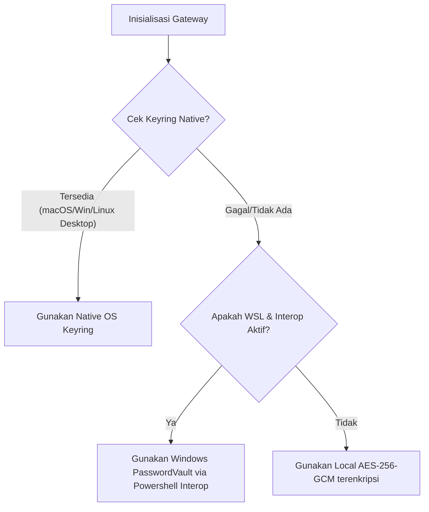

# Brainstorming Fase 4 (Iterasi 2): Ekosistem, Guardrails, & Keamanan (Kredensial Aman, Auto-Discovery, & PII Sanitizer)

Dokumen ini memaparkan riset arsitektur yang mendalam, analisis *edge cases*, solusi cerdas yang diperluas, dan rencana implementasi mutakhir untuk **Fase 4** peningkatan sistem perutean multi-provider pada Hermes Agent.

---

## 1. Secure Credential Store (Enkripsi API Keys)

### 🚨 Tantangan Keamanan & Edge Cases
1.  **Headless & Containerized Environments:** Pada lingkungan container (Docker) atau server headless (via SSH), daemon secure store desktop Linux (seperti `gnome-keyring` atau `kwallet`) biasanya tidak terinstal atau tidak dapat diakses tanpa sesi X11/DBus yang aktif.
2.  **Keterbatasan WSL Interoperability:** Meskipun interop Windows Powershell dapat digunakan di WSL, pemanggilan biner `.exe` dari dalam WSL bergantung pada konfigurasi sistem `/proc/sys/fs/binfmt_misc/WSLInterop`. Jika dinonaktifkan oleh administrator, pemanggilan `powershell.exe` akan gagal total.
3.  **Kelemahan Enkripsi Lokal Biasa:** Enkripsi lokal menggunakan static key atau password bawaan kode sangat mudah didekripsi oleh pihak tidak bertanggung jawab yang membaca source code.

### 💡 Solusi Iterasi (Peningkatan Arsitektur)
Kita mengimplementasikan **`DynamicCredentialStoreManager`** dengan alur penentuan otomatis (*auto-detection pipeline*) berikut:



#### Detail Implementasi AES-256-GCM Terenkripsi (Fallback):
*   **Machine-Bound Key Derivation:** Kunci dekripsi rahasia dihasilkan secara dinamis menggunakan KDF `PBKDF2HMAC` (dengan `SHA256`) yang menggabungkan parameter mesin yang konstan dan unik:
    *   Sidik jari UUID mesin unik (`/etc/machine-id` di Linux atau Registry UUID di Windows).
    *   MAC Address kartu jaringan primer (`uuid.getnode()`).
    *   Username OS saat ini (`getpass.getuser()`).
*   **Keuntungan:** File rahasia terenkripsi `.hermes_secrets` yang disimpan di direktori home pengguna **tidak akan pernah dapat didekripsi jika dipindahkan ke komputer lain**, karena kunci dekripsi terikat erat secara fisik pada hardware mesin asalnya.

---

## 2. Dukungan Provider Lokal Terpadu (Auto-Discovery Ollama)

### 🚨 Tantangan Penggunaan & Edge Cases
1.  **Kustomisasi Port & Host:** Pengguna sering kali menjalankan Ollama di alamat IP atau port kustom (misal: di server LAN `http://192.168.1.50:11434`), bukan localhost standar.
2.  **Out-Of-Memory (OOM) Konteks:** Model lokal memiliki panjang jendela konteks (*context window*) default yang terbatas (biasanya 2K-8K). Mengirimkan payload chat yang melebihi batas ini ke Ollama lokal tanpa konfigurasi parameter `num_ctx` yang tepat akan menyebabkan crash OOM atau hilangnya ingatan agen di tengah jalan.

### 💡 Solusi Iterasi (Peningkatan Arsitektur)
1.  **Dukungan Standard Env variables:**
    *   Membaca variabel lingkungan standar `OLLAMA_HOST` (jika terdefinisi) untuk mendeteksi alamat IP dan port kustom server Ollama sebelum meluncurkan probe asinkron.
2.  **Dynamic Context Length Query:**
    *   Setelah daftar model diperoleh via `/api/tags`, discovery engine akan mengirimkan request detail `/api/show` untuk setiap model yang terinstal.
    *   Mengekstrak parameter panjang konteks bawaan (`num_ctx`) secara dinamis dari model metadata tersebut.
    *   Mengonfigurasi parameter `_ollama_num_ctx` agen secara presisi dan otomatis untuk mencegah eror context overflow selama runtime.

---

## 3. Penyaringan Konten & PII Sanitizer (Guardrails Cerdas)

### 🚨 Tantangan Kebocoran Data & Edge Cases
1.  **False-Positives pada Source Code:** Regex standar yang terlalu sensitif dapat salah mendeteksi blok kode pemrograman (seperti token JWT tiruan di unit test atau baris script) sebagai data pribadi yang harus disanitasi.
2.  **Streaming De-anonymization:** Pada pemanggilan streaming, teks mengalir kata-demi-kata (SSE chunks). Jika model LLM luar mengulang data placeholder (seperti `[REDACTED_EMAIL_1]`), kita harus menggantinya kembali dengan email asli secara real-time pada aliran chunk streaming tersebut sebelum ditampilkan ke UI/TUI tanpa menghentikan atau merusak parser streaming.

### 💡 Solusi Iterasi (Peningkatan Arsitektur)
1.  **Lexical/Regex Hybrid Guardrail:**
    *   Menyediakan file konfigurasi `guardrails.yaml` yang dapat disesuaikan oleh pengguna untuk memilih jenis PII yang ingin dipantau (`email`, `ip_address`, `private_key`, `credit_card`).
    *   Membatasi pemindaian pada file biner atau blok Markdown code blocks (` ``` `) untuk menghindari false-positive pada source code.
2.  **Stream De-anonymizer Buffer:**
    *   Membangun sliding buffer parser pada stream consumer. Jika parser mendeteksi pola label placeholder `[REDACTED_...]` yang mengalir di chunk teks, buffer akan menahan aliran tersebut sesaat, mengganti label dengan string asli dari tabel pemetaan lokal di memori, dan menggelontorkannya ke terminal secara instan.

---

## 4. OpenAI-Compatible Local Endpoint Server

### 🚨 Tantangan Integrasi Eksternal & Edge Cases
1.  **Streaming Standard:** Aplikasi pihak ketiga (seperti VS Code Continue.dev) mengharapkan format data streaming Server-Sent Events (SSE) standard OpenAI yang dibungkus dengan prefix `data: ` dan diakhiri dengan `data: [DONE]`.
2.  **Model Discovery:** Banyak extension IDE yang membutuhkan endpoint `/v1/models` untuk mendeteksi model apa saja yang tersedia di dalam server sebelum mengizinkan pengguna memilih model obrolan.

### 💡 Solusi Iterasi (Peningkatan Arsitektur)
1.  **Expose Endpoint `/v1/models`:**
    *   Mengembalikan daftar seluruh model komersial aktif yang dikonfigurasi di `cli-config.yaml` dan model lokal Ollama gratis yang berhasil di-discover secara dinamis.
2.  **OpenAI-Compliant SSE Streamer:**
    *   Endpoint `/v1/chat/completions` mendeteksi parameter `"stream": true`.
    *   Jika aktif, server local memicu `interruptible_streaming_api_call` Hermes, menangkap delta token, membungkusnya ke dalam format standard SSE OpenAI (`data: {"choices": [{"delta": {"content": "..."}}]}`), dan mengalirkannya secara real-time ke aplikasi pemanggil.
