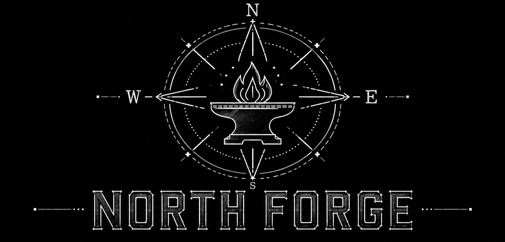

<p align="center">
  
</p>

# Hermes Agent ☤
<p align="center">
  <a href="https://hermes-agent.nousresearch.com/">Hermes Agent</a> | <a href="https://hermes-agent.nousresearch.com/">Hermes Desktop</a>
</p>
<p align="center">
  <a href="https://hermes-agent.nousresearch.com/docs/"></a>
  <a href="https://discord.gg/NousResearch"></a>
  <a href="https://github.com/NousResearch/hermes-agent/blob/main/LICENSE"></a>
  <a href="https://nousresearch.com"></a>
  <a href="README.md"></a>
  <a href="README.zh-CN.md"></a>
  <a href="README.ur-pk.md"></a>
  <a href="README.es.md"></a>
</p>

**Agen AI dengan penyempurnaan diri yang dibangun oleh [Nous Research](https://nousresearch.com).** Ini satu-satunya agen dengan loop pembelajaran bawaan — ia membuat skill dari pengalaman, menyempurnakan skill tersebut saat digunakan, mendorong dirinya sendiri untuk menyimpan pengetahuan, mencari percakapan lamanya sendiri, dan membangun pemahaman yang semakin mendalam tentang siapa Anda dari sesi ke sesi. Jalankan di VPS $5, cluster GPU, atau infrastruktur serverless yang hampir tidak berbiaya saat idle. Tidak terikat pada laptop Anda — ajak bicara lewat Telegram sementara ia bekerja di VM cloud.

Gunakan model apa pun yang Anda mau — [Nous Portal](https://portal.nousresearch.com), OpenRouter, OpenAI, endpoint Anda sendiri, dan [banyak lainnya](https://hermes-agent.nousresearch.com/docs/integrations/providers). Ganti dengan `hermes model` — tanpa perubahan kode, tanpa terkunci pada satu penyedia.

<table>
<tr><td><b>Antarmuka terminal sungguhan</b></td><td>TUI lengkap dengan penyuntingan multi-baris, autocomplete slash-command, riwayat percakapan, interupsi-dan-alihkan, serta output tool yang streaming.</td></tr>
<tr><td><b>Hadir di tempat Anda berada</b></td><td>Telegram, Discord, Slack, WhatsApp, Signal, dan CLI — semuanya dari satu proses gateway. Transkripsi pesan suara, kontinuitas percakapan lintas platform.</td></tr>
<tr><td><b>Loop pembelajaran yang tertutup</b></td><td>Memori yang dikurasi oleh agen dengan dorongan berkala. Pembuatan skill otomatis setelah tugas kompleks. Skill menyempurnakan dirinya sendiri saat digunakan. Pencarian sesi FTS5 dengan ringkasan LLM untuk mengingat lintas sesi. Pemodelan pengguna dialektik <a href="https://github.com/plastic-labs/honcho">Honcho</a>. Kompatibel dengan standar terbuka <a href="https://agentskills.io">agentskills.io</a>.</td></tr>
<tr><td><b>Otomatisasi terjadwal</b></td><td>Penjadwal cron bawaan dengan pengiriman ke platform mana pun. Laporan harian, backup malam hari, audit mingguan — semuanya dalam bahasa natural, berjalan tanpa perlu diawasi.</td></tr>
<tr><td><b>Mendelegasikan dan memparalelkan</b></td><td>Jalankan subagen terisolasi untuk alur kerja paralel. Tulis skrip Python yang memanggil tool lewat RPC, memampatkan pipeline multi-langkah menjadi giliran tanpa biaya konteks.</td></tr>
<tr><td><b>Berjalan di mana saja, tidak hanya di laptop Anda</b></td><td>Tujuh backend terminal — local, Docker, SSH, Singularity, Modal, Daytona, dan Vercel Sandbox. Daytona dan Modal menawarkan persistensi serverless — lingkungan agen Anda hibernasi saat idle dan bangun sesuai permintaan, hampir tanpa biaya di antara sesi. Jalankan di VPS $5 atau cluster GPU.</td></tr>
<tr><td><b>Siap untuk riset</b></td><td>Pembuatan trajectory secara batch, kompresi trajectory untuk melatih generasi model tool-calling berikutnya.</td></tr>
</table>

---

## Instalasi Cepat

### Linux, macOS, WSL2, Termux

```bash
curl -fsSL https://hermes-agent.nousresearch.com/install.sh | bash
```

### Windows (native, PowerShell)

> **Catatan:** Windows native menjalankan Hermes tanpa WSL — CLI, gateway, TUI, dan tool semuanya berjalan secara native. Jika Anda lebih suka WSL2, perintah Linux/macOS di atas juga berfungsi di sana. Menemukan bug? Silakan [laporkan issue](https://github.com/NousResearch/hermes-agent/issues).

Jalankan ini di PowerShell:

```powershell
iex (irm https://hermes-agent.nousresearch.com/install.ps1)
```

Installer menangani semuanya: uv, Python 3.11, Node.js, ripgrep, ffmpeg, **dan Git Bash portabel** (MinGit, diekstrak ke `%LOCALAPPDATA%\hermes\git` — tanpa perlu admin, sepenuhnya terisolasi dari instalasi Git sistem mana pun). Hermes memakai Git Bash bawaan ini untuk menjalankan perintah shell.

Jika Anda sudah punya Git terpasang, installer akan mendeteksinya dan memakainya. Jika tidak, unduhan MinGit ~45MB sudah cukup — tidak akan menyentuh atau mengganggu Git sistem mana pun.

> **Android / Termux:** Jalur manual yang sudah teruji didokumentasikan di [panduan Termux](https://hermes-agent.nousresearch.com/docs/getting-started/termux). Di Termux, Hermes memasang extra `.[termux]` yang sudah dikurasi karena extra penuh `.[all]` saat ini menarik dependensi voice yang tidak kompatibel dengan Android.
>
> **Windows:** Windows native didukung penuh — perintah PowerShell di atas memasang semuanya. Jika Anda lebih suka WSL2, perintah Linux juga berfungsi di sana. Instalasi Windows native berada di `%LOCALAPPDATA%\hermes`; WSL2 terpasang di `~/.hermes` seperti di Linux.

Setelah instalasi:

```bash
source ~/.bashrc    # muat ulang shell (atau: source ~/.zshrc)
hermes              # mulai mengobrol!
```

### Pemecahan Masalah

#### Windows Defender atau antivirus menandai `uv.exe` sebagai malware

Jika antivirus Anda (Bitdefender, Windows Defender, dll.) mengkarantina `uv.exe` dari folder `bin` Hermes (`%LOCALAPPDATA%\hermes\bin\uv.exe`), ini adalah **false positive**. File tersebut adalah `uv` milik Astral — package manager Python berbasis Rust yang dibundel Hermes untuk mengelola environment Python-nya. Mesin antivirus berbasis ML sering menandai binary Rust tak bertanda tangan yang mengunduh dan memasang paket.

**Untuk memverifikasi bahwa salinan Anda asli:**

```powershell
# Pasang GitHub CLI jika perlu
winget install --id GitHub.cli

# Login ke GitHub
gh auth login

# Jalankan verifikasi
$uv = "$env:LOCALAPPDATA\hermes\bin\uv.exe"
$ver = (& $uv --version).Split(' ')[1]
[Net.ServicePointManager]::SecurityProtocol = [Net.SecurityProtocolType]::Tls12
$zip = "$env:TEMP\uv.zip"
Invoke-WebRequest "https://github.com/astral-sh/uv/releases/download/$ver/uv-x86_64-pc-windows-msvc.zip" -OutFile $zip -UseBasicParsing
gh attestation verify $zip --repo astral-sh/uv
Expand-Archive $zip "$env:TEMP\uv_x" -Force
(Get-FileHash "$env:TEMP\uv_x\uv.exe").Hash -eq (Get-FileHash $uv).Hash
```

Jika attestation menampilkan "Verification succeeded" dan baris terakhir mencetak `True`, berarti aman.

**Untuk mem-whitelist Hermes:**
- **Windows Defender:** Jalankan PowerShell sebagai Admin → `Add-MpPreference -ExclusionPath "$env:LOCALAPPDATA\hermes\bin"`
- **Bitdefender:** Tambahkan exception di konsol Bitdefender (Protection > Antivirus > Settings > Manage Exceptions)
- Whitelist **folder**-nya, bukan hash file — Hermes memperbarui `uv` dan hash-nya berubah setiap versi

Untuk konteks lebih lanjut, lihat laporan upstream Astral: [astral-sh/uv#13553](https://github.com/astral-sh/uv/issues/13553), [astral-sh/uv#15011](https://github.com/astral-sh/uv/issues/15011), [astral-sh/uv#10079](https://github.com/astral-sh/uv/issues/10079).

---

## Memulai

```bash
hermes              # CLI interaktif — mulai percakapan
hermes model        # Pilih penyedia dan model LLM Anda
hermes tools        # Konfigurasi tool mana yang aktif
hermes config set   # Atur nilai konfigurasi satu per satu
hermes config get   # Cetak nilai konfigurasi satu per satu
hermes gateway      # Jalankan gateway perpesanan (Telegram, Discord, dll.)
hermes setup        # Jalankan wizard setup lengkap (mengkonfigurasi semuanya sekaligus)
hermes claw migrate # Migrasi dari OpenClaw (jika Anda datang dari OpenClaw)
hermes update       # Perbarui ke versi terbaru
hermes doctor       # Diagnosa masalah apa pun
```

📖 **[Dokumentasi lengkap →](https://hermes-agent.nousresearch.com/docs/)**

---

## Lewati pengumpulan API key — Nous Portal

Hermes bekerja dengan penyedia apa pun yang Anda mau — itu tidak berubah. Tapi jika Anda tidak ingin mengumpulkan lima API key terpisah untuk model, web search, image generation, TTS, dan cloud browser, **[Nous Portal](https://portal.nousresearch.com)** mencakup semuanya dalam satu subscription:

- **300+ model** — pilih salah satunya dengan `/model <name>`
- **Tool Gateway** — web search (Firecrawl), image generation (FAL), text-to-speech (OpenAI), cloud browser (Browser Use), semuanya lewat subscription Anda. Tanpa akun tambahan.

Satu perintah dari instalasi baru:

```bash
hermes setup --portal
```

Ini akan login lewat OAuth, menjadikan Nous sebagai penyedia Anda, dan mengaktifkan Tool Gateway. Cek kapan saja apa yang sudah tersambung dengan `hermes portal info`. Detail lengkap di [halaman dokumentasi Tool Gateway](https://hermes-agent.nousresearch.com/docs/user-guide/features/tool-gateway).

Anda tetap bisa memakai API key sendiri per tool kapan pun Anda mau — gateway ini bersifat per-backend, bukan semua-atau-tidak-sama-sekali.

---

## Referensi Cepat: CLI vs Perpesanan

Hermes punya dua entry point: jalankan terminal UI dengan `hermes`, atau jalankan gateway dan ajak bicara lewat Telegram, Discord, Slack, WhatsApp, Signal, atau Email. Begitu berada dalam percakapan, banyak slash command yang sama di kedua antarmuka.

| Aksi                              | CLI                                           | Platform Perpesanan                                                              |
| --------------------------------- | ---------------------------------------------- | ---------------------------------------------------------------------------------- |
| Mulai mengobrol                   | `hermes`                                      | Jalankan `hermes gateway setup` + `hermes gateway start`, lalu kirim pesan ke bot |
| Mulai percakapan baru             | `/new` atau `/reset`                          | `/new` atau `/reset`                                                              |
| Ganti model                       | `/model [provider:model]`                     | `/model [provider:model]`                                                         |
| Atur personality                  | `/personality [name]`                         | `/personality [name]`                                                             |
| Ulangi atau batalkan giliran terakhir | `/retry`, `/undo`                         | `/retry`, `/undo`                                                                 |
| Kompres konteks / cek pemakaian   | `/compress`, `/usage`, `/insights [--days N]` | `/compress`, `/usage`, `/insights [days]`                                         |
| Jelajahi skill                    | `/skills` atau `/<skill-name>`                | `/<skill-name>`                                                                   |
| Interupsi pekerjaan yang sedang berjalan | `Ctrl+C` atau kirim pesan baru          | `/stop` atau kirim pesan baru                                                     |
| Status khusus platform            | `/platforms`                                  | `/status`, `/sethome`                                                             |

Untuk daftar perintah lengkap, lihat [panduan CLI](https://hermes-agent.nousresearch.com/docs/user-guide/cli) dan [panduan Messaging Gateway](https://hermes-agent.nousresearch.com/docs/user-guide/messaging).

---

## Dokumentasi

Semua dokumentasi ada di **[hermes-agent.nousresearch.com/docs](https://hermes-agent.nousresearch.com/docs/)**:

| Bagian                                                                                             | Yang Dibahas                                             |
| --------------------------------------------------------------------------------------------------- | ----------------------------------------------- |
| [Quickstart](https://hermes-agent.nousresearch.com/docs/getting-started/quickstart)                 | Instal → setup → percakapan pertama dalam 2 menit |
| [Penggunaan CLI](https://hermes-agent.nousresearch.com/docs/user-guide/cli)                        | Perintah, keybinding, personality, sesi          |
| [Konfigurasi](https://hermes-agent.nousresearch.com/docs/user-guide/configuration)                 | File konfigurasi, penyedia, model, semua opsi    |
| [Messaging Gateway](https://hermes-agent.nousresearch.com/docs/user-guide/messaging)                | Telegram, Discord, Slack, WhatsApp, Signal, Home Assistant |
| [Keamanan](https://hermes-agent.nousresearch.com/docs/user-guide/security)                         | Persetujuan perintah, pairing DM, isolasi container |
| [Tools & Toolsets](https://hermes-agent.nousresearch.com/docs/user-guide/features/tools)            | 40+ tool, sistem toolset, backend terminal       |
| [Sistem Skills](https://hermes-agent.nousresearch.com/docs/user-guide/features/skills)              | Memori prosedural, Skills Hub, membuat skill      |
| [Memori](https://hermes-agent.nousresearch.com/docs/user-guide/features/memory)                     | Memori persisten, profil pengguna, praktik terbaik |
| [Integrasi MCP](https://hermes-agent.nousresearch.com/docs/user-guide/features/mcp)                 | Sambungkan server MCP mana pun untuk kapabilitas tambahan |
| [Penjadwalan Cron](https://hermes-agent.nousresearch.com/docs/user-guide/features/cron)             | Tugas terjadwal dengan pengiriman ke platform    |
| [File Konteks](https://hermes-agent.nousresearch.com/docs/user-guide/features/context-files)        | Konteks proyek yang membentuk setiap percakapan  |
| [Arsitektur](https://hermes-agent.nousresearch.com/docs/developer-guide/architecture)               | Struktur proyek, agent loop, kelas-kelas kunci   |
| [Berkontribusi](https://hermes-agent.nousresearch.com/docs/developer-guide/contributing)            | Setup development, proses PR, gaya kode          |
| [Referensi CLI](https://hermes-agent.nousresearch.com/docs/reference/cli-commands)                  | Semua perintah dan flag                          |
| [Environment Variables](https://hermes-agent.nousresearch.com/docs/reference/environment-variables) | Referensi lengkap environment variable           |

---

## Migrasi dari OpenClaw

Jika Anda datang dari OpenClaw, Hermes bisa otomatis mengimpor pengaturan, memori, skill, dan API key Anda.

**Saat setup pertama kali:** Wizard setup (`hermes setup`) otomatis mendeteksi `~/.openclaw` dan menawarkan migrasi sebelum konfigurasi dimulai.

**Kapan saja setelah instalasi:**

```bash
hermes claw migrate              # Migrasi interaktif (preset lengkap)
hermes claw migrate --dry-run    # Pratinjau apa yang akan dimigrasikan
hermes claw migrate --preset user-data   # Migrasi tanpa secret
hermes claw migrate --overwrite  # Timpa konflik yang ada
```

Apa saja yang diimpor:

- **SOUL.md** — file persona
- **Memori** — entri MEMORY.md dan USER.md
- **Skills** — skill buatan pengguna → `~/.hermes/skills/openclaw-imports/`
- **Command allowlist** — pola persetujuan
- **Pengaturan messaging** — konfigurasi platform, pengguna yang diizinkan, working directory
- **API key** — secret yang di-allowlist (Telegram, OpenRouter, OpenAI, Anthropic, ElevenLabs)
- **Aset TTS** — file audio workspace
- **Instruksi workspace** — AGENTS.md (dengan `--workspace-target`)

Lihat `hermes claw migrate --help` untuk semua opsi, atau gunakan skill `openclaw-migration` untuk migrasi interaktif yang dipandu agen dengan pratinjau dry-run.

---

## Berkontribusi

Kontribusi sangat kami sambut! Lihat [Panduan Berkontribusi](https://hermes-agent.nousresearch.com/docs/developer-guide/contributing) untuk setup development, gaya kode, dan proses PR.

Quick start untuk kontributor — pakai installer standar, lalu bekerja dari
git checkout lengkap yang dibuatnya di `$HERMES_HOME/hermes-agent` (biasanya
`~/.hermes/hermes-agent`). Ini sesuai dengan layout yang dipakai `hermes update`, venv
terkelola, lazy dependency, gateway, dan tooling docs.

```bash
curl -fsSL https://hermes-agent.nousresearch.com/install.sh | bash
cd "${HERMES_HOME:-$HOME/.hermes}/hermes-agent"
uv pip install -e ".[all,dev]"
scripts/run_tests.sh
```

Fallback clone manual (untuk clone sekali pakai/CI yang memang sengaja tidak
ingin memakai layout instalasi terkelola):

Buat venv di luar direktori source yang di-clone — venv di dalam direktori
tempat agen beroperasi bisa terhapus oleh perintah relative-path yang dijalankan
agen terhadap checkout-nya sendiri, merusak runtime yang sedang berjalan di tengah sesi.

```bash
curl -LsSf https://astral.sh/uv/install.sh | sh
uv venv ~/.hermes/venvs/hermes-dev --python 3.11
source ~/.hermes/venvs/hermes-dev/bin/activate
uv pip install -e ".[all,dev]"
scripts/run_tests.sh
```

---

## Komunitas

- 💬 [Discord](https://discord.gg/NousResearch)
- 📚 [Skills Hub](https://agentskills.io)
- 🐛 [Issues](https://github.com/NousResearch/hermes-agent/issues)
- 🔌 [computer-use-linux](https://github.com/avifenesh/computer-use-linux) — Server MCP kontrol desktop Linux untuk Hermes dan host MCP lainnya, dengan accessibility tree AT-SPI, input Wayland/X11, screenshot, dan compositor window targeting.
- 🔌 [HermesClaw](https://github.com/AaronWong1999/hermesclaw) — Jembatan WeChat komunitas: Jalankan Hermes Agent dan OpenClaw di akun WeChat yang sama.

---

## Lisensi

MIT — lihat [LICENSE](LICENSE).

Dibangun oleh [Nous Research](https://nousresearch.com).
