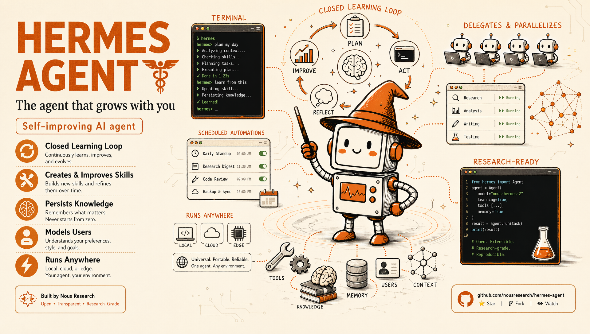

# Hermes Agent - Zapabob's Applied AI Engineering Fork

<p align="center">
  
</p>

<p align="center">
  <a href="https://hermes-agent.nousresearch.com/docs/"></a>
  <a href="https://discord.gg/NousResearch"></a>
  <a href="https://github.com/NousResearch/hermes-agent/blob/main/LICENSE"></a>
  <a href="https://nousresearch.com"></a>
  <a href="README.zh-CN.md"></a>
  <a href="README.ur-pk.md"></a>
  <a href="README.es.md"></a>
</p>

This repository is a working engineering fork of
[NousResearch/hermes-agent](https://github.com/NousResearch/hermes-agent). It
keeps the official Hermes runtime as the authority, then adds the operator
features I rely upon in daily work: Windows-first service recovery, local LLM
fallback, controlled social publishing, NotebookLM source packaging, LINE bot
conversation policy, Galaxy-friendly AITuber sessions, VRChat tooling, and
provider routing for cost-conscious AI operations.

Use any model you want — [Nous Portal](https://portal.nousresearch.com), OpenRouter, OpenAI, your own endpoint, and [many others](https://hermes-agent.nousresearch.com/docs/integrations/providers). Switch with `hermes model` — no code changes, no lock-in.

The aim is not to outgrow upstream Hermes. The aim is to keep the official
agent current whilst proving that a long-lived personal fork can remain
disciplined: official security and bug fixes come in promptly, equivalent
features are based on upstream behaviour, and fork-only advantages are carried
as explicit overlays rather than private drift.

## Current Official Baseline

This branch has been synchronised from `origin/main`, then merged with the
latest `upstream/main` from NousResearch. The present upstream intake includes:

- Desktop composer pop-out support, including a draggable floating composer,
  Electron link-title window handling, and desktop platform test coverage.
- Signal gateway fixes for quoted reply context, self-mention stripping in
  groups, explicit stop-typing RPC cancellation, shared markdown formatting,
  and ADTS AAC voice note remuxing.
- Safer malformed environment-variable handling through guarded int and float
  parsing paths.
- Gateway, reply-injection, and send-message test updates that harden the
  messaging surface.
- Dependency and release maintenance in the official package metadata and
  release tooling.

Official changes are treated as the base whenever upstream now covers the same
problem. Where this fork has a genuine local advantage, the local behaviour is
kept as an overlay on top of the current upstream API.

## Fork-Only Work Kept On Top

### Policy-Driven Upstream Merges

Upstream integration is handled with Python tooling rather than ad hoc manual
patching. The main entry point is:

```powershell
py -3 scripts\sync_all.py --dry-run --allow-preflight-blockers
py -3 scripts\sync_all.py --merge --target main --allow-preflight-blockers
```

The policy lives under `scripts/merge_tools/`. It classifies files as
`upstream`, `preserve_custom`, `official_with_overlay`, or
`manual_api_followup`. Lockfiles and workflow updates favour upstream. Local
operator features, VRChat tooling, and fork-owned plugins are preserved. Core
agent and gateway files take official fixes first, then carry only the required
local overlay.

### Windows-First Operations

The fork is maintained on a real Windows workstation where Desktop, dashboard,
gateway, scheduled tasks, local LLM endpoints, and helper services all have to
survive restarts. The repository therefore includes PowerShell launchers,
Task Scheduler registration, process health checks, port verification, and
recovery scripts under `scripts/windows/`.

Representative entry points:

```powershell
powershell -ExecutionPolicy Bypass -File scripts\windows\start-hermes-stack.ps1
powershell -ExecutionPolicy Bypass -File scripts\windows\check-local-llm.ps1
powershell -ExecutionPolicy Bypass -File scripts\windows\restart-hermes-stack.ps1
```

### Troubleshooting

#### Windows Defender or antivirus flags `uv.exe` as malware

If your antivirus (Bitdefender, Windows Defender, etc.) quarantines `uv.exe` from the Hermes `bin` folder (`%LOCALAPPDATA%\hermes\bin\uv.exe`), this is a **false positive**. The file is Astral's `uv` — the Rust Python package manager Hermes bundles to manage its Python environment. ML-based antivirus engines commonly flag unsigned Rust binaries that download and install packages.

**To verify your copy is authentic:**

```powershell
# Install GitHub CLI if needed
winget install --id GitHub.cli

# Login to GitHub
gh auth login

# Run verification
$uv = "$env:LOCALAPPDATA\hermes\bin\uv.exe"
$ver = (& $uv --version).Split(' ')[1]
[Net.ServicePointManager]::SecurityProtocol = [Net.SecurityProtocolType]::Tls12
$zip = "$env:TEMP\uv.zip"
Invoke-WebRequest "https://github.com/astral-sh/uv/releases/download/$ver/uv-x86_64-pc-windows-msvc.zip" -OutFile $zip -UseBasicParsing
gh attestation verify $zip --repo astral-sh/uv
Expand-Archive $zip "$env:TEMP\uv_x" -Force
(Get-FileHash "$env:TEMP\uv_x\uv.exe").Hash -eq (Get-FileHash $uv).Hash
```

If attestation says "Verification succeeded" and the last line prints `True`, you're good.

**To whitelist Hermes:**
- **Windows Defender:** Run PowerShell as Admin → `Add-MpPreference -ExclusionPath "$env:LOCALAPPDATA\hermes\bin"`
- **Bitdefender:** Add an exception in the Bitdefender console (Protection > Antivirus > Settings > Manage Exceptions)
- Whitelist the **folder**, not the file hash — Hermes updates `uv` and the hash changes every version

For more context, see the upstream Astral reports: [astral-sh/uv#13553](https://github.com/astral-sh/uv/issues/13553), [astral-sh/uv#15011](https://github.com/astral-sh/uv/issues/15011), [astral-sh/uv#10079](https://github.com/astral-sh/uv/issues/10079).

---

The local secretary path uses llama.cpp-compatible OpenAI endpoints as a
private fallback for moments when a cloud provider is unavailable, unsuitable,
or needlessly expensive. It is not a sketch: the fork carries start scripts,
health checks, context-size validation, chat completion checks, and
tool-calling contracts.

### LINE Conversation Policy

`plugins/line_ai_bot` now registers a conversation plugin through
`PluginContext.register_conversation_plugin`. LINE messages receive a
channel-scoped prompt that names the bot, records the LINE chat type, and
treats user text as untrusted channel content. Slash commands and non-LINE
platforms are deliberately excluded.

The LINE platform adapter also supports configurable API bases, which makes
tests and local gateways easier to run without hard-wiring the production LINE
endpoints.

### AITuber OnAir And Galaxy Sessions

`plugins/aituber_onair` provides Hakua-oriented avatar operation, local speech,
YouTube comment reactions, provider rotation, and Galaxy S9+ friendly VRM
sessions. The Galaxy session command starts the VRM surface on a LAN-visible
host, starts the audio WebSocket, and can optionally start TTS, autonomous
talk, and local comment reactions.

```powershell
hermes aituber-onair galaxy-session --public-host 192.168.1.23 --audio-ws-port 5176 --force
```

Provider rotation now recovers from rate-limit style failures whilst keeping
avatar speech attached to the final reply, so the public-facing character does
not lose voice output merely because the first provider was exhausted.

### LM-twitterer

`plugins/lm-twitterer` turns Hermes into a controlled X publishing assistant.
It supports dry-runs, live posts, whitelist-gated replies, cron installation,
topic validation, explicit reviewed text, and local media attachments.

```powershell
hermes plugins enable lm-twitterer
hermes lm-twitterer install-deps --yes
hermes lm-twitterer post --text "Reviewed release note" --media output\daily_posts\clip.mp4 --live
```

### NotebookLM Source Packaging

`plugins/notebooklm` collects redacted operational material into reusable
research bundles. It is intended for turning agent work, logs, and notes into
reviewable sources without placing secrets into a cloud notebook.

```powershell
hermes plugins enable notebooklm
hermes notebooklm collect
hermes notebooklm brainstorm
```

### VRChat And Local Automation

The fork includes VRChat and Quest 2 operational tooling, OSC helpers, runtime
doctors, OpenXR repair scripts, and related skills. These are examples of
Hermes acting as a local systems operator rather than merely a chat surface.

Relevant areas include `skills/gaming/vrchat/`, `scripts/vrchat_runtime_doctor.py`,
and the VRChat repair scripts under `scripts/windows/`.

## Engineering Rules

This fork follows the Hermes narrow-waist design. The model tool surface stays
small; capabilities belong first in plugins, skills, CLI commands, service-gated
tools, or MCP servers. Per-conversation prompt caching is protected. Secrets
belong in `~/.hermes/.env`; behaviour belongs in `config.yaml`. Runtime claims
are checked with concrete evidence: ports, processes, response contracts,
tests, and logs.

For upstream merges, the tie-breaker is explicit: if official Hermes and a
local feature solve the same problem equally well, use the official
implementation as the base and carry only the fork's additional advantage.

## Quick Start

For development from this fork on Windows:

Create the venv outside the cloned source tree. A venv inside the directory
the agent operates from can be wiped by a relative-path command the agent runs
against its own checkout, destroying the running runtime mid-session.

```powershell
git clone https://github.com/zapabob/hermes-agent.git
cd hermes-agent
py -3 -m venv "$env:USERPROFILE/.hermes/venvs/hermes-dev"
& "$env:USERPROFILE/.hermes/venvs/hermes-dev/Scripts/Activate.ps1"
python -m pip install -U pip
pip install -e ".[all,dev]"
python -m hermes_cli.main setup
```

For the Windows installer path, use `scripts/install.ps1`.

Run the main surfaces:

```powershell
hermes --tui
hermes dashboard
hermes gateway run
```

Enable selected fork plugins:

```powershell
hermes plugins enable lm-twitterer
hermes plugins enable notebooklm
hermes plugins enable aituber-onair
hermes plugins enable line-ai-bot
```

## Repository Map

| Area | Purpose |
| --- | --- |
| `scripts/sync_all.py` | Python-driven upstream sync and fork-preserving merge workflow. |
| `scripts/merge_tools/` | Merge classification, overlay policy, and conflict-resolution helpers. |
| `scripts/windows/` | Windows launch, restart, local LLM, gateway, desktop, and recovery scripts. |
| `plugins/aituber_onair/` | Hakua avatar operation, speech, Galaxy sessions, and live-comment loops. |
| `plugins/line_ai_bot/` | LINE bot reply tooling and conversation prompt policy. |
| `plugins/lm-twitterer/` | X publishing, replies, cron, explicit text, and media workflows. |
| `plugins/notebooklm/` | Redacted source collection and NotebookLM-oriented research packaging. |
| `gateway/` | Messaging gateway and platform adapters. |
| `apps/desktop/` | Electron desktop chat application, including current upstream composer work. |
| `ui-tui/` | Ink-based terminal interface. |
| `tui_gateway/` | JSON-RPC backend used by the TUI and Desktop surfaces. |
| `agent/` | Core conversation loop, provider adapters, prompts, memory, and runtime helpers. |

## Upstream Credit

Hermes Agent is developed by NousResearch. This repository is an applied
operations and portfolio fork on top of that work. Upstream documentation
remains the best starting point for the base platform:

- <https://hermes-agent.nousresearch.com/docs/>
- <https://github.com/NousResearch/hermes-agent>
