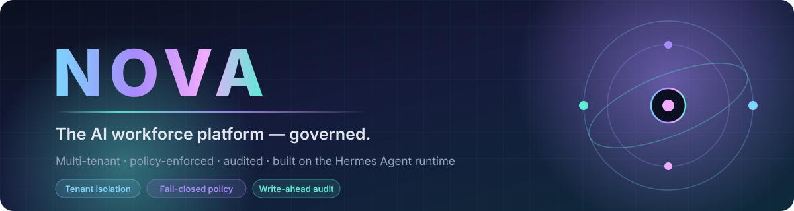
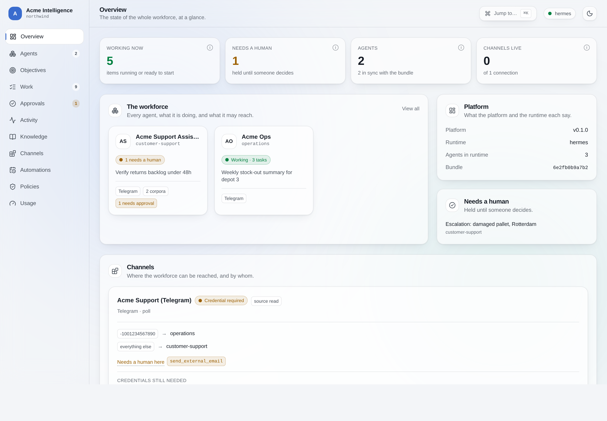
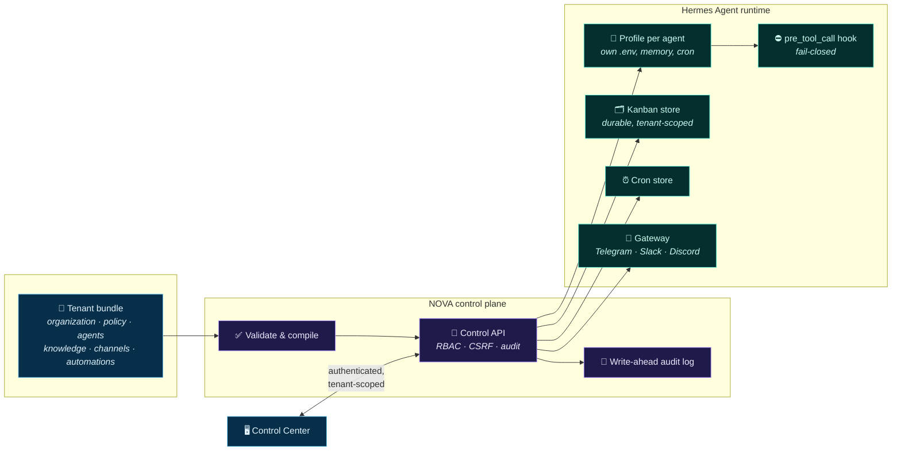
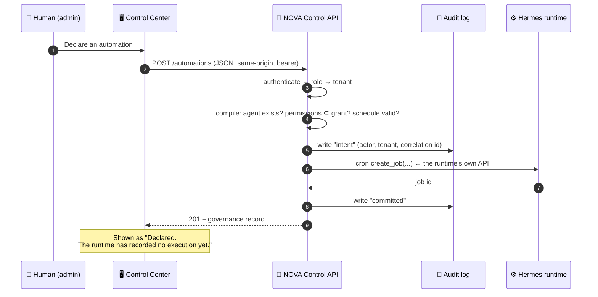
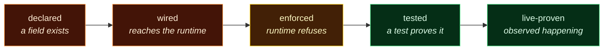
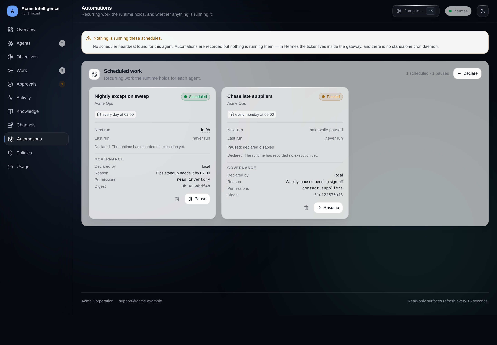
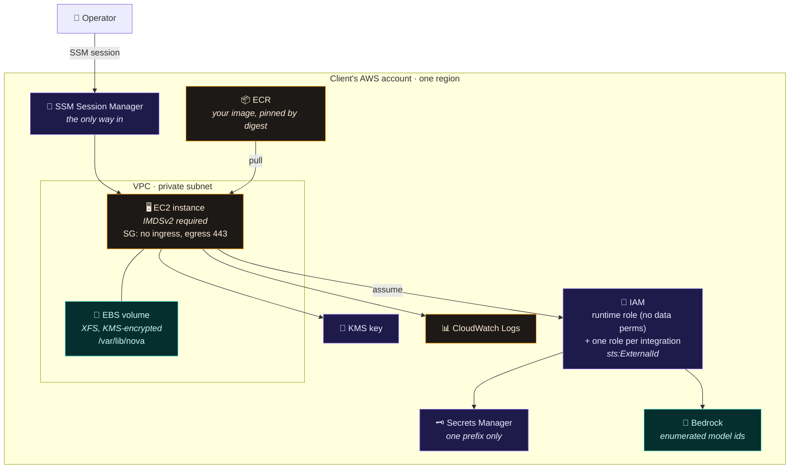

<p align="center">
  
</p>

<p align="center">
  
  
  
  
  
  
</p>

<p align="center">
  <b><a href="#quickstart">Quickstart</a></b> ·
  <b><a href="#deploy-for-a-client-on-aws">Deploy on AWS</a></b> ·
  <b><a href="#what-is-actually-enforced">What is actually enforced</a></b> ·
  <b><a href="#architecture">Architecture</a></b> ·
  <b><a href="README.hermes.md">Hermes runtime README</a></b>
</p>

---

## NOVA turns an AI agent runtime into something a business can be accountable for

A capable agent runtime is not a product a company can buy. **Who may run what, on whose
data, with whose approval, and how do you prove afterwards what happened** — those are the
questions that decide whether agents reach production, and a runtime answers none of them.

NOVA is the governance layer that does. It sits **on top of** the
[Hermes Agent](README.hermes.md) runtime and adds the parts an enterprise deployment needs:
tenants that cannot see each other, policy the runtime itself refuses to violate, a
write-ahead audit trail, a human approval gate, and a Control Center an operator can hand to
a customer.

It does this **without forking the runtime**. NOVA declares; Hermes executes. Where Hermes
already does something — durable task queues, cron, channel routing, per-profile credential
isolation — NOVA governs it rather than reimplementing it. The result is a small, auditable
platform layer over a runtime that keeps receiving upstream work.

<p align="center">
  
  <br><em>A real screenshot: the Control Center serving a tenant, its agents, its work board and its channels.</em>
</p>

---

## What NOVA is — and what it is not

| NOVA **is** | NOVA **is not** |
|---|---|
| A multi-tenant control plane over one agent runtime | A second agent runtime, scheduler or task engine |
| A compiler from declarations to runtime configuration | A fork of Hermes — the core patch budget is near zero |
| A governance and audit layer | A model provider, an LLM gateway, or a prompt framework |
| A white-labelable Control Center for your customers | A replacement for the Hermes CLI or dashboard, which stay |
| Honest about what it can and cannot enforce | A dashboard that mistakes a config field for a control |

---

## Features

<table>
<tr>
  <td width="33%" valign="top"><h3>🏢 Real multi-tenancy</h3>
  Every task, run, event, comment and attachment carries a <code>tenant_id</code>, enforced in
  SQL at the store, not in a view. A partial unique index makes idempotency keys
  tenant-scoped. Fair scheduling and per-tenant concurrency caps keep one heavy tenant from
  starving the rest.</td>
  <td width="33%" valign="top"><h3>🛡️ Policy that actually refuses</h3>
  Permissions compile into the runtime's <code>pre_tool_call</code> hook — the one hook that is
  fail-closed. A denied tool is denied inside the agent process, not hidden in a UI. What
  cannot be enforced is <em>labelled unenforced</em> rather than claimed.</td>
  <td width="33%" valign="top"><h3>📓 Write-ahead audit</h3>
  <em>Model-visible means logged.</em> Every mutation writes <code>intent</code> before it acts and
  <code>committed</code> or <code>failed</code> after, with the authenticated human actor, the tenant
  and a correlation id. A dangling intent is a detectable crash, not a silent gap.</td>
</tr>
<tr>
  <td valign="top"><h3>✋ Human approval gates</h3>
  Business actions can require sign-off — globally, or only over a customer-facing channel.
  Phase 10 derives a separate runtime profile per channel grant, so "needs approval on
  Telegram" is a different compiled policy, not a flag someone can flip.</td>
  <td valign="top"><h3>⏰ Governed automations</h3>
  Scheduled work is a first-class object: tenant, agent, schedule, objective, permissions,
  reason, owner. It compiles through NOVA's validator into Hermes' real cron API. There is
  no raw "create cron job" endpoint, and the objective cannot bypass policy.</td>
  <td valign="top"><h3>🔌 Channels, governed</h3>
  Telegram, Discord, Slack, WhatsApp and Signal are routed by the runtime's own gateway.
  NOVA owns the routing table and replaces it on every apply, so a revoked connection stops
  delivering. Credentials are never written by NOVA — only variable <em>names</em>.</td>
</tr>
<tr>
  <td valign="top"><h3>🎛️ White-label Control Center</h3>
  React 19 + Tailwind 4, served by the control plane itself under a strict CSP with no
  inline script. Product name, colours and support links come from the tenant bundle.
  Light and dark, WCAG AA against glass surfaces, keyboard-navigable.</td>
  <td valign="top"><h3>☁️ AWS deployment, IAM derived</h3>
  Terraform for EC2, EBS, KMS, CloudWatch and IAM — where the per-integration roles are
  <em>generated from the tenant's declaration</em>, each assumed with <code>sts:ExternalId</code>. No
  ingress rules; access is SSM Session Manager only.</td>
  <td valign="top"><h3>🪶 Almost no dependencies</h3>
  NOVA imports the standard library and PyYAML. The runtime is imported lazily, inside the
  adapter package only, and a test enforces that boundary. The production image is 304 MB
  with no apt layer at all.</td>
</tr>
</table>

---

## Architecture

NOVA never reaches into the runtime's databases from the frontend. Every path is the same
one, and it is one-directional:


```mermaid
flowchart LR
  subgraph Customer[" "]
    direction TB
    B["📄 Tenant bundle<br/><i>organization · policy · agents<br/>knowledge · channels · automations</i>"]
  end

  subgraph NOVA["NOVA control plane"]
    direction TB
    V["✅ Validate &amp; compile"]
    A["🔐 Control API<br/><i>RBAC · CSRF · audit</i>"]
    L["📓 Write-ahead audit log"]
    V --> A
    A --> L
  end

  subgraph Runtime["Hermes Agent runtime"]
    direction TB
    P["👤 Profile per agent<br/><i>own .env, memory, cron</i>"]
    H["⛔ pre_tool_call hook<br/><i>fail-closed</i>"]
    K["🗂️ Kanban store<br/><i>durable, tenant-scoped</i>"]
    C["⏰ Cron store"]
    G["📡 Gateway<br/><i>Telegram · Slack · Discord</i>"]
  end

  CC["🖥️ Control Center"]

  B --> V
  A --> P
  A --> K
  A --> C
  A --> G
  P --> H
  CC <-->|"authenticated,<br/>tenant-scoped"| A

  classDef nova fill:#1e1b4b,stroke:#A78BFA,color:#EDE9FE
  classDef rt fill:#042f2e,stroke:#5EEAD4,color:#CCFBF1
  classDef cust fill:#082f49,stroke:#7DD3FC,color:#E0F2FE
  class V,A,L nova
  class P,H,K,C,G rt
  class B,CC cust
```

**The rule that keeps this honest:** the Control Center is a *view*. Frontend state is never
authoritative, a UI button is never an enforcement mechanism, and no browser talks to a
runtime database. If a control is not enforced by the runtime, NOVA says so on the screen.

### What happens when someone changes something


```mermaid
sequenceDiagram
  autonumber
  participant H as 👤 Human (admin)
  participant CC as 🖥️ Control Center
  participant API as 🔐 NOVA Control API
  participant AUD as 📓 Audit log
  participant RT as ⚙️ Hermes runtime

  H->>CC: Declare an automation
  CC->>API: POST /automations (JSON, same-origin, bearer)
  API->>API: authenticate → role → tenant
  API->>API: compile: agent exists? permissions ⊆ grant? schedule valid?
  API->>AUD: write "intent" (actor, tenant, correlation id)
  API->>RT: cron create_job(...)  ← the runtime's own API
  RT-->>API: job id
  API->>AUD: write "committed"
  API-->>CC: 201 + governance record
  Note over CC: Shown as "Declared.<br/>The runtime has recorded no execution yet."
```

That last note is the point. A schedule that exists is **not** a schedule that ran, and the
Control Center refuses to conflate them.

---

## What is actually enforced

Every capability in this repository is classified on one ladder, and nothing is promoted
without evidence:


```mermaid
flowchart LR
  D["declared<br/><i>a field exists</i>"] --> W["wired<br/><i>reaches the runtime</i>"] --> E["enforced<br/><i>runtime refuses</i>"] --> T["tested<br/><i>a test proves it</i>"] --> LP["live-proven<br/><i>observed happening</i>"]
  classDef weak fill:#431407,stroke:#FB923C,color:#FFEDD5
  classDef mid fill:#422006,stroke:#FACC15,color:#FEF9C3
  classDef good fill:#052e16,stroke:#4ADE80,color:#DCFCE7
  class D,W weak
  class E mid
  class T,LP good
```

A config field is not a capability. A schema is not a capability. A CLI command is not a
capability. Documentation mentioning something is *definitely* not a capability.

| Capability | Status | How it is enforced |
|---|---|---|
| Tenant isolation of work | **tested** | SQL scoping in `hermes_cli/kanban_db.py`; cross-tenant read returns `None` |
| Tenant isolation of state | **tested** | One runtime home per tenant; a NOVA agent id *is* a Hermes profile |
| Tool denial | **tested** | Compiled into the fail-closed `pre_tool_call` hook |
| Positive tool scoping | **declared** | Recorded, **not** enforced by the adapter — and the UI says so |
| Approval gates | **tested** | Runtime blocks the task and will not resume without a decision |
| Per-channel approval | **tested** | A derived profile with its own compiled policy |
| RBAC on the control plane | **tested** | Role checked per route; writes default to refusal |
| Audit completeness | **tested** | Every write emits intent → committed/failed |
| Channel grant revocation | **tested** | NOVA replaces `gateway.profile_routes` wholesale |
| Scheduling | **tested** | Hermes' real cron API, through NOVA's compiler |
| Cron **execution** | **not proven** | Hermes' ticker lives in the gateway; no standalone daemon |
| Spend ceilings | **declared** | `run_budget_seconds` and token counts are **observations, not limits** |

> The last two rows are why this table exists. It would be easy to ship a "budget" field and
> let a buyer assume it stops spending. It does not, so NOVA says it does not.

Full evidence: [`docs/audits/NOVA_HERMES_CAPABILITY_AUDIT.md`](docs/audits/NOVA_HERMES_CAPABILITY_AUDIT.md)
and the machine-readable [`nova/capabilities/catalog.yaml`](nova/capabilities/catalog.yaml).

<p align="center">
  
  <br><em>Governed automations. Note the banner — the platform tells you nothing is running these
  schedules, rather than letting the cards imply otherwise.</em>
</p>

---

## Quickstart

Python 3.11+ and PyYAML. That is the whole dependency list for the platform layer.

```bash
git clone https://github.com/yahyeameer/hermes-agen-.git
cd hermes-agen-
python -m venv .venv && . .venv/bin/activate
pip install pyyaml

# 1. Validate a tenant declaration (nothing is written)
python -m nova validate nova/examples/acme

# 2. See exactly what applying it would do
python -m nova plan nova/examples/acme

# 3. Apply it — materialises one runtime profile per agent
python -m nova apply nova/examples/acme

# 4. Serve the Control Center on loopback
python -m nova serve nova/examples/acme
#    → http://127.0.0.1:8787/
```

A tenant bundle is a directory of YAML:

```
acme/
  organization.yaml     who this deployment serves (tenant_id lands on every audit event)
  identity.yaml         white-label surface: product name, colours, support links
  policy.yaml           business actions, permissions, approval defaults
  knowledge.yaml        the corpora agents may be granted
  channels.yaml         connections, routes, and which agents each grants
  deployment.yaml       operator-owned: endpoints, credential variable NAMES
  agents/*.yaml         one agent per file
  objectives/*.yaml     repeatable multi-step business processes
  automations/*.yaml    scheduled work
  prompts/*.md          personas referenced by agents
```

Nothing secret belongs in any of them. `api_key_env` names the variable; the value lives in
the agent's own `.env`, which NOVA never writes and never reads the values of.

### Give someone access

```bash
python -m nova token new alice --role admin    # prints the entry once; you write the file
python -m nova token new bob   --role viewer   # viewer: operational state, no governance
```

Tokens are stored as SHA-256 digests. NOVA never holds a credential in the clear —
the same rule it applies to the customer's secrets, applied to its own front door.

---

## Deploy for a client on AWS

Single-node by design: state is SQLite on an attached volume, and those guarantees hold
across processes on one host rather than across hosts. That is a deliberate trade for
auditability over horizontal scale, and it is the right one for a per-tenant deployment.


```mermaid
flowchart TB
  subgraph AWS["Client's AWS account · one region"]
    direction TB
    ECR["📦 ECR<br/><i>your image, pinned by digest</i>"]
    subgraph VPC["VPC · private subnet"]
      direction TB
      EC2["🖥️ EC2 instance<br/><i>IMDSv2 required</i><br/>SG: no ingress, egress 443"]
      EBS["💾 EBS volume<br/><i>XFS, KMS-encrypted</i><br/>/var/lib/nova"]
      EC2 --- EBS
    end
    KMS["🔑 KMS key"]
    CW["📊 CloudWatch Logs"]
    SSM["🔐 SSM Session Manager<br/><i>the only way in</i>"]
    IAM["👮 IAM<br/>runtime role (no data perms)<br/>+ one role per integration<br/><i>sts:ExternalId</i>"]
    SM["🗝️ Secrets Manager<br/><i>one prefix only</i>"]
    BR["🧠 Bedrock<br/><i>enumerated model ids</i>"]
  end
  Op["👤 Operator"] -->|SSM session| SSM --> EC2
  ECR -->|pull| EC2
  EC2 --> CW
  EC2 --> KMS
  EC2 -->|assume| IAM
  IAM --> SM
  IAM --> BR

  classDef aws fill:#1c1917,stroke:#FF9900,color:#FFEDD5
  classDef sec fill:#1e1b4b,stroke:#A78BFA,color:#EDE9FE
  classDef store fill:#042f2e,stroke:#5EEAD4,color:#CCFBF1
  class ECR,EC2,CW aws
  class IAM,SSM,KMS,SM sec
  class EBS,BR store
```

### Security posture, stated plainly

| Decision | Why |
|---|---|
| **No ingress rules at all** | Nothing to expose, no key to rotate, no bastion to maintain. Access is SSM Session Manager. |
| **IMDSv2 required, hop limit 1** | An SSRF against anything running here cannot read the instance credentials. |
| **Runtime role holds no customer-data permissions** | The integration list is therefore the *complete* answer to "what can the agents touch?" — and an empty list means nothing. |
| **One IAM role per declared integration** | Generated from the tenant bundle, assumed with `sts:ExternalId`. Enumerated resources, never wildcards. |
| **Bedrock model ids enumerated** | A wildcard makes "which models can this call?" unanswerable. |
| **Secrets Manager scoped to one prefix** | The runtime may read under it and nowhere else. |
| **No AWS account is hard-coded anywhere** | The example bundle carries AWS's own documented placeholders. You supply yours at deploy time. |
| **No permanent admin credentials required** | The system is not designed around holding root in a customer's account. |

### The steps

```bash
# 1. Build the image. The tag names one commit and one tree state.
deploy/docker/build.sh
#    → nova-control-plane:0.1.0-g<commit>

# 2. Prove it locally before anything reaches AWS. 49 checks: two tenants side by
#    side, cross-tenant reads, RBAC, CSRF, audit, restart recovery, secret scanning.
deploy/docker/validate-local.sh nova-control-plane:0.1.0-g<commit>

# 3. Push to the client's registry and pin the DIGEST, not a moving tag.
docker tag  nova-control-plane:0.1.0-g<commit> <acct>.dkr.ecr.<region>.amazonaws.com/nova:0.1.0-g<commit>
docker push <acct>.dkr.ecr.<region>.amazonaws.com/nova:0.1.0-g<commit>

# 4. Render the Terraform variables from the tenant's own declaration.
python -m nova deploy render nova/examples/acme --out deploy/aws/terraform.tfvars

# 5. Apply.
cd deploy/aws && terraform init && terraform plan && terraform apply
```

### Before you call it done

Four things live outside the image and are the operator's, deliberately:

1. **The tenant bundle** must be placed on the state volume — the image ships no customer
   configuration and refuses to serve without one.
2. **The principals file** must be written at `/var/lib/nova/home/control-principals.yaml`.
   `nova token new` prints the entry; it does not write the file.
3. **Model credentials** go in each agent's `.env`. `nova apply` reports honestly that an
   agent "cannot run yet" until they exist.
4. **How the Control Center is reached** is an exposure decision. The systemd unit publishes
   no port and SSM gives a shell on the host, not inside the container. Either publish to
   host loopback and use an SSM port-forward, or use `docker exec`. Binding a non-loopback
   interface makes NOVA require a principals file *and* TLS — by design, and not weakened.

Full report, including what is proven locally versus what is unproven until first deploy:
**[`docs/audits/AWS_DEPLOYMENT_READINESS.md`](docs/audits/AWS_DEPLOYMENT_READINESS.md)**

---

## Repository layout

| Path | What lives there |
|---|---|
| `nova/spec/` | The declaration model — bundles, agents, objectives, automations |
| `nova/policy/` | Policy model and the compiler into runtime enforcement |
| `nova/runtime/` | Runtime adapters. **The only place the runtime may be imported** |
| `nova/control/` | Control API, authentication, RBAC, and the Control Center |
| `nova/control/ui/` | React 19 + Tailwind 4 frontend sources |
| `nova/audit/` | The write-ahead audit log |
| `nova/automations/` | The automation compiler and NOVA's provenance registry |
| `nova/capabilities/` | The machine-readable capability catalog |
| `deploy/aws/` | Terraform: EC2, EBS, KMS, CloudWatch, IAM |
| `deploy/docker/` | The production image, its entrypoint, health check, build and validation |
| `docs/audits/` | Evidence. Every claim in this README traces to one of these |
| `tests/platform/` | The platform test suite |

### Tests

```bash
pip install pytest
python -m pytest tests/platform -q            # the platform layer
python -m pytest tests/hermes_cli -q          # the runtime, including tenant isolation
python scripts/check_protected_identifiers.py # no protected Hermes identifier was renamed
```

Two of these deserve a mention, because they are what keeps the architecture from eroding:

- `tests/platform/test_boundaries.py` fails the build if anything outside
  `nova/runtime/<adapter>/` imports the runtime, or if any runtime code imports `nova`.
- `scripts/check_protected_identifiers.py` fails the build if any Hermes identifier is
  renamed — the 225 `HERMES_*` variables, `~/.hermes`, `hermes://`, the console scripts, the
  PyPI package, the model names. **This is not a rebrand of Hermes.**

---

## Relationship to Hermes Agent

NOVA is built on the [Hermes Agent](https://github.com/NousResearch/hermes-agent) runtime by
[Nous Research](https://nousresearch.com), and that runtime is **unmodified in every way that
matters**. Its CLI, dashboard, plugins, toolsets, environment variables and model identifiers
all stay exactly where they are. Five runtime files carry NOVA changes — four in
`hermes_cli/kanban_*` and one in `gateway/` — all of them adding tenant scoping to the shared
work store.

The original runtime README is preserved here: **[`README.hermes.md`](README.hermes.md)**
([中文](README.zh-CN.md) · [اردو](README.ur-pk.md) · [Español](README.es.md)).

If you want a superb self-improving agent, use Hermes directly — it is excellent, and NOVA
adds nothing to that experience. If you need to put agents in front of customers, under a
policy, with an audit trail someone will one day read in a dispute, that is what this layer
is for.

---

<p align="center">
  <sub>MIT licensed. Built on Hermes Agent by Nous Research.<br>
  Every capability claim in this document traces to evidence in <code>docs/audits/</code>.</sub>
</p>
