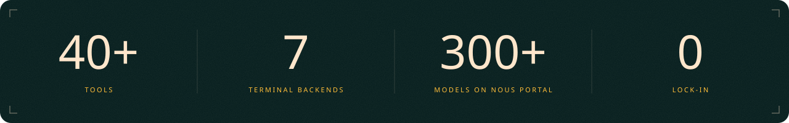
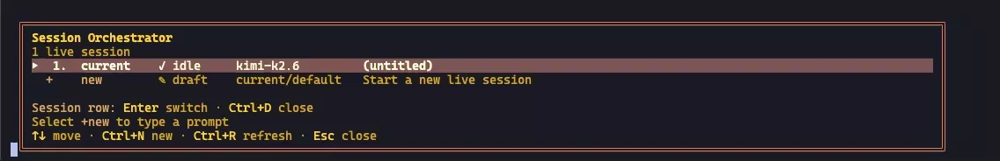
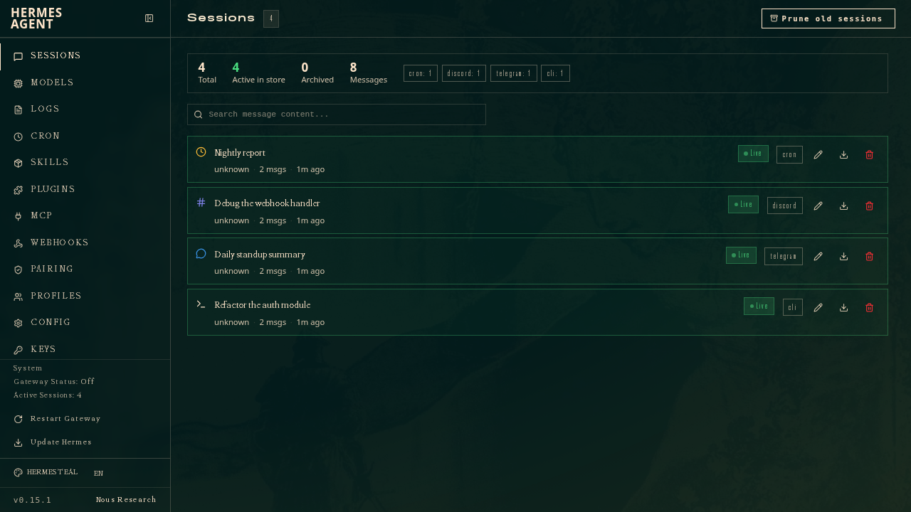
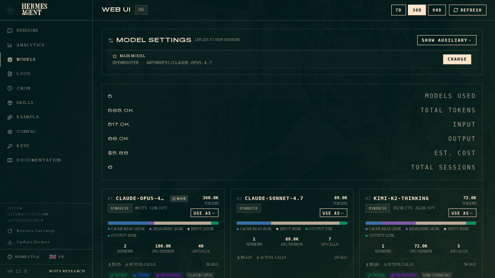
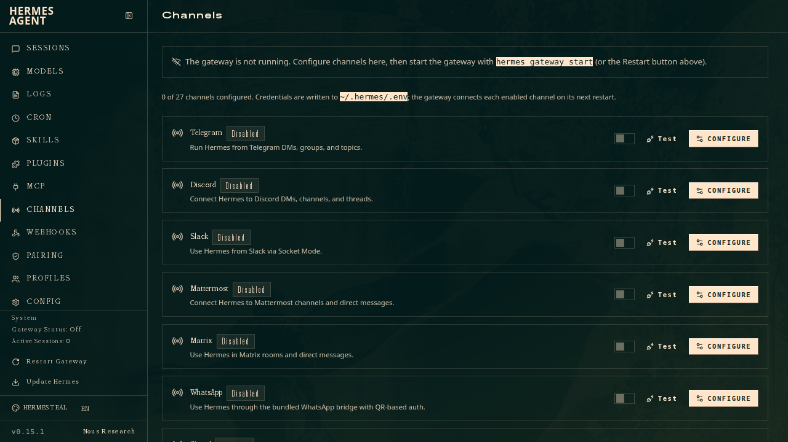
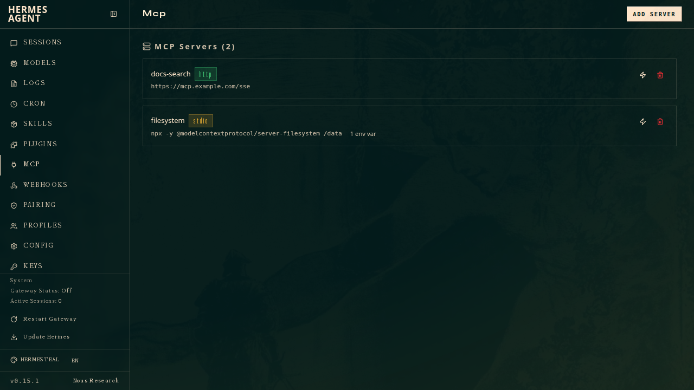

<p align="center">
  <a href="https://hermes-agent.nousresearch.com/">
    <picture>
      <source srcset="assets/readme/hero.webp" type="image/webp">
      
    </picture>
  </a>
</p>

<h1 align="center">Hermes Agent ☤</h1>

<p align="center">
  <a href="https://hermes-agent.nousresearch.com/"><b>Hermes Agent</b></a> &nbsp;·&nbsp; <a href="https://hermes-agent.nousresearch.com/"><b>Hermes Desktop</b></a>
</p>

<p align="center">
  <a href="https://hermes-agent.nousresearch.com/docs/"></a>
  <a href="https://discord.gg/NousResearch"></a>
  <a href="https://github.com/NousResearch/hermes-agent/blob/main/LICENSE"></a>
  <a href="https://nousresearch.com"></a>
  <br>
  <a href="README.zh-CN.md"></a>
  <a href="README.ur-pk.md"></a>
  <a href="README.es.md"></a>
</p>

<p align="center">
  <a href="#quick-install">Install</a> &nbsp;·&nbsp;
  <a href="#getting-started">Getting Started</a> &nbsp;·&nbsp;
  <a href="#skip-the-api-key-collection--nous-portal">Nous Portal</a> &nbsp;·&nbsp;
  <a href="#cli-vs-messaging-quick-reference">Commands</a> &nbsp;·&nbsp;
  <a href="#documentation">Docs</a> &nbsp;·&nbsp;
  <a href="#migrating-from-openclaw">OpenClaw</a> &nbsp;·&nbsp;
  <a href="#community">Community</a>
</p>

<br>

**The self-improving AI agent built by [Nous Research](https://nousresearch.com).** It's the only agent with a built-in learning loop — it creates skills from experience, improves them during use, nudges itself to persist knowledge, searches its own past conversations, and builds a deepening model of who you are across sessions. Run it on a $5 VPS, a GPU cluster, or serverless infrastructure that costs nearly nothing when idle. It's not tied to your laptop — talk to it from Telegram while it works on a cloud VM.

Use any model you want — [Nous Portal](https://portal.nousresearch.com), OpenRouter, OpenAI, your own endpoint, and [many others](https://hermes-agent.nousresearch.com/docs/integrations/providers). Switch with `hermes model` — no code changes, no lock-in.

<p align="center">
  
</p>

<p align="center">
  
</p>

<table>
  <tr>
    <td width="50%" valign="top">
      <br>
      <b>A real terminal interface</b><br>
      Full TUI with multiline editing, slash-command autocomplete, conversation history, interrupt-and-redirect, and streaming tool output.
    </td>
    <td width="50%" valign="top">
      <br>
      <b>Lives where you do</b><br>
      Telegram, Discord, Slack, WhatsApp, Signal, and CLI — all from a single gateway process. Voice memo transcription, cross-platform conversation continuity.
    </td>
  </tr>
  <tr>
    <td valign="top">
      <br>
      <b>A closed learning loop</b><br>
      Agent-curated memory with periodic nudges. Autonomous skill creation after complex tasks. Skills self-improve during use. FTS5 session search with LLM summarization for cross-session recall. <a href="https://github.com/plastic-labs/honcho">Honcho</a> dialectic user modeling. Compatible with the <a href="https://agentskills.io">agentskills.io</a> open standard.
    </td>
    <td valign="top">
      <br>
      <b>Scheduled automations</b><br>
      Built-in cron scheduler with delivery to any platform. Daily reports, nightly backups, weekly audits — all in natural language, running unattended.
    </td>
  </tr>
  <tr>
    <td valign="top">
      <br>
      <b>Delegates and parallelizes</b><br>
      Spawn isolated subagents for parallel workstreams. Write Python scripts that call tools via RPC, collapsing multi-step pipelines into zero-context-cost turns.
    </td>
    <td valign="top">
      <br>
      <b>Runs anywhere, not just your laptop</b><br>
      Seven terminal backends — local, Docker, SSH, Singularity, Modal, Daytona, and Vercel Sandbox. Daytona and Modal offer serverless persistence — your agent's environment hibernates when idle and wakes on demand, costing nearly nothing between sessions. Run it on a $5 VPS or a GPU cluster.
    </td>
  </tr>
  <tr>
    <td colspan="2" valign="top">
      <br>
      <b>Research-ready</b><br>
      Batch trajectory generation, trajectory compression for training the next generation of tool-calling models.
    </td>
  </tr>
</table>

<p align="center">
  
</p>

---

## Quick Install

<p align="center">
  
</p>

### Linux, macOS, WSL2

```bash
curl -fsSL https://hermes-agent.nousresearch.com/install.sh | bash
```

### Windows (native, PowerShell)

> [!NOTE]
> **Heads up:** Native Windows runs Hermes without WSL — CLI, gateway, TUI, and tools all work natively. If you'd rather use WSL2, the Linux/macOS one-liner above works there too. Found a bug? Please [file issues](https://github.com/NousResearch/hermes-agent/issues).

Run this in PowerShell:

```powershell
iex (irm https://hermes-agent.nousresearch.com/install.ps1)
```

The source installer delegates Python 3.14, Node.js, npm, ripgrep, FFmpeg,
and Python dependencies to PM. If Git is absent, it stages the verified Git
for Windows archive in Hermes' tool store. It does not replace your system Git.
See [installation methods](https://hermes-agent.nousresearch.com/docs/getting-started/installation)
for the separate MSIX/App Installer package and its update ownership.

> [!TIP]
> **Android / Termux:** A signed APT repository is available for aarch64 devices, with a `stable` channel (tagged releases) and a prerelease `canary` channel. The package includes Python, Node.js, and the TUI. Use the [Termux guide](https://hermes-agent.nousresearch.com/docs/getting-started/termux), not the desktop/server installer script.

> [!NOTE]
> **Windows:** Native Windows is fully supported — the PowerShell one-liner above installs everything. If you'd rather use WSL2, the Linux command works there too. Native Windows install lives under `%LOCALAPPDATA%\hermes`; WSL2 installs under `~/.hermes` as on Linux.

After installation:

```bash
source ~/.bashrc    # reload shell (or: source ~/.zshrc)
hermes              # start chatting!
```

### Troubleshooting

<details>
<summary><b>Windows Defender or antivirus flags <code>uv.exe</code> as malware</b></summary>

<br>

If your antivirus (Bitdefender, Windows Defender, etc.) quarantines `uv.exe` from the Hermes `bin` folder (`%LOCALAPPDATA%\hermes\bin\uv.exe`), this is a **false positive**. The file is Astral's `uv` — the Rust Python package manager Hermes bundles to manage its Python environment. ML-based antivirus engines commonly flag unsigned Rust binaries that download and install packages.

**To verify your copy is authentic:**

```powershell
# Install GitHub CLI if needed
winget install --id GitHub.cli

# Login to GitHub
gh auth login

# Run verification
$uv = "$env:LOCALAPPDATA\hermes\bin\uv.exe"
$ver = (& $uv --version).Split(' ')[1]
[Net.ServicePointManager]::SecurityProtocol = [Net.SecurityProtocolType]::Tls12
$zip = "$env:TEMP\uv.zip"
Invoke-WebRequest "https://github.com/astral-sh/uv/releases/download/$ver/uv-x86_64-pc-windows-msvc.zip" -OutFile $zip -UseBasicParsing
gh attestation verify $zip --repo astral-sh/uv
Expand-Archive $zip "$env:TEMP\uv_x" -Force
(Get-FileHash "$env:TEMP\uv_x\uv.exe").Hash -eq (Get-FileHash $uv).Hash
```

If attestation says "Verification succeeded" and the last line prints `True`, you're good.

**To whitelist Hermes:**
- **Windows Defender:** Run PowerShell as Admin → `Add-MpPreference -ExclusionPath "$env:LOCALAPPDATA\hermes\bin"`
- **Bitdefender:** Add an exception in the Bitdefender console (Protection > Antivirus > Settings > Manage Exceptions)
- Whitelist the **folder**, not the file hash — Hermes updates `uv` and the hash changes every version

For more context, see the upstream Astral reports: [astral-sh/uv#13553](https://github.com/astral-sh/uv/issues/13553), [astral-sh/uv#15011](https://github.com/astral-sh/uv/issues/15011), [astral-sh/uv#10079](https://github.com/astral-sh/uv/issues/10079).

</details>

---

## Getting Started

```bash
hermes              # Interactive CLI — start a conversation
hermes model        # Choose your LLM provider and model
hermes tools        # Configure which tools are enabled
hermes config set   # Set individual config values
hermes config get   # Print individual config values
hermes gateway      # Start the messaging gateway (Telegram, Discord, etc.)
hermes setup        # Run the full setup wizard (configures everything at once)
hermes claw migrate # Migrate from OpenClaw (if coming from OpenClaw)
hermes update       # Update to the latest version
hermes doctor       # Diagnose any issues
```

<p align="center">
  <a href="https://hermes-agent.nousresearch.com/docs/"></a>
</p>

<table>
  <tr>
    <td colspan="2"></td>
  </tr>
  <tr>
    <td width="50%"></td>
    <td width="50%"></td>
  </tr>
  <tr>
    <td></td>
    <td></td>
  </tr>
</table>
<p align="center"><sub>The terminal UI and the <a href="https://hermes-agent.nousresearch.com/docs/user-guide/features/web-dashboard">web dashboard</a> (<code>hermes dashboard</code>).</sub></p>

---

## Skip the API-key collection — Nous Portal

Hermes works with whatever provider you want — that's not changing. But if you'd rather not collect five separate API keys for the model, web search, image generation, TTS, and a cloud browser, **[Nous Portal](https://portal.nousresearch.com)** covers all of them under one subscription:

<table>
  <tr>
    <td width="50%" valign="top"><b>300+ models</b><br>Pick any of them with <code>/model &lt;name&gt;</code></td>
    <td width="50%" valign="top"><b>Tool Gateway</b><br>Web search, image generation (FAL), text-to-speech (OpenAI), cloud browser (Browser Use), all routed through your sub. No extra accounts.</td>
  </tr>
</table>

One command from a fresh install:

```bash
hermes setup --portal
```

That logs you in via OAuth, sets Nous as your provider, and turns on the Tool Gateway. Check what's wired up any time with `hermes portal info`. Full details on the [Tool Gateway docs page](https://hermes-agent.nousresearch.com/docs/user-guide/features/tool-gateway).

You can still bring your own keys per-tool whenever you want — the gateway is per-backend, not all-or-nothing.

---

## CLI vs Messaging Quick Reference

Hermes has two entry points: start the terminal UI with `hermes`, or run the gateway and talk to it from Telegram, Discord, Slack, WhatsApp, Signal, or Email. Once you're in a conversation, many slash commands are shared across both interfaces.

| Action                         | CLI                                           | Messaging platforms                                                              |
| ------------------------------ | --------------------------------------------- | -------------------------------------------------------------------------------- |
| Start chatting                 | `hermes`                                      | Run `hermes gateway setup` + `hermes gateway start`, then send the bot a message |
| Start fresh conversation       | `/new` or `/reset`                            | `/new` or `/reset`                                                               |
| Change model                   | `/model [provider:model]`                     | `/model [provider:model]`                                                        |
| Set a personality              | `/personality [name]`                         | `/personality [name]`                                                            |
| Retry or undo the last turn    | `/retry`, `/undo`                             | `/retry`, `/undo`                                                                |
| Compress context / check usage | `/compress`, `/usage`, `/insights [--days N]` | `/compress`, `/usage`, `/insights [days]`                                        |
| Browse skills                  | `/skills` or `/<skill-name>`                  | `/<skill-name>`                                                                  |
| Interrupt current work         | `Ctrl+C` or send a new message                | `/stop` or send a new message                                                    |
| Platform-specific status       | `/platforms`                                  | `/status`, `/sethome`                                                            |

For the full command lists, see the [CLI guide](https://hermes-agent.nousresearch.com/docs/user-guide/cli) and the [Messaging Gateway guide](https://hermes-agent.nousresearch.com/docs/user-guide/messaging).

---

## Documentation

All documentation lives at **[hermes-agent.nousresearch.com/docs](https://hermes-agent.nousresearch.com/docs/)**:

| Section                                                                                             | What's Covered                                             |
| --------------------------------------------------------------------------------------------------- | ---------------------------------------------------------- |
| [Quickstart](https://hermes-agent.nousresearch.com/docs/getting-started/quickstart)                 | Install → setup → first conversation in 2 minutes          |
| [CLI Usage](https://hermes-agent.nousresearch.com/docs/user-guide/cli)                              | Commands, keybindings, personalities, sessions             |
| [Configuration](https://hermes-agent.nousresearch.com/docs/user-guide/configuration)                | Config file, providers, models, all options                |
| [Messaging Gateway](https://hermes-agent.nousresearch.com/docs/user-guide/messaging)                | Telegram, Discord, Slack, WhatsApp, Signal, Home Assistant |
| [Security](https://hermes-agent.nousresearch.com/docs/user-guide/security)                          | Command approval, DM pairing, container isolation          |
| [Tools & Toolsets](https://hermes-agent.nousresearch.com/docs/user-guide/features/tools)            | 40+ tools, toolset system, terminal backends               |
| [Skills System](https://hermes-agent.nousresearch.com/docs/user-guide/features/skills)              | Procedural memory, Skills Hub, creating skills             |
| [Memory](https://hermes-agent.nousresearch.com/docs/user-guide/features/memory)                     | Persistent memory, user profiles, best practices           |
| [MCP Integration](https://hermes-agent.nousresearch.com/docs/user-guide/features/mcp)               | Connect any MCP server for extended capabilities           |
| [Cron Scheduling](https://hermes-agent.nousresearch.com/docs/user-guide/features/cron)              | Scheduled tasks with platform delivery                     |
| [Context Files](https://hermes-agent.nousresearch.com/docs/user-guide/features/context-files)       | Project context that shapes every conversation             |
| [Architecture](https://hermes-agent.nousresearch.com/docs/developer-guide/architecture)             | Project structure, agent loop, key classes                 |
| [Contributing](https://hermes-agent.nousresearch.com/docs/developer-guide/contributing)             | Development setup, PR process, code style                  |
| [CLI Reference](https://hermes-agent.nousresearch.com/docs/reference/cli-commands)                  | All commands and flags                                     |
| [Environment Variables](https://hermes-agent.nousresearch.com/docs/reference/environment-variables) | Complete env var reference                                 |

---

## Migrating from OpenClaw

If you're coming from OpenClaw, Hermes can automatically import your settings, memories, skills, and API keys.

**During first-time setup:** The setup wizard (`hermes setup`) automatically detects `~/.openclaw` and offers to migrate before configuration begins.

**Anytime after install:**

```bash
hermes claw migrate              # Interactive migration (full preset)
hermes claw migrate --dry-run    # Preview what would be migrated
hermes claw migrate --preset user-data   # Migrate without secrets
hermes claw migrate --overwrite  # Overwrite existing conflicts
```

What gets imported:

| Imported | Details |
| --- | --- |
| **SOUL.md** | persona file |
| **Memories** | MEMORY.md and USER.md entries |
| **Skills** | user-created skills → `~/.hermes/skills/openclaw-imports/` |
| **Command allowlist** | approval patterns |
| **Messaging settings** | platform configs, allowed users, working directory |
| **API keys** | allowlisted secrets (Telegram, OpenRouter, OpenAI, Anthropic, ElevenLabs) |
| **TTS assets** | workspace audio files |
| **Workspace instructions** | AGENTS.md (with `--workspace-target`) |

See `hermes claw migrate --help` for all options, or use the `openclaw-migration` skill for an interactive agent-guided migration with dry-run previews.

---

## Contributing

We welcome contributions! See the [Contributing Guide](https://hermes-agent.nousresearch.com/docs/developer-guide/contributing) for development setup, code style, and PR process.

Start with the [PM developer workflow](website/docs/reference/package-management.md#developer-workflow)
for activation, daily use, dependency changes, and leaving the environment.
[Development Setup](CONTRIBUTING.md#development-setup) covers the separate test environment and verification commands.

---

## Community

<p align="center">
  <a href="https://discord.gg/NousResearch"></a>
  <a href="https://agentskills.io"></a>
  <a href="https://github.com/NousResearch/hermes-agent/issues"></a>
</p>

- 💬 [Discord](https://discord.gg/NousResearch)
- 📚 [Skills Hub](https://agentskills.io)
- 🐛 [Issues](https://github.com/NousResearch/hermes-agent/issues)
- 🔌 [computer-use-linux](https://github.com/avifenesh/computer-use-linux) — Linux desktop-control MCP server for Hermes and other MCP hosts, with AT-SPI accessibility trees, Wayland/X11 input, screenshots, and compositor window targeting.
- 🔌 [HermesClaw](https://github.com/AaronWong1999/hermesclaw) — Community WeChat bridge: Run Hermes Agent and OpenClaw on the same WeChat account.

---

## License

MIT — see [LICENSE](LICENSE).

Built by [Nous Research](https://nousresearch.com).

<br>

<p align="center">
  <a href="https://nousresearch.com">
    <picture>
      <source srcset="assets/readme/footer.webp" type="image/webp">
      
    </picture>
  </a>
</p>
