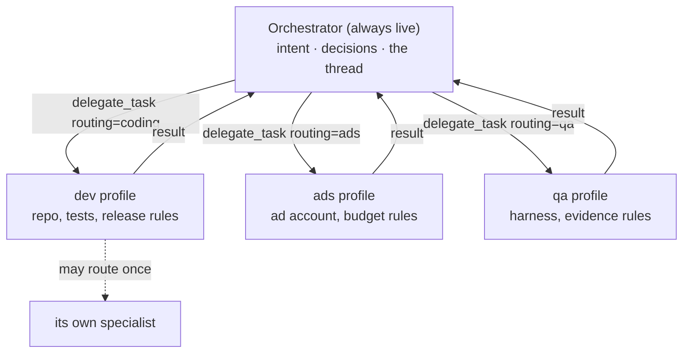

<p align="center">
  
</p>

# Hermes Agent ☤
<p align="center">
  <a href="https://hermes-agent.nousresearch.com/">Hermes Agent</a> | <a href="https://hermes-agent.nousresearch.com/">Hermes Desktop</a>
</p>
<p align="center">
  <a href="https://hermes-agent.nousresearch.com/docs/"></a>
  <a href="https://discord.gg/NousResearch"></a>
  <a href="https://github.com/NousResearch/hermes-agent/blob/main/LICENSE"></a>
  <a href="https://nousresearch.com"></a>
  <a href="README.zh-CN.md"></a>
  <a href="README.ur-pk.md"></a>
  <a href="README.es.md"></a>
</p>

**The self-improving AI agent built by [Nous Research](https://nousresearch.com).** It's the only agent with a built-in learning loop — it creates skills from experience, improves them during use, nudges itself to persist knowledge, searches its own past conversations, and builds a deepening model of who you are across sessions. Run it on a $5 VPS, a GPU cluster, or serverless infrastructure that costs nearly nothing when idle. It's not tied to your laptop — talk to it from Telegram while it works on a cloud VM.

Use any model you want — [Nous Portal](https://portal.nousresearch.com), OpenRouter, OpenAI, your own endpoint, and [many others](https://hermes-agent.nousresearch.com/docs/integrations/providers). Switch with `hermes model` — no code changes, no lock-in.

> **Fork addition — profile-pool delegation.** Upstream `delegate_task` spawns an in-process clone
> of the calling agent: same model, same toolset, no identity, and whatever it learns dies with it.
> This fork adds an opt-in `delegation-router` plugin so that one always-live orchestrator manages
> **subagents that are real Hermes profiles** — each with its own skills, tools, memory and project
> files, each accumulating knowledge across runs. Jump to
> [Profile-pool delegation](#profile-pool-delegation-this-fork).

<table>
<tr><td><b>A real terminal interface</b></td><td>Full TUI with multiline editing, slash-command autocomplete, conversation history, interrupt-and-redirect, and streaming tool output.</td></tr>
<tr><td><b>Lives where you do</b></td><td>Telegram, Discord, Slack, WhatsApp, Signal, and CLI — all from a single gateway process. Voice memo transcription, cross-platform conversation continuity.</td></tr>
<tr><td><b>A closed learning loop</b></td><td>Agent-curated memory with periodic nudges. Autonomous skill creation after complex tasks. Skills self-improve during use. FTS5 session search with LLM summarization for cross-session recall. <a href="https://github.com/plastic-labs/honcho">Honcho</a> dialectic user modeling. Compatible with the <a href="https://agentskills.io">agentskills.io</a> open standard.</td></tr>
<tr><td><b>Scheduled automations</b></td><td>Built-in cron scheduler with delivery to any platform. Daily reports, nightly backups, weekly audits — all in natural language, running unattended.</td></tr>
<tr><td><b>Delegates and parallelizes</b></td><td>Spawn isolated subagents for parallel workstreams. Write Python scripts that call tools via RPC, collapsing multi-step pipelines into zero-context-cost turns.</td></tr>
<tr><td><b>Runs anywhere, not just your laptop</b></td><td>Seven terminal backends — local, Docker, SSH, Singularity, Modal, Daytona, and Vercel Sandbox. Daytona and Modal offer serverless persistence — your agent's environment hibernates when idle and wakes on demand, costing nearly nothing between sessions. Run it on a $5 VPS or a GPU cluster.</td></tr>
<tr><td><b>Research-ready</b></td><td>Batch trajectory generation, trajectory compression for training the next generation of tool-calling models.</td></tr>
</table>

---

## Profile-pool delegation (this fork)

### The problem with clones

Upstream, `delegate_task` spawns a **clone of the caller**: same model, same tools, a fresh
conversation, and no identity. That is the right tool for splitting one big task into parallel
pieces. But it has three limits that show up the moment work becomes routine:

1. **Nothing accumulates.** Every clone starts from zero. It has no memory of last week's audit,
   no project files, no skill that got better over time. You pay the same setup cost and get the
   same mistakes back.
2. **The wrong brain for the job.** A clone inherits the orchestrator's model. A code review, an
   ad-creative QA pass, and a refund audit all get the same model, the same toolset, and the same
   personality.
3. **Context becomes the bottleneck.** The orchestrator's window fills with raw tool output from
   work it should never have been holding in the first place. Long sessions degrade, then compact,
   then lose detail.

### The shape: one orchestrator, many specialist profiles

This fork keeps **one always-live orchestrator** — your default profile — and makes its subagents
**real Hermes profiles**. Each profile owns a kind of work. Each has its own model, skills, tools,
plugins, memory and project files.


```mermaid
flowchart TD
  O["Orchestrator (always live)<br/>intent · decisions · the thread"]
  O -->|delegate_task routing=coding| D["dev profile<br/>repo, tests, release rules"]
  O -->|delegate_task routing=ads| A["ads profile<br/>ad account, budget rules"]
  O -->|delegate_task routing=qa| Q["qa profile<br/>harness, evidence rules"]
  D -->|result| O
  A -->|result| O
  Q -->|result| O
  D -.->|may route once| X["its own specialist"]
```

The orchestrator's job is to **stay in the conversation**: hold your intent, decide what matters,
sequence the work, keep the record straight. It does not do the work. That is what keeps it live
and current instead of drowning in detail.

### What accumulates — and why that compounds

Every profile is a standing asset, not a one-shot worker:

| | what it means |
|---|---|
| **Skills** | Hermes learns new skills from experience and improves skills during use. A profile that does QA for weeks is a better QA agent than one spun up this morning — and you can read what it learned. |
| **Memory** | Each profile keeps its own durable notes: account IDs, conventions, what broke last time, who to ask. |
| **Project files** | The dev profile works inside the real repo with its staging rules; the ads profile holds the real account context. No re-briefing. |
| **Tools and plugins** | The browser profile, MCP servers, terminal backends and credentials a role actually needs — scoped to that profile, not handed to every clone. |

Route the same task next month and it lands in a more capable place than it did today. That is the
compounding: the orchestrator stays sharp on decisions, the profiles get steadily better at their
craft.

### Minimal context loss, by construction

Only the **summary** crosses the boundary. The orchestrator never holds the child's raw tool
traffic, so its window stays small and its reasoning stays on the decisions. And nothing is
lossy in the other direction either:

- each routed run writes a **full transcript** to `$HERMES_HOME/delegation-router/runs/` and an
  audit line to `runs.jsonl`, so the detail exists even though it is not in the orchestrator's
  context;
- every run is still a **real session**, resumable with `hermes -p <profile> --resume <session_id>`
  if you need to go back into the work without replaying it in the main thread;
- the orchestrator can keep going while children work, and their results re-enter the conversation
  as ordinary messages — no polling, no stalled turns.

### Realtime, and observable by default

Routed work is not a black box you wait on:

- `delegate_task` returns a **dispatch handle immediately**; the consolidated result arrives as a
  new message when the batch finishes.
- Routed children register as **visible subagents of the calling session**, so
  `delegate_task(action="list")`, the TUI/desktop agent view, and `action="stop"` all work on them.
- Live transcripts stream to disk while the run happens; `delegation_router_status` shows the pool,
  the bucket → profile mapping and recent runs; `runs.jsonl` is the audit trail.
- Children run in parallel, and a large job becomes several specialists working at once instead of
  one agent queued behind itself.

### It composes

A routed profile is a full Hermes agent, so it can route *its own* sub-work one level down when the
role calls for it (a dev profile handing a verification pass to the QA profile), bounded by
`max_depth`. Beyond that boundary, delegation goes back to stock clones — so the pattern nests
without ever running away with itself.

### Clone vs profile subagent

| | stock clone | routed profile subagent |
|---|---|---|
| model | the caller's `delegation.model` | the profile's own |
| skills | caller's toolset only | the profile's, plus per-role preload |
| memory, project files | caller's | the profile's own, persistent |
| identity / role | none | an explicit charter (persona) when you want one |
| what it learns | lost at the end of the run | kept — skills and memory accumulate |
| durable session | no | yes (`--resume`) |
| visible in `/agents` | yes | yes |
| best for | splitting one task into parallel pieces | work that belongs to a standing specialist |

Both stay available. A task that resolves to no bucket is handed to stock delegation untouched, so
routing never silently swallows work.

### Quickstart

```bash
hermes plugins enable delegation-router
cp plugins/delegation_router/routing.yaml.example \
   "$HERMES_HOME/plugins/delegation-router/routing.yaml"   # point buckets at YOUR profiles
hermes profile create coder --no-alias                     # one profile per role you route to
```

```python
delegate_task(routing="coding", project="acme", goal="…")   # → hermes -p acme-dev chat --oneshot …
```

Full guide: [`website/docs/user-guide/features/profile-pool-delegation.md`](website/docs/user-guide/features/profile-pool-delegation.md).
Plugin operations and troubleshooting: [`plugins/delegation_router/README.md`](plugins/delegation_router/README.md).

### The core change is small

`delegate_task` is dispatched **inline**, not through the tool registry, so a plugin that took the
tool over with the `tools.override` capability never saw the call. This fork adds one generic hook:
`registry.plugin_handler(name)` reports the handler only when a *plugin* owns it, and the inline
dispatch site consults it. With no plugin installed the built-in path is unchanged — the change is
~15 lines, and it benefits any plugin, not just this one. The router prefers the hook and falls
back to wrapping the dispatch method on a build without it, so the same plugin file works on stock
Hermes.

### Limits, stated plainly

- A routed run is a **subprocess session**: it costs a real process, and its model spend is the
  profile's, not the orchestrator's.
- Children **end with the session that dispatched them** — interrupting that session or shutting it
  down stops them, exactly as stock background subagents behave. Work that must outlive a
  conversation belongs in `cronjob` or a Kanban worker.
- Routing happens when the caller **asks** (`routing`/`project`) or when the goal's keywords match a
  bucket. A model that ignores the argument gets stock delegation.
- A skill name visible in two roots is refused by Hermes, so a charter member can be reported as
  `skills_ambiguous_not_preloaded` rather than silently half-loaded.

---

## Quick Install

### Linux, macOS, WSL2, Termux

```bash
curl -fsSL https://hermes-agent.nousresearch.com/install.sh | bash
```

### Windows (native, PowerShell)

> **Heads up:** Native Windows runs Hermes without WSL — CLI, gateway, TUI, and tools all work natively. If you'd rather use WSL2, the Linux/macOS one-liner above works there too. Found a bug? Please [file issues](https://github.com/NousResearch/hermes-agent/issues).

Run this in PowerShell:

```powershell
iex (irm https://hermes-agent.nousresearch.com/install.ps1)
```

The installer handles everything: uv, Python 3.11, Node.js, ripgrep, ffmpeg, **and a portable Git Bash** (MinGit, unpacked to `%LOCALAPPDATA%\hermes\git` — no admin required, completely isolated from any system Git install). Hermes uses this bundled Git Bash to run shell commands.

If you already have Git installed, the installer detects it and uses that instead. Otherwise a ~45MB MinGit download is all you need — it won't touch or interfere with any system Git.

> **Android / Termux:** The tested manual path is documented in the [Termux guide](https://hermes-agent.nousresearch.com/docs/getting-started/termux). On Termux, Hermes installs a curated `.[termux]` extra because the full `.[all]` extra currently pulls Android-incompatible voice dependencies.
>
> **Windows:** Native Windows is fully supported — the PowerShell one-liner above installs everything. If you'd rather use WSL2, the Linux command works there too. Native Windows install lives under `%LOCALAPPDATA%\hermes`; WSL2 installs under `~/.hermes` as on Linux.

After installation:

```bash
source ~/.bashrc    # reload shell (or: source ~/.zshrc)
hermes              # start chatting!
```

### Troubleshooting

#### Windows Defender or antivirus flags `uv.exe` as malware

If your antivirus (Bitdefender, Windows Defender, etc.) quarantines `uv.exe` from the Hermes `bin` folder (`%LOCALAPPDATA%\hermes\bin\uv.exe`), this is a **false positive**. The file is Astral's `uv` — the Rust Python package manager Hermes bundles to manage its Python environment. ML-based antivirus engines commonly flag unsigned Rust binaries that download and install packages.

**To verify your copy is authentic:**

```powershell
# Install GitHub CLI if needed
winget install --id GitHub.cli

# Login to GitHub
gh auth login

# Run verification
$uv = "$env:LOCALAPPDATA\hermes\bin\uv.exe"
$ver = (& $uv --version).Split(' ')[1]
[Net.ServicePointManager]::SecurityProtocol = [Net.SecurityProtocolType]::Tls12
$zip = "$env:TEMP\uv.zip"
Invoke-WebRequest "https://github.com/astral-sh/uv/releases/download/$ver/uv-x86_64-pc-windows-msvc.zip" -OutFile $zip -UseBasicParsing
gh attestation verify $zip --repo astral-sh/uv
Expand-Archive $zip "$env:TEMP\uv_x" -Force
(Get-FileHash "$env:TEMP\uv_x\uv.exe").Hash -eq (Get-FileHash $uv).Hash
```

If attestation says "Verification succeeded" and the last line prints `True`, you're good.

**To whitelist Hermes:**
- **Windows Defender:** Run PowerShell as Admin → `Add-MpPreference -ExclusionPath "$env:LOCALAPPDATA\hermes\bin"`
- **Bitdefender:** Add an exception in the Bitdefender console (Protection > Antivirus > Settings > Manage Exceptions)
- Whitelist the **folder**, not the file hash — Hermes updates `uv` and the hash changes every version

For more context, see the upstream Astral reports: [astral-sh/uv#13553](https://github.com/astral-sh/uv/issues/13553), [astral-sh/uv#15011](https://github.com/astral-sh/uv/issues/15011), [astral-sh/uv#10079](https://github.com/astral-sh/uv/issues/10079).

---

## Getting Started

```bash
hermes              # Interactive CLI — start a conversation
hermes model        # Choose your LLM provider and model
hermes tools        # Configure which tools are enabled
hermes config set   # Set individual config values
hermes config get   # Print individual config values
hermes gateway      # Start the messaging gateway (Telegram, Discord, etc.)
hermes setup        # Run the full setup wizard (configures everything at once)
hermes claw migrate # Migrate from OpenClaw (if coming from OpenClaw)
hermes update       # Update to the latest version
hermes doctor       # Diagnose any issues
```

📖 **[Full documentation →](https://hermes-agent.nousresearch.com/docs/)**

---

## Skip the API-key collection — Nous Portal

Hermes works with whatever provider you want — that's not changing. But if you'd rather not collect five separate API keys for the model, web search, image generation, TTS, and a cloud browser, **[Nous Portal](https://portal.nousresearch.com)** covers all of them under one subscription:

- **300+ models** — pick any of them with `/model <name>`
- **Tool Gateway** — web search (Firecrawl), image generation (FAL), text-to-speech (OpenAI), cloud browser (Browser Use), all routed through your sub. No extra accounts.

One command from a fresh install:

```bash
hermes setup --portal
```

That logs you in via OAuth, sets Nous as your provider, and turns on the Tool Gateway. Check what's wired up any time with `hermes portal info`. Full details on the [Tool Gateway docs page](https://hermes-agent.nousresearch.com/docs/user-guide/features/tool-gateway).

You can still bring your own keys per-tool whenever you want — the gateway is per-backend, not all-or-nothing.

---

## CLI vs Messaging Quick Reference

Hermes has two entry points: start the terminal UI with `hermes`, or run the gateway and talk to it from Telegram, Discord, Slack, WhatsApp, Signal, or Email. Once you're in a conversation, many slash commands are shared across both interfaces.

| Action                         | CLI                                           | Messaging platforms                                                              |
| ------------------------------ | --------------------------------------------- | -------------------------------------------------------------------------------- |
| Start chatting                 | `hermes`                                      | Run `hermes gateway setup` + `hermes gateway start`, then send the bot a message |
| Start fresh conversation       | `/new` or `/reset`                            | `/new` or `/reset`                                                               |
| Change model                   | `/model [provider:model]`                     | `/model [provider:model]`                                                        |
| Set a personality              | `/personality [name]`                         | `/personality [name]`                                                            |
| Retry or undo the last turn    | `/retry`, `/undo`                             | `/retry`, `/undo`                                                                |
| Compress context / check usage | `/compress`, `/usage`, `/insights [--days N]` | `/compress`, `/usage`, `/insights [days]`                                        |
| Browse skills                  | `/skills` or `/<skill-name>`                  | `/<skill-name>`                                                                  |
| Interrupt current work         | `Ctrl+C` or send a new message                | `/stop` or send a new message                                                    |
| Platform-specific status       | `/platforms`                                  | `/status`, `/sethome`                                                            |

For the full command lists, see the [CLI guide](https://hermes-agent.nousresearch.com/docs/user-guide/cli) and the [Messaging Gateway guide](https://hermes-agent.nousresearch.com/docs/user-guide/messaging).

---

## Documentation

All documentation lives at **[hermes-agent.nousresearch.com/docs](https://hermes-agent.nousresearch.com/docs/)**:

| Section                                                                                             | What's Covered                                             |
| --------------------------------------------------------------------------------------------------- | ---------------------------------------------------------- |
| [Quickstart](https://hermes-agent.nousresearch.com/docs/getting-started/quickstart)                 | Install → setup → first conversation in 2 minutes          |
| [CLI Usage](https://hermes-agent.nousresearch.com/docs/user-guide/cli)                              | Commands, keybindings, personalities, sessions             |
| [Configuration](https://hermes-agent.nousresearch.com/docs/user-guide/configuration)                | Config file, providers, models, all options                |
| [Messaging Gateway](https://hermes-agent.nousresearch.com/docs/user-guide/messaging)                | Telegram, Discord, Slack, WhatsApp, Signal, Home Assistant |
| [Security](https://hermes-agent.nousresearch.com/docs/user-guide/security)                          | Command approval, DM pairing, container isolation          |
| [Tools & Toolsets](https://hermes-agent.nousresearch.com/docs/user-guide/features/tools)            | 40+ tools, toolset system, terminal backends               |
| [Skills System](https://hermes-agent.nousresearch.com/docs/user-guide/features/skills)              | Procedural memory, Skills Hub, creating skills             |
| [Memory](https://hermes-agent.nousresearch.com/docs/user-guide/features/memory)                     | Persistent memory, user profiles, best practices           |
| [MCP Integration](https://hermes-agent.nousresearch.com/docs/user-guide/features/mcp)               | Connect any MCP server for extended capabilities           |
| [Cron Scheduling](https://hermes-agent.nousresearch.com/docs/user-guide/features/cron)              | Scheduled tasks with platform delivery                     |
| [Context Files](https://hermes-agent.nousresearch.com/docs/user-guide/features/context-files)       | Project context that shapes every conversation             |
| [Architecture](https://hermes-agent.nousresearch.com/docs/developer-guide/architecture)             | Project structure, agent loop, key classes                 |
| [Contributing](https://hermes-agent.nousresearch.com/docs/developer-guide/contributing)             | Development setup, PR process, code style                  |
| [CLI Reference](https://hermes-agent.nousresearch.com/docs/reference/cli-commands)                  | All commands and flags                                     |
| [Environment Variables](https://hermes-agent.nousresearch.com/docs/reference/environment-variables) | Complete env var reference                                 |

---

## Migrating from OpenClaw

If you're coming from OpenClaw, Hermes can automatically import your settings, memories, skills, and API keys.

**During first-time setup:** The setup wizard (`hermes setup`) automatically detects `~/.openclaw` and offers to migrate before configuration begins.

**Anytime after install:**

```bash
hermes claw migrate              # Interactive migration (full preset)
hermes claw migrate --dry-run    # Preview what would be migrated
hermes claw migrate --preset user-data   # Migrate without secrets
hermes claw migrate --overwrite  # Overwrite existing conflicts
```

What gets imported:

- **SOUL.md** — persona file
- **Memories** — MEMORY.md and USER.md entries
- **Skills** — user-created skills → `~/.hermes/skills/openclaw-imports/`
- **Command allowlist** — approval patterns
- **Messaging settings** — platform configs, allowed users, working directory
- **API keys** — allowlisted secrets (Telegram, OpenRouter, OpenAI, Anthropic, ElevenLabs)
- **TTS assets** — workspace audio files
- **Workspace instructions** — AGENTS.md (with `--workspace-target`)

See `hermes claw migrate --help` for all options, or use the `openclaw-migration` skill for an interactive agent-guided migration with dry-run previews.

---

## Contributing

We welcome contributions! See the [Contributing Guide](https://hermes-agent.nousresearch.com/docs/developer-guide/contributing) for development setup, code style, and PR process.

Quick start for contributors — use the standard installer, then work from the
full git checkout it creates at `$HERMES_HOME/hermes-agent` (usually
`~/.hermes/hermes-agent`). This matches the layout used by `hermes update`, the
managed venv, lazy dependencies, gateway, and docs tooling.

```bash
curl -fsSL https://hermes-agent.nousresearch.com/install.sh | bash
cd "${HERMES_HOME:-$HOME/.hermes}/hermes-agent"
uv pip install -e ".[all,dev]"
scripts/run_tests.sh
```

Manual clone fallback (for throwaway clones/CI where you intentionally do not
want the managed install layout):

Create the venv outside the cloned source tree — a venv inside the directory
the agent operates from can be wiped by a relative-path command the agent runs
against its own checkout, destroying the running runtime mid-session.

```bash
curl -LsSf https://astral.sh/uv/install.sh | sh
uv venv ~/.hermes/venvs/hermes-dev --python 3.11
source ~/.hermes/venvs/hermes-dev/bin/activate
uv pip install -e ".[all,dev]"
scripts/run_tests.sh
```

---

## Community

- 💬 [Discord](https://discord.gg/NousResearch)
- 📚 [Skills Hub](https://agentskills.io)
- 🐛 [Issues](https://github.com/NousResearch/hermes-agent/issues)
- 🔌 [computer-use-linux](https://github.com/avifenesh/computer-use-linux) — Linux desktop-control MCP server for Hermes and other MCP hosts, with AT-SPI accessibility trees, Wayland/X11 input, screenshots, and compositor window targeting.
- 🔌 [HermesClaw](https://github.com/AaronWong1999/hermesclaw) — Community WeChat bridge: Run Hermes Agent and OpenClaw on the same WeChat account.

---

## License

MIT — see [LICENSE](LICENSE).

Built by [Nous Research](https://nousresearch.com).
