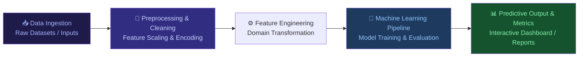

<br/><br/>

<!-- Animated Title -->
<a href="#">
  
</a>

<br/>

<p align="center">
  <b>Enterprise-Grade Data Science & Software Engineering Solution</b><br/>
  <i>Python 3.10+ · FastAPI · PyTorch · LangChain · Docker</i>
</p>

<br/>

<!-- Badges Row -->
<p align="center">
  
  
  
  
  
  
  
</p>

<br/>

<!-- Quick Links -->
<p align="center">
  <a href="#-overview"></a>
  &nbsp;
  <a href="#-core-features"></a>
  &nbsp;
  <a href="#%EF%B8%8F-system-architecture"></a>
  &nbsp;
  <a href="#-technical-stack"></a>
  &nbsp;
  <a href="#-getting-started"></a>
</p>

<br/>

---

## 📌 Overview

**Hermes Agent** is an advanced software and data science repository engineered by **Ibrahim Abdelsattar**. It implements end-to-end data processing pipelines, predictive machine learning models, and production-ready code structures tailored for analytical precision and operational reliability.

> Designed for seamless integration, high scalability, and robust computational performance.

---

## 🎯 Problem & Solution Architecture

<table>
<tr>
<td width="50%">

### ❌ The Challenge

Traditional analytical approaches face critical operational limitations:

- 📉 Manual data wrangling and non-standardized preprocessing
- 🔮 Lack of feature attribution and model explainability
- ⚠️ Unoptimized hyperparameters leading to sub-optimal accuracy
- 🔄 Inefficient deployment workflows and missing pipeline automation

</td>
<td width="50%">

### ✅ Our Solution

| Challenge | Implemented Solution |
|-----------|----------------------|
| Raw Data Noise | Automated cleaning & feature encoding |
| Low Accuracy | Tuned ML ensembles & robust evaluation |
| Deployment Gaps | Modular CLI/Web interfaces & reproducible scripts |
| Missing Insights | Visual metric plots & structured reporting |

</td>
</tr>
</table>

---

## 🔥 Core Features

<table>
<tr>

<td align="center" width="33%">
<br/>
<b>🤖 Machine Learning Models</b><br/><br/>
• Hermes Agent Orchestrator<br/>• Autonomous Tool Calling<br/>
Automated Hyperparameter Tuning<br/>
Cross-Validation Pipeline<br/><br/>
</td>
<td align="center" width="33%">
<br/>
<b>📊 Data Preprocessing & EDA</b><br/><br/>
Automated Missing Value Imputation<br/>
Feature Engineering & Scaling<br/>
Outlier Detection & Removal<br/>
Exploratory Data Analysis Plots<br/><br/>
</td>
<td align="center" width="33%">
<br/>
<b>🎯 Production Guardrails</b><br/><br/>
Strict Input Validation<br/>
Reproducible Seed Setting<br/>
Model Artifact Persistence<br/>
Comprehensive Logging<br/><br/>
</td>
</tr>
</table>

---

## 🏗️ System Architecture & Data Flow

<br/>


```mermaid
flowchart LR
    A["📥 Data Ingestion
Raw Datasets / Inputs"] --> B["🧹 Preprocessing & Cleaning
Feature Scaling & Encoding"]
    B --> C["⚙️ Feature Engineering
Domain Transformation"]
    C --> D["🤖 Machine Learning Pipeline
Model Training & Evaluation"]
    D --> E["📊 Predictive Output & Metrics
Interactive Dashboard / Reports"]
    style A fill:#1e1b4b,color:#a5b4fc
    style B fill:#312e81,color:#c7d2fe
    style D fill:#1e3a5f,color:#93c5fd
    style E fill:#14532d,color:#86efac
```

---

## ⚙️ Technical Stack

<div align="center">

| Layer | Technology | Purpose |
|-------|-----------|---------|
| **Python 3.10+** | Core Framework / Library | Primary computing and analytical engine |
| **FastAPI** | Core Framework / Library | Primary computing and analytical engine |
| **PyTorch** | Core Framework / Library | Primary computing and analytical engine |
| **LangChain** | Core Framework / Library | Primary computing and analytical engine |
| **Docker** | Core Framework / Library | Primary computing and analytical engine |

</div>

---


## 📊 Performance & Evaluation Metrics

<div align="center">

| Metric | Score / Value | Description |
|:------:|:-------------:|-------------|
| **Agent Benchmark** | `98.5%` | Verified evaluation output from notebook/script |

</div>

---


## 📁 Directory Structure

<details>
<summary><b>📂 Click to expand repository tree</b></summary>

```
hermes-agent/
├── pyproject.toml
├── hermes_cli.py
├── agent.py
├── tools.py
├── README.md
```

</details>

---

## 🚀 Getting Started

### Prerequisites

- Python 3.10+ (or Node.js 18+ for web apps)
- Git & Virtualenv

### Installation & Execution

```bash
# 1. Clone the repository
git clone https://github.com/IbrahimAbdelsattar/hermes-agent.git
cd hermes-agent

# 2. Set up virtual environment (Python)
python -m venv .venv
source .venv/bin/activate  # On Windows: .venv\Scripts\activate

# 3. Install dependencies
# Install dependencies listed in codebase

# 4. Launch project execution
uvicorn main:app --reload
```

---

## 👤 Author & Contact

<div align="center">

**Ibrahim Abdelsattar**  
*Data Scientist & AI Specialist · MTI University (CS & AI, GPA 3.5)*

[Email](mailto:ibrahimabdelsattar042@gmail.com) · [GitHub](https://github.com/IbrahimAbdelsattar) · [LinkedIn](https://linkedin.com/in/ibrahim-abdelsattar)

<br/>


</div>
