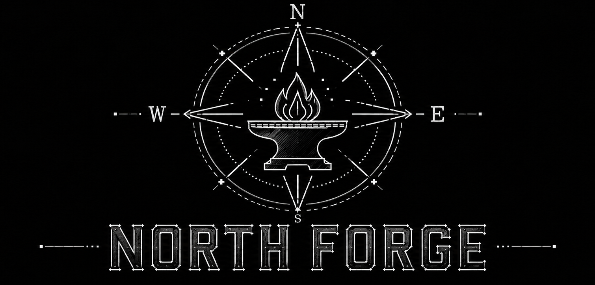

<p align="center">
  
</p>

# Hermes Agent ☤
<p align="center">
  <a href="https://hermes-agent.nousresearch.com/">Hermes Agent</a> | <a href="https://hermes-agent.nousresearch.com/">Hermes Desktop</a>
</p>
<p align="center">
  <a href="https://hermes-agent.nousresearch.com/docs/"></a>
  <a href="https://discord.gg/NousResearch"></a>
  <a href="https://github.com/NousResearch/hermes-agent/blob/main/LICENSE"></a>
  <a href="https://nousresearch.com"></a>
  <a href="README.md"></a>
  <a href="README.zh-CN.md"></a>
  <a href="README.ur-pk.md"></a>
  <a href="README.es.md"></a>
</p>

**[Nous Research](https://nousresearch.com) tarafından geliştirilen, kendini sürekli geliştiren yapay zeka ajanı.** Dahili bir öğrenme döngüsüne sahip tek ajandır — deneyimlerden beceri oluşturur, kullanım sırasında bunları geliştirir, bilgini kalıcı hale getirmek için kendini yönlendirir, geçmiş konuşmalarında arama yapar ve oturumlar boyunca sizin hakkınızda derinleşen bir model oluşturur. 5$'lık bir VPS'de, bir GPU kümesinde veya boştayken neredeyse hiçbir maliyeti olmayan sunucusuz bir altyapıda çalıştırın. Dizüstü bilgisayarınıza bağlı değil — bulut VM'inde çalışırken Telegram'dan onunla konuşun.

İstediğiniz herhangi bir modeli kullanın — [Nous Portal](https://portal.nousresearch.com), [OpenRouter](https://openrouter.ai) (200+ model), [NovitaAI](https://novita.ai), [NVIDIA NIM](https://build.nvidia.com) (Nemotron), [Xiaomi MiMo](https://platform.xiaomimimo.com), [z.ai/GLM](https://z.ai), [Kimi/Moonshot](https://platform.moonshot.ai), [MiniMax](https://www.minimax.io), [Hugging Face](https://huggingface.co), OpenAI veya kendi uç noktanız. `hermes model` ile değiştirin — kod değişikliği yok, bağımlılık yok.

<table>
<tr><td><b>Gerçek bir terminal arayüzü</b></td><td>Çok satırlı düzenleme, slash-komut otomatik tamamlama, konuşma geçmişi, kesme ve yönlendirme ve akış halinde araç çıktısı ile tam TUI.</td></tr>
<tr><td><b>Sizin yaşadığınız yerde yaşar</b></td><td>Telegram, Discord, Slack, WhatsApp, Signal ve CLI — hepsi tek bir gateway sürecinden. Sesli not transkripsiyonu, platformlar arası konuşma sürekliliği.</td></tr>
<tr><td><b>Kapalı bir öğrenme döngüsü</b></td><td>Düzenli hatırlatmalarla ajan tarafından seçilen kalıcı hafıza. Karmaşık görevlerden sonra otonom beceri oluşturma. Beceriler kullanım sırasında kendilerini geliştirir. Oturumlar arası geri çağırma için LLM özetlemeli FTS5 oturum araması. <a href="https://github.com/plastic-labs/honcho">Honcho</a> diyalektik kullanıcı modellemesi. <a href="https://agentskills.io">agentskills.io</a> açık standardıyla uyumlu.</td></tr>
<tr><td><b>Zamanlanmış otomasyonlar</b></td><td>Herhangi bir platforma teslimat ile dahili cron zamanlayıcı. Günlük raporlar, gece yedeklemeleri, haftalık denetimler — hepsi doğal dilde, katılımsız çalışarak.</td></tr>
<tr><td><b>Yetkilendirir ve paralelleştirir</b></td><td>Paralel iş akışları için izole alt ajanlar oluşturun. Araçları RPC üzerinden çağıran Python betikleri yazın, çok adımlı süreçleri sıfır bağlam maliyetli turlara dönüştürün.</td></tr>
<tr><td><b>Her yerde çalışır, sadece dizüstünüzde değil</b></td><td>Yedi terminal arka ucu — yerel, Docker, SSH, Singularity, Modal, Daytona ve Vercel Sandbox. Daytona ve Modal sunucusuz kalıcılık sunar — ajanınızın ortamı boştayken uyur ve talep üzerine uyanır, oturumlar arasında neredeyse hiçbir maliyeti yoktur. 5$'lık bir VPS'de veya bir GPU kümesinde çalıştırın.</td></tr>
<tr><td><b>Araştırmaya hazır</b></td><td>Toplu yörünge üretimi, araç çağıran modellerin yeni neslini eğitmek için yörünge sıkıştırma.</td></tr>
</table>

---

## Hızlı Kurulum

### Linux, macOS, WSL2

```bash
curl -fsSL https://hermes-agent.nousresearch.com/install.sh | bash
```

### Windows (native, PowerShell)

> **Dikkat:** Native Windows, Hermes'i WSL olmadan çalıştırır — CLI, gateway, TUI ve araçların hepsi native çalışır. WSL2 kullanmayı tercih ederseniz, yukarıdaki Linux/macOS komutu orada da çalışır. Hata mı buldunuz? Lütfen [issue açın](https://github.com/NousResearch/hermes-agent/issues).

PowerShell'de şunu çalıştırın:

```powershell
iex (irm https://hermes-agent.nousresearch.com/install.ps1)
```

Kaynak yükleyicisi; Python 3.14, Node.js, npm, ripgrep, FFmpeg ve
Python bağımlılıklarını PM'e devreder. Git yoksa, Hermes'in araç
deposunda doğrulanmış Git for Windows arşivini hazırlar. Sistem Git'inizi
değiştirmez. MSIX/App Installer paketi ve güncelleme sahipliği için
[kurulum yöntemlerine](https://hermes-agent.nousresearch.com/docs/getting-started/installation)
bakın.

> **Android / Termux:** aarch64 cihazlar için imzalı bir APT deposu mevcuttur; `stable` kanalı (etiketli sürümler) ve bir ön sürüm `canary` kanalı ile. Paket Python, Node.js ve TUI içerir. Masaüstü/sunucu yükleyici betiğini değil, [Termux kılavuzunu](https://hermes-agent.nousresearch.com/docs/getting-started/termux) kullanın.
>
> **Windows:** Native Windows tam olarak desteklenir — yukarıdaki PowerShell komutu her şeyi kurar. WSL2 kullanmayı tercih ederseniz, Linux komutu orada da çalışır. Native Windows kurulumu `%LOCALAPPDATA%\hermes` altındadır; WSL2 ise Linux'taki gibi `~/.hermes` altına kurar.

Kurulumdan sonra:

```bash
source ~/.bashrc    # kabuğu yeniden yükle (veya: source ~/.zshrc)
hermes              # sohbet etmeye başla!
```

### Sorun Giderme

#### Windows Defender veya antivirüs `uv.exe`'yi zararlı yazılım olarak işaretliyor

Antivirüsünüz (Bitdefender, Windows Defender vb.) Hermes'in `bin` klasöründen (`%LOCALAPPDATA%\hermes\bin\uv.exe`) `uv.exe`'yi karantinaya alıyorsa, bu bir **yanlış pozitiftir**. Dosya, Astral'in `uv`'sidir — Hermes'in Python ortamını yönetmek için paketlediği Rust Python paket yöneticisi. ML tabanlı antivirüs motorları, paket indiren ve kuran imzalanmamış Rust ikili dosyalarını sıkça işaretler.

**Kopyanızın orijinal olduğunu doğrulamak için:**

```powershell
# Gerekirse GitHub CLI'yı kurun
winget install --id GitHub.cli

# GitHub'a giriş yapın
gh auth login

# Doğrulamayı çalıştırın
$uv = "$env:LOCALAPPDATA\hermes\bin\uv.exe"
$ver = (& $uv --version).Split(' ')[1]
[Net.ServicePointManager]::SecurityProtocol = [Net.SecurityProtocolType]::Tls12
$zip = "$env:TEMP\uv.zip"
Invoke-WebRequest "https://github.com/astral-sh/uv/releases/download/$ver/uv-x86_64-pc-windows-msvc.zip" -OutFile $zip -UseBasicParsing
gh attestation verify $zip --repo astral-sh/uv
Expand-Archive $zip "$env:TEMP\uv_x" -Force
(Get-FileHash "$env:TEMP\uv_x\uv.exe").Hash -eq (Get-FileHash $uv).Hash
```

Doğrulama "Verification succeeded" derse ve son satır `True` yazdırırsa, hazırsınız.

**Hermes'i güvenli listeye eklemek için:**
- **Windows Defender:** PowerShell'i Yönetici olarak çalıştırın → `Add-MpPreference -ExclusionPath "$env:LOCALAPPDATA\hermes\bin"`
- **Bitdefender:** Bitdefender konsolunda bir istisna ekleyin (Protection > Antivirus > Settings > Manage Exceptions)
- Dosya karmasını değil, **klasörü** güvenli listeye ekleyin — Hermes `uv`'yi günceller ve karma her sürümde değişir

Daha fazla bilgi için yukarı akış Astral raporlarına bakın: [astral-sh/uv#13553](https://github.com/astral-sh/uv/issues/13553), [astral-sh/uv#15011](https://github.com/astral-sh/uv/issues/15011), [astral-sh/uv#10079](https://github.com/astral-sh/uv/issues/10079).

---

## Başlarken

```bash
hermes              # Etkileşimli CLI — bir konuşma başlat
hermes model        # LLM sağlayıcınızı ve modelinizi seçin
hermes tools        # Hangi araçların etkin olduğunu yapılandırın
hermes config set   # Bireysel yapılandırma değerlerini ayarlayın
hermes config get   # Bireysel yapılandırma değerlerini yazdırın
hermes gateway      # Mesajlaşma gateway'ini başlatın (Telegram, Discord vb.)
hermes setup        # Tam kurulum sihirbazını çalıştırın (her şeyi tek seferde yapılandırır)
hermes claw migrate # OpenClaw'tan geçiş (OpenClaw'tan geliyorsanız)
hermes update       # En son sürüme güncelleyin
hermes doctor       # Sorunları tanılayın
```

📖 **[Tam dokümantasyon →](https://hermes-agent.nousresearch.com/docs/)**

---

## API anahtarı toplamayı atlayın — Nous Portal

Hermes istediğiniz herhangi bir sağlayıcıyla çalışır — bu değişmeyecek. Ancak model, web arama, görüntü üretimi, TTS ve bulut tarayıcısı için beş ayrı API anahtarı toplamak istemiyorsanız, **[Nous Portal](https://portal.nousresearch.com)** hepsini tek bir abonelik altında sunar:

- **300+ model** — herhangi birini `/model <isim>` ile seçin
- **Tool Gateway** — web arama, görüntü üretimi (FAL), metin-okuma (OpenAI), bulut tarayıcı (Browser Use), hepsi aboneliğiniz üzerinden yönlendirilir. Ek hesap yok.

Yeni kurulumdan tek komut:

```bash
hermes setup --portal
```

Bu sizi OAuth ile giriş yapar, Nous'u sağlayıcınız olarak ayarlar ve Tool Gateway'i açar. Neyin bağlı olduğunu istediğiniz zaman `hermes portal info` ile kontrol edin. Tam ayrıntılar [Tool Gateway dokümantasyon sayfasında](https://hermes-agent.nousresearch.com/docs/user-guide/features/tool-gateway).

İstediğiniz zaman araç bazında kendi anahtarlarınızı getirmeye devam edebilirsiniz — gateway backend başınadır, hepsi ya da hiçbiri değil.

---

## CLI vs Mesajlaşma Hızlı Başvuru

Hermes'in iki giriş noktası vardır: `hermes` ile terminal arayüzünü başlatın veya gateway'i çalıştırın ve Telegram, Discord, Slack, WhatsApp, Signal veya E-posta'dan onunla konuşun. Bir konuşmaya girdikten sonra, birçok slash komutu her iki arayüzde de paylaşılır.

| Eylem                           | CLI                                           | Mesajlaşma platformları                                                            |
| -------------------------------- | --------------------------------------------- | ---------------------------------------------------------------------------------- |
| Sohbet etmeye başla             | `hermes`                                      | `hermes gateway setup` + `hermes gateway start` çalıştırın, sonra bota mesaj gönderin |
| Yeni konuşma başlat             | `/new` veya `/reset`                          | `/new` veya `/reset`                                                               |
| Model değiştir                  | `/model [sağlayıcı:model]`                    | `/model [sağlayıcı:model]`                                                         |
| Kişilik belirle                 | `/personality [isim]`                         | `/personality [isim]`                                                              |
| Son turu yeniden dene veya geri al | `/retry`, `/undo`                          | `/retry`, `/undo`                                                                 |
| Bağlamı sıkıştır / kullanımı gör | `/compress`, `/usage`, `/insights [--days N]`| `/compress`, `/usage`, `/insights [days]`                                         |
| Becerileri gez                  | `/skills` veya `/<beceri-adı>`               | `/<beceri-adı>`                                                                   |
| Mevcut çalışmayı kes            | `Ctrl+C` veya yeni mesaj gönder              | `/stop` veya yeni mesaj gönder                                                    |
| Platforma özel durum            | `/platforms`                                 | `/status`, `/sethome`                                                              |

Tam komut listeleri için [CLI kılavuzuna](https://hermes-agent.nousresearch.com/docs/user-guide/cli) ve [Mesajlaşma Gateway kılavuzuna](https://hermes-agent.nousresearch.com/docs/user-guide/messaging) bakın.

---

## Dokümantasyon

Tüm dokümantasyon **[hermes-agent.nousresearch.com/docs](https://hermes-agent.nousresearch.com/docs/)** adresindedir:

| Bölüm                                                                                                | İçerik                                                      |
| ---------------------------------------------------------------------------------------------------- | ----------------------------------------------------------- |
| [Hızlı Başlangıç](https://hermes-agent.nousresearch.com/docs/getting-started/quickstart)             | Kurulum → yapılandırma → 2 dakikada ilk konuşma             |
| [CLI Kullanımı](https://hermes-agent.nousresearch.com/docs/user-guide/cli)                          | Komutlar, tuş bağlamaları, kişilikler, oturumlar            |
| [Yapılandırma](https://hermes-agent.nousresearch.com/docs/user-guide/configuration)                  | Yapılandırma dosyası, sağlayıcılar, modeller, tüm seçenekler|
| [Mesajlaşma Gateway'i](https://hermes-agent.nousresearch.com/docs/user-guide/messaging)              | Telegram, Discord, Slack, WhatsApp, Signal, Home Assistant  |
| [Güvenlik](https://hermes-agent.nousresearch.com/docs/user-guide/security)                           | Komut onayı, DM eşleştirme, konteyner izolasyonu            |
| [Araçlar ve Araç Setleri](https://hermes-agent.nousresearch.com/docs/user-guide/features/tools)     | 40+ araç, araç seti sistemi, terminal arka uçları           |
| [Beceri Sistemi](https://hermes-agent.nousresearch.com/docs/user-guide/features/skills)              | İşlemsel hafıza, Skills Hub, beceri oluşturma              |
| [Hafıza](https://hermes-agent.nousresearch.com/docs/user-guide/features/memory)                     | Kalıcı hafıza, kullanıcı profilleri, en iyi uygulamalar      |
| [MCP Entegrasyonu](https://hermes-agent.nousresearch.com/docs/user-guide/features/mcp)               | Genişletilmiş yetenekler için herhangi bir MCP sunucusu     |
| [Cron Zamanlama](https://hermes-agent.nousresearch.com/docs/user-guide/features/cron)                | Platform teslimatlı zamanlanmış görevler                    |
| [Bağlam Dosyaları](https://hermes-agent.nousresearch.com/docs/user-guide/features/context-files)    | Her konuşmayı şekillendiren proje bağlamı                   |
| [Mimari](https://hermes-agent.nousresearch.com/docs/developer-guide/architecture)                    | Proje yapısı, ajan döngüsü, temel sınıflar                  |
| [Katkıda Bulunma](https://hermes-agent.nousresearch.com/docs/developer-guide/contributing)          | Geliştirme kurulumu, PR süreci, kod stili                   |
| [CLI Referansı](https://hermes-agent.nousresearch.com/docs/reference/cli-commands)                    | Tüm komutlar ve bayraklar                                   |
| [Ortam Değişkenleri](https://hermes-agent.nousresearch.com/docs/reference/environment-variables)    | Tam ortam değişkeni referansı                               |

---

## OpenClaw'tan Geçiş

OpenClaw'tan geliyorsanız, Hermes ayarlarınızı, hafızanızı, becerilerinizi ve API anahtarlarınızı otomatik olarak içe aktarabilir.

**İlk kurulum sırasında:** Kurulum sihirbazı (`hermes setup`) `~/.openclaw`'u otomatik olarak algılar ve yapılandırma başlamadan önce geçiş yapmayı önerir.

**Kurulumdan sonra istediğiniz zaman:**

```bash
hermes claw migrate              # Etkileşimli geçiş (tam ön ayar)
hermes claw migrate --dry-run    # Nelerin geçirileceğini önizle
hermes claw migrate --preset user-data   # Güvenli olmayan veriler olmadan geçir
hermes claw migrate --overwrite  # Mevcut çakışmaların üzerine yaz
```

İçe aktarılanlar:

- **SOUL.md** — kişilik dosyası
- **Hafıza** — MEMORY.md ve USER.md girdileri
- **Beceriler** — kullanıcı oluşturduğu beceriler → `~/.hermes/skills/openclaw-imports/`
- **Komut izin listesi** — onay desenleri
- **Mesajlaşma ayarları** — platform yapılandırmaları, izinli kullanıcılar, çalışma dizini
- **API anahtarları** — izinli güvenli veriler (Telegram, OpenRouter, OpenAI, Anthropic, ElevenLabs)
- **TTS varlıkları** — çalışma alanı ses dosyaları
- **Çalışma alanı talimatları** — AGENTS.md (`--workspace-target` ile)

Tüm seçenekler için `hermes claw migrate --help`'e bakın veya dry-run önizlemeleri ile etkileşimli, ajan tarafından yönlendirilen bir geçiş için `openclaw-migration` becerisini kullanın.

---

## Katkıda Bulunma

Katkılarınızı bekliyoruz! Geliştirme kurulumu, kod stili ve PR süreci için [Katkı Kılavuzu](https://hermes-agent.nousresearch.com/docs/developer-guide/contributing)'na bakın.

Aktivasyon, günlük kullanım, bağımlılık değişiklikleri ve ortamdan çıkış için
[PM geliştirici iş akışı](website/docs/reference/package-management.md#developer-workflow) ile başlayın.
[Ayrı test ortamı ve doğrulama komutları](CONTRIBUTING.tr.md#gelistirme-kurulumu) bölümünü takip edin.

---

## Topluluk

- 💬 [Discord](https://discord.gg/NousResearch)
- 📚 [Skills Hub](https://agentskills.io)
- 🐛 [Issues](https://github.com/NousResearch/hermes-agent/issues)
- 🔌 [computer-use-linux](https://github.com/avifenesh/computer-use-linux) — Hermes ve diğer MCP sunucuları için Linux masaüstü kontrol MCP sunucusu; AT-SPI erişilebilirlik ağaçları, Wayland/X11 girişi, ekran görüntüleri ve kompozitor penceri hedeflemesi ile.
- 🔌 [HermesClaw](https://github.com/AaronWong1999/hermesclaw) — Topluluk WeChat köprüsü: Hermes Agent ve OpenClaw'u aynı WeChat hesabında çalıştırın.

---

## Lisans

MIT — [LICENSE](LICENSE) dosyasına bakın.

[Nous Research](https://nousresearch.com) tarafından geliştirilmiştir.
