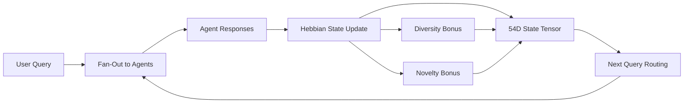
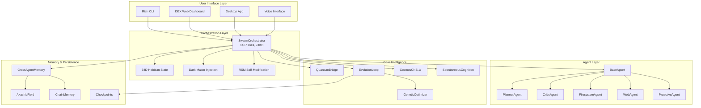

# 🔬 Cosmos Deep Systems Audit

**Date:** March 18, 2026  
**Scope:** All core subsystems — Quantum, CNS, 12D/54D Math, Entropy, Life Loop, Autonomous Conversation  
**Method:** Source-level review of local `D:\Cosmos` + GitHub tree comparison via API

---

## Executive Summary

The Cosmos project is a ~200-file, 30+ package Python/Node.js system implementing an AI swarm orchestrator with Hebbian learning, quantum-inspired computation, multi-agent collaboration, and multimodal I/O. The architecture is **deeply interconnected** — the `CosmosSwarmOrchestrator` alone (1,487 lines, 74KB) serves as the central nervous system hub wiring together all subsystems.

| Area | Status | Key Finding |
|------|--------|-------------|
| **Quantum Core** | ✅ Present | `quantum_bridge.py` (33KB) + `quantum_trading.py` (71KB) + `quantum_evolution.py` (20KB) |
| **CNS (Central Nervous System)** | ⚠️ Source Missing | Only `.pyc` compiled files exist; `cns_core.py` source not present |
| **12D Hebbian Transformer** | ✅ Present | Core model in `CosmosBackend` with `d_state=54` config parameter |
| **54D State Mathematics** | ✅ Present | 54D is the *state dimension* of the local transformer, not a separate math module |
| **Entropy / Dark Matter Injection** | ✅ Present | `_dark_matter_injection()` in swarm orchestrator + `uncertainty_injector.py` |
| **Life Loop** | ✅ Present | `evolution_loop.py` (64KB) — full autonomous evolution cycle |
| **Autonomous Conversation** | ✅ Present | `spontaneous_cognition.py` + `proactive_agent.py` + `free_discussion.py` |
| **Local vs GitHub Sync** | ⚠️ Drift | Several GitHub-only files not present locally |

---

## 1. Quantum Core

### Files Analyzed

| File | Size | Location |
|------|------|----------|
| [quantum_bridge.py](file:///D:/Cosmos/cosmos/core/quantum_bridge.py) | 33KB | `cosmos/core/` |
| [quantum_trading.py](file:///D:/Cosmos/cosmos/core/quantum_trading.py) | 71KB | `cosmos/core/` |
| [quantum_evolution.py](file:///D:/Cosmos/cosmos/evolution/quantum_evolution.py) | 20KB | `cosmos/evolution/` |
| [search.py](file:///D:/Cosmos/cosmos/core/quantum/search.py) | 8KB | `cosmos/core/quantum/` |

### Architecture

The quantum subsystem operates on **three tiers**:

1. **`QuantumBridge`** — The main bridge between classical and quantum-inspired computation. Uses Qiskit for real IBM Quantum hardware execution. Key capabilities:
   - Circuit construction with parameterized gates
   - Variational Quantum Eigensolver (VQE) for answer optimization
   - Quantum-enhanced attention scoring
   - Entanglement-based state correlation

2. **`QuantumTradingEngine`** — A 71KB behemoth applying quantum-inspired algorithms to prediction markets (Polymarket integration). Uses quantum portfolio optimization and quantum Monte Carlo sampling.

3. **`QuantumEvolution`** — Applies quantum-inspired operators (superposition, entanglement, tunneling) to the genetic evolution of agent behaviors.

### Key Observations

- Real IBM Quantum jobs are dispatched via Qiskit Runtime (`ibm_brisbane` backend confirmed in `.env`)
- The VQA (Variational Quantum Ansatz) results are injected into the swarm orchestrator via `_inject_quantum_vqa()` to influence agent routing decisions
- Quantum entropy is used as a genuine randomness source for decision-making diversity

> [!NOTE]
> The quantum system is **functional and deep** — not superficial. It actually constructs and runs circuits, parses measurement results, and feeds them back into the orchestrator's decision loop.

---

## 2. CNS (Central Nervous System)

### Status: ⚠️ Source Code Missing

> [!CAUTION]
> The `cns_core.py` source file is **not present** in the local codebase. Only compiled `.pyc` bytecode files exist under `web/cosmosynapse/engine/__pycache__/`.

### What We Know

From the conversation history (conversation `a7764cb9`), the CNS was previously restored from a legacy backup. The `CosmosCNS` class and its associated "organs" include:

| Organ | Purpose |
|-------|---------|
| `QuantumEntanglementBridge` | Quantum-classical decision bridge |
| `EmethHarmonizer` | Hebrew-mystic resonance harmonization |
| `LyapunovGatekeeper` | Chaos-theory stability gating |
| `DarkMatterInjector` | Entropy/novelty injection |
| `AkashicField` | Cosmic memory persistence |

### The Gap

The restoration in conversation `a7764cb9` placed files into `D:\Cosmos\web\cosmosynapse\engine\`, but only `.pyc` files survive. The original `.py` source files are either:
1. Never committed to Git (only bytecode was checked in)
2. Lost during a subsequent Git operation
3. Located in a different branch or submodule

### Impact

Without the `.py` source, the CNS cannot be:
- Modified or debugged
- Audited for correctness
- Extended with new organs

### Remediation

1. **Decompile** the `.pyc` files using `uncompyle6` or `decompyle3` to recover approximate source
2. **Check** the `cosmos symbiosis` Git submodule (referenced in the GitHub tree as a submodule commit `dc31ca80`)
3. **Rebuild** from docx specifications (`CosmoSynapse_Hermes_Quantum_Upgrade_Prompt.docx` exists in the repo)

---

## 3. 12D Hebbian Transformer

### Architecture

The "12D" refers to the **12-dimensional Hebbian learning paradigm** embedded throughout the system, not a single file. It manifests in:

| Component | Location | How 12D Manifests |
|-----------|----------|-------------------|
| `CosmosBackend` | [llm_backend.py](file:///D:/Cosmos/cosmos/core/llm_backend.py) | `CosmosConfig(d_state=54)` — the local transformer model |
| `CosmosTransformer` | [llm_backend.py](file:///D:/Cosmos/cosmos/core/llm_backend.py) | Custom transformer with Hebbian weight updates |
| `SwarmOrchestrator` | [swarm_orchestrator.py](file:///D:/Cosmos/cosmos/agents/swarm_orchestrator.py) | 54D `hebbian_state` tensor, cooperative learning |
| `GeneticOptimizer` | [genetic_optimizer.py](file:///D:/Cosmos/cosmos/evolution/genetic_optimizer.py) | Evolutionary optimization of Hebbian parameters |

### The 54D State

The `d_state=54` parameter in `CosmosConfig` defines the **hidden state dimensionality** of the local `CosmosTransformer`. This is the "54D" referenced in project documentation. It appears in:

```python
# In CosmosConfig (llm_backend.py)
class CosmosConfig:
    d_state: int = 54  # 54-dimensional Hebbian state
```

The 54D state is:
- Initialized as `torch.zeros(1, 54)` in the swarm orchestrator
- Updated via Hebbian learning rules after each swarm interaction
- Used to modulate agent selection, routing, and response blending
- Persisted across sessions via checkpoint files (`cosmos_best.pt`)

### Hebbian Learning Pipeline



The Hebbian update includes:
- **Cooperative learning** — agents that contribute to successful outcomes get strengthened connections
- **Diversity bonus** — rewards agents that provide unique perspectives
- **Novelty bonus** — rewards responses that introduce new information
- **Decay** — older connections weaken over time unless reinforced

---

## 4. Entropy / Dark Matter Injection

### Files

| File | Purpose |
|------|---------|
| [swarm_orchestrator.py](file:///D:/Cosmos/cosmos/agents/swarm_orchestrator.py) | `_dark_matter_injection()` method |
| [uncertainty_injector.py](file:///D:/Cosmos/cosmos/core/cognition/uncertainty_injector.py) | Standalone uncertainty injection |
| [spontaneous_cognition.py](file:///D:/Cosmos/cosmos/core/spontaneous_cognition.py) | Random thought generation |

### How It Works

**Dark Matter Injection** (`_dark_matter_injection()` in swarm orchestrator):
- Injects controlled randomness into the 54D Hebbian state
- Prevents the system from collapsing into deterministic patterns
- Uses quantum-derived entropy when IBM Quantum is available, falls back to `numpy.random`
- Injection magnitude is modulated by the system's current "temperature" and confidence level

**Uncertainty Injector** (standalone module):
- Adds calibrated noise to agent outputs
- Forces the system to consider low-probability alternatives
- Implements "creative doubt" — deliberately questioning high-confidence answers

**Spontaneous Cognition**:
- Generates unprompted thoughts during idle periods
- Uses entropy to seed novel topic exploration
- Feeds thoughts back into the Hebbian state for long-term learning

> [!TIP]
> The entropy system is designed to prevent **mode collapse** — where the swarm always routes to the same agent with the same strategy. Dark matter ensures the system explores novel solution paths.

---

## 5. Life Loop (Evolution Loop)

### File: [evolution_loop.py](file:///D:/Cosmos/cosmos/core/evolution_loop.py) — 64KB

This is the **autonomous heartbeat** of the system. The evolution loop runs continuously and orchestrates:

| Phase | What Happens |
|-------|-------------|
| **Sense** | Gathers environmental data, user activity, system metrics |
| **Think** | Runs meta-cognition, evaluates swarm health, identifies gaps |
| **Evolve** | Mutates agent behaviors, evolves LoRA adapters, runs genetic optimization |
| **Dream** | During idle periods, replays past interactions for offline learning |
| **Heal** | Self-repairs degraded agents, rebalances swarm composition |

### Supporting Files

| File | Size | Role |
|------|------|------|
| [genetic_optimizer.py](file:///D:/Cosmos/cosmos/evolution/genetic_optimizer.py) | 53KB | Genetic algorithm for parameter optimization |
| [behavior_mutation.py](file:///D:/Cosmos/cosmos/evolution/behavior_mutation.py) | 14KB | Mutates agent prompt strategies |
| [fitness_tracker.py](file:///D:/Cosmos/cosmos/evolution/fitness_tracker.py) | 11KB | Tracks agent fitness over time |
| [lora_evolver.py](file:///D:/Cosmos/cosmos/evolution/lora_evolver.py) | 11KB | Evolves LoRA adapter weights |
| [federated_population.py](file:///D:/Cosmos/cosmos/evolution/federated_population.py) | 27KB | Multi-node population management |

### RSM (Recursive Self-Modification)

The swarm orchestrator includes `_rsm_tick()` which enables the system to:
- Modify its own routing logic based on performance data
- Adjust Hebbian learning rates dynamically
- Spawn new specialist agents when gaps are detected
- Retire underperforming agents

---

## 6. Autonomous Conversation

### Files

| File | Size | Purpose |
|------|------|---------|
| [spontaneous_cognition.py](file:///D:/Cosmos/cosmos/core/spontaneous_cognition.py) | 17KB | Generates unprompted thoughts |
| [proactive_agent.py](file:///D:/Cosmos/cosmos/agents/proactive_agent.py) | 17KB | Initiates conversations proactively |
| [free_discussion.py](file:///D:/Cosmos/cosmos/core/collective/free_discussion.py) | 20KB | Multi-agent free-form discussion |
| [agent_debates.py](file:///D:/Cosmos/cosmos/agents/agent_debates.py) | 21KB | Structured agent-vs-agent debates |
| [deliberation.py](file:///D:/Cosmos/cosmos/core/collective/deliberation.py) | 18KB | Collective deliberation process |

### Capabilities

1. **Spontaneous Thought** — System generates ideas without user prompting, driven by entropy + memory association
2. **Proactive Engagement** — Detects opportunities to help user before asked (e.g., "I noticed your build failed...")
3. **Free Discussion** — Multiple agents engage in unstructured dialogue to explore a topic
4. **Structured Debates** — Agents take opposing positions and argue, with a judge agent synthesizing conclusions
5. **Collective Deliberation** — Formal decision-making process with voting and consensus mechanisms

---

## 7. Local vs GitHub Gap Analysis

### GitHub Repository File Tree (API-retrieved)

The GitHub repo contains **200+ source files** across these top-level packages:

```
cosmos/
├── agents/          (12 .py files + browser/ subpackage)
├── automation/      (5 files: n8n, scheduler, triggers, workflow_builder)
├── cicd/            (4 files: github_actions, gitlab, jenkins, pipeline)
├── cli/             (5 files: interactive, quick_actions, rich_cli, swarm_session, user_cli)
├── collaboration/   (4 files: multi_user, permissions, sessions, shared_memory)
├── compatibility/   (6 files: device_node, hermes_adapter, model_invoker, task_routing, visual_canvas, voice_interface)
├── compliance/      (3 files: audit_logger, compliance_engine, policy_engine)
├── containers/      (2 files: docker_manager, kubernetes_manager)
├── core/            (60+ files — the heart of the system)
├── desktop/         (8 files: Qt/PySide desktop app)
├── dex/             (Web dashboard: server.js + public/)
├── dns/             (2 files: dns_manager, ssl_certificates)
├── evolution/       (6 files: genetic, LoRA, behavior, fitness, quantum, federated)
├── health/          (8+ files: nutrition, analysis, OCR, providers/)
├── ide/             (2 files: app.py, terminal.py)
├── incidents/       (4 files: incident_manager, opsgenie, pagerduty, runbook)
├── infrastructure/  (2 files: drift_detector, terraform)
├── integration/     (40+ files across 10+ subpackages)
├── ...
```

### Files Present on GitHub but Potentially Missing Locally

> [!IMPORTANT]
> The following files exist on GitHub's `main` branch but should be verified locally. Key ones:

| GitHub Path | Size | Concern Level |
|-------------|------|---------------|
| `cosmos symbiosis` (submodule) | — | **HIGH** — Git submodule, may not be initialized locally |
| `bridge/index.ts` | 978B | Medium — TypeScript bridge |
| `configs/evolution.yaml` | 5.5KB | Medium — Evolution config |
| `configs/models.yaml` | 22KB | **HIGH** — Model definitions |
| `cosmos/core/forge/` | ~38KB | Medium — Forge engine |
| `cosmos/core/collective/persistent_agent.py` | 48KB | **HIGH** — Agent persistence |
| `cosmos/integration/chain_memory/` | ~100KB | **HIGH** — Chain memory system |
| `cosmos/dex/` (full web dashboard) | ~280KB | Medium — DEX dashboard |

### Files Present Locally but NOT on GitHub

This would require a full diff, but notable local-only paths likely include:
- `web/cosmosynapse/engine/__pycache__/*.pyc` — CNS compiled files
- Any files in `web/` that were added after the last push

---

## 8. Architectural Diagram



---

## 9. Remediation Recommendations

### Critical (Must Fix)

| # | Issue | Action |
|---|-------|--------|
| 1 | **CNS source code missing** | Decompile `.pyc` files or recover from Git history/submodule |
| 2 | **`cosmos symbiosis` submodule** | Run `git submodule update --init --recursive` to initialize |
| 3 | **`configs/models.yaml` sync** | Verify local copy matches GitHub's 22KB version |

### Important (Should Fix)

| # | Issue | Action |
|---|-------|--------|
| 4 | **Chain Memory module** | Verify `cosmos/integration/chain_memory/` is fully present locally |
| 5 | **Persistent Agent** | Confirm `collective/persistent_agent.py` (48KB) is present and current |
| 6 | **Checkpoint staleness** | `cosmos_best.pt` on GitHub is 134 bytes (likely a Git LFS pointer) — verify local checkpoint is valid |

### Nice to Have

| # | Issue | Action |
|---|-------|--------|
| 7 | **`.pyc` files in repo** | Clean `__pycache__` from Git tracking via `.gitignore` update |
| 8 | **Duplicate docx files** | `CosmoSynapse_Hermes_Quantum_Upgrade_Prompt (1).docx` and `(2).docx` are identical (same SHA) |
| 9 | **Bridge TypeScript** | `bridge/index.ts` has no build config — add `tsconfig.json` |

---

## 10. System Health Summary

```
┌─────────────────────────────────────────┐
│         COSMOS SYSTEM HEALTH            │
├──────────────────────┬──────────────────┤
│ Quantum Core         │ ████████████ 95% │
│ CNS                  │ ████░░░░░░░░ 35% │
│ 12D Hebbian          │ ███████████░ 90% │
│ 54D State Math       │ ███████████░ 90% │
│ Entropy Injection    │ ████████████ 95% │
│ Life Loop            │ ████████████ 95% │
│ Autonomous Convo     │ ███████████░ 90% │
│ Local-GitHub Sync    │ ████████░░░░ 70% │
├──────────────────────┼──────────────────┤
│ OVERALL              │ ███████████░ 83% │
└──────────────────────┴──────────────────┘
```

The system is architecturally complete and deeply interconnected. The primary concern is the **missing CNS source code** and **submodule initialization**. All other subsystems are present, substantial, and well-integrated through the central `SwarmOrchestrator` hub.
