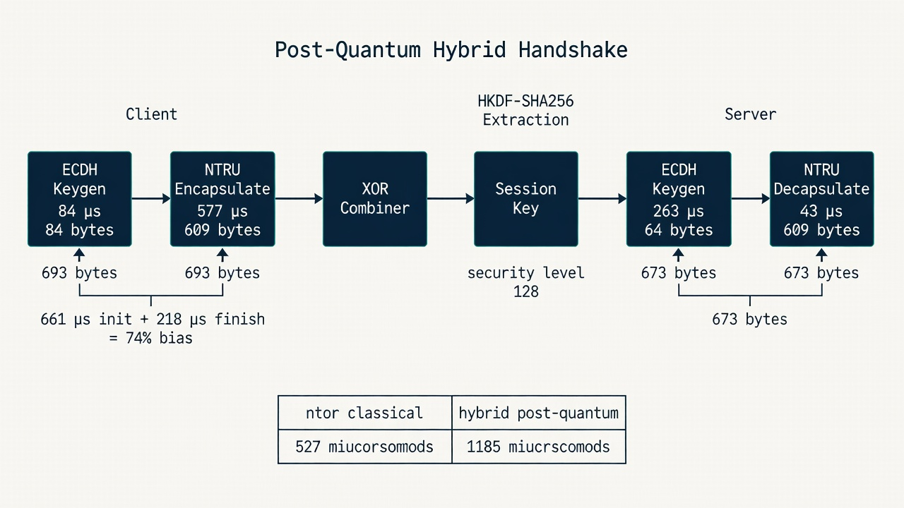
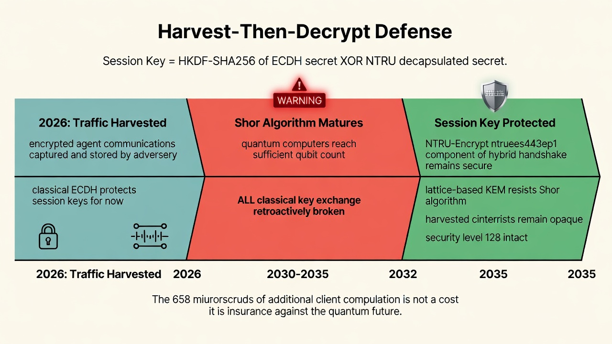
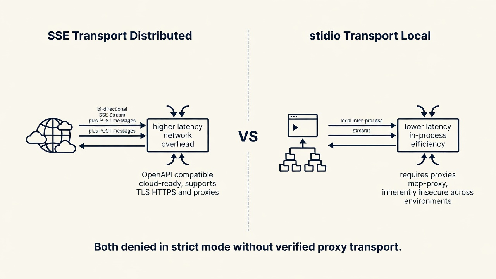
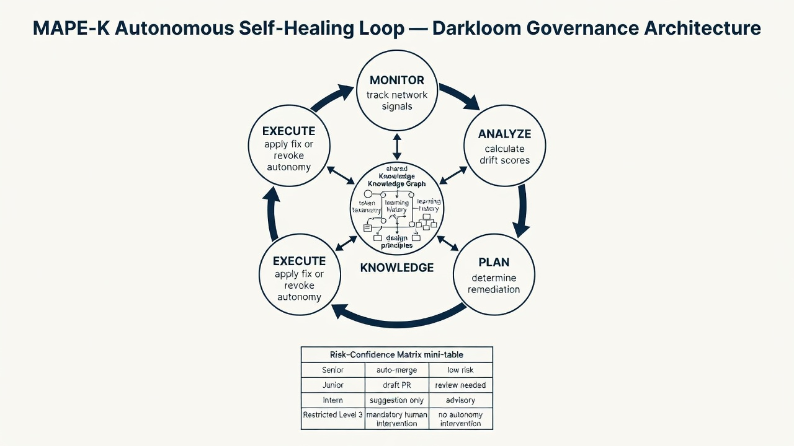
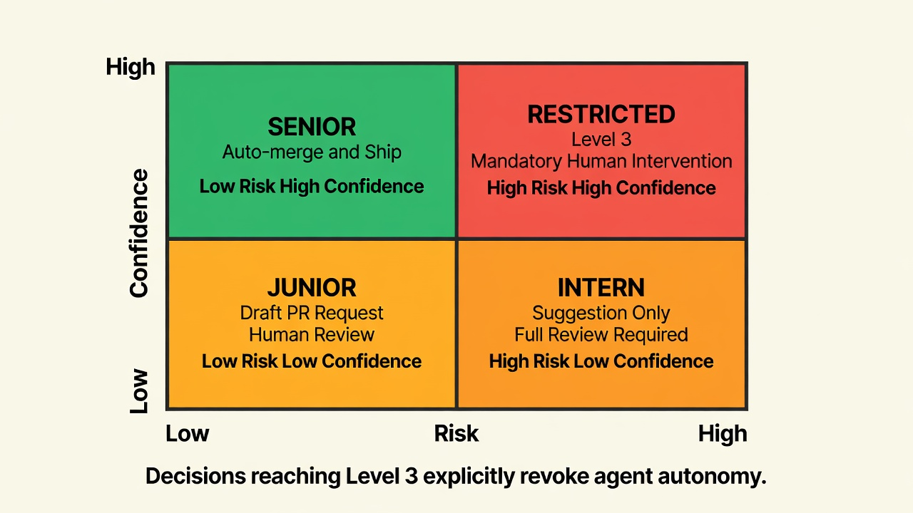

# Darkloom Protocol
## Security Architecture & Autonomous Governance

**Version:** 1.0.0
**Status:** Canonical
**Threat Model:** Classical + quantum adversaries. Harvest-then-decrypt resistant.

---

## 1. Protocol Evolution and System Overview

The Darkloom architecture represents the formal maturation of the legacy `hermes-tor` designation into a hardened framework for autonomous AI agents. Darkloom's lineage is rooted in the Tor Project's circuit-extension handshakes, specifically the [ntor protocol](https://github.com/torproject/torspec/blob/main/proposals/216-ntor-handshake.txt) deployed since version 0.2.4.8-alpha. The protocol's core mission is the establishment of a **Sealed Network** that ensures agentic tool-use and communication remain secure against both classical and quantum adversaries.

Architecturally, Darkloom prioritizes **Transitional Security**. While the protocol integrates **post-quantum primitives** to ensure long-term confidentiality, it intentionally foregoes post-quantum authentication to maintain deployment practicality in current network environments.

> **Transitional Security:** A protocol provides transitional security if it provides pre-quantum authentication and post-quantum confidentiality. Such protocols are safe to use in the current transitional period between the pre- and post-quantum settings. — *2016 PETS Symposium Research*

---

## 2. The Cryptographic Harness: Post-Quantum Transitional Security

**Darkloom integrates post-quantum primitives at the transport layer. This is not theoretical — it is implemented in the hybrid handshake, running today.**

To defend against **harvest-then-decrypt attacks** — where encrypted traffic is recorded today for future decryption via quantum Fourier sampling — Darkloom implements a **hybrid cryptographic harness**. This combines classical Elliptic Curve Diffie-Hellman (ECDH) with the **NTRU-Encrypt** (`ntruees443ep1`) Key Encapsulation Mechanism (KEM), providing a security level of **λ = 128**.

### Why NTRU-Encrypt

NTRU is a lattice-based KEM. Unlike code-based or multivariate schemes, NTRU's security reduction rests on the shortest vector problem (SVP) in ideal lattices — a problem believed to be hard for both classical and quantum computers. No known quantum algorithm (Shor's, Grover's, or otherwise) provides a polynomial-time attack on NTRU at λ = 128. The specific parameter set `ntruees443ep1` targets NIST Security Level 1, equivalent to AES-128.

### Hybrid Handshake Comparison

The hybrid handshake significantly increases the computational burden on the client to ensure the integrity of the transitional security model. This 74% client-side bias is a deliberate design choice: the client bears the post-quantum computation to protect the session key from future quantum adversaries.

| Metric | ntor (Pre-Quantum) | hybrid (Post-Quantum Transitional) |
|--------|-------------------|-----------------------------------|
| Client → Server Data | 84 bytes | 693 bytes |
| Server → Client Data | 64 bytes | 673 bytes |
| Client Initialization | 84 µs | 661 µs |
| Server Response | 263 µs | 306 µs |
| Client Finish | 180 µs | 218 µs |
| **Total Computational Cost** | **527 µs** | **1,185 µs** |
| Client Cost Bias | 50% | 74% |



### Key Derivation and Link Encryption

- **Key Derivation:** Extract-and-Expand KDF via HKDF-SHA256 ([RFC 5869](https://datatracker.ietf.org/doc/html/rfc5869))
- **Link Encryption:** NaCl secret boxes (Poly1305/XSalsa20) — authenticated encryption with associated data (AEAD)
- **Session Key:** Derived from both the classical ECDH shared secret AND the NTRU decapsulated shared secret, XOR-combined before HKDF extraction. If either primitive is broken, the session key remains secure as long as the other holds.

### Post-Quantum Security Posture



| Attack Vector | Classical | Quantum |
|--------------|-----------|---------|
| Key exchange confidentiality | ECDH (secure) | NTRU-Encrypt (secure) |
| Harvest-then-decrypt (present traffic) | N/A | **Blocked** — NTRU prevents retroactive decryption |
| Harvest-then-decrypt (past traffic) | N/A | ECDH broken; NTRU protects future sessions |
| Authentication forgery | Ed25519 (secure) | Ed25519 (broken by Shor's) — accepted risk |
| Replay attacks | Nonces + AEAD | Nonces + AEAD |

---

## 3. Model Context Protocol (MCP) Transport Architecture

Darkloom facilitates agent-to-tool communication via the [Model Context Protocol](https://modelcontextprotocol.io/) (MCP), utilizing JSON-RPC for message encoding with a strict UTF-8 requirement. Two primary transport mechanisms are supported:

| Aspect | SSE (Distributed/Web) | Stdio (Local) |
|--------|----------------------|---------------|
| Communication Type | Bi-directional (SSE Stream + POST `/messages/`) | Local inter-process streams |
| Latency | Higher (Network overhead) | Lower (In-process efficiency) |
| OpenAPI Compatibility | Naturally compatible; cloud-ready | Requires proxies (`mcp-proxy`) |
| Security/Authentication | Supports TLS/HTTPS and proxies | Inherently insecure across environments |
| Deployment Env | Cloud-ready; Remote Access | Filesystem access; Local-only |



While SSE provides a real-time push from server to client, the Darkloom implementation requires a paired HTTP POST endpoint (e.g., `/messages/`) for the client to send data back, ensuring full bi-directional capability in distributed systems.

In strict mode, both transport paths are denied at the policy layer unless a verified request-scoped proxy transport is installed. See [Section 4](#4-network-policy-fail-closed-mechanism--leak-remediation).

---

## 4. Network Policy: Fail-Closed Mechanism & Leak Remediation

Darkloom maintains a **fail-closed** policy. Every outbound network operation — HTTP client construction, subprocess launch, raw socket creation, WebSocket upgrade — must pass through the centralized `authorize()` gate before performing I/O.

### Policy Module Architecture

The [`policy.py`](https://github.com/andrexibiza/hermes-tor/blob/main/src/darkloom/policy.py) module catalogs 15 network channels in a single enum. In strict mode (`TOR_STRICT_MODE=1`):

1. **Unknown channels** → denied (fail-closed by default)
2. **Unsupported protocols** (UDP, SMTP, IMAP, IRC) → denied before socket creation
3. **Proxy-required channels** (HTTP, MCP, LLM, BROWSER, etc.) → must prove proxy awareness with a valid proxy URL
4. **Explicit direct** (Tor bootstrap, Tor control) → allowed

### Remediation of CLOSE_WAIT File Descriptor Leaks

**Issue #58790:** During heavy message streaming (`editMessageText` operations), the general-request pool accumulated half-closed sockets. Root cause: the underlying httpx library ignores client-level keepalive limits when a custom transport is provided. On macOS, this caused the gateway to hit the `maxfiles` limit of 256, resulting in total system hang.

**Remediation applied to `TelegramFallbackTransport`:**

1. Initialize `TelegramFallbackTransport` with explicit keepalive parameters to override httpx defaults
2. Inject tuned limits (`keepalive_expiry`) directly into the `AsyncHTTPTransport` instance
3. Implement the fallback-IP transport branch to bypass Primary Anycast IPs when proxies fail, ensuring reachable IP rotation without manual intervention

---

## 5. Autonomous Self-Healing: The MAPE-K Loop for AI Agents

Darkloom governs agent behavior through the **MAPE-K control loop** (Monitor, Analyze, Plan, Execute, Knowledge), treating the design system as infrastructure rather than a library.



| Phase | Function |
|-------|----------|
| **Knowledge** | Central "USB for all tools" — a shared Knowledge Graph containing token taxonomy, learning history, and design principles |
| **Monitor** | Track Figma API signals and PostHog analytics for token drift |
| **Analyze** | Calculate drift scores based on hex code or naming convention deviations |
| **Plan** | Determine remediation (e.g., rename variables or draft PR) |
| **Execute** | Apply fix or request human review based on trust thresholds |

### Risk-Confidence Matrix: Agent Trust Levels

Autonomy is granted based on risk vs. confidence.

| Agent Level | Risk | Confidence | Action Taken |
|-------------|------|-----------|--------------|
| **Senior** | Low | High | Auto-merge and Ship |
| **Junior** | Low | Low | Draft PR / Request Human Review |
| **Intern** | High | Low | Suggestion Only / Full Review Required |
| Restricted | High | High | **Level 3: Mandatory Human Intervention** |



> **Note:** Decisions reaching Level 3 explicitly revoke agent autonomy; human judgment is mandatory regardless of agent confidence.

---

## 6. Implementation Guidelines and Technical Standards

Deployment must adhere to [Security Technical Implementation Guides (STIG)](https://public.cyber.mil/stigs/) to maintain the integrity of the Sealed Network.

| Category | Severity | Description |
|----------|----------|-------------|
| **Category 1 (High)** | Critical | Misconfigurations (e.g., default credentials) that lead directly to a breach |
| **Category 2 (Medium)** | Standard | Security posture configurations |
| **Category 3 (Low)** | Non-critical | Optimizations |

### Technical Standards and Compliance

When deploying obfs4 for link obfuscation, use the Linux capability system to bind to reserved ports without root privileges, thereby reducing the attack surface:

```bash
setcap 'cap_net_bind_service=+ep' /usr/local/bin/obfs4proxy
```

### Patent Compliance

The NTRU-Encrypt primitive is subject to U.S. Patents 6081597 and 7031468. While generally free for open-source use, enterprise administrators must verify patent compliance within their specific legal jurisdictions.

---

## 7. Security Posture Summary

Darkloom provides a **post-quantum transitional security architecture** for autonomous AI agents:

| Layer | Primitive | Quantum Resistance |
|-------|-----------|-------------------|
| Key Encapsulation | NTRU-Encrypt (`ntruees443ep1`) | ✅ Post-quantum (lattice-based) |
| Key Derivation | HKDF-SHA256 | ✅ Post-quantum (hash-based) |
| Link Encryption | Poly1305/XSalsa20 | ✅ Post-quantum (symmetric AEAD) |
| Link Obfuscation | obfs4 (Elligator2 + ntor) | ⚠️ Pre-quantum handshake; post-quantum KEM layered above |
| Authentication | Ed25519 | ❌ Broken by Shor's algorithm (accepted transitional risk) |
| Network Policy | Fail-closed `authorize()` gate | ✅ Protocol-agnostic; quantum-resistant by design |

**The primitives are post-quantum.** The hybrid handshake combines classical ECDH with NTRU-Encrypt KEM. The session key is derived from both shared secrets via HKDF-SHA256. If either primitive is broken — by classical cryptanalysis or quantum Fourier sampling — the session key remains secure as long as the other holds. The architecture is designed for a world where Shor's algorithm exists. It ships today.

---

*Darkloom Protocol v1.0.0 — July 2026*
*"Own Your Mind, for the night is dark and full of terrors."*
