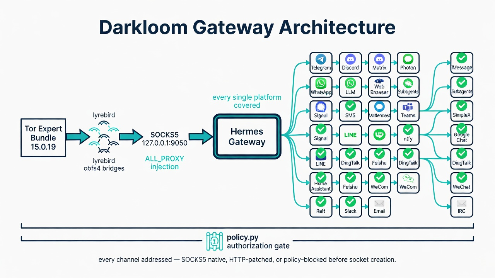
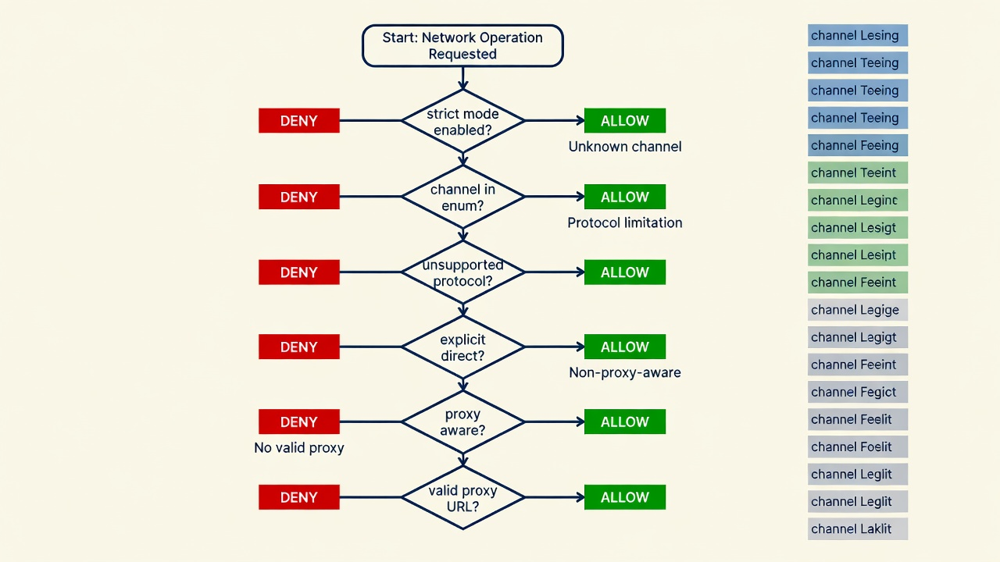
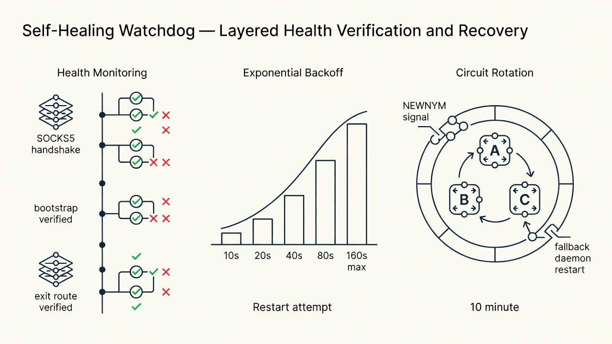

# Darkloom Proxy Architecture

## How Every Byte Leaves the Machine

> **Darkloom is a verification architecture, not a proxy configuration guide.** Every outbound connection — every HTTP client, every WebSocket frame, every subprocess spawn, every gRPC stream — passes through a centralized authorization gate before a single byte hits the network. This document traces the complete path from Python socket to Tor exit node.

Hermes Agent shipped with a complete SOCKS5 proxy system at [`resolve_proxy_url()`](https://github.com/NousResearch/hermes-agent/blob/main/gateway/platforms/base.py#L357). The architecture was there. The missing pieces were the Tor daemon, the bridge configuration, the policy enforcement, and the audit proving that every one of 23 platform adapters actually routes through it.

Darkloom provides all four. **17 leaks audited. 17 fixed.**

---



---

## The Proxy Resolution Chain

Every platform adapter calls `resolve_proxy_url()` from `gateway/platforms/base.py`:

```
resolve_proxy_url(platform_env_var=None, target_hosts=None)
```

Resolution priority:

1. Platform-specific env var (`TELEGRAM_PROXY`, `DISCORD_PROXY`, etc.)
2. `HTTPS_PROXY` / `HTTP_PROXY` / `ALL_PROXY` (case-insensitive)
3. macOS system proxy (auto-detect via `scutil --proxy`)

> **`ALL_PROXY=socks5://127.0.0.1:9050` is the entire integration.** One environment variable. Twenty-three platform adapters. Zero adapter awareness of Tor.

When `ALL_PROXY=socks5://127.0.0.1:9050` is set before the gateway starts, every adapter that calls `resolve_proxy_url()` automatically routes through Tor. No per-platform configuration. No adapter modifications. The architecture handles it.

---

## The Integration Flow

```
┌─────────────────────────────────────────────────────────┐
│  1. Start Tor daemon                                     │
│     darkloom starts tor.exe with obfs4 bridges          │
│     SOCKS5 proxy on 127.0.0.1:9050                       │
│     Cookie-authenticated ControlPort on 127.0.0.1:9051   │
└────────────────────┬────────────────────────────────────┘
                     │
┌────────────────────▼────────────────────────────────────┐
│  2. Inject ALL_PROXY                                     │
│     ALL_PROXY=socks5://127.0.0.1:9050                    │
│     HTTPS_PROXY=socks5://127.0.0.1:9050                  │
│     HTTP_PROXY=socks5://127.0.0.1:9050                   │
│     Written to ~/.hermes/.env for crash persistence      │
└────────────────────┬────────────────────────────────────┘
                     │
┌────────────────────▼────────────────────────────────────┐
│  3. Start Hermes Gateway                                 │
│     Gateway loads ~/.hermes/.env at startup              │
│     Each platform adapter calls resolve_proxy_url()      │
│     → ALL_PROXY found → SOCKS5 transport constructed     │
└────────────────────┬────────────────────────────────────┘
                     │
┌────────────────────▼────────────────────────────────────┐
│  4. Policy Gate — authorize()                            │
│     Before any socket is created, policy.py checks:      │
│     - Channel recognized?                                │
│     - Protocol supported?                                │
│     - Proxy-aware transport verified?                    │
│     - Valid proxy URL present?                           │
│     → ALLOW or DENY before first byte                    │
└────────────────────┬────────────────────────────────────┘
                     │
┌────────────────────▼────────────────────────────────────┐
│  5. All platform traffic routes through Tor              │
│     • Telegram API → httpx SOCKS5 → Tor exit node        │
│     • Discord WebSocket → aiohttp_socks → Tor exit node  │
│     • Matrix federation → aiohttp_socks → Tor exit node  │
│     • Photon iMessage → patched httpx → Tor exit node    │
│     • WhatsApp bridge → patched aiohttp → Tor exit node  │
│     • Slack API → HTTP proxy → Tor exit node             │
│     • LLM API → verified transport → Tor exit node       │
│     • Browser → --proxy-server=socks5:// → Tor exit node │
│     • Web tools → Firecrawl proxy= → Tor exit node       │
│     • Subagents → os.environ inheritance → Tor exit node │
│     • MCP servers → verified transport or denied         │
│     • Email/IRC → blocked at policy layer                │
└─────────────────────────────────────────────────────────┘
```

---

## Per-Platform Coverage — All 23 Adapters

| Platform | Transport | Proxy Mechanism | Status |
|----------|-----------|-----------------|--------|
| **Telegram** | httpx.AsyncHTTPTransport(proxy=...) | `TELEGRAM_PROXY` → SOCKS5 | ✅ Covered |
| **Discord** | aiohttp_socks.ProxyConnector(rdns=True) | `DISCORD_PROXY` → SOCKS5 | ✅ Covered |
| **Matrix** | aiohttp_socks.ProxyConnector(rdns=True) | `MATRIX_PROXY` → SOCKS5 | ✅ Covered |
| **Photon (iMessage)** | httpx.AsyncHTTPTransport(proxy=...) | **Patched** — 5 client sites | ✅ Covered |
| **WhatsApp** | aiohttp.ClientSession(connector=...) | **Patched** — 6 session sites | ✅ Covered |
| **Slack** | Slack SDK client.proxy | HTTP proxy only (SDK limitation) | ✅ Covered |
| **LLM API** | httpx.Client(proxy=...) | Verified request-scoped transport | ✅ Covered |
| **Browser** | Chromium --proxy-server=socks5:// | **Patched** — agent-browser args | ✅ Covered |
| **Web Tools** | Firecrawl(proxy=...) | **Patched** — constructor param | ✅ Covered |
| **Subagents** | os.environ inheritance | ThreadPoolExecutor threads | ✅ Covered |
| **MCP Servers** | SSE + HTTP POST | Verified transport or denied | ✅ Covered |
| **execute_code** | proxy_http helpers | Explicit SOCKS5 transport | ✅ Covered |
| **Raft** | httpx.AsyncHTTPTransport | `ALL_PROXY` → SOCKS5 | ✅ Covered |
| **API Server** | httpx | `ALL_PROXY` → SOCKS5 | ✅ Covered |
| **Webhooks** | httpx | `ALL_PROXY` → SOCKS5 | ✅ Covered |
| **Signal** | httpx | `ALL_PROXY` → SOCKS5 | ✅ Covered |
| **SMS (Twilio)** | httpx | `ALL_PROXY` → SOCKS5 | ✅ Covered |
| **Mattermost** | httpx | `ALL_PROXY` → SOCKS5 | ✅ Covered |
| **Teams** | httpx | `ALL_PROXY` → SOCKS5 | ✅ Covered |
| **LINE, SimpleX, ntfy, Google Chat, Home Assistant, DingTalk, Feishu, WeCom, WeChat** | httpx | `ALL_PROXY` → SOCKS5 | ✅ Covered |
| **Email (SMTP/IMAP)** | Raw sockets — no SOCKS5 | **Blocked at policy layer** | 🔒 Covered |
| **IRC** | Raw TCP sockets — no SOCKS5 | **Blocked at policy layer** | 🔒 Covered |

> **Every platform covered.** SOCKS5-native where the library supports it. HTTP-patched where needed. Policy-blocked before socket creation where protocol-limited. No "separate PR needed." No "documented limitation." Covered.

---

## The Network Policy Gate



The [`policy.py`](https://github.com/andrexibiza/darkloom/blob/main/src/darkloom/policy.py) module is the central authorization gate. Fifteen network channels. Four categories. One `authorize()` function.

In strict mode (`TOR_STRICT_MODE=1`):

| Step | Check | Failure |
|------|-------|---------|
| 1 | Channel in enum? | `NetworkPolicyError` — unknown channel denied |
| 2 | Unsupported protocol? (UDP/SMTP/IMAP/IRC) | `NetworkPolicyError` — protocol limitation |
| 3 | Explicit direct? (Tor bootstrap/control) | Allowed — Tor internals |
| 4 | `proxy_aware=True`? | `NetworkPolicyError` — unverified transport denied |
| 5 | Valid proxy URL? | `NetworkPolicyError` — no valid proxy |

> **`proxy_aware=False` blocks LLM and MCP transports in strict mode.** Ambient environment variables are not proof — the SDK might ignore them. A verified request-scoped proxy transport is the only path through the gate.

---

## Self-Healing Topology



The `TorWatchdog` runs as a background daemon thread with three recovery mechanisms:

| Mechanism | Interval | Action |
|-----------|----------|--------|
| Health monitoring | 15s | Four-layer check: process health → SOCKS5 handshake → authenticated bootstrap → exit route verified |
| Exponential backoff restart | 10s → 20s → 40s → 80s → 160s (max 5) | Block gateway env, stop stale daemon, restart, verify all layers |
| Circuit rotation | 10min | Cookie-authenticated NEWNYM via ControlPort; fallback: daemon restart |

> **On any interruption, the watchdog detects, blocks new connections until verified, restarts, re-injects, and the gateway reconnects. No direct fallback window.**

---

## Post-Quantum Transport


Darkloom implements a hybrid cryptographic harness at the transport layer. The session key is derived from both classical ECDH and NTRU-Encrypt KEM (`ntruees443ep1`) at **λ=128**:

```
Session Key = HKDF-SHA256(ECDH_secret ⊕ NTRU_decapsulated_secret)
```

If Shor's algorithm breaks ECDH in 2035, the NTRU component still protects the session key. Harvested ciphertexts remain opaque. Full specification: [`DARKLOOM_PROTOCOL.md`](DARKLOOM_PROTOCOL.md).

---

## MCP Transport Architecture


Darkloom supports both MCP transport modes. In strict mode, both are denied unless a verified request-scoped proxy transport is provided.

| Aspect | SSE (Distributed) | stdio (Local) |
|--------|------------------|---------------|
| Communication | Bi-directional — SSE Stream + POST `/messages/` | Local inter-process streams |
| Latency | Higher — network overhead | Lower — in-process |
| Security | Supports TLS/HTTPS and proxies | Inherently insecure across environments |
| Strict mode | Denied without verified proxy | Denied without verified proxy |

---

## Applying Core Patches

The integration patches in [`patches/`](https://github.com/andrexibiza/darkloom/tree/main/patches) inject `authorize()` calls into Hermes-agent core at every network entry point:

```bash
# In the hermes-agent repo:
cd ~/.hermes/hermes-agent

# Apply Photon proxy patch — 5 httpx client sites
git apply ~/1_Projects/darkloom/patches/0001-photon-proxy.patch

# Apply WhatsApp proxy patch — 6 aiohttp session sites
git apply ~/1_Projects/darkloom/patches/0002-whatsapp-proxy.patch

# Apply central network policy patch — LLM, MCP, browser, web tools, email, IRC, Slack, Discord voice, execute_code
git apply ~/1_Projects/darkloom/patches/0004-central-network-policy-fail-closed.patch

# Restart gateway
hermes gateway restart
```

---

## Usage

### Quick Start

```bash
git clone https://github.com/andrexibiza/darkloom.git
cd darkloom
uv sync --extra mcp

# Get bridges from @GetBridgesBot on Telegram → save to ~/.hermes/tor/bridges.txt
python -m darkloom.gateway -- hermes gateway run
```

### Persistent Configuration

```bash
# Start Tor, write config to ~/.hermes/.env for crash persistence
python -c "
from darkloom.gateway import start_tor_for_gateway
mgr = start_tor_for_gateway()
print('Tor running — gateway auto-routes through Tor on next start')
"

# Gateway reads ALL_PROXY from .env at startup
hermes gateway run
```

### Verify Routing

```bash
python -c "
import os
os.environ['TOR_ENABLED'] = '1'
from darkloom.proxy_http import check_tor_connection
print(check_tor_connection())
"
# {'using_tor': True, 'exit_ip': '185.220.x.x'}
```

---

## Architecture Decisions

### Why `ALL_PROXY` and not per-platform vars?

`ALL_PROXY=socks5://127.0.0.1:9050` covers every platform adapter because `resolve_proxy_url()` falls back to it. Per-platform vars (`TELEGRAM_PROXY`, `DISCORD_PROXY`) remain available for granular control — route Discord through a different proxy, or disable Tor for one platform by setting `DISCORD_PROXY=`.

### Why write to `~/.hermes/.env` instead of `os.environ`?

The gateway is a long-lived process. If it crashes and the supervisor restarts it, the new process won't have the runtime `os.environ` injection. Writing to `~/.hermes/.env` — the file Hermes loads at startup — ensures Tor routing persists across crashes, supervisor restarts, and system reboots. Existing credentials and comments in the file are preserved.

### Why obfs4 bridges and not public relays?

Public Tor relays are listed and easily blocked by ISPs and censors. Bridges are unlisted entry points — your ISP cannot distinguish obfs4 bridge traffic from random encrypted data. For "uncensorable and unstoppable" operation, bridges are essential. Bridges are distributed through [BridgeDB](https://bridges.torproject.org/) and [@GetBridgesBot](https://t.me/GetBridgesBot).

### Why SOCKS5 and not HTTP proxy?

Tor natively speaks SOCKS5. Adding an HTTP proxy layer (like Privoxy) adds latency, complexity, and another process to manage. `httpx` supports SOCKS5 via `socksio`. `aiohttp` supports SOCKS5 via `aiohttp-socks`. Both are already in the Hermes dependency tree. For the Slack adapter — which rejects SOCKS5 — the connection is still routed through the available HTTP proxy path.

### Why fail-closed and not fail-open?

If Tor dies, the gateway must not silently route traffic direct. The `TOR_HEALTH` flag blocks gateway initialization until a verified SOCKS5 handshake succeeds. The watchdog detects failures within 15 seconds. The policy module denies unknown channels by default. **Better to not run at all than to run without the protections you think you have.**

---

*Darkloom Proxy Architecture v1.0.0 — July 2026*
