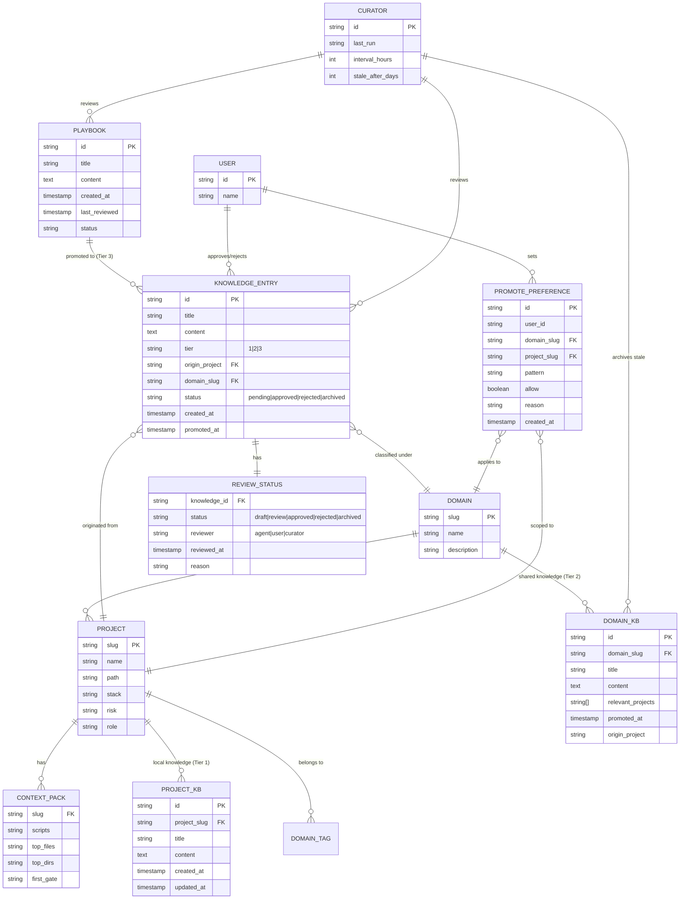
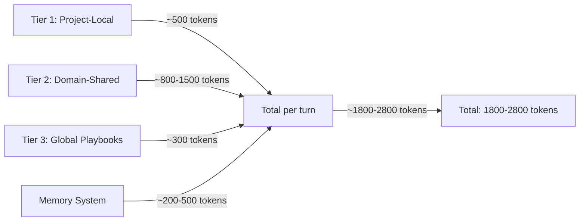

# Hermes Agent 3-Tier Knowledge Center

## Entity-Relationship Diagram



## Data Flow

```mermaid
flowchart TD
    A[Agent works on Project X] --> B{Creates new knowledge?}
    B -- No --> C[Continue work]
    B -- Yes --> D{Match existing preference?}
    D -- Yes: allow --> E[Auto-promote to Domain KB]
    D -- Yes: deny --> F[Keep in Project KB only]
    D -- No preference --> G{Cross-project relevance?}
    G -- No match --> F
    G -- Match found --> H[Ask user: promote to shared?]
    H -- Approve --> E
    H -- Reject --> F
    H -- Reject + remember --> I[Save deny preference]
    E --> J[Write to domains/{domain}/note.md]
    J --> K[Update domain index]
    K --> L[Update project note backlink]

    M[Agent starts work on Project Y] --> N[Load Tier 1: Project Y context pack]
    N --> O[Load Tier 2: domains matching Project Y's domains]
    O --> P[Load Tier 3: playbooks always in system prompt]
    P --> Q[Agent works with relevant knowledge]
```

## Token Budget Model



## Implementation Plan

See [11-knowledge-center-plan.md](./11-knowledge-center-plan.md) for the full 7-phase, 70-issue implementation plan with compliance tracking.

---
