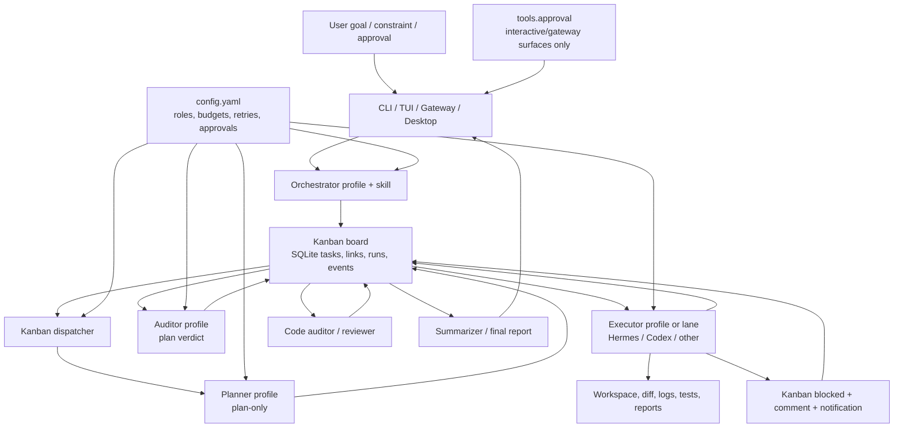
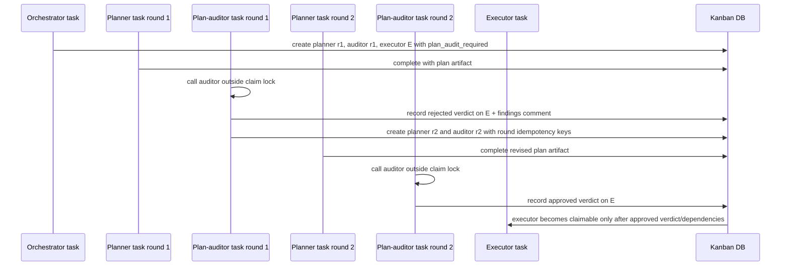
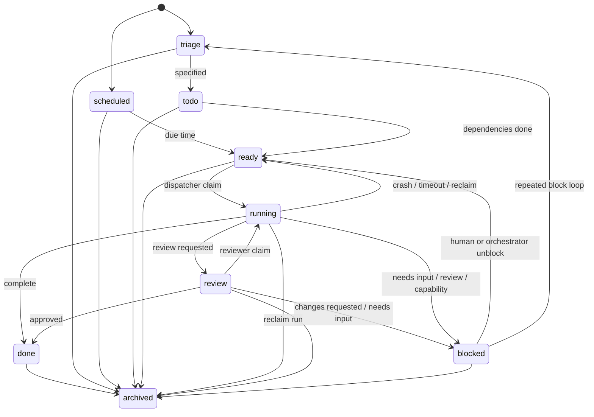

# Hermes Personal Orchestration Architecture

Status: draft for audit

Scope: architecture plan only. No additional runtime code is proposed or executed by this document.

Baseline: Kanban-first V2.1. Do not build a second orchestrator, database, or workflow engine beside Hermes Kanban.

## 1. Executive Summary

Hermes can become the personal "AI Chief of Staff" from the original request, but the correct architecture is not a new orchestration subsystem. Hermes already has the main durable orchestration primitive: Kanban tasks, runs, links, dispatcher, worker profiles, comments, events, dashboard, gateway notifications, approval gates, provider routing, skills, and plugins.

The design should therefore treat Hermes Kanban as the workflow engine and add only the missing control layer:

1. A thin orchestration skill/profile that translates a user goal into a Kanban task graph.
2. Role-to-profile routing in `config.yaml`, not hard-coded model names.
3. Plan-audit and code-audit conventions backed by Kanban events/comments/runs.
4. Per-task budget and retry policies.
5. Optional external worker lanes such as Codex CLI, Claude Code, OpenClaw, or browser/computer-use engines, always behind adapters or skills.

The MVP should automate one real coding workflow end to end:

User goal -> planner task -> auditor verdict loop -> executor task -> code auditor verdict loop -> final summary.

Non-coding workflows use the same graph shape later: research, product comparison, reports, document analysis, computer automation, and multi-project operations.

## 2. Correction To The Earlier Drift

The original user request explicitly said: plan architecture first, do not write code yet. The earlier implementation of slice 1 and slice 2 went beyond that scope for the architecture deliverable, but their design direction is still accepted: plan-audit gating and task-budget enforcement are the small product slices this architecture depends on when moving from document to implementation.

This document resets the baseline:

- The product architecture is Kanban-first.
- Existing Hermes mechanisms are reused wherever possible.
- Code patches are listed as small accepted slices, not assumed to be the center of the design.
- OpenClaw is optional and must never become a central dependency.
- Codex, Claude, Gemini, DeepSeek, GLM, MiMo, and similar names are provider/profile bindings, not business-logic states.

## 3. Feasibility

Feasible now:

- Durable task state through Kanban SQLite.
- Multi-agent worker execution through Hermes profiles.
- Human-in-the-loop through Kanban comments, block/unblock, dashboard, gateway notifications, and approval prompts.
- Role separation through profile names and toolsets.
- Workflow fan-out, pipelines, reviewer/synthesizer patterns through Kanban links.
- Persistent run history, task events, worker logs, and structured handoff metadata.
- Per-surface access through CLI, slash command, gateway, dashboard, and desktop/backend APIs.

Requires small product work:

- A real plan-auditor actuator that reads a planner output, calls the auditor, records an audit verdict outside the dispatcher lock, and either opens executor work or creates the next planner revision.
- A first-class "Kanban Orchestrated Coding" skill/profile contract that encodes the planner-auditor-executor-auditor loop.
- Budget enforcement if the target upstream baseline does not already include the local slice 2 patch.
- More ergonomic workflow templates so users can create a whole graph from one high-level request.

Not feasible or not safe as a first MVP:

- Letting one model freely route every step without hard gates.
- Automatically pushing, deploying, deleting data, buying items, or sending production messages without explicit policy and approval.
- Treating external CLIs as if their self-report is trusted completion.
- Making OpenClaw required for all workflows.
- Rebuilding a generic workflow engine while Kanban already owns durable state and dispatch.

## 4. Ambiguities And Design Pushback

1. "Codex planner" and "Claude auditor" should mean role bindings, not hard dependencies. A user may configure those roles to other profiles or providers.
2. "Hermes sends plan to Claude" needs a provider path. This can be a Hermes profile using an Anthropic-compatible provider, an external Claude Code lane, or a manually reviewed Kanban task. The architecture must support all three.
3. Cost accounting cannot be perfectly authoritative for every provider. The MVP should support `actual`, `estimated`, `included`, and `unknown` cost status and expose unknown-cost policy.
4. Fully automatic routing is unsafe. Rule-based routing must run before any smart router.
5. "Do not copy source code unnecessarily" conflicts with isolated agent lanes. Default Hermes workers can operate in the pinned workspace; untrusted external CLI lanes should use worktrees and reconcile back.
6. Human approval is a safety primitive, not a failure. When planner and auditor disagree beyond the configured round limit, Hermes should summarize the disagreement and ask the user.
7. Workflow definitions should start as skill/config conventions. A database-backed workflow-template editor can wait.

## 5. Requirement Mapping

| Requirement | Existing Hermes mechanism | Config/skill work | Code patch needed | Later |
|---|---|---|---|---|
| Durable task state | `hermes_cli/kanban_db.py`, `task_runs`, `task_events` | Use board per project | No new DB | Cross-host boards |
| Multi-agent execution | Kanban dispatcher + profile lanes | Create role profiles | External lane adapters if needed | Worker pools |
| Planner first, no code | Kanban task body + skill instructions | Planner profile excludes edit tools or uses plan-only prompt | Plan-audit gate if enforcing before claim | Rich policy UI |
| Claude audits plan | Auditor profile/lane | Bind `auditor` role to Claude provider/profile | Real caller records verdict | Multi-auditor quorum |
| Executor implements | Hermes profile lane, Codex lane skill | Bind executor role and workspace policy | External CLI adapters optional | Auto PR policy |
| Code audit after execution | Reviewer task or `review-required` block convention | Auditor skill and metadata schema | Optional reviewer gate helpers | Reviewer marketplace |
| Abstract roles | Profiles, assignees, toolsets | Role map in config | No model hard-code | Smart router |
| Model routing | Provider config, `auxiliary.*`, profiles | Hard rules and one primary profile per MVP role | Optional router helper | Smart router and fallback lists |
| Budget/quota | `agent/usage_pricing.py`, config | Role budgets, task caps, visible workflow cap | Per-task budget gate if absent | Account/day budgets |
| HITL | Kanban block/comment, gateway/dashboard notification, `tools.approval.py` on interactive surfaces | Approval policy config | No new core tool | Policy editor |
| Memory | Session DB, Kanban DB, skills, config | Retention policy | No single memory rewrite | Vector corpora |
| OpenClaw | Plugin/skill/MCP/worker-lane pattern | Optional adapter binding | Only if integrating | Swap engines |
| Non-coding workflows | Kanban swarm, skills, plugins | Workflow skill templates | Minimal template runner if needed | Visual builder |

## 6. Overall Architecture



Ownership rules:

- Kanban owns lifecycle truth.
- Profiles and worker lanes own execution attempts.
- Skills own procedural instructions.
- `config.yaml` owns behavior policy.
- Providers and external CLIs are replaceable adapters.
- The user owns final approval for unsafe, ambiguous, or exhausted loops.

## 7. Component Design

### 7.1 Intake And Orchestrator

The orchestrator is a Hermes profile, not a new service. It receives a high-level user goal and creates a Kanban graph.

Responsibilities:

- Classify the task type: coding, research, document analysis, shopping/product comparison, automation, report, multi-project.
- Select a workflow template.
- Create root and child tasks.
- Attach constraints: budget, max rounds, max retries, workspace, tenant, risk mode.
- Assign tasks to abstract roles.
- Avoid direct implementation unless the workflow is trivial and policy allows it.

Implementation shape:

- CLI/gateway command: `hermes kanban create` or `/kanban create`.
- Existing specifier: `hermes kanban specify` for rough triage expansion.
- Existing graph helper: `hermes kanban swarm` for fan-out/reviewer/synthesizer graphs.
- New thin skill: "Kanban Orchestrated Coding" for the coding default workflow.

### 7.2 Workflow Engine

Use Kanban as the workflow engine:

- Task row = a step or unit of work.
- Task links = dependencies.
- Status = lifecycle.
- Runs = attempts.
- Comments = durable inter-agent protocol.
- Events = audit trail.
- Workspace = execution boundary.
- Board = project/domain boundary.
- Tenant = optional soft namespace.

Do not add a generic workflow engine in MVP. Workflow templates should compile into Kanban tasks and links.

Template example for coding:

```text
root goal
  -> planner
  -> plan auditor
  -> executor (plan-audit gated)
  -> code auditor
  -> summarizer
```

Loops are represented by comments/events and new attempts, not by hidden in-memory state.

For MVP, the loop actuator is not a dispatcher hook and not a polling daemon. It is a normal Kanban worker task: the plan-auditor task owns the audit call and the next graph mutation. This keeps LLM calls outside claim locks and makes the loop observable as ordinary task comments, links, events, and runs.

### 7.3 Role Model

Roles are abstract. Profiles bind roles to concrete model/provider/toolset choices.

Core roles:

- `orchestrator`: decomposes and routes.
- `planner`: reads context and proposes a plan; no code.
- `auditor`: reviews plan, diff, tests, logs, and risk.
- `executor`: implements approved work.
- `researcher`: gathers source material.
- `tool_operator`: browser/computer/file-heavy execution.
- `reviewer`: human-proxy review or policy gate.
- `summarizer`: final user-facing synthesis.
- `utility_worker`: cheap/simple transformations.

Example config shape:

```yaml
kanban_orchestration:
  roles:
    planner:
      primary_profile: codex-planner
    auditor:
      primary_profile: claude-auditor
    executor:
      primary_profile: codex-executor
    summarizer:
      primary_profile: gemini-summarizer
  plan_audit:
    max_rounds: 3

auxiliary:
  plan_auditor:
    provider: anthropic
    model: claude-sonnet
```

Exact names can change. Business logic should only say "planner", "auditor", or "executor".

There are two namespaces on purpose:

- `kanban_orchestration.roles.*` maps abstract workflow roles to Hermes profiles/assignees.
- `auxiliary.*` remains the binding for secondary model calls such as plan-auditor LLM calls. If the auditor is a full profile worker, the role map points to that profile. If the auditor is an in-process auxiliary call made by the plan-auditor task, the worker uses `auxiliary.plan_auditor`.

Fallback profiles belong in Phase 2. MVP should use one primary profile per role and block/escalate when it is unavailable.

### 7.4 Model Router

Routing has three layers.

Layer 1: hard rules.

- Destructive, irreversible, purchase, deploy, production, or secret-sensitive actions require approval.
- Architecture changes require planner and auditor.
- Executor cannot change the approved objective or architecture without sending work back to planner/auditor.
- Missing provider/quota blocks cleanly in MVP, or falls back only when the user configured an explicit fallback.
- Toolsets are restricted by role.

Layer 2: smart router. This is not in the MVP.

- Considers task type, risk, cost, quota, latency, context length, tool need, and prior failures.
- May recommend a profile, but cannot override hard rules.
- Later it can become a helper command or gated tool if structured decisions are needed.

Layer 3: fallback and escalation. MVP only escalates cleanly; automatic fallback is Phase 2.

- Retry with limits.
- Switch executor profile.
- Split task smaller.
- Escalate to stronger model.
- Ask user when the decision affects scope, cost, safety, or architecture.

### 7.5 Planner-Auditor Loop

The plan loop should be explicit and auditable.

1. Planner task reads the original request and relevant project context.
2. Planner writes a plan artifact into task summary/comment metadata:
   - request interpretation
   - planned files
   - implementation steps
   - risks and assumptions
   - validation plan
   - out-of-scope items
3. Plan-auditor task receives:
   - original request
   - context summary
   - planner output
   - workflow policy
4. Plan-auditor task calls the configured auditor model/profile outside the dispatcher claim lock.
5. The MVP verdict primitive is binary:
   - `approved`
   - `rejected` with findings
6. The verdict is recorded on the task that carries `plan_audit_required`, which is the gated executor task. The plan-auditor task is only the actuator. It must call `record_plan_audit_verdict(executor_task_id, ...)`, not `record_plan_audit_verdict(auditor_task_id, ...)`.
7. A "needs user decision" outcome is represented as `rejected` plus a Kanban `blocked` task/comment explaining the decision needed. Do not add a third verdict state in MVP unless the verdict primitive is explicitly expanded. Use structured metadata such as `rejected.kind = "revise_plan"` or `rejected.kind = "needs_user_decision"` so the actuator can distinguish an automatic revision from a human decision point.
8. Rejection creates the next planner-revision task until `plan_audit.max_rounds` is reached.
9. Loop stops on approval, `max_rounds`, budget exhaustion, or user escalation.

Important safety rule: no LLM call should happen inside the atomic claim path. The dispatcher can enforce that a task is not claimable until verdict events exist, but the auditor caller must run outside the DB lock.

Actuation sequence for one rejection then approval:



The plan-auditor worker is therefore the loop actuator for MVP. A future dispatcher post-hook could automate the same graph mutation, but that is not required and should not be introduced before the worker-embedded version is proven.

Revision task creation must be idempotent per root workflow, gated executor task, and round number. If the actuator crashes after recording a rejection but before or during planner-revision creation, replaying the actuator must return the same planner/auditor revision tasks rather than creating duplicates.

### 7.6 Execution And Code Audit Loop

Executor input:

- Original request.
- Approved plan.
- Auditor findings.
- Workspace path.
- Allowed files/scope.
- Test commands.
- Budget and timeout.
- Explicit stop conditions.

Executor output:

- Changed files.
- Diff or artifact paths.
- Tests/lint/build commands and exact results.
- Known failures.
- Risk notes.
- Handoff metadata.

Code auditor input:

- Original request.
- Approved plan.
- Diff.
- Test results.
- Logs.
- Executor handoff.

Code auditor output in MVP:

- `approved`: task can complete.
- `rejected`: executor gets another run, or the workflow blocks for user input.

`changes_requested` and `needs_user_decision` are vocabulary for user-facing summaries, not separate persisted verdict states in MVP. They are represented as `rejected` plus structured comment metadata:

- `rejected.kind = "changes_requested"` when the executor should revise.
- `rejected.kind = "needs_user_decision"` when the task should block for human input.

For code-changing tasks, prefer the existing review-required convention:

- Executor comments structured metadata.
- Executor blocks with reason prefix `review-required: ...`.
- Reviewer/auditor approves by comment and unblock, or requests changes.

### 7.7 Task State Machine

Use the existing Kanban lifecycle:



Do not add states such as `planning`, `auditing`, or `executing` to the core status enum for MVP. `review` and `scheduled` already exist in Kanban and should be documented as existing lifecycle states, not new workflow states. Represent planning/auditing/execution phase identity as tasks, roles, comments, events, and workflow metadata.

### 7.8 Provider And Worker Adapters

Provider adapters:

- Use existing Hermes provider/model config.
- A profile binds provider, model, toolsets, memory, and prompt behavior.
- `auxiliary.*` settings are appropriate for secondary model calls such as approval, compression, triage/specification, plan auditing, and lightweight routing.

External worker lanes:

- Hermes profile lane remains default.
- Codex CLI, Claude Code, OpenCode, OpenClaw, or other CLIs should be worker lanes or skills.
- External lane output is untrusted input until Hermes reviews diff/artifacts and reruns validation.
- External lanes must not write durable Kanban state directly unless they implement the same lifecycle contract.

OpenClaw:

- Optional adapter, not core.
- Can be used as a computer-use worker, execution backend, MCP server, or tool provider.
- Must be replaceable by another engine.
- No OpenClaw-specific logic should be hard-coded into core workflow state.

## 8. Storage, Memory, And Artifacts

Use the right storage for each fact:

| Data | Storage |
|---|---|
| User-facing behavior policy | `~/.hermes/config.yaml` |
| Secrets and tokens | `.env` or provider secret store; never logs |
| Task lifecycle | Kanban SQLite DB |
| Task attempts | `task_runs` |
| Audit trail | `task_events`, comments, run metadata |
| Worker stdout/stderr | Kanban logs directory |
| Generated patches/reports | Workspace or artifact directory |
| Project list | Config and boards |
| Workflow templates | Start as skills/config; later optional template files |
| Long-term confirmed knowledge | Hermes memory provider |
| Large document corpora | File store plus vector index only when needed |
| Quota/cost facts | Run metadata and budget fields |

Never store:

- API keys, OAuth tokens, private keys, session cookies, or credentials in task comments, events, logs, or memory.
- Raw sensitive documents unless the user explicitly authorizes retention.
- Provider full transcripts by default when they contain secrets or private data.

## 9. Budget, Quota, Retry, And Fallback

Budget policies:

- Per-task cap for MVP.
- Workflow cap for MVP should be expressed as a root-task cap or as explicit per-step caps whose worst-case sum is visible before dispatch.
- Per-run usage report with model, provider, token counts, estimated/actual cost, and cost status.
- Unknown-cost policy: allow, warn, or block.
- Negative or malformed costs must never reduce spend.
- Budget checks must run before claiming `ready -> running` and review claim paths.
- A workflow with multiple child tasks must not hide total exposure. If subtree roll-up enforcement is not implemented yet, the orchestrator must set conservative caps per step and report the maximum possible workflow spend as `sum(step_cap * max_rounds)`.

Retry policies:

- Per-task `max_retries`.
- Dispatcher failure limit.
- Planner-auditor `max_rounds`.
- Code audit `max_rounds`.
- Runtime timeout.
- Heartbeat/stale detection.
- Stop on repeated same blocker and escalate to user.

Fallback:

- Phase 2 should prefer fallback profiles in the same role.
- In MVP, if executor fails because of quota, block/escalate without changing task state or approved plan unless the user configured an explicit fallback.
- If planner/auditor disagree repeatedly, ask the user rather than silently choosing one.

## 10. Human-In-The-Loop And Safety

Hermes should ask only when the decision is material:

- Requirements are ambiguous.
- Architecture trade-off is large.
- Plan/auditor cannot converge.
- Action could delete, deploy, purchase, send, publish, or expose data.
- Secrets, credentials, account access, production systems, or private user data are involved.
- Budget would be exceeded.
- Worker wants to expand scope.

Existing safety primitives to reuse:

- `tools.approval.py` for dangerous command/tool approval only when the running surface has an interactive or gateway listener.
- Kanban `blocked` plus comments for human decisions.
- Dashboard/gateway notifications.
- Toolset allowlists by profile.
- Workspace isolation through board/workspace policy.
- No auto-commit, push, deploy, or destructive cleanup unless policy explicitly permits it.

Detached dispatcher workers must not wait on an interactive terminal approval prompt. In orchestration workflows, human-in-the-loop inside a worker degrades to asynchronous Kanban control: add a structured comment, move/block the task with a clear reason, and notify the user through dashboard/gateway subscription. This avoids headless workers hanging forever while preserving a durable decision point.

## 11. Observability And Audit

Minimum observability:

- Every task transition is an event.
- Every execution attempt is a run.
- Every worker has a log path.
- Every audit verdict is preserved.
- Every budget decision is visible.
- Every final report includes changed files, tests, skipped checks, and residual risks.

Operator surfaces:

- `hermes kanban show/list/runs/tail/watch/stats`.
- Dashboard Kanban task drawer and run history.
- Gateway notifications for terminal events.
- Final report artifact for large tasks.

Audit contract:

```text
Original request
Approved plan
Execution diff/artifacts
Validation commands and results
Auditor findings
Final decision
```

## 12. Pause, Resume, Cancel, And Recovery

Pause:

- Block task with reason.
- Pause entire workflow by blocking root or next dependent step.

Resume:

- Add comment with new context.
- Unblock task.
- Dispatcher spawns next run with prior comments/runs available.

Cancel:

- Archive task or workflow subtree.
- Terminate active run through dashboard/API if needed.
- Close current run as reclaimed/cancelled-style outcome where supported.

Recovery:

- Dispatcher detects crashed workers, stale claims, timeouts, and protocol violations.
- Ready tasks remain durable after Hermes restarts.
- Idempotency keys prevent duplicate automation-created tasks.
- Runs preserve prior failed attempts so new workers avoid repeating failed paths.

## 13. MVP Scope

MVP should be deliberately small:

1. One board per real project.
2. Role profiles for planner, auditor, executor, reviewer, summarizer.
3. One coding workflow skill:
   - collect context
   - planner produces plan only
   - auditor approves/rejects plan
   - auditor task actuates rejection by creating the next planner revision
   - executor implements approved plan
   - code auditor reviews diff/tests/logs
   - summarizer reports result
4. Plan-audit gate before executor claim.
5. Per-task budget cap, visible workflow cost ceiling, and retry/round limits.
6. Manual user escalation through Kanban block/comment when loops exhaust.
7. Dashboard/CLI visibility.
8. No automatic commit/push/deploy.

MVP can be semi-automatic if provider/CLI authentication for Claude/Codex is not fully configured: Hermes may create auditor/executor tasks and wait for the corresponding profile/lane to run.

The MVP role set is the coding role set only. `researcher`, `tool_operator`, and `utility_worker` remain vocabulary for later workflow templates, not required profile setup for the coding MVP.

## 14. Not In MVP

- New workflow database.
- New core model tools.
- Visual workflow builder.
- Multi-host distributed Kanban.
- Full marketplace of worker lanes.
- Automatic PR creation/merge/deploy.
- Account-wide/day-wide budget enforcement.
- OpenClaw as mandatory dependency.
- Learned autonomous router.
- Smart router and automatic fallback lists.
- Cross-project global memory writes without review.
- Direct purchase/payment/order execution.

## 15. Roadmap

Phase 0: Grounding and setup.

- Define project boards.
- Define role profiles.
- Configure providers and toolsets.
- Decide approval, workspace, and budget policy.
- Validate Kanban dispatcher and dashboard on one small task.

Phase 1: Coding MVP.

- Add or enable plan-audit gate.
- Add or enable per-task budget enforcement.
- Create "Kanban Orchestrated Coding" skill.
- Implement worker-embedded plan-auditor actuator outside claim lock.
- Exercise planner -> auditor reject -> planner revise -> auditor approve -> executor -> code auditor -> summary on a non-critical repo task.

Phase 2: Router hardening.

- Add role fallback lists.
- Add quota-aware routing.
- Add structured workflow metadata for rounds and verdicts.
- Improve final reports and dashboard affordances.

Phase 3: Non-coding workflows.

- Research repository workflow.
- Product/price comparison VN-China workflow.
- Document analysis/report workflow.
- Multi-worker research swarm with synthesizer.

Phase 4: External lanes.

- Codex CLI lane as optional input lane.
- Claude Code or other CLI lane.
- OpenClaw/computer-use adapter.
- MCP catalog integrations where structured tools are needed.

Phase 5: Advanced operations.

- Workflow template registry.
- Multi-project governance.
- Stronger budget/account limits.
- Policy UI.
- Evaluation suite for router decisions.

## 16. MVP Acceptance Criteria

A coding task is successful when:

- User creates one high-level goal.
- Hermes creates a visible Kanban graph.
- Planner produces a plan without modifying code.
- Auditor verdict is recorded and visible.
- Plan-audit verdict is recorded on the gated executor task id, not on the auditor task id.
- Rejection creates a planner revision or blocks at `max_rounds`; it does not silently stall.
- Executor does not start before plan approval.
- Executor works only in the approved workspace and scope.
- Executor reports changed files and validation results.
- Code auditor receives diff/tests/logs and records verdict.
- Per-task budget, visible workflow cost ceiling, and retry limits are enforced.
- Human escalation happens on exhausted loops or unsafe actions.
- Detached worker HITL produces Kanban `blocked` plus notification/comment, not an interactive hang.
- Final summary includes outcome, files, commands, failures, and residual risk.
- Restarting Hermes mid-work does not lose task state.

## 17. Test Strategy

Unit tests:

- Task creation with workflow metadata.
- Claim gate blocks unapproved plan tasks.
- Audit verdict recording.
- Audit verdict recording targets the task carrying `plan_audit_required`.
- Budget arithmetic and unknown-cost policy.
- Retry/round exhaustion.
- Role routing rules.
- Verdict vocabulary maps `needs_user_decision` and `changes_requested` to rejected-plus-comment/block in MVP.

Integration tests:

- Temp `HERMES_HOME`.
- Real Kanban DB.
- Fake worker spawn function.
- Planner/auditor/executor graph through `dispatch_once`.
- Planner -> auditor reject -> planner revision -> auditor approve -> executor path.
- `max_rounds` exhaustion blocks for human input and does not loop forever.
- Executor cannot claim before approved verdict.
- Recording verdict on the auditor task id does not open the executor gate; recording on the executor task id does.
- Replaying revision creation for the same executor task and round reuses idempotent planner/auditor revision tasks.
- Workflow cost ceiling is visible and budget exhaustion prevents further claim.
- Detached worker needing approval blocks/comments/notifies instead of waiting on interactive approval.
- Orchestrator graph creation and reject-round revision creation are idempotent through idempotency keys.
- CLI and tool surfaces produce equivalent task fields.
- Dashboard API can create/read workflow, verdict, and round metadata.

End-to-end smoke:

- One local dummy repo.
- Planner writes plan artifact.
- Fake auditor rejects once, then approves the revision.
- Executor makes a small file change.
- Code auditor approves.
- Final summary produced.

Do not require live provider calls in normal CI. Provider-specific tests should be marked integration and use explicit opt-in credentials.

## 18. Technical Risks

- Dispatcher lock safety: never call LLMs or slow tools inside atomic claim logic.
- Prompt-cache stability: do not rebuild system prompt mid-conversation for routing.
- Scope creep: new workflow templates can turn into a second workflow engine.
- Provider uncertainty: cost and quota data may be missing or provider-specific.
- Dirty workspace hazards: external lanes must isolate and reconcile.
- Windows portability: subprocess, signal, path, and shell assumptions need tests.
- Approval fatigue: too many prompts make the system unusable; too few make it unsafe.
- Audit theater: model self-reports are not verification; Hermes must preserve diffs/logs/tests.
- Secrets leakage: comments and logs are durable, so redaction and "do not store" rules matter.
- Multi-agent file conflicts: use worktrees, task dependencies, or explicit locks for concurrent code edits.

## 19. Decisions For Kibe Before More Code

1. Which Hermes surface is primary for daily use: CLI/TUI, desktop, gateway, or dashboard?
2. Which providers are actually available for the first roles: planner, auditor, executor, summarizer?
3. Should Claude be an API-backed Hermes profile, an external CLI lane, or manual audit at first?
4. Should Codex be a Hermes provider/profile, external CLI lane, or both?
5. What is the default per-task budget for coding tasks?
6. What should happen on unknown cost: allow, warn, or block?
7. What actions are never allowed without explicit approval: commit, push, deploy, delete, browser purchase, gateway message?
8. Should workers edit the user's real repo workspace directly, or always use worktrees for coding?
9. How long should logs/artifacts be retained?
10. Which non-coding workflow should be second after coding: repo research, product comparison, reports, or document analysis?
11. Is OpenClaw needed now, or should it stay deferred until the base Kanban workflow is stable?
12. Should the auditor loop actuator stay worker-embedded for MVP, or should a later dispatcher post-hook/polling service be designed after the MVP proves the lifecycle?

## 20. Recommended Next Step

For the next implementation slice, do not add another broad subsystem. Build slice 3 only:

- Create the "Kanban Orchestrated Coding" skill.
- Add the worker-embedded plan-auditor actuator that uses the configured auditor profile/model.
- Make it record binary approved/rejected verdicts through the existing Kanban verdict function on the gated executor task id: `record_plan_audit_verdict(executor_task_id, ...)`. The `plan_audit_required` flag and the verdict event must live on the same executor task; planner/auditor tasks are producers around that gate.
- Represent needs-user and changes-requested as rejected-plus-comment/block for MVP.
- On rejection, make the actuator create the next planner revision task with a round-scoped idempotency key or block at `max_rounds`.
- Keep executor and code-audit behavior as Kanban tasks/comments/runs.
- Validate on a small local repo with a reject -> revise -> approve path using fake or configured providers.

This completes the original architecture intent without replacing Hermes' existing orchestration spine.
