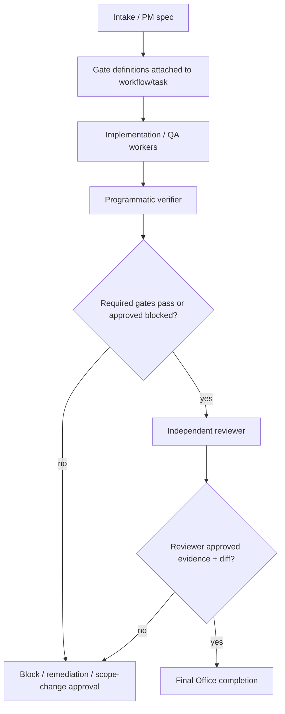

# Agent Office verification honesty gates architecture

Status: proposed for implementation
Owner lane: architect
Source PRD: `docs/product/agent-office-verification-honesty-gates-prd.md`
Related Kanban tasks: `t_b7147a8d` (PM PRD), `t_aa136407` (architecture), `t_f82c936b` (coder implementation)

## Problem statement

Agent Office currently treats Kanban worker completion summaries and review-required conventions as coordination signals, not as independently verified facts. That leaves a gap for false or overstated completion claims: a worker can say benchmarks, live integration tests, Helm installs, k6 thresholds, or release/publish steps succeeded without producing the concrete command output and artifacts that prove the original gate.

The target architecture adds a programmatic evidence gate between worker/QA output and final Office completion. It must preserve generic Kanban compatibility while making gate-bearing Agent Office workflows impossible to mark finally done unless required gates have executable/inspectable evidence and an independent reviewer approves that evidence.

No PM requirement is infeasible. MVP can use existing `task_runs.metadata`, `task_events`, and workspace report files without a new DB table.

## Architecture decision

Accepted direction:

1. Add a new Office verifier module and CLI:
   - `hermes_cli/office_verifier.py`
   - command surface: `hermes office verify <task_id> [--run-id <id>] [--strict] [--report-json <path>]`
   - verifier reads gate definitions from canonical Office task/workflow metadata, executes/inspects each gate, writes bounded DB summaries plus full JSON reports under `.hermes/verification/<task_id>/<run_id>/`.

2. Store MVP gate state in existing Kanban primitives:
   - `task_runs.metadata.verification_gates`: active gate definitions for a run or workflow step.
   - `task_runs.metadata.verification_report`: latest aggregate summary/path.
   - `task_events.kind = office.verification.started|completed|gate_failed`.
   - `task_events.kind = office.scope_change_requested|office.scope_change_approved`.
   - `task_events.kind = office.review.completed`.
   - `task_comments`: human-readable excerpts and reviewer/scope-change handoffs.

3. Treat gate definitions as canonical requirements owned by task creation/specification, not by the completing worker. Worker prose and worker-provided metadata may suggest evidence paths, but cannot weaken, remove, or redefine gates.

4. Add Office workflow enforcement in `hermes_cli/agent_office.py` around gate-bearing tasks:
   - before terminal Office completion, run verifier or route to a verifier child/stage;
   - after verifier output, route to reviewer stage;
   - only allow final completion when completion rule is satisfied.

5. Add parseable `SCOPE_CHANGE_REQUEST` enforcement at two layers:
   - prompt layer: inject explicit format/rule into Office worker bootstrap guidance from `agent/prompt_builder.py` when task is Office/gate-bearing;
   - machine layer: parse comments, block reasons, and run outputs in `hermes_cli/kanban_db.py` or an Office wrapper so valid scope-change blocks emit events and freeze affected gates as blocked pending approval.

6. Add reviewer as separate judgment authority from verifier:
   - verifier is deterministic evidence gathering/scoring;
   - reviewer inspects diffs, report, and evidence paths and records approval or findings;
   - reviewer cannot approve if required gates fail or unapproved partial/blocked gates remain.

Rejected alternatives:

- New verification DB tables for MVP: rejected to avoid migration risk. Existing metadata/events plus workspace files meet audit requirements. Add tables later only if report querying becomes slow or payload summaries outgrow event/metadata caps.
- Trusting worker-supplied test summaries: rejected because the failure mode is false worker claims.
- Replacing Kanban completion semantics globally: rejected for backwards compatibility. Gate enforcement applies to Agent Office/gate-bearing tasks; legacy non-gate tasks keep current behavior.
- Making every scope limitation a human approval loop: rejected because it would make legitimate work noisy. Instead, valid scope-change blocks are rare, require attempted evidence, and are reviewer/human-approved before gate relaxation.

Confidence: high for MVP using existing Kanban primitives. Rollout risk is moderate because command execution must respect workspace and permission boundaries.

## Components

### 1. Gate definition model

Likely files:
- new: `hermes_cli/office_verifier.py`
- optional new: `hermes_cli/office_gates.py` if schema/helpers grow beyond one module
- tests: `tests/hermes_cli/test_office_verifier.py`

Responsibilities:
- Validate `verification_gates` before execution.
- Normalize paths relative to task workspace and reject traversal outside workspace unless an explicit allowlisted external path policy exists.
- Resolve gate templates into concrete gate definitions in future P1.

Inputs:
- `task_id`, optional `run_id`.
- Gate definitions from task/run/workflow metadata or task body fenced JSON/YAML for early MVP if no metadata writer exists yet.
- Task workspace path and board context.

Outputs:
- validated `VerificationGate` objects.
- validation errors that fail strict verifier runs before command execution.

Failure modes:
- malformed gate definition: verifier returns aggregate `fail` in strict mode, `blocked` only if gates cannot be loaded because of missing authorized PM/specification data.
- unsafe command/path: gate `blocked` with policy reason, never silently skipped.

Observability hooks:
- `office.verification.started` event includes policy version, task id, run id, gate count.
- validation failures included in report `gate_errors` and event summary.

### 2. Programmatic verifier/scorer

Likely files:
- new: `hermes_cli/office_verifier.py`
- CLI integration: `hermes_cli/commands.py` and the CLI command dispatcher file that handles `hermes office ...` subcommands
- Kanban display integration: `hermes_cli/kanban.py`
- tests: `tests/hermes_cli/test_office_verifier.py`, `tests/hermes_cli/test_agent_office.py`

Responsibilities:
- Execute required commands when `evidence_policy` includes `execute`.
- Inspect expected artifacts when `evidence_policy` includes `inspect_existing` or `both`.
- Run service readiness/startup/teardown commands for live service gates.
- Parse benchmark/release artifacts and compare thresholds.
- Produce one verdict per gate plus aggregate report.
- Persist full reports and bounded summaries.

Inputs:
- validated gates.
- workspace path.
- current run/task metadata.
- permission gateway/command policy outcome for gate commands.

Outputs:
- `.hermes/verification/<task_id>/<run_id>/report.json`
- command logs under `.hermes/verification/<task_id>/<run_id>/logs/<gate_id>/<command_id>.stdout|stderr`
- optional copied/exported artifacts under `.hermes/verification/<task_id>/<run_id>/artifacts/`
- `office.verification.completed` event payload with aggregate verdict and `report_path`
- updated run metadata summary/path.

Failure modes:
- command timeout: gate `fail` unless explicitly environment-blockable; include timeout and log paths.
- missing toolchain: gate `blocked` only when gate declares environment dependency and `allow_blocked=true`; otherwise `fail`.
- missing artifact: gate `fail`; never `pass` based on a claim.
- threshold parse failure: gate `fail` with actual parse error and evidence path.
- service startup failed: live-service gate `fail`/`blocked` based on gate policy, with startup logs.

Observability hooks:
- per-gate failure events for required gates: `office.verification.gate_failed`.
- report path and aggregate counts in completion event.
- dashboard/CLI reads latest event/metadata to render a gate matrix.

### 3. Scope-change parser and enforcement

Likely files:
- `agent/prompt_builder.py`
- `hermes_cli/kanban_db.py`
- optional new: `hermes_cli/office_scope.py`
- tests: `tests/hermes_cli/test_office_scope_change.py` or inside `test_agent_office.py`

Responsibilities:
- Inject Office-specific no-silent-scope-reduction guidance into worker bootstrap when task is Agent Office/gate-bearing.
- Parse exact block format:

```text
SCOPE_CHANGE_REQUEST
requirement_ref: <original requirement id/text>
requested_change: <exact proposed reduction/substitution>
reason: <why original cannot be satisfied>
attempted_evidence: <commands/files/actions tried>
impact: <what success claim would no longer mean>
options:
  - <option 1>
  - <option 2>
END_SCOPE_CHANGE_REQUEST
```

- Emit `office.scope_change_requested` event with parsed fields and affected gate ids where resolvable.
- Prevent valid requests from being treated as normal completion.
- Treat affected gates as `blocked` until approval updates the gate definition or records an approved scope-change decision.

Inputs:
- comment bodies from `add_comment()`.
- block reasons from `block_task()`.
- completion summaries/result text from `complete_task()` and task run outputs where available.

Outputs:
- task event `office.scope_change_requested`.
- optional task comment with normalized parse summary.
- verifier report entries marking affected gates as blocked/pending approval.

Failure modes:
- non-parseable scope caveat: not accepted as scope change; reviewer finding; verifier still evaluates original gate.
- overuse without attempted evidence: parse event records request, but reviewer/human may reject as unjustified; verifier still does not pass affected gates.
- multiple conflicting requests: latest unapproved request does not supersede previous approvals unless explicitly linked to a requirement/gate and approved.

### 4. Office workflow enforcer

Likely files:
- `hermes_cli/agent_office.py`
- `hermes_cli/office_delegate.py`
- `hermes_cli/kanban_db.py` only for generic completion guard hooks if needed
- tests: `tests/hermes_cli/test_agent_office.py`

Responsibilities:
- Detect gate-bearing Office tasks/workflows.
- Ensure a verifier stage and reviewer stage exist before final terminal done.
- Gate `complete_task()` calls for Office/gate-bearing final tasks so they cannot silently bypass verifier/reviewer.
- Keep generic Kanban behavior unchanged for non-gate tasks.

MVP enforcement topology:



Important invariant:
- The implementation worker's own completion is not the same as final workflow completion. For code-changing tasks, workers may still block with `review-required:`. Office finalization must wait for verifier + reviewer evidence events.

### 5. Reviewer evidence workflow

Likely files:
- `hermes_cli/agent_office.py`
- profile/task body generation in `hermes_cli/office_delegate.py`
- `hermes_cli/kanban.py` display of review metadata
- tests: `tests/hermes_cli/test_agent_office.py`

Responsibilities:
- Route review tasks to concrete reviewer profiles after verifier report exists.
- Reviewer task body must include report path, diff ref, evidence paths, gate matrix, and instructions not to approve failed/unapproved gates.
- Reviewer completion metadata must include:
  - `approved: true|false`
  - `reviewed_report_path`
  - `reviewed_diff_ref`
  - `findings`
  - `gate_report_overall_status`
- Emit `office.review.completed` event.

Failure modes:
- reviewer omits required fields: final workflow remains blocked/fails acceptance tests.
- reviewer approves with failed required gates: final workflow rejects approval and records finding.
- blocked gates without approved scope change: reviewer can confirm legitimate block, but final completion requires approved blocked policy decision, not a simple pass.

### 6. CLI/dashboard rendering

Likely files:
- `hermes_cli/kanban.py`
- `plugins/kanban/dashboard/plugin_api.py`
- `web/src/pages/OfficePage.tsx`
- tests: `tests/hermes_cli/test_kanban_cli.py`, `tests/plugins/test_kanban_dashboard_plugin.py`

Responsibilities:
- `hermes kanban show <task_id>` renders latest gate matrix when verification metadata/events exist.
- Dashboard exposes gate status, missing artifacts, evidence paths, command exit codes, report path, and reviewer status.
- Final badge distinguishes worker done vs verified vs review approved.

## Data model

Use dataclasses/TypedDict/Pydantic-like validation in `office_verifier.py` for MVP; avoid adding runtime dependency unless repo already has it.

### VerificationGate

Required fields:

```json
{
  "id": "rust-criterion-bench",
  "title": "Rust Criterion benchmark ran and exported artifact",
  "requirement_ref": "REQ-BENCH-001",
  "type": "benchmark",
  "required": true,
  "commands": [
    {
      "id": "cargo-bench",
      "cmd": "cargo bench --bench ingest",
      "cwd": ".",
      "timeout_seconds": 600,
      "env_policy": "inherit_safe",
      "requires_service": null
    }
  ],
  "expected_artifacts": [
    {
      "path": "target/criterion/**/estimates.json",
      "must_exist": true,
      "min_bytes": 100,
      "content_regex": null,
      "json_schema": null,
      "produced_by_command_id": "cargo-bench",
      "must_be_committed": false
    },
    {
      "path": "BENCHMARKS.md",
      "must_exist": true,
      "min_bytes": 200,
      "content_regex": "p99|throughput|criterion|benchmark",
      "json_schema": null,
      "produced_by_command_id": null,
      "must_be_committed": true
    }
  ],
  "service": null,
  "thresholds": [
    {"name": "criterion_report_exists", "op": "==", "expected": true}
  ],
  "evidence_policy": "both",
  "allow_blocked": false,
  "notes": "Benchmarks require command output plus artifact, not claim-only evidence."
}
```

Additional recommended fields for implementation:
- `commands[].id`: stable local id required when artifacts reference producer command.
- `commands[].destructive`: default false; true requires permission approval.
- `commands[].allowed_exit_codes`: default `[0]`.
- `expected_artifacts[].path_kind`: `workspace_relative`, `absolute_allowlisted`, or `url`.
- `thresholds[].source`: artifact path or command id.
- `scope_change_ref`: optional approved scope-change event id replacing or relaxing this gate.

### GateVerdict

```json
{
  "gate_id": "rust-criterion-bench",
  "status": "fail",
  "score": 0.5,
  "commands_run": [
    {
      "id": "cargo-bench",
      "cmd": "cargo bench --bench ingest",
      "cwd": "/workspace/project",
      "started_at": 1778559000,
      "ended_at": 1778559120,
      "exit_code": 0,
      "stdout_path": ".hermes/verification/t_x/19/logs/rust-criterion-bench/cargo-bench.stdout",
      "stderr_path": ".hermes/verification/t_x/19/logs/rust-criterion-bench/cargo-bench.stderr"
    }
  ],
  "evidence_paths": ["target/criterion/foo/estimates.json"],
  "missing_artifacts": ["BENCHMARKS.md"],
  "threshold_results": [
    {"name": "criterion_report_exists", "expected": true, "actual": true, "status": "pass"},
    {"name": "committed_benchmark_artifact", "expected": true, "actual": false, "status": "fail"}
  ],
  "blocked_reason": null,
  "notes": "cargo bench ran, but required committed/exported benchmark artifact is missing"
}
```

### VerificationReport

```json
{
  "schema_version": 1,
  "policy_version": "office-verification-v1",
  "task_id": "t_x",
  "run_id": 19,
  "verifier_profile": "verifier-or-tooling",
  "started_at": 1778559000,
  "ended_at": 1778559121,
  "overall_status": "fail",
  "passed": 0,
  "failed": 1,
  "partial": 0,
  "blocked": 0,
  "total": 1,
  "report_path": ".hermes/verification/t_x/19/report.json",
  "gate_verdicts": []
}
```

Aggregation rule:
- any required `fail` => aggregate `fail`.
- no fails but any required unapproved `blocked` => aggregate `blocked`.
- no fails/blocked but any required unapproved `partial` => aggregate `partial`.
- all required pass or approved scope-changed/blocked => aggregate `pass` with `approved_exceptions` listed.

### ReviewReport

```json
{
  "approved": false,
  "reviewer_profile": "reviewer",
  "reviewed_report_path": ".hermes/verification/t_x/19/report.json",
  "reviewed_diff_ref": "git diff --stat / branch / PR URL",
  "gate_report_overall_status": "fail",
  "findings": [
    {
      "severity": "blocking",
      "gate_id": "k6-p99",
      "issue": "No k6 JSON summary exists; p99 threshold cannot be verified."
    }
  ]
}
```

## Control flow

### Gate creation/specification

1. PM/specifier or workflow template defines `verification_gates` in task/run metadata. Early MVP may parse a fenced `verification_gates` block from task body only as a compatibility bridge, but implementation should prefer structured metadata.
2. Coder/QA workers receive the original gates in worker context, but cannot modify them by completion metadata.
3. If a worker discovers genuine infeasibility, it blocks/comments with a valid `SCOPE_CHANGE_REQUEST` block.

### Worker completion path

1. Worker performs implementation/QA.
2. Worker records evidence paths in metadata/comments, but this is treated as hints only.
3. For code-changing work, worker continues current convention: `review-required:` block rather than final done.
4. Office enforcer sees gate-bearing workflow is not terminal until verifier and reviewer stages complete.

### Verifier path

1. `agent_office.tick()` or manual CLI invokes `office_verifier.verify_task(task_id, run_id=None, strict=True)` for gate-bearing tasks after implementation/QA stage.
2. Verifier writes `office.verification.started` event.
3. For each gate:
   - validate command/path safety;
   - start service if configured;
   - run commands if required;
   - inspect artifacts;
   - parse thresholds;
   - teardown service;
   - write logs/artifact copies;
   - compute verdict.
4. Verifier writes full report to workspace and bounded summary to metadata/event/comment.
5. Failed required gates route back to remediation or blocked state.
6. Passing or approved-blocked gates route to reviewer.

### Reviewer path

1. Office creates or promotes reviewer task after verifier report exists.
2. Reviewer inspects diff and report/evidence.
3. Reviewer completes with required review metadata.
4. Office records `office.review.completed`.
5. Final completion guard checks:
   - latest verifier aggregate acceptable;
   - every required gate pass or approved exception;
   - reviewer approved with required fields;
   - report path exists.

## Permission boundaries

- Verifier commands are tool actions and must go through existing command/approval policy rather than bypassing permissions.
- Default command working directory must be inside `task.workspace_path`.
- Artifact paths must be workspace-relative unless explicitly typed as URL or allowlisted absolute path.
- Destructive commands are disallowed unless gate has `destructive=true` and permission gateway approves.
- External publish/release gates must not fake success when credentials are unavailable. They can be `blocked` only when `allow_blocked=true` and blocked reason names the missing credential/infrastructure.
- Scope-change approval must be explicit event state from authorized human/owner/reviewer; a worker cannot approve its own scope reduction.
- Reviewer and verifier roles must be distinct from the implementation worker for final Office approval.

## Benchmark/release artifact enforcement

Concrete MVP gate templates/evals must require outputs, not just scripts:

1. Rust Criterion/cargo bench
   - command: `cargo bench` or project-specific bench command
   - required artifacts: `target/criterion/**/estimates.json` or equivalent output plus committed/exported `BENCHMARKS.md` when success is claimed as deliverable
   - false positive caught: markdown-only or command-only benchmark claims with no Criterion/report artifact.

2. Python SDK live integration
   - service startup/readiness command or URL required
   - pytest command must run after readiness evidence
   - mocks-only pytest reports cannot satisfy `live_service_test`
   - required artifacts: pytest report/log and service readiness evidence.

3. Helm real install
   - command must include actual cluster install/upgrade into kind/minikube/k8s context, not only `helm lint` or `helm template`
   - required artifacts: install command log, `helm status`, `kubectl get pods`, or namespace resource evidence
   - cluster absence can be blocked only if gate permits and records concrete missing tool/cluster.

4. k6 p99
   - command must emit JSON/summary artifact (`--summary-export`, JSON output, or parsed report)
   - threshold result must include p99 expected/actual/status
   - no k6 report => gate fails.

5. PyPI/release
   - required artifact depends on requirement: `dist/*` files, TestPyPI/PyPI URL, GitHub Release URL, or release workflow run artifact
   - missing credentials => blocked only with `allow_blocked=true`; otherwise failure/no success claim.

6. Benchmark artifact
   - if the requirement says benchmark results are part of done, at least one committed/exported artifact must exist and satisfy size/content checks
   - generated-but-uncommitted artifacts fail when `must_be_committed=true`.

## Backward compatibility and migration

- Existing non-gate Kanban tasks keep current `complete_task()` behavior.
- Existing Agent Office tasks without `verification_gates` are not retroactively blocked unless routed through a new gate-bearing Office template.
- `kanban_show` remains compatible: it adds a gate matrix only when verification metadata/events exist.
- No mandatory DB migration for MVP. Add only code that writes new event kinds and metadata keys.
- Legacy task bodies may include gates in a fenced block during migration, but new Office task creation should write structured metadata as soon as helper APIs exist.
- Dashboard consumers must tolerate missing verification fields and display `not configured` rather than erroring.

Migration steps:
1. Introduce schema validators and report writer with no workflow enforcement.
2. Add CLI verifier and tests.
3. Add prompt/parser for scope changes.
4. Add Office workflow enforcement behind config flag `agent_office.verification.enabled` defaulting to true only for gate-bearing tasks.
5. Add CLI/dashboard rendering.
6. Add gate templates and make new high-stakes Office workflows attach gates by default.

## Tests and evals

Unit tests:
- gate schema validation accepts valid command/artifact/live_service/benchmark/release gates.
- invalid path traversal, missing gate id, duplicate gate id, malformed thresholds fail validation.
- verdict aggregation produces pass/fail/partial/blocked deterministically.
- scope-change parser accepts only exact block format and extracts all required fields.
- non-parseable scope-change prose does not emit approved scope-change state.

Integration tests:
- `hermes office verify <task_id>` writes report JSON and `office.verification.completed` event.
- `hermes kanban show <task_id>` renders concise gate matrix when metadata/events exist.
- Agent Office final workflow refuses completion without verifier report.
- Agent Office final workflow refuses completion without reviewer approval.
- Reviewer approval metadata missing `approved`, `reviewed_report_path`, `reviewed_diff_ref`, or `findings` is rejected.
- Legacy non-gate task can still complete.

Regression eval fixtures for known false positives:

1. Cargo bench false positive
   - setup: worker metadata says `cargo bench passed`; no `target/criterion/**/estimates.json` and no benchmark report.
   - expected: benchmark gate `fail`; aggregate not `pass`; missing artifacts listed.

2. Mocked pytest when live server required
   - setup: pytest result exists using mocks; no service startup/readiness evidence.
   - expected: live-service gate `fail` or `partial`, never `pass`.

3. Helm template/lint without install
   - setup: `helm lint` and `helm template` logs exist; no install/status/kubectl evidence.
   - expected: helm install gate `fail`; missing evidence names real cluster install/status.

4. Missing k6 report/p99
   - setup: script exists or worker claims k6 success; no JSON/summary report.
   - expected: k6 gate `fail`; p99 threshold result missing/fail; final completion blocked.

5. PyPI/release claim without publish artifact
   - setup: build script or prose claim exists; no dist files, release URL, PyPI/TestPyPI URL, or workflow artifact.
   - expected: release gate `fail`, unless `allow_blocked=true` and missing credentials are concretely recorded as blocked.

6. Benchmark artifact missing
   - setup: benchmark command can run or has log, but no committed/exported `BENCHMARKS.md`/JSON/report artifact.
   - expected: artifact subcheck fails; aggregate not `pass`.

## File paths likely to change

New files:
- `hermes_cli/office_verifier.py`
- optional `hermes_cli/office_gates.py`
- optional `hermes_cli/office_scope.py`
- `tests/hermes_cli/test_office_verifier.py`
- optional `tests/hermes_cli/test_office_scope_change.py`
- fixture directories under `tests/fixtures/office_verifier/`

Existing files:
- `agent/prompt_builder.py`: inject Office/gate-bearing scope-change honesty guidance.
- `hermes_cli/agent_office.py`: verification/reviewer stage routing and final completion enforcement.
- `hermes_cli/office_delegate.py`: attach gate metadata/body hints when creating gate-bearing workflows; include verifier/reviewer stages.
- `hermes_cli/kanban_db.py`: parse scope-change blocks on comment/block/complete paths; emit Office events; optionally add helper APIs for metadata updates.
- `hermes_cli/kanban.py`: render gate matrix in `show` and expose scope/review events.
- `hermes_cli/commands.py` and CLI dispatchers: add `hermes office verify` command registration if command registry requires it.
- `plugins/kanban/dashboard/plugin_api.py`: expose verification/review summaries to dashboard.
- `web/src/pages/OfficePage.tsx`: show gate/reviewer state in Office dashboard.
- `tests/hermes_cli/test_agent_office.py`: workflow enforcement tests.
- `tests/hermes_cli/test_kanban_cli.py`: `kanban show` rendering tests.
- `tests/plugins/test_kanban_dashboard_plugin.py`: dashboard API contract tests.

## Implementation milestones and acceptance criteria

### M1: Schema and report writer

Owner: tooling/coder

Acceptance:
- Gate/verdict/report schemas are implemented and validate required fields.
- Full report is written under `.hermes/verification/<task_id>/<run_id>/report.json`.
- Large command stdout/stderr are file paths in report, not DB event blobs.
- Unit tests cover duplicate ids, unsafe paths, missing artifacts, threshold aggregation.

### M2: Verifier CLI

Owner: tooling/coder

Acceptance:
- `hermes office verify <task_id> --strict` executes/inspects gates from canonical task metadata.
- Each gate gets `pass|fail|partial|blocked`, command exit codes, evidence paths, missing artifacts, threshold results.
- Events `office.verification.started` and `office.verification.completed` are recorded.
- Regression fixtures for cargo bench, live-server pytest, Helm install, k6 p99, PyPI/release, and benchmark artifact fail as expected.

### M3: Scope-change enforcement

Owner: coder with reviewer/security review

Acceptance:
- Office worker prompt includes exact `SCOPE_CHANGE_REQUEST` format when task is gate-bearing/Office.
- `add_comment`, `block_task`, and completion/run-output handling parse valid blocks and emit `office.scope_change_requested`.
- Valid requests block affected gates pending approval.
- Non-parseable scope caveats do not relax gates.
- Tests prove silent Helm install -> template reduction fails original gate.

### M4: Workflow enforcer + reviewer stage

Owner: coder/reviewer

Acceptance:
- Gate-bearing Office workflows insert verifier + reviewer stages before final completion.
- Final completion rejects missing verifier report, failing required gates, missing approved scope-change decision, or missing reviewer approval.
- Reviewer metadata includes `approved`, `reviewed_report_path`, `reviewed_diff_ref`, and `findings`.
- Existing `review-required:` convention remains valid for code tasks but does not substitute for verifier evidence.

### M5: CLI/dashboard UX

Owner: tooling/frontend

Acceptance:
- `hermes kanban show` displays latest gate matrix and review status.
- Dashboard shows gate status, evidence path, missing artifacts, command exit, report path, and reviewer approval.
- Legacy non-gate tasks show no noisy verification requirement.

## Handoff plan

To coder/tooling (`t_f82c936b`):
- Implement `office_verifier` schemas, report writer, CLI, scope-change parser, and Office workflow guard in the file paths above.
- Preserve existing Kanban compatibility.
- Start with tests for the six false-positive fixtures before enforcing workflow globally.

To QA/evals:
- Build fixture repos/task rows that reproduce each known false-positive pattern.
- Add integration tests around verifier, final Office completion, and reviewer metadata rejection.

To reviewer:
- Review for evidence integrity, command safety, workspace path safety, and absence of worker-prose trust.
- Do not approve if any required gate can pass without real command/artifact evidence.

To security/devops:
- Review verifier command execution policy, cluster/publish command handling, and blocked-vs-fail behavior for missing external credentials.

## Invariants

- Worker prose is never evidence by itself.
- Gate definitions are canonical and cannot be weakened by the worker being verified.
- Required gates block final completion unless passed or explicitly approved as scope-changed/blocked.
- Benchmarks/releases require output artifacts, not scripts or claims.
- Reviewer approval is independent and follows verifier output.
- Non-gate legacy Kanban remains compatible.
