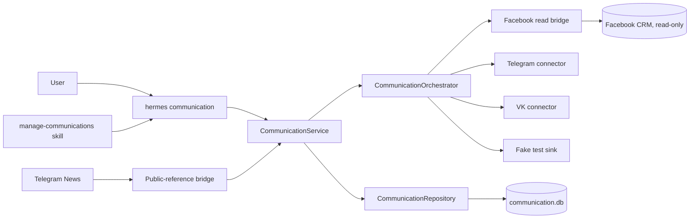

# Architecture and ownership

## Boundary

The CLI owns argument parsing and redacted presentation. It never executes
SQL. `CommunicationService` owns orchestration, routing decisions, sync, and
write policy. `CommunicationRepository` owns physical schema and
transactions. Adapters translate one exact `ConnectedAccount` to normalized
read records. Only `FakeCommunicationAdapter` implements `send_approved`.

## Narrow waist

No Communication Core schema is registered in `model_tools.py`, `toolsets.py`,
or the system prompt. The model uses a CLI command guided by a skill, so the
per-conversation cached prefix stays byte-stable and the permanent model-tool
surface does not grow.

## Domain ownership

Personal communication owns people, platform identities, endpoints,
conversations, messages, journeys, routes, CRM state, groups, drafts,
approvals, outbox state, greetings, and sync evidence. Platform adapters own
transport-specific reads. The legacy Facebook application service continues
to own browser/E2EE/profile behavior.

Telegram News is a separate domain. The only permitted cross-domain object is
a public-reference suggestion containing topic/entity/story/source IDs. News
cannot receive private message/article bodies from Communication Core, and the
bridge can create only private suggestions or drafts.
