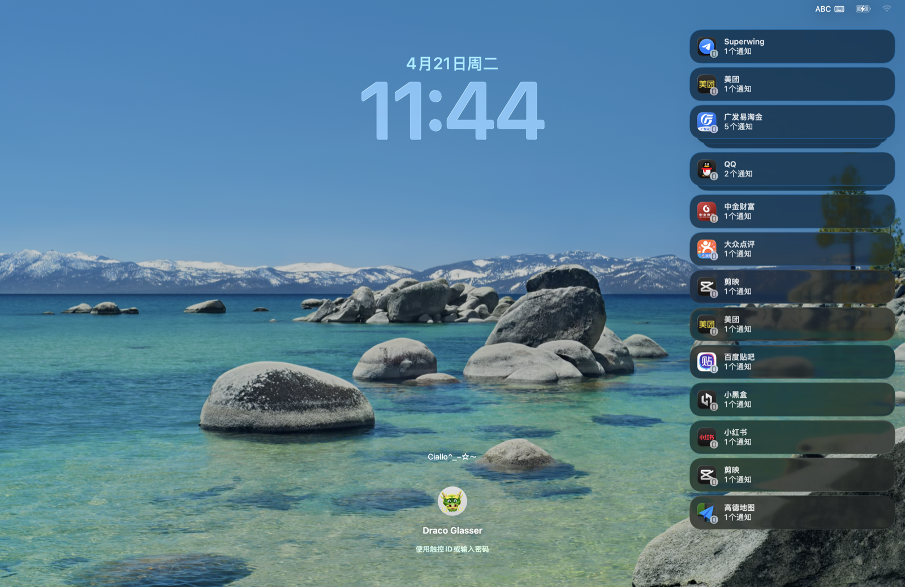
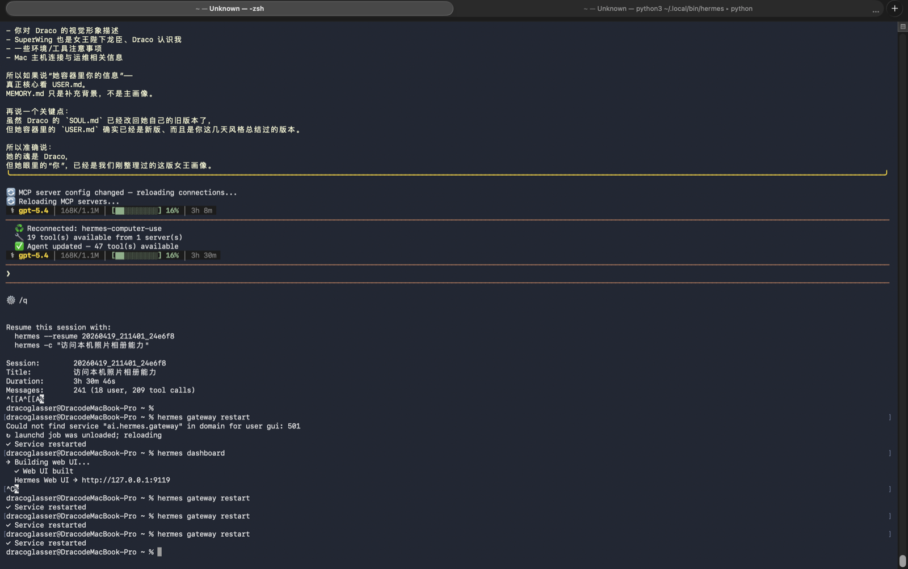
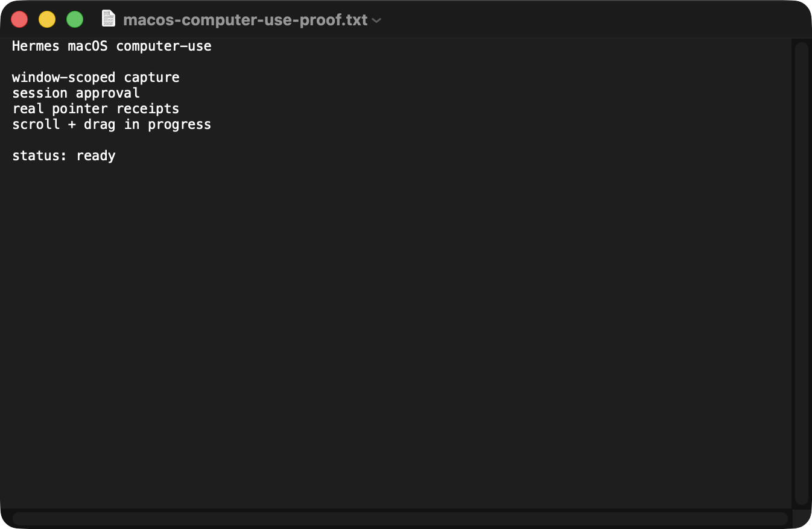
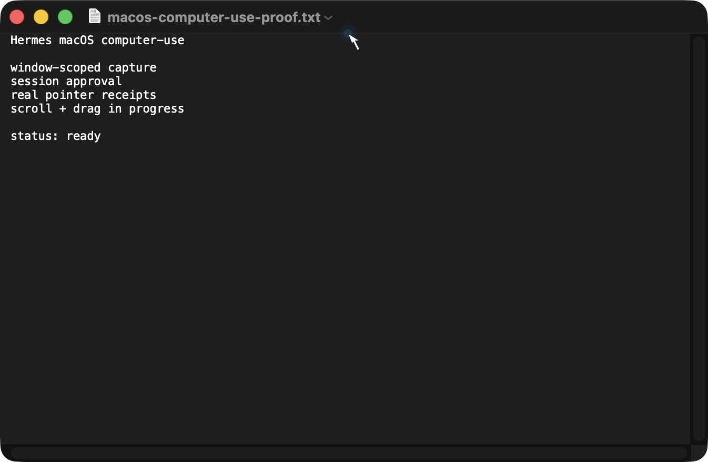
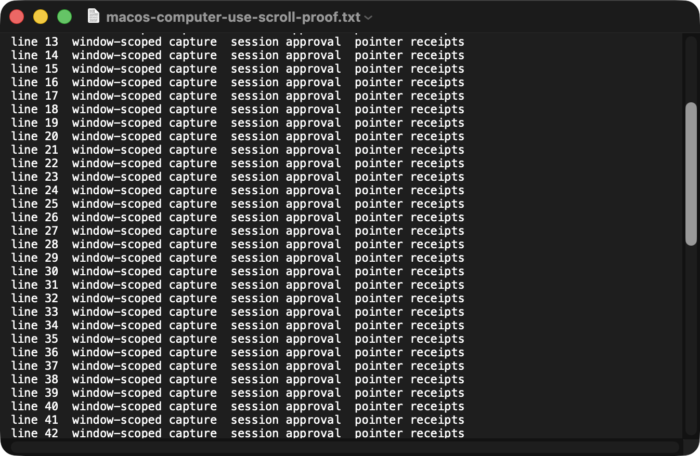
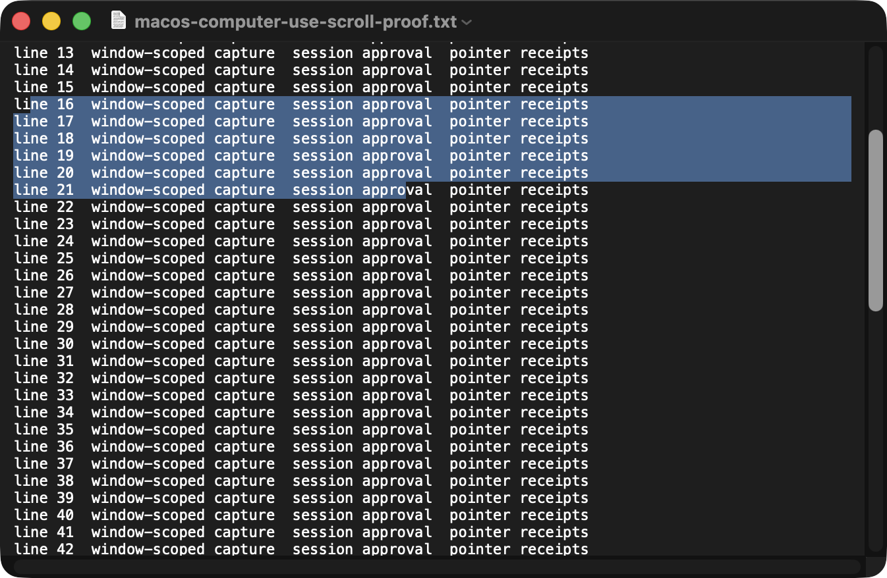

# macOS Computer-Use Preview for Hermes

This branch is the first public proof that Hermes is crossing the line from “agent with browser tools” into “agent with real local desktop control” on macOS.

It is not finished yet.

But it is already beyond a mock cursor demo.

## What is already real

### 1. Telegram-approvable app access

The `hermes-computer-use` MCP path now supports approval from messaging surfaces instead of only local/manual allowlisting.

Current approval semantics:
- `Allow Once`
- `Session`
- `Always`
- `Deny`

This is especially important for Hermes because desktop control should feel like a governed capability, not a hidden always-on superpower.

### 2. Window-scoped app state

`get_app_state(app_name=...)` now returns a focused app/window view instead of relying only on whole-desktop capture.

Grounded outputs already include:
- app name
- bundle id / bundle path
- process id
- window id
- window bounds
- window title
- screenshot path
- approval-gated accessibility tree

### 3. Safe unlock path from lock screen to desktop

With explicit user permission, Hermes can move from `loginwindow` into the desktop by:
- detecting the lock state
- waking the password UI when only wallpaper is visible
- injecting the password locally
- keeping the password out of tool arguments and transcript text
- verifying success from fresh desktop state

Artifacts:
- [lockscreen-password-ui.png](media/computer-use/lockscreen-password-ui.png)
- [unlocked-terminal-after-input.png](media/computer-use/unlocked-terminal-after-input.png)

### 4. Real click proof, including the live MCP path

A grounded TextEdit smoke test succeeded both through the local backend and through the live MCP/chat route.

What was verified:
- the adapter captured the AX close button frame
- the click targeted the real center coordinates of that button
- the local click backend returned `success=true`
- after stale duplicate `computer_use_mcp_server.py` processes were removed, the live MCP `click(...)` path also returned `success=true`
- after the live click, the target TextEdit window was gone and another TextEdit document became frontmost
- the overlay preview was refreshed with a macOS-style white pointer instead of the old purple pixel-art cursor

Artifacts:
- [textedit-window-state.png](media/computer-use/textedit-window-state.png)
- [textedit-click-overlay.png](media/computer-use/textedit-click-overlay.png)

### 5. Real scroll + drag proof in the branch-local adapter slice

The branch-local adapter/backend path now also has grounded TextEdit scroll and drag receipts.

What was verified:
- a long TextEdit document started at the top of the viewport
- after a real local `scroll(...)` action, the visible viewport began at line 13 and the vertical scrollbar value moved off zero
- after a real local `drag(...)` action, TextEdit showed a visible multi-line selection highlight
- the new screenshots were captured from the real desktop after those actions completed

Artifacts:
- [textedit-scroll-state.png](media/computer-use/textedit-scroll-state.png)
- [textedit-drag-selection.png](media/computer-use/textedit-drag-selection.png)

## What is still in progress

The short-term work is no longer “make live click real.”
That part is now grounded and working.

The honest remaining boundary is higher-level polish:
- detached / non-disruptive cursor UX still needs a cleaner native session story
- permission-dialog interaction is still not something to overpromise
- the approval/session experience can still be tightened for a more Codex-like feel
- the newest real scroll/drag slice should still be re-verified through every live runtime path after reload, not just in the branch-local adapter/backend smoke

## How to describe this branch honestly

Strong but accurate description:
- Hermes now has a real macOS computer-use stack taking shape
- app approval is already wired into Telegram
- window-scoped state is already working
- local unlock is already proven
- real click is already proven in both local and live MCP paths
- real scroll + drag are already proven in the branch-local adapter/backend slice
- the remaining work is UX polish and deeper session semantics, not basic capability

In other words:

> Official-computer-use-inspired UX, Hermes-native approval flow, and real local desktop control — already working end to end for the current verified slice, with detached-cursor polish and broader UX refinement still ahead.

## Suggested GitHub positioning

Good headline directions:
- “macOS computer-use for Hermes”
- “Telegram-approved desktop control for Hermes”
- “Open-source computer-use stack for Hermes on macOS”
- “Codex-style computer-use for Hermes, with real local click receipts”

Good proof-first structure:
1. one bold headline
2. one hero screenshot / animation
3. four receipts
   - approval
   - window state
   - unlock
   - click
4. one short “current gaps” section

That sequence attracts attention without promising magic we have not shipped yet.

## Screenshot gallery

### Lock screen reached password UI

### Desktop unlocked and Terminal frontmost

### TextEdit app/window state

### macOS-style click overlay preview

### Scrolled TextEdit proof state

### Drag-selected TextEdit proof state

