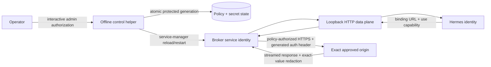
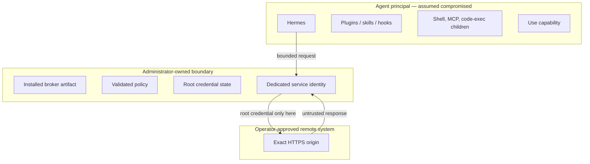

# Policy-Bound Credential Broker — Native Privilege Boundary for Agent Credentials

Status: design proposal (not yet implemented)
Author: Dakota Smith (`@dsr-restyn`), with community input on issue #4656
Issue: [#4656](https://github.com/NousResearch/hermes-agent/issues/4656)
Supersedes: the architecture attempted in [PR #9704](https://github.com/NousResearch/hermes-agent/pull/9704) and duplicated in [PR #4691](https://github.com/NousResearch/hermes-agent/pull/4691); neither implementation should be merged as written

## Decision summary

Hermes should not receive a long-lived provider credential and then try to hide it
from its own subprocesses. The root credential must instead live behind an OS
security boundary in a broker that:

1. accepts a use-only capability from Hermes;
2. authorizes one exact HTTPS origin plus explicit HTTP method and path rules;
3. generates one configured upstream authentication header;
4. forwards broad, ordinary HTTP traffic without following redirects or retrying
   requests;
5. prevents the raw root credential and generated wire value from crossing back
   into Hermes; and
6. exposes no agent-accessible control plane.

The first implementation is a small standalone native service with an
administrator-mediated control helper and Linux, macOS, Windows, and WSL2
service adapters. It is a **fixed-origin reverse proxy**, not a generic forward
proxy and not transparent HTTPS interception.

The accurate claim is **policy-bound root-credential confinement**, not
"zero-knowledge": an approved upstream can still mint delegated credentials or
return transformed secret material that an exact-value redactor cannot
recognize.

## Why the Phase 1 implementations are invalid

PRs #9704 and #4691 substitute `hermes-proxy://...` placeholders for credentials
and run a user-owned HTTP proxy. That approach cannot satisfy issue #4656:

- A blind HTTPS `CONNECT` tunnel cannot inspect an encrypted request and therefore
  cannot replace a placeholder inside the request headers.
- Arbitrary-origin substitution turns one root credential into a credential the
  agent can exercise against any host: a confused-deputy boundary rather than a
  credential boundary.
- A service owned by the same user and importing code from a user-writable Hermes
  checkout, virtualenv, or plugin path can be changed or inspected by the agent.
- A management API reachable from Hermes lets the protected sidecar become an
  agent-operated secret store.
- A Unix-domain-socket-only design is not a native Windows design and does not
  match Hermes's cross-platform contract.
- Returning upstream bytes without credential-echo handling makes "the agent
  never sees the credential" false whenever an upstream reflects it.

Useful lessons survive: per-binding capabilities, strict framing, async
streaming, redaction tests, and an opt-in adapter path. The current code does not.

## Security objective and honest guarantee

### Protected asset

The protected asset is one configured, long-lived **root credential**, such as
an OpenAI API key, Anthropic API key, or bearer service token.

Given the assumptions below, the broker guarantees that the raw root credential
and the exact authentication value generated from it:

- do not exist in the Hermes process, its subprocess environment, its
  configuration, its files, or an agent-owned IPC channel;
- are sent only in the configured header to the binding's exact approved HTTPS
  origin, after method and path authorization;
- are removed from the client request before forwarding;
- are not replayed automatically to a redirect target or by a broker retry; and
- are not returned verbatim to Hermes in response headers or response-body
  streams.

Hermes receives a random **use capability**. Possession authorizes requests
within one binding's policy; it does not disclose or recover the root credential.
A compromised Hermes process can exercise every request allowed by that binding.
That is intentional and must be visible to the operator.

### Explicit non-guarantees

The first slice does not claim to prevent:

- an approved origin from using the root credential for any action its own API
  assigns to that credential;
- an approved origin from encoding, hashing, encrypting, splitting, or otherwise
  transforming the credential before returning it;
- an approved origin from minting a cookie, OAuth code, signed URL, delegated
  token, or other new authority and returning that authority to Hermes;
- exfiltration of ordinary response data or of a delegated credential returned by
  an approved API;
- compromise by root/Administrator, by the broker service identity, by a kernel
  exploit, or by a malicious broker release;
- isolation between two Hermes profiles that run as the same OS principal; or
- disk-theft protection merely because a key and ciphertext are stored on the
  same machine.

Cookie-authenticated browsing, browser session storage, OAuth lifecycle,
request signing, mTLS client identities, credential injection into URL/query/body
fields, WebSocket frames, and transparent TLS interception require separate
adapters and separate threat models.

## Threat model

### In scope

Assume an attacker can fully control:

- model output and every Hermes tool call;
- the Hermes process and all code loaded into it, including skills, plugins,
  hooks, and MCP clients;
- every subprocess launched as the Hermes OS user;
- Hermes-owned files, configuration, virtual environments, and checkout paths;
- client HTTP requests sent to the broker, including malformed framing, headers,
  paths, bodies, cancellation, and concurrency; and
- upstream response bytes from an operator-approved origin.

The attacker can read the binding ID and use capability, send arbitrary requests
through the binding, connect directly to other network services, and attempt to
exhaust the broker.

### Required assumptions

The guarantee holds only when:

- Hermes and the broker run as distinct OS/container security principals;
- every operation that handles a root-secret value receives it through an
  administrator-owned out-of-band session or an OS secure-input channel whose
  input path is inaccessible to the Hermes principal; same-session elevation
  alone is not an input boundary;
- Hermes has no root/Administrator access and cannot modify broker binaries,
  service definitions, policy, secret state, release manifests, or runtime
  dependencies;
- the OS prevents Hermes from reading or debugging the broker process and state;
- the operator trusts the configured upstream origin not to intentionally return
  transformed versions of the root credential;
- the host's kernel, TLS trust store, DNS resolver, and administrator account are
  not compromised; and
- broker updates are verified and installed through the administrator-owned
  release path.

If Hermes is granted elevation, host process inspection, write access to the
installation, or the broker service identity, the guarantee intentionally
collapses. Startup checks must reject detectable violations rather than silently
degrading to a same-user daemon.

## Terminology

- **Binding:** immutable association among one binding ID, one root credential,
  one exact upstream origin, one generated-auth strategy, and one request policy.
- **Root credential:** protected long-lived value known only to the broker side.
- **Use capability:** random per-binding token readable by Hermes and accepted
  only by the broker data plane.
- **Control helper:** elevated offline CLI that installs the service and performs
  binding mutations; it is not the daemon.
- **Data plane:** request-forwarding listener. It cannot add, rotate, list, export,
  or delete root credentials.
- **Policy generation:** atomically installed, internally consistent snapshot of
  policies, capability hashes, and secret references.

## Architecture



### Trust boundaries



### Broker artifact

The broker is a standalone minimal service. It must not import Hermes, plugins,
skills, hooks, or modules from a user-controlled Python path. The recommended
substrate is a small Rust binary with:

- a mature HTTP/1.1 server parser for the loopback side;
- a mature HTTPS client stack supporting HTTP/1.1 and HTTP/2 upstream;
- bounded streaming and backpressure;
- locked dependencies and reproducible Linux/macOS/Windows release builds; and
- no dynamic extension or plugin mechanism.

The protocol and policy model are language-independent. If maintainers choose a
different implementation language, the installation must still place a minimal,
locked runtime outside every Hermes/user-writable path and satisfy the same
cross-platform and adversarial transport suite. A mutable user virtualenv is not
acceptable.

### Listener

The native first slice listens only on loopback TCP. TCP is used on Linux, macOS,
native Windows, and WSL2 to keep one client contract. The listener:

- binds an operator-configured loopback address and fixed port;
- refuses wildcard or non-loopback bind addresses in native mode;
- authenticates every binding request with a 256-bit or stronger random use
  capability;
- exposes only a minimal unauthenticated health result (`healthy`, `degraded`, or
  `reloading`, plus protocol version), never binding names or policy details;
- applies global and per-binding concurrency/rate limits before expensive work;
  and
- uses uniform responses for unknown binding IDs and invalid capabilities.

Container or remote-agent deployment is a later packaging profile. It must use
an OS-isolated private network plus mutually authenticated transport or an
equivalent workload-identity boundary; publishing the native data plane on a LAN
is not supported.

## Binding model

The conceptual policy below is not a commitment to YAML as the protected on-disk
format. Policy and secret values are separate files/stores and are joined only by
an internal opaque `secret_ref`.

```yaml
id: openai-primary
origin: https://api.openai.com:443
secret_ref: secret-7f5932f8

client_auth:
  header: Hermes-Broker-Capability
  capability_hash: sha256:...

upstream_auth:
  kind: bearer                 # bearer | basic | raw_header
  header: Authorization

network:
  scope: public                # public | explicit_private
  allowed_private_cidrs: []    # required and elevated for explicit_private

rules:
  - id: models-list
    methods: [GET]
    exact_paths: [/v1/models]
  - id: responses
    methods: [POST]
    exact_paths: [/v1/responses]
    prefix_paths: [/v1/responses/]
  - id: chat-completions
    methods: [POST]
    exact_paths: [/v1/chat/completions]

limits:
  max_header_bytes: 65536
  max_header_count: 100
  max_request_body_bytes: 67108864
  max_concurrency: 32
  connect_timeout_seconds: 10
  response_header_timeout_seconds: 30
  stream_idle_timeout_seconds: 120
  total_timeout_seconds: 3600

response:
  exact_root_redaction: required
```

### Binding invariants

- `id` is a non-secret stable identifier with a conservative ASCII slug format.
- `origin` is one normalized `https://host:port` origin. It has no path, query,
  fragment, userinfo, wildcard, or origin list.
- HTTP origins are rejected. HTTPS certificate and hostname verification cannot
  be disabled per binding.
- Each rule has a stable audit ID and a non-empty method allowlist plus at least
  one exact or bounded-prefix path.
- Path prefixes are segment-aware. `/v1/responses/` matches descendants, not
  `/v1/responses-evil`.
- Glob, regex, wildcard host, free-form authentication template, query/body
  substitution, and client-provided upstream-header values are rejected.
- Exactly one client capability and root secret are active in one policy
  generation. Rotation creates a new atomic generation; rollback restores the
  complete previous pair.
- Listing returns policy metadata and secret references, never root values,
  capability material, or hashes useful for offline comparison.

### Generated authentication strategies

The first slice supports only strategies where the broker can construct one
header without parsing or rewriting the request body:

- `bearer`: `Header-Name: Bearer <root>`;
- `basic`: `Header-Name: Basic <base64(configured-user:root)>`; and
- `raw_header`: `Header-Name: <root>`.

The header name is fixed by elevated policy. The generated wire value and raw
root value are both registered with the response redactor before any upstream
bytes are released.

AWS SigV4, OAuth refresh, HMAC signatures, mTLS, multi-header schemes, and
provider-specific token exchange require dedicated strategy implementations;
they are not representable as free-form templates.

## Origin and destination validation

An exact hostname policy is insufficient by itself: DNS rebinding or a poisoned
resolver could make an approved name connect to localhost, a private service, or
cloud metadata. Destination validation is part of the request boundary.

For every new upstream connection, the broker must:

1. normalize the policy host once using IDNA A-label rules and lowercase DNS
   comparison; reject userinfo, trailing-dot ambiguity, zone identifiers,
   malformed host syntax, and all IPv4/IPv6 literal origins in the first slice;
2. resolve the fixed policy hostname itself, obtaining all A and AAAA answers;
3. classify **every** returned address before opening a socket;
4. reject the entire resolution set if any answer is prohibited by the binding's
   network scope;
5. select only from the validated set and connect the socket directly to that IP
   address, preventing a second implicit resolver lookup;
6. preserve the configured origin hostname for TLS SNI, certificate hostname
   verification, and the HTTP `Host`/`:authority` value; and
7. repeat resolution and classification whenever a new connection is created.

Reusing an already validated live connection is allowed. A new connection after
idle close, failure, reconnect, or pool eviction must re-resolve and revalidate.
The broker never changes policy because DNS changed.

The upstream transport does not read process proxy environment variables or OS
proxy settings, honor `Alt-Svc`, perform cross-origin HTTP/2 connection
coalescing, or delegate hostname resolution to another proxy. Connection pools
are keyed by binding, exact origin, and policy generation. These rules prevent a
valid policy from migrating to an unvalidated destination below the HTTP layer.

### Default public-origin policy

`network.scope: public` accepts only globally routable unicast destinations. It
rejects at least:

- IPv4 unspecified, current-network, loopback, RFC1918 private, carrier-grade
  NAT, link-local, cloud-metadata, documentation, benchmarking, multicast,
  broadcast, and reserved ranges;
- IPv6 unspecified, loopback, unique-local, link-local, site-local/deprecated,
  documentation, discard, multicast, and other non-global ranges; and
- IPv4-mapped IPv6 addresses whose embedded IPv4 address is prohibited.

The implementation must pin its tables to the IANA IPv4/IPv6 special-purpose
registries and test them explicitly rather than assuming one platform's
`is_private` helper has stable semantics. Cloud metadata targets such as
`169.254.169.254` and provider-specific aliases remain prohibited even if a
resolver labels them differently.

### Explicit private-origin policy

A private origin is permitted only by an elevated binding mutation that sets
`network.scope: explicit_private` and names the smallest required CIDR set. There
is no unprivileged override and no blanket "allow all private networks" setting.
On every connection all A/AAAA results must fall inside the elevated CIDR set.
Mixed public/private answers fail closed.

Unspecified, multicast, broadcast, malformed, and cloud-metadata destinations
remain prohibited. Loopback requires a separately explicit loopback CIDR; it is
never implied by enabling RFC1918/ULA access. The control helper displays the
expanded network authority before accepting the mutation and records it in the
non-secret policy audit.

## Request data-plane contract

Hermes configures a client base URL such as:

```text
http://127.0.0.1:9843/b/openai-primary
```

and sends the use capability in:

```http
Hermes-Broker-Capability: <opaque random token>
```

A client request to
`http://127.0.0.1:9843/b/openai-primary/v1/responses` maps to
`https://api.openai.com:443/v1/responses`. The `/b/<binding-id>` prefix is local
routing metadata and is never forwarded.

### Validation order

For every request, the broker performs this order:

1. Parse strict HTTP framing under header count/size, body size, idle, total
   duration, rate, and concurrency limits.
2. Reject ambiguous framing, multiple/conflicting `Content-Length`, illegal
   `Transfer-Encoding`, absolute-form targets, authority-form targets,
   `CONNECT`, protocol upgrades, invalid header bytes, duplicate capabilities,
   duplicate client-supplied copies of the selected upstream-auth header, and
   other duplicate security-sensitive headers.
3. Parse the local binding prefix without using it as an upstream authority.
4. Authenticate the capability in constant time. Unknown binding and wrong
   capability share one generic status, body shape, and timing envelope.
5. Canonicalize and authorize method/path before resolving the root credential
   or performing DNS.
6. Remove the client capability, every client-supplied copy of the configured
   upstream-auth header, `Authorization`/`Proxy-Authorization` not explicitly
   required by another reviewed strategy, `Host`, `Proxy-*`, all hop-by-hop
   headers, and every header nominated by `Connection`.
7. Set the exact upstream `Host`/`:authority`, force `Accept-Encoding: identity`
   where protocol-compatible, and generate the configured authentication header.
8. Resolve and validate the fixed destination, then connect with normal TLS
   certificate and hostname verification.
9. Stream the request with bounded buffers and backpressure.
10. Stream the response through header/body redaction and safe reframing.

The data plane never resolves or connects to a client-supplied authority.

### Path canonicalization and policy matching

Policy and upstream must see the same path representation. The broker therefore:

- accepts origin-form request targets only;
- rejects fragments, controls, NUL, backslashes, malformed percent escapes,
  percent-encoded `/` or `\`, and encoded or literal dot-segments;
- canonicalizes percent escapes for unreserved characters and uppercase hex for
  remaining escapes;
- does not collapse repeated slashes or invent a trailing slash;
- matches the canonical path against exact and segment-aware prefix rules; and
- forwards that same canonical path.

The query string is validated for legal request-target bytes, preserved opaque,
and excluded from path authorization and audit logs. Query-key/value policy is a
later explicit feature; the broker does not inject credentials into it.

### Bodies and streaming

The broker forwards fixed-length and chunked request bodies, including JSON,
forms, multipart, and opaque binary payloads. It does not parse or mutate them.
Uploads, downloads, SSE, and long polling use bounded streaming and backpressure.

Default limits are conservative and may be tightened per binding. Elevated
configuration may increase body/duration limits only below release-defined hard
ceilings. A slow client or upstream consumes a bounded concurrency slot and is
terminated at the applicable idle/total deadline.

### Retries

The broker never retries an HTTP request. Before any request bytes are sent, it
may try another address from the same fully validated DNS result when TCP/TLS
connection establishment fails. Once any request bytes have been written,
failure is final and the client decides whether the operation is safe to retry.

This preserves client-library retry semantics and prevents the broker from
silently replaying non-idempotent work.

## Redirects

The broker's upstream client has automatic redirect handling disabled and never
follows a redirect internally. It resolves relative, absolute-path,
scheme-relative, and absolute `Location` values against the configured origin
with the same strict origin/path parser used for requests.

- A normalized same-origin `Location` is rewritten through the same local
  binding URL. If the client follows it, the new request re-enters capability,
  method, path, DNS, and policy validation.
- A cross-origin `Location` is returned as a direct URL without broker auth. The
  generated upstream authentication header is never replayed to that origin.
- `Location` is scanned for the raw root credential and generated wire value; a
  match fails closed.
- Userinfo, unsupported schemes, malformed escapes, a same-origin location that
  cannot be represented safely, or ambiguous origin parsing fails closed with a
  sanitized `502`.
- The client owns 301/302/303/307/308 method conversion, redirect counts, and
  retry decisions.

Cross-origin signed download/upload URLs work as ordinary delegated URLs because
the client follows them directly. Hermes can read and exfiltrate such a URL;
that is an explicit delegated-credential non-guarantee, not a leak of the root
credential.

Header-authenticated private pages with same-origin redirects can work under this
contract. Cookie-authenticated browser flows cannot be made safe by forwarding a
browser cookie jar and are out of scope.

## Response confidentiality

An operator-approved upstream is still untrusted response input. The broker must
not release a response byte until it can preserve the exact-value guarantee.

### Response metadata handling

The broker constructs the downstream status line from the validated numeric
status and a broker-owned fixed reason phrase; it never forwards an upstream
HTTP/1.1 reason phrase. Before committing the final response, it:

- rejects every upstream informational `1xx` field block and every HTTP/1.1 or
  HTTP/2 trailer declaration/block in the first slice;
- removes hop-by-hop headers and headers named by `Connection`;
- scans every final-response field **name and value**, including `Location`, for
  the raw root credential and exact generated wire value;
- fails the response closed on a match in any field name or value rather than
  forwarding or selectively classifying the field;
- strips or recomputes `Content-Length`, `ETag`, `Content-MD5`, `Digest`, and
  related validators if body redaction changes bytes; and
- never includes raw upstream exception text in an error response.

After binding authentication loads the protected patterns, the fully serialized
downstream status line, broker-generated field names/values, error body, and
redaction marker are checked as well. A coincidental exact collision uses a
non-colliding representation where protocol semantics permit it; otherwise the
broker resets/fails the response rather than emitting the protected byte string.

On the request side, the first slice also rejects trailer declarations/blocks.
It accepts only `Expect: 100-continue`; after header, capability, and policy
validation the broker may emit its own fixed `100 Continue`, removes `Expect`
before forwarding, and treats any upstream informational response as an error.

### Body streaming redactor

For identity-encoded bodies, the broker uses a rolling exact-byte matcher that
retains at most `max(pattern_length) - 1` bytes between chunks. It detects values
split across arbitrary HTTP/1.1 chunks, HTTP/2 data frames, SSE events, and local
write boundaries. Matches are replaced with a fixed redaction marker before the
bytes enter the client-side write buffer.

The root credential and full generated value (for example `Bearer <root>` or the
complete Basic value) are independent patterns. Redaction is byte-exact and
content-type agnostic.

The broker requests identity encoding. If an upstream nevertheless returns a
content encoding the broker cannot safely decode, scan, re-encode, and reframe,
it fails closed with `502 broker_response_uninspectable`; it does not pass the
opaque bytes through. The same rule applies to unsupported framing or protocol
upgrades.

This catches verbatim echoes only. Encoded or transformed root values remain an
explicit limitation and are why bindings target operator-trusted,
non-reflecting APIs.

## Control plane

There is no daemon management socket, HTTP mutation route, or agent-facing
secret-store API. All mutation is performed by an offline elevated helper:

```text
hermes-credential-broker install
hermes-credential-broker binding add
hermes-credential-broker binding rotate-secret
hermes-credential-broker binding rotate-capability
hermes-credential-broker binding delete
hermes-credential-broker binding list
hermes-credential-broker status
hermes-credential-broker uninstall
```

### Secret entry

The control helper distinguishes authorization to mutate policy from safe input
of the root value. `sudo`, UAC, or an Authorization Services prompt can elevate a
process while leaving it attached to a terminal/display owned by the compromised
Hermes principal. Echo suppression does not stop another same-user process from
opening or competing for that input path.

Secret-bearing `binding add` and `binding rotate-secret` operations therefore
accept input only from one of these channels:

1. an administrator-owned out-of-band login/session under a principal distinct
   from Hermes, with a terminal/input device Hermes cannot open (for example, a
   direct administrator SSH session, root-owned virtual console, or separate
   administrator desktop session); or
2. a platform-native secure-input channel that provides OS-enforced isolation
   from the Hermes principal and has a real negative capture test on that
   platform.

The helper records the configured Hermes identity at installation and rejects a
secret-bearing operation when the interactive session, controlling terminal, or
input endpoint is owned by or accessible to that identity. In particular, it
rejects an elevated helper inherited from a Hermes-owned `/dev/pts/*`, console,
pipe, pseudoconsole, or desktop input path. If a platform cannot prove the input
boundary, the operator must provision from the out-of-band administrator
session; there is no same-session compatibility fallback.

After establishing that boundary, the helper must:

- obtain OS-mediated administrator authorization before requesting the root
  secret;
- read it with echo disabled through the validated input endpoint;
- reject secret values supplied through argv, environment variables, ordinary
  stdin pipes, command substitution, response files, inherited Hermes/plugin
  paths, clipboard, or temporary user-owned files;
- avoid putting it into shell history, process listings, crash output, audit
  events, or the normal Hermes configuration; and
- clear transient buffers on a best-effort basis without claiming memory
  zeroization as the primary boundary.

The helper may return the newly generated **use capability** once after a
successful health-checked mutation. That value is intended for Hermes and is not
the root credential. The elevated helper must not follow symlinks or write into a
Hermes-owned profile path; a non-elevated setup step stores the capability for
the selected profile.

### Atomic mutation

Every mutation holds an administrator/service-owned exclusive OS lock from the
first state read through validation, generation switch, service reload, health
verification, capability return, and rollback. The lock is inaccessible to
Hermes and released automatically if the helper exits. Recovery after an
abandoned lock validates the active generation before accepting another
mutation.

While holding the lock, a mutation:

1. reads the active generation and records its generation ID;
2. validates the complete proposed policy and secret references;
3. writes a new protected generation in the state directory;
4. `fsync`s files and parent directory where the platform supports it;
5. atomically compare-and-swaps the recorded active ID to the new generation;
6. requests reload/restart through the OS service manager;
7. verifies process identity, exact policy generation, and health; and
8. retains the previous known-good generation until the new one serves.

A failed health check rolls back only with a compare-and-swap proving the failed
generation is still active; it can never restore over a newer mutation. A new
use capability is not emitted until the new generation is healthy. Add, rotate,
and delete all use this serialized protocol.

The service watches no user-writable file and accepts no unauthenticated reload
signal. Hermes cannot invoke service-manager lifecycle actions under the
installed authorization policy.

## Protected state

Policy, capability hashes, root-secret state, release manifest, and audit output
are separate service-owned artifacts under an administrator-owned directory.
The service receives only the read/write access required for its role; Hermes
receives none.

Root values and generated wire values never enter process arguments,
environment variables, diagnostic endpoints, core dumps, minidumps, TLS key
logs, or general crash reports. Native service configuration disables dumps and
debug attachment where the platform permits it; protected diagnostics remain
metadata-only.

At-rest encryption may be provided by an OS keystore or later external-store
adapter, but it is defense in depth. Encrypting a value next to a key readable by
the same service does not strengthen the process-identity guarantee and must not
be marketed as vault-equivalent protection.

A later secret resolver may implement 1Password, HashiCorp Vault, SOPS-mediated
deployment, or another external provider. It must resolve on the protected side
and preserve the same no-export interface. Pluggability belongs behind
`secret_ref`; it must never become an agent-callable `get secret` operation.

## Native platform controls

All supported native platforms implement the same security contract, not merely
the same CLI spelling.

### Linux

- Dedicated unprivileged system account with no login shell.
- Administrator-owned binary, service unit, policy, state, and release manifest.
- `systemd` service with restrictive filesystem access, private temp/runtime
  paths, no new privileges, minimal capabilities, protected process visibility,
  and explicit network address families.
- Service state readable only by root and the broker service identity; Hermes
  cannot signal, inspect, or attach to the process.
- Administrator authorization through a narrowly scoped polkit/sudo installation
  action that requires interactive local authentication; NOPASSWD or
  agent-writable policy is unsupported.
- Secret-bearing mutations reject a `sudo`/polkit process attached to a
  Hermes-owned pseudoterminal. Supported input comes from a distinct
  administrator login/SSH/virtual-console session whose TTY owner and ACL exclude
  the Hermes UID, unless a separately reviewed secure-input provider is used.

### macOS

- Dedicated hidden service account and root-owned `LaunchDaemon`.
- Signed/notarized artifact under `/Library/PrivilegedHelperTools` or another
  administrator-owned immutable installation location.
- Protected state under `/Library/Application Support`, ACL'd only to root and
  the broker identity.
- Authorization Services prompt before control-helper mutation; no per-user
  LaunchAgent fallback.
- An Authorization Services prompt authorizes mutation but does not by itself
  protect arbitrary secret text entered later. Root values require a separate
  administrator login session or a reviewed native secure-input component using
  OS secure-event isolation that the Hermes account cannot observe.

### Windows

- Signed Windows service running under a virtual service account or dedicated
  least-privilege service identity.
- Binary and state under administrator-controlled locations; `%ProgramData%`
  state ACL'd only to Administrators, SYSTEM, and the service SID.
- UAC-secured control helper and Service Control Manager lifecycle.
- No same-user Scheduled Task, `python.exe` background daemon, POSIX mode-bit
  assumption, or inherited user `PATH`/module search path.
- Native ACL and process-access tests prove the Hermes user cannot read state,
  open the service process for memory inspection, replace the artifact, or
  control the service.
- UAC elevation alone is not treated as a secret-input boundary. Root values are
  entered from a separate administrator session/SID or a reviewed secure-desktop
  input component whose window, keyboard events, console, and pseudoconsole
  handles are inaccessible to the Hermes SID.

### WSL2

In-WSL service mode is unsupported under default WSL2 interoperability. It is
allowed only in a dedicated hardened distribution with systemd enabled,
Windows-executable interoperability disabled, host-drive automounts disabled,
and no writable host-code, Docker socket, or equivalent host escape reachable by
the Hermes identity. Startup checks these properties and fails closed when they
cannot be established. A hostile Hermes process invoking
`wsl.exe --distribution <distro> --user root` or another Windows executable must
fail in the real WSL2 integration test.

If that hardened profile is unavailable, run the broker as the native Windows
service and connect through an explicitly isolated Windows↔WSL transport profile;
the ordinary native loopback listener is not published to a LAN. Non-systemd or
same-user foreground brokers inside WSL2 are unsupported.

### Profile isolation

Two profiles under one user account share one security principal and can read
each other's use capabilities. Strong per-profile isolation requires separate
OS users, containers, or workload identities. The UI and docs must not claim
that distinct binding IDs alone create a process boundary.

## Startup and reload validation

The broker refuses startup or a new generation when:

- artifact, runtime, service definition, policy, secret state, or release
  manifest is writable by the Hermes principal or an untrusted group;
- policy/secret paths traverse symlinks, reparse points, mount escapes, or
  user-owned ancestors;
- service identity equals the Hermes identity or process-isolation checks are
  unavailable;
- installed artifact checksum/signature does not match the release manifest;
- an origin, rule, auth strategy, limit, or network scope is malformed or
  ambiguous;
- capabilities collide, a policy references missing secret state, or a root
  credential is empty;
- private CIDRs were not installed through the elevated explicit-private flow;
- the listener is non-loopback in native mode;
- the TLS verifier or destination-address classifier cannot initialize; or
- on WSL2, Windows executable interoperability, host-drive automounts, writable
  host-code paths, Docker/host-control sockets, or equivalent escapes are
  reachable by the Hermes identity.

A reload is all-or-nothing. Existing requests finish under the immutable policy
generation with which they started; new requests use the new generation after
activation. A generation and its secret material remain alive only until its
last in-flight request completes, then are released.

## Stable failures

Client errors use a stable machine-readable JSON envelope with a request ID and
sanitized operator guidance. They never contain capability values, binding
existence, request/response headers or bodies, query strings, root values,
generated auth, resolved private addresses, or raw upstream exception text.

| HTTP | Stable category | Meaning |
|---|---|---|
| `400` | `broker_request_invalid` | malformed or ambiguous request |
| `401` | `broker_capability_invalid` | missing/invalid capability or unknown binding |
| `403` | `broker_policy_denied` | method/path denied |
| `413` | `broker_request_too_large` | configured request limit exceeded |
| `429` | `broker_capacity_exceeded` | binding/global rate or concurrency limit exceeded |
| `502` | `broker_upstream_failed` | DNS/address policy, TLS, upstream framing, redirect, redaction, or uninspectable response failure |
| `503` | `broker_generation_unavailable` | startup, reload, degraded fail-closed state, or shutdown |
| `504` | `broker_upstream_timeout` | configured upstream deadline exceeded |

Where revealing whether DNS or policy failed would expand an enumeration or SSRF
oracle, the external error remains the generic `502`; the structured protected
audit carries the coarse operator-only reason.

The table applies only before downstream response commitment. If an invalid late
chunk/trailer, upstream reset, idle/total timeout, or other framing/redaction
failure is discovered after safe response bytes have been sent, the broker
immediately resets the downstream stream/connection, marks both connections
non-reusable, and records a sanitized terminal audit outcome. It cannot replace
an already committed response with JSON `502`/`504`; adapters must treat a
truncated/reset stream as failure rather than a successful partial `2xx`.

## Audit contract

Structured audit events contain only:

- UTC timestamp and random request ID;
- binding ID and matched policy-rule ID;
- policy generation;
- method;
- outcome category and upstream status class;
- request/response byte counts;
- queue, connect, TLS, first-byte, and total latency buckets; and
- coarse destination-policy result (`public`, `explicit_private`, `denied`) with
  no address value.

Events never contain use capabilities, capability hashes, root credentials,
generated auth, request or response headers/bodies, query strings, full URLs,
resolved IP addresses, cookies, or raw exception text. Default library access
logging and TLS key logging are disabled.

Audit storage is bounded, rotated, administrator/service-owned, and safe under
disk-full conditions. A single audit write failure does not release sensitive
bytes. Repeated failure marks health degraded; an elevated policy may require
fail-closed request handling for regulated deployments.

## Resource limits and denial-of-service behavior

The service uses bounded queues and buffers. Limits exist at global, binding, and
connection levels for:

- accepted and active connections;
- in-flight requests;
- header count and aggregate bytes;
- request-body bytes;
- DNS answers and resolution duration;
- connect/TLS/header/idle/total durations;
- redactor pattern length and retained overlap;
- upstream connection-pool size and idle lifetime; and
- audit queue and disk use.

Capacity rejection occurs before root-secret resolution. Cancellation tears down
both sides promptly and does not leave reusable connections in an ambiguous
state. Panics or fatal parser conditions terminate the affected process under the
service manager; they do not restart a request.

## Hermes integration

Broker use is opt-in per credential binding. Hermes must not set global
`HTTP_PROXY`/`HTTPS_PROXY`, alter unrelated integrations, or silently fall back
to a raw provider key.

For a supported client, Hermes stores only:

- the local broker base URL;
- non-secret binding ID;
- use capability in an agent-readable, mode/ACL-protected capability file; and
- adapter-specific custom-header configuration.

The root-credential enrollment path has two modes:

**Greenfield:** with Hermes stopped/not yet initialized, provision a new root
credential through the protected input channel, store only its capability in the
Hermes profile, run the broker compatibility doctor, and start Hermes without
the root value ever entering its principal.

**Migration from a raw key:** stop and disable restart for the complete Hermes
process tree and every same-principal worker that could retain the old value.
Through the protected administrator channel, mint a **fresh provider
credential** and provision only that new value to the broker. Remove the old
value from Hermes config, `.env`, external secret-source mappings, inherited
service environment, and provider settings; configure the capability; run the
doctor with no raw-key fallback; revoke the old provider credential and verify
revocation; only then restart Hermes. Reusing the old value cannot establish the
confinement guarantee because a compromised prior process may already have
copied it. If the provider cannot mint a fresh value and revoke the old one
before restart, migration is unsupported and the claim does not apply.

The use capability is not passed to shell, MCP, cron, or code-execution
subprocesses by default; the agent process applies it to the configured HTTP
client directly.

### Compatibility doctor

The trusted setup path runs the doctor before Hermes activation. It verifies:

- loopback broker protocol/version and service health;
- capability authentication without exposing binding-enumeration details;
- the configured method/path policy needed by the adapter;
- public/private destination scope;
- a representative streaming request or safe provider endpoint;
- response redaction protocol support; and
- that the client library supports an explicit base URL and custom header.

A failed doctor leaves Hermes stopped or the integration unconfigured and emits
no raw credential. There is no \"try broker, then raw key\" request path.

### First adapters

OpenAI-compatible and Anthropic-compatible API-key clients are the first
representative adapters because they exercise JSON, binary/multipart request
bodies, SSE, long-lived HTTP, redirects, and custom base URLs/headers.

The broker HTTP contract itself is broader and can serve any client that supports
an explicit base URL plus capability header. Each Hermes integration still opts
in explicitly so unsupported credential semantics do not degrade silently.

## Compatibility matrix

| Traffic class | First-slice status | Notes |
|---|---|---|
| REST/JSON with generated header | Supported | exact origin + method/path policy |
| SSE and long polling | Supported | rolling redaction, idle/total limits |
| Multipart/binary upload/download | Supported | opaque bounded streaming |
| Same-origin redirects | Supported | rewritten through binding, re-authorized |
| Cross-origin redirects | Supported without broker auth | delegated URL visible to Hermes |
| HTTP/1.1 client to broker | Supported | strict parser; no ambiguous framing |
| HTTP/1.1 or HTTP/2 upstream | Supported | ordinary HTTPS verification |
| WebSocket/HTTP upgrade | Rejected | frame-level threat model required |
| Cookie/session browsing | Rejected | broker-owned cookie jar required |
| OAuth refresh/device/browser flow | Rejected | protected lifecycle strategy required |
| Credential in URL/query/body | Rejected | header strategies only |
| AWS SigV4/HMAC/request signing | Rejected | dedicated signer required |
| mTLS client identity | Rejected | dedicated key/handshake strategy required |
| Generic transparent proxy | Rejected | no arbitrary authority or CONNECT |
| Private origin | Elevated opt-in | exact CIDR authority, metadata still blocked |

## Verification plan

Every test defends an externally observable boundary and must fail against a
plausible bypass.

### Policy and canonicalization

- exact HTTPS origin normalization across DNS case, default ports, IDNA,
  trailing dots, userinfo, query, and fragments, plus rejection of all
  IPv4/IPv6 literal origins and malformed literals;
- exact versus segment-prefix boundaries, including denial of
  `/v1/responses-evil`;
- encoded slash/backslash, encoded/literal dot-segment, duplicate slash,
  malformed escape, NUL, and control-character cases;
- duplicate security headers and `Connection`-nominated header stripping;
- capability mismatch across bindings and uniform unknown-binding behavior; and
- rejection of wildcard hosts, regex/glob paths, free-form auth, and missing
  method/path rules.

### DNS, destination, and rebinding

- all IANA special-purpose IPv4 and IPv6 categories, including IPv4-mapped IPv6;
- resolver sets containing one valid public address plus one loopback, private,
  link-local, metadata, multicast, or reserved address fail as a whole;
- public-only, explicit-private exact-CIDR, mixed-CIDR, and loopback-specific
  policy cases;
- DNS answer changes between connections are re-resolved and reclassified;
- the socket connects to the already validated address rather than performing a
  second hostname resolution;
- TLS SNI, certificate verification, and Host/authority remain the configured
  hostname when connected to a selected IP; and
- pool reuse is allowed only for the same origin and policy generation.

### Adversarial transport

- conflicting `Content-Length`/`Transfer-Encoding`, duplicate lengths,
  absolute-form targets, `CONNECT`, upgrades, header smuggling, and oversized
  headers;
- slowloris, chunk fragmentation, client cancellation, upstream cancellation,
  timeout edges, capacity exhaustion, and reload during a stream;
- fixed/chunked uploads, downloads, JSON, form, multipart, binary, SSE, long poll,
  HTTP/1.1 keep-alive, upstream HTTP/2, and backpressure;
- no automatic request replay after connect, partial header, partial body, TLS
  close, or upstream reset; and
- 301/302/303/307/308 same-origin and cross-origin behavior proving generated
  auth never crosses origins.
- before-commit failures produce stable envelopes, while late invalid chunks,
  resets, and timeouts reset the downstream connection/stream, prevent pool
  reuse, and cannot be mistaken for a completed `2xx`;

### Redaction

- root value and full generated wire value echoed in every final-response field
  name/value, `Location`, HTTP/1.1 reason phrase, informational field block,
  trailer field name/value, and body position;
- upstream reason phrases are never forwarded, while `1xx` and trailers are
  rejected without releasing their metadata;
- matches split at every possible byte offset across parser chunks, HTTP chunks,
  HTTP/2 frames, SSE events, and local writes;
- multiple/overlapping matches, one-byte secrets, large secrets, binary bodies,
  and cancellation while overlap is buffered;
- invalidated length/digest/cache validators are removed or recomputed; and
- unsupported or deceptive content encoding/framing fails closed without
  forwarding opaque bytes.

Tests explicitly document that base64/hash/encryption/splitting transformations,
new cookies/OAuth codes, and signed URLs are outside the guarantee.

### Privilege and supply chain

- data plane exposes no mutation operation;
- Hermes cannot install, add, rotate, delete, list protected state, signal reload,
  stop/start the service, read files, attach a debugger, open process memory, or
  replace the artifact/runtime;
- secret entry never appears in argv, environment, stdin pipe, inherited handles,
  clipboard, tempfile, Hermes files, audit, crash output, or service-manager
  metadata;
- on each native platform, a hostile Hermes-principal process attempts to open,
  read, race, hook, or inject the chosen terminal/console/secure-input endpoint;
  the supported channel denies capture, while a same-session elevated
  Hermes-owned terminal is rejected before secret entry;
- wrong ownership/ACL, symlink/reparse point, user-writable ancestor,
  signature/checksum mismatch, or mutable runtime blocks startup;
- atomic generation crash points and failed health checks restore the prior
  known-good state;
- concurrent add/rotate/delete helpers, helper crashes at every switch point, and
  stale rollback attempts prove the exclusive lock and generation compare-and-
  swap cannot resurrect deleted policy or overwrite a newer healthy generation;
- hardened WSL2 tests prove a hostile Hermes process cannot execute `wsl.exe`
  (including `--user root`), access host-drive code, or reach Docker/host-control
  sockets; default-interoperability WSL2 fails startup;
- enrollment tests prove greenfield startup has no raw key and migration keeps
  Hermes stopped while a fresh key is doctored, revokes/verifies the old key
  before restart, rejects requests using the old key, and has no raw-key
  fallback;
- Linux, macOS, native Windows, and WSL2 lifecycle/ACL tests run on real platform
  CI where emulation cannot prove the boundary.

Release verification includes locked dependency audit, SBOM, checksums/signature,
rollback, and Hermes's Windows-footgun checker for integration changes.

## Delivery sequence and maintainer gate

No replacement implementation should begin until maintainers accept four
load-bearing decisions:

1. the security claim is policy-bound root-credential confinement, not generic
   zero-knowledge proxying;
2. the broker is a distinct native service identity with an offline elevated
   control helper;
3. the first client contract is opt-in fixed-origin broad HTTP with generated
   auth headers, not CONNECT/MITM or global proxy variables; and
4. Linux, macOS, Windows, and WSL2 service/ACL behavior is part of the first
   supported release, not a later port.

After that gate, split work into independently testable slices:

1. **Protocol and policy fixtures:** normative schemas, canonicalization vectors,
   DNS/IP tables, framing corpus, redirect vectors, and redaction fixtures.
2. **Broker core:** listener/parser, capability authentication, policy evaluator,
   destination validator, HTTPS transport, streaming redactor, limits, and audit.
3. **Protected control helper:** install/uninstall, atomic binding lifecycle,
   secret entry, rollback, and signed-release verification.
4. **Native service adapters:** Linux/systemd, macOS/LaunchDaemon, Windows service,
   and WSL2 supervisor contract, each with real ACL/process tests.
5. **Hermes adapters:** opt-in config, capability storage, compatibility doctor,
   and OpenAI/Anthropic-compatible routing with no raw-key fallback.
6. **Security review:** adversarial transport, DNS rebinding, privilege boundary,
   supply chain, negative claims, and independent platform verification.

The broker artifact may live in a dedicated NousResearch repository or a locked
subproject initially, but its shipped runtime and release lifecycle remain
standalone. Repository placement is a maintainer packaging decision, not a reason
to weaken the boundary.

## Community collaboration

Issue #4656 remains the coordination point. PR #4691's author and other interested
contributors should not be asked to incrementally patch the invalid Phase 1
architecture. Instead, contributors can own the fixture corpus, one native
service adapter, the broker core, or one Hermes client adapter after the
maintainer gate.

Design and security review should happen before another large implementation PR.
Each agreed slice should be developed locally, tested against the shared
normative fixtures, and pushed once it is reviewable rather than using upstream
PRs as an iterative scratchpad.

## Open maintainer decisions

The security contract above is complete; these packaging choices remain:

- dedicated broker repository versus a locked standalone subproject in this
  repository;
- release-signing mechanism and trusted release key ownership;
- exact native authorization UX for each installer/control helper;
- minimum supported OS versions and whether non-systemd WSL2 is supported or
  explicitly gated; and
- which contributor owns each implementation slice.

None changes the root invariant: the credential, policy, mutation path, and
runtime must remain outside the Hermes principal's addressable authority.
