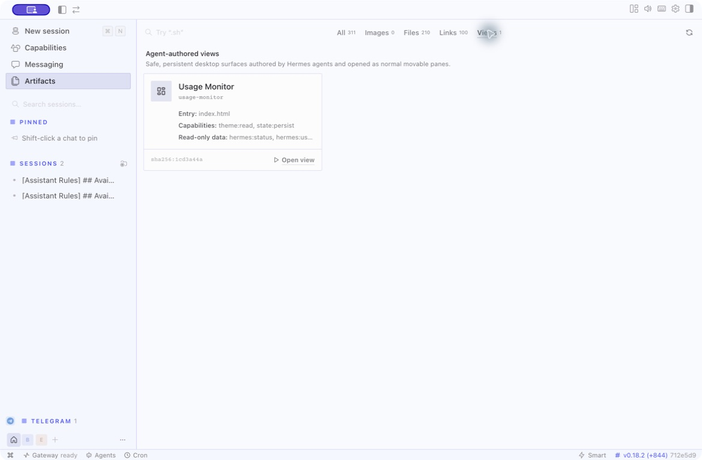
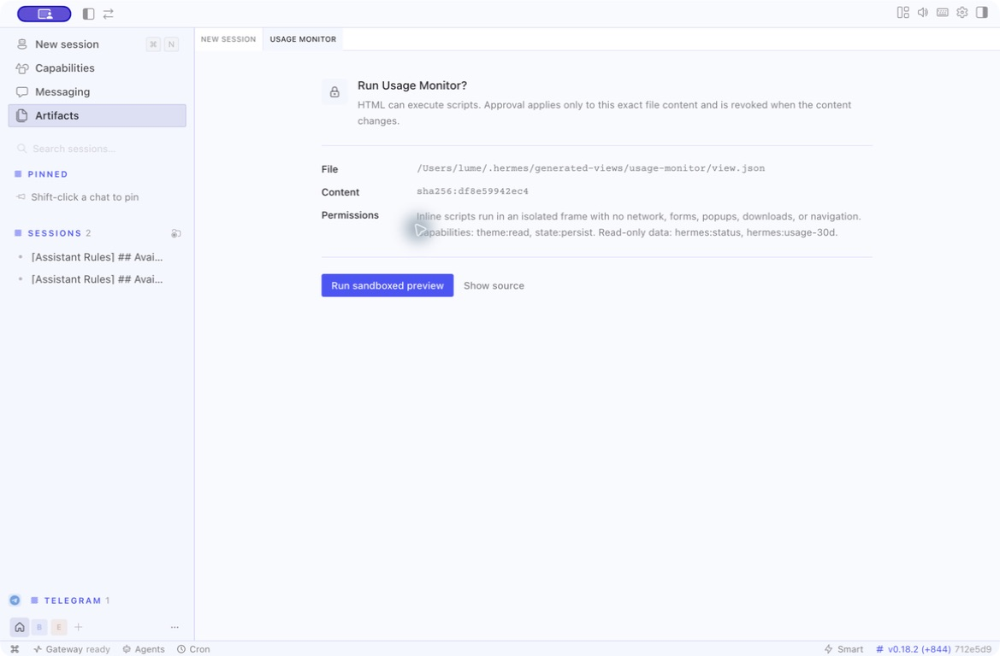
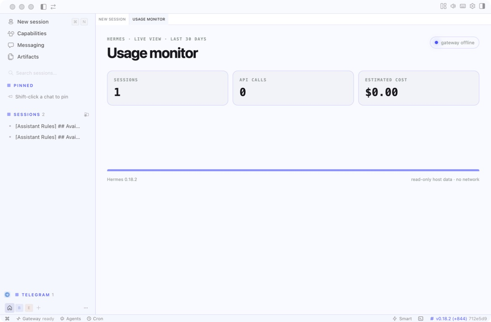

# Agent-authored desktop views

Hermes agents can author small interactive desktop surfaces without adding a
model tool or loading trusted plugin code. A generated view is a validated
`view.json` plus an HTML entry under `$HERMES_HOME/generated-views/<id>/`. The
Artifacts page discovers these documents and opens each one as a normal pane in
the existing contribution-driven layout tree.

## End-to-end flow

1. An agent uses its existing terminal/file abilities to write `view.json` and
   `index.html`.
2. Desktop reads both through the active profile's filesystem facade, validates
   the manifest and jailed entry, and hashes the manifest authority plus HTML.
3. Artifacts → Views shows the title, entry, capabilities, bindings, and digest.
4. Opening registers `generated-view:<id>` through the existing pane mirror.
   The layout tree adopts it, and later drag/split/tab placement persists in the
   same tree as core panes.
5. The iframe does not exist until the user approves the exact digest. Approved
   HTML runs with `sandbox="allow-scripts"`, an opaque origin, restrictive CSP,
   no referrer, restrictive Permissions Policy, and Electron frame-level
   network blocking.
6. A source, capability, or binding edit changes the digest and synchronously
   removes the active frame. Removing the directory unregisters the pane and
   prunes stale tree entries.

## Manifest v1

```json
{
  "version": 1,
  "id": "usage-monitor",
  "title": "Usage Monitor",
  "entry": "index.html",
  "capabilities": ["theme:read", "state:persist"],
  "bindings": ["hermes:status", "hermes:usage-30d"]
}
```

IDs are lowercase and match `^[a-z0-9][a-z0-9_-]{0,63}$`. Entries are relative,
traversal-jailed HTML paths. Unknown fields, capabilities, and bindings fail
closed. Approval state is renderer-owned and cannot be declared in the file.

## Bridge v1

Messages use `{ v: 1, type, requestId }`. The parent accepts events only from
the exact iframe window it created. Unknown or malformed messages are silently
dropped.

| Request | Required authority | Response |
|---|---|---|
| `hermes:getTheme` | `theme:read` | `hermes:theme { tokens }` |
| `hermes:getState` | `state:persist` | `hermes:state { state, version }` |
| `hermes:setState { state }` | `state:persist`; JSON ≤64 KB | `hermes:state` |
| `hermes:getData { bindingId }` | exact manifest binding from host allowlist | `hermes:data` |

The bridge exposes no general filesystem, network, plugin SDK, gateway, socket,
model, or renderer authority. The initial read-only binding allowlist contains a
sanitized gateway status snapshot and 30-day usage analytics.

## Authoring

The bundled `hermes-generated-views` skill includes single-file, themed
stateful, and usage-monitor templates. Generated views are intentionally
single-document surfaces: inline styles/scripts and `data:`/`blob:` images work;
CDNs and sibling assets do not. Localhost development previews remain on the
existing webview path for full multi-file development workflows.

## Desktop walkthrough

Artifacts discovers valid documents independently of recent-session artifact
indexing and makes their declared authority visible before they are opened.



The host constructs no authored iframe until the user approves the exact digest.
Editing the manifest or HTML destroys the running frame and returns the pane to
this gate with the new digest and authority summary.



Once approved, a view is an ordinary shell pane. This usage-monitor example was
dragged into the main tab stack, restarted with Hermes Desktop, and restored in
the same position with its read-only data bridge live.


