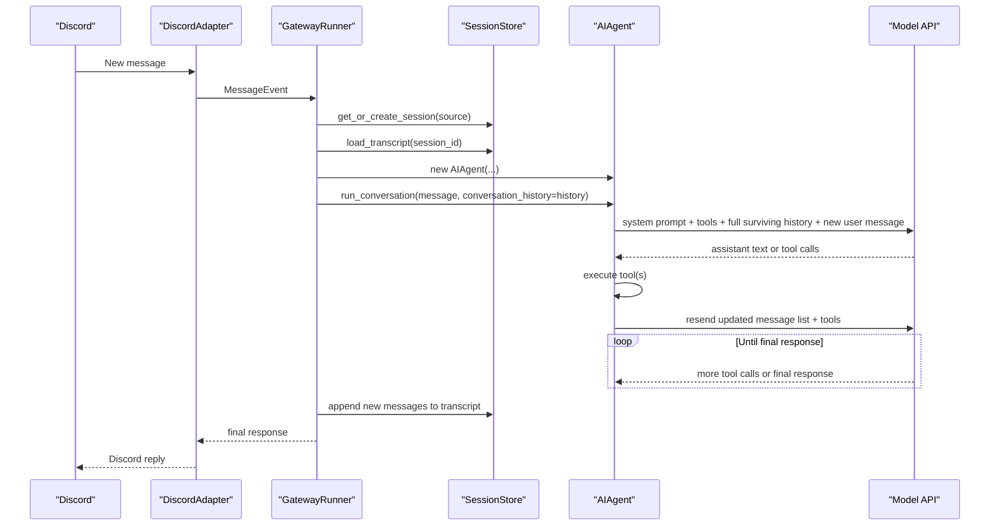

# Discord Usage Audit

## 1. Purpose

This document audits how Hermes behaves when used through Discord, with emphasis on:

- what enters model requests
- what does not enter model requests
- how session context grows over time
- how Discord features map onto Hermes session boundaries
- which implementation choices are most likely driving token and cost blowups

This audit is code-first. DeepWiki and the website docs were used as secondary references. When documentation and code disagree, the code should be treated as authoritative.

## 2. Executive Summary

Hermes does not appear to fetch large amounts of Discord chat history from Discord itself on every turn. The real cost driver is internal replay:

1. Every new Discord message creates a fresh `AIAgent`.
2. The gateway reloads the entire stored transcript for the active Hermes session.
3. The agent sends that transcript again on every model API call made during the current turn.
4. Prior tool calls and tool results remain in that transcript until reset or compression.

On this repository, the fixed request overhead is already large before any user conversation is counted:

- Project context prompt from `AGENTS.md` and related files: about `4,549` tokens.
- Base system prompt plus Discord/session context: about `4,870` tokens.
- `hermes-discord` tool schemas: about `10,180` tokens for the 40 exposed tools.

That yields roughly `15,050` tokens of fixed overhead before prior chat history, current user text, optional memory blocks, Honcho context, or any auxiliary tool-specific model call.

The single most important conclusion is this:

- Hermes is replaying its own saved session transcript, not pulling arbitrary Discord history from the Discord API.

The second most important conclusion is this:

- The current Discord defaults are optimized for capability, not for cost discipline.

## 3. Audit Method

The audit traced these paths:

- Discord ingress and message normalization in `gateway/platforms/discord.py`
- session key construction and transcript persistence in `gateway/session.py`
- gateway message handling and agent startup in `gateway/run.py`
- system prompt assembly in `run_agent.py` and `agent/prompt_builder.py`
- context compression in `agent/context_compressor.py`
- toolset sizing in `toolsets.py`
- Discord delivery and target discovery in `tools/send_message_tool.py`, `gateway/delivery.py`, and `gateway/channel_directory.py`

Secondary references:

- DeepWiki: [https://deepwiki.com/NousResearch/hermes-agent](https://deepwiki.com/NousResearch/hermes-agent)
- Docs: [website/docs/user-guide/messaging/discord.md](../website/docs/user-guide/messaging/discord.md), [website/docs/user-guide/sessions.md](../website/docs/user-guide/sessions.md), [website/docs/user-guide/messaging/index.md](../website/docs/user-guide/messaging/index.md)

## 4. Request Lifecycle for One Discord Turn



Important operational property:

- Normal tool execution does not itself replay the whole chat to the main model.
- Each main-model round trip inside the tool loop does replay the full current message list.
- Some tools make their own auxiliary LLM calls, but those calls usually use focused tool inputs rather than the full conversation transcript.

## 5. What Actually Enters a Discord Model Request

### 5.1 Always Included on Main Model Calls

For each main model API call, Hermes can include:

- the rebuilt system prompt
- the Discord session context prompt
- the full enabled tool schema list
- the surviving transcript for the active session
- the current user message
- optional prefill messages
- optional memory and user-profile blocks
- optional Honcho prefetch context

The loaded transcript is not limited to plain user and assistant text. It can include:

- assistant messages with `tool_calls`
- tool result messages
- mirrored cross-platform assistant deliveries
- compression summaries

That means expensive earlier steps can keep increasing the cost of later Discord turns.

### 5.2 Not Automatically Included

Hermes does not automatically include:

- arbitrary Discord channel history fetched live from Discord
- the full content of the message you replied to on Discord
- past Hermes sessions from other days or channels unless the model explicitly uses `session_search`
- raw Discord forum metadata beyond what the adapter derives from the current channel object

### 5.3 Tool Calls vs. Tool-Backed Model Calls

The distinction matters:

- `terminal`, `process`, `read_file`, `write_file`, `patch`, and most browser primitives do not call the LLM themselves.
- `web_extract`, `vision_analyze`, `browser_vision`, `session_search`, `mixture_of_agents`, and context compression can make extra model calls.

So the “every tool call is resending the chat logs” theory is not quite right. The accurate statement is:

- every main agent iteration resends the current transcript
- some LLM-backed tools add more model calls on top of that

## 6. Measured Fixed Overhead in This Repo

These measurements were taken from the current repository state.

### 6.1 Project Context Injection

`agent/prompt_builder.py` recursively loads `AGENTS.md` plus cursor and soul files into the system prompt. In this repository:

- root `AGENTS.md` size: `30,109` chars
- context-file prompt after truncation and framing: about `18,196` chars
- estimated token cost for that prompt block: about `4,549` tokens

This is a major fixed cost on every gateway turn because `gateway/run.py` does not set `skip_context_files=True`.

### 6.2 Base Prompt Before Conversation History

A representative Discord session prompt made of:

- agent identity
- loaded project context
- Discord platform hint
- session-context prompt

comes out to about `4,870` tokens before memory, Honcho, prefill messages, or conversation history.

### 6.3 Tool Schema Payload

The default `hermes-discord` toolset exposes 40 tools. Serializing the current tool schemas yields roughly:

- `40,722` chars
- about `10,180` tokens

This is sent with every main model call.

### 6.4 Practical Lower Bound

On this repo, the practical lower bound for a Discord model call is roughly:

- `~4,870` tokens for prompt/context framing
- `~10,180` tokens for tools

Total:

- `~15,050` tokens before conversation history

This is enough to make a long-lived Discord session expensive even if the conversation itself is modest.

## 7. Why Discord Usage Grows So Fast

### 7.1 Fresh Agent, Old Transcript

The gateway creates a new `AIAgent` for every incoming Discord message, but it also reloads the full active transcript and passes it into `run_conversation`. This means the session is logically continuous even though the agent object is fresh.

Cost implication:

- every new Discord turn starts by replaying the session again

### 7.2 Prior Tool Results Stay in Context

The gateway persists the full new message list from each turn, including tool-call structure and tool outputs. `run_agent.py` allows tool results up to `100,000` chars before truncation.

Cost implication:

- one large `terminal` or `web_extract` result can contaminate many future turns

### 7.3 Compression Is an Overflow Safety Valve, Not a Spend Governor

There are two relevant compression paths:

- in-agent context compression near the model context limit
- gateway “session hygiene” auto-compression for very large stored transcripts

Both trigger late by default:

- agent compression threshold defaults to `85%` of model context
- gateway hygiene defaults to `100,000` estimated transcript tokens or `200` messages

Cost implication:

- you can spend a lot of tokens long before compression activates

### 7.4 Shared Channel Sessions

For normal Discord server channels, the session key is effectively channel-scoped, not user-scoped.

Cost implication:

- if multiple people interact with Hermes in one channel, everyone inherits the same growing transcript

This is one of the clearest ways Discord usage can “absolutely destroy” spend.

### 7.5 Toolset Breadth

`hermes-discord` is the full core toolset. It includes:

- browser tools
- vision
- image generation
- mixture-of-agents
- cron tools
- send-message
- Home Assistant tools
- memory and session search

Cost implication:

- the tool schema block is large
- the model has access to expensive auxiliary paths it may invoke

## 8. Discord Feature Mapping

### 8.1 What Works Well

| Feature | Current State | Notes |
|---|---|---|
| DMs | Supported | Normal message flow works |
| Server channels | Supported | Mention-gated unless free-response is configured |
| Native slash commands | Supported | `/ask`, `/reset`, `/status`, `/stop`, etc. |
| Message replies | Partially supported | Hermes replies to the source message |
| Threads | Supported for message flow | Thread messages get their own thread-scoped session |
| Forum posts | Partially supported | Discord forum posts arrive as threads, so message handling works |
| Attachments | Supported | Images, audio, and files are cached or sent natively |
| Typing indicator | Supported | Refreshed during long-running work |
| Button approvals | Supported | Dangerous command approvals use Discord buttons |

### 8.2 What Is Missing or Weaker Than It Looks

| Feature | Current State | Impact |
|---|---|---|
| Live Discord history import | Not implemented | Costs come from Hermes transcripts, not Discord history fetches |
| Reply-context injection | Not implemented | Reply target ID is captured, but replied-to content is not added to model context |
| Auto-threading | Not implemented | Mentioned in the adapter docstring, but not present in code |
| First-class forum discovery | Not implemented | Channel directory does not enumerate forum posts/threads |
| Thread discovery in `send_message(action='list')` | Not implemented | Numeric thread IDs may work, but human discovery is poor |
| Explicit outbound thread metadata | Not implemented for Discord | Slack and Telegram have stronger thread/topic routing support |
| Accurate slash-thread typing | Partially wrong | Slash commands inside threads are labeled as `group`, not `thread` |
| Per-user DM isolation on Discord | Not implemented | All Discord DMs share one session key per bot assumption |

## 9. Discord-Specific Findings

### 9.1 Threads Are the Best Existing Isolation Unit

Inbound thread messages are treated as `chat_type="thread"` and use the thread ID as the session key payload. That gives each thread its own replay boundary.

Practical consequence:

- using one Discord thread per task is materially cheaper than using one shared channel forever

### 9.2 Forum Posts Work Indirectly, Not Intentionally

A forum post in Discord is effectively handled as a thread because the message channel is a `discord.Thread`.

Practical consequence:

- forum posts can isolate context well
- discovery, documentation, and targeting for them are incomplete

### 9.3 Slash Commands in Threads Lose Some Semantics

The slash-command event builder uses the thread channel ID, so the session is still separate, but it does not mark the source as a thread or preserve `thread_id`.

Practical consequence:

- prompt context is less accurate than regular message flow
- any future reset-by-type or routing logic can diverge

### 9.4 Shared Server Channels Are the Worst-Case Cost Pattern

Because session state is keyed at the channel level for normal server-channel traffic:

- all addressed conversations in that channel accumulate into one transcript
- all future addressed requests replay that transcript

Practical consequence:

- a “Hermes corner” channel with multiple users is expensive by design under current rules

## 10. Documentation and Reference Drift

Several references overstate or misframe current behavior.

### 10.1 Discord “Read Message History” for Context

The Discord setup docs describe the permission as needed “for context.” In the current implementation, context comes from Hermes’s own persisted transcript, not from Discord history fetches.

More accurate framing:

- the permission is useful for reply handling and channel operations
- it is not the source of the large prompt replay

### 10.2 Session Reset Expectations

The docs discuss shorter examples for messaging reset policies, including Discord-specific examples like `60` minutes. The shipped config example still defaults to `1440` idle minutes plus a daily reset.

Practical consequence:

- many users will believe Discord is short-lived by default when it is not

### 10.3 Auto-Threading Claim

`gateway/platforms/discord.py` advertises “Auto-threading for long conversations” in the class docstring. The implementation does not create or manage Discord threads automatically.

## 11. Observability Gaps

### 11.1 Gateway Session Token Counts Are Not Persisted

`GatewayRunner` calls `SessionStore.update_session(session_key)` without passing input or output token counts. As a result:

- `SessionEntry.total_tokens` is not meaningfully updated
- `/status` cannot be trusted as a cost indicator

This makes the usage problem harder to diagnose from inside Discord.

### 11.2 Session Hygiene Is Underdocumented

The gateway has a `session_hygiene` configuration path in code, but it is not surfaced in the main config example or user docs.

Practical consequence:

- the main spend-control knob for transcript size is not easy to discover

## 12. Recommendations

### 12.1 Highest-Value Config and Usage Changes

These do not require architectural changes.

1. Use one Discord thread or forum post per task.
   - Avoid long-lived shared channels for ongoing Hermes work.
   - This isolates transcripts and prevents channel-wide replay.

2. Shorten Discord session lifetime aggressively.
   - If you want a global messaging default, use `~/.hermes/config.yaml`:

```yaml
session_reset:
  mode: idle
  idle_minutes: 60
```

   - If you want a Discord-only override, use `~/.hermes/gateway.json`:

```json
{
  "reset_by_platform": {
    "discord": { "mode": "idle", "idle_minutes": 60 }
  }
}
```

3. Give Discord a smaller toolset than CLI.
   - Example:

```yaml
platform_toolsets:
  discord: [web, terminal, file, todo, memory]
```

This removes a large amount of schema overhead and reduces the chance of expensive tool choices such as `mixture_of_agents`.

4. Lower reasoning effort for messaging.
   - Example:

```yaml
agent:
  reasoning_effort: low
```

5. If you want prompt caching, pin Discord usage to OpenRouter + Claude.
   - Current prompt caching only auto-activates for Claude via OpenRouter.
   - If gateway inference resolves to Nous or another provider, you do not get that mitigation.

### 12.2 Highest-Value Code Changes

1. Add a gateway-specific option to skip project context files.
   - A Discord gateway turn should not automatically pay the same `AGENTS.md` tax as a local coding session unless explicitly requested.
   - Recommended shape:
     - `messaging.skip_context_files: true`
     - or `platform_context.discord.load_project_context: false`

2. Introduce a lighter default `hermes-discord` preset.
   - The current default is capability-maximal.
   - A better default for Discord would exclude browser, image generation, mixture-of-agents, and unrelated platform integration tools unless users opt in.

3. Make Discord session keying configurable.
   - Recommended modes:
     - `dm: per_chat`
     - `channel: per_channel`
     - `channel: per_user_per_channel`
     - `thread: per_thread`

   The current “shared channel transcript” model is too expensive for many Discord server workflows.

4. Store summarized tool outputs in transcripts by default.
   - Persist a compact tool-result summary plus a file/log pointer instead of replaying large raw outputs forever.
   - Keep full raw results in debug storage, not in the main replay path.

5. Lower gateway session-hygiene thresholds for messaging.
   - The current `100k`-token or `200`-message trigger is too late if the goal is cost control.
   - Messaging should target spend ceilings, not only overflow prevention.

6. Return token counts from `_run_agent` and persist them in `SessionStore.update_session`.
   - This fixes `/status`.
   - It also allows per-platform cost analysis and future auto-reset policies based on spend, not just time.

### 12.3 Discord Feature Completeness Changes

1. Fix slash commands in threads to preserve `chat_type="thread"` and `thread_id`.
2. Extend channel discovery to include active threads and forum posts.
3. Allow `send_message` and delivery routing to target threads by name, not only by raw ID.
4. Add optional reply-context fetch:
   - when a user replies to a prior message, include a compact quoted excerpt in the prompt
5. Remove or implement the “auto-threading” claim

### 12.4 Documentation Changes

1. Update Discord docs to say that Hermes reuses its own persisted transcripts rather than fetching Discord history for context.
2. Document that shared server channels create shared replay cost.
3. Surface `session_hygiene` in the user config docs and example config.
4. Clarify that the shipped reset default is still `1440` idle minutes unless the user changes it.

## 13. Recommended Implementation Order

If the goal is to reduce spend quickly, implement in this order:

1. Use Discord threads or forum posts for Hermes work.
2. Reduce the Discord toolset.
3. Shorten Discord idle reset to `60` minutes.
4. Pin Discord inference to OpenRouter Claude if prompt caching is desired.
5. Add gateway-level `skip_context_files`.
6. Fix token observability and session-cost reporting.
7. Redesign Discord session keying for shared channels.
8. Replace persisted raw tool outputs with summarized transcript entries.

## 14. Bottom Line

The high Discord usage is plausibly explained by the current architecture without assuming a Discord API history bug.

The dominant factors are:

- large fixed prompt overhead
- full transcript replay per Discord turn
- large persisted tool outputs
- channel-scoped sessions in shared Discord channels
- full-toolset schema payload on every call

If you do only three things, they should be:

1. isolate work into Discord threads or forum posts
2. cut the Discord toolset down substantially
3. stop injecting full project context files into messaging sessions by default
