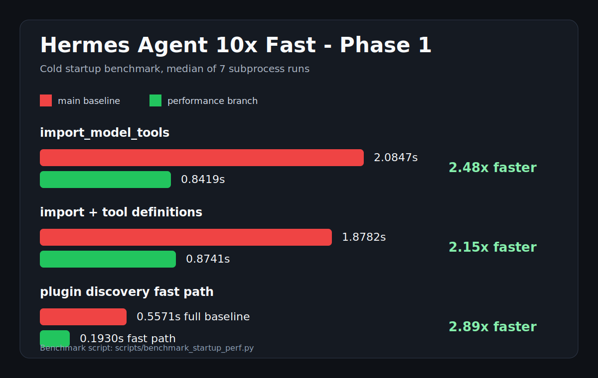

# Hermes Agent 10x Fast PR - Phase 1

Date: 2026-05-15

This PR is the first concrete performance pass from
`docs/performance-pr-candidates-2026-05-15.md`. The headline result is a
~2.15x faster cold `model_tools` import plus tool-schema startup path on this
Windows workstation, while preserving the full gateway/platform path for
callers that need it.

The "10x fast" target is still a multi-PR goal. This phase removes several
large startup costs and adds a repeatable benchmark so future PRs can keep
compounding the gains without guessing.

## Benchmark

Command:

```powershell
python scripts\benchmark_startup_perf.py -n 7
```

Baseline was measured from detached `main` at
`a1c316c6f664fa507bb43ea8f91519b390ed9f75` in a separate worktree.

| Case | main median | branch median | Speedup | Change |
| --- | ---: | ---: | ---: | ---: |
| `import_model_tools` | 2.0847s | 0.8419s | 2.48x | 59.6% faster |
| `import_and_get_tool_definitions` | 1.8782s | 0.8741s | 2.15x | 53.5% faster |
| `get_tool_definitions` | 0.0918s | 0.0898s | 1.02x | 2.2% faster |
| platform plugin discovery fast path | 0.5571s full baseline | 0.1930s fast path | 2.89x | 65.4% faster |

Visual summary:



## What Shipped

1. Deferred platform plugin imports outside normal model-tool startup.
   `model_tools` now calls `discover_plugins(include_platforms=False)`, while
   gateway/platform callers can still use the default full discovery.

2. Added an on-demand platform-plugin load path.
   `PluginManager.discover_and_load()` can start fast, then hydrate platform
   plugins later without forcing a restart.

3. Replaced AST parsing in built-in tool discovery.
   `tools/registry.py` now detects top-level `registry.register(...)` with a
   lightweight regex, avoiding per-file AST construction during discovery.

4. Made browser provider imports lazy.
   `tools/browser_tool.py` no longer imports cloud browser providers,
   `requests`, Camofox, `cfg_get`, or auxiliary LLM code during module import.

5. Preserved browser test patch surfaces while staying lazy.
   `call_llm` and `requests` remain patchable from `tools.browser_tool`, but
   they resolve the heavy modules only when used.

6. Made cloud browser requirement checks credential-gated.
   Provider classes are imported only when config or environment variables make
   a cloud browser path possible.

7. Made TTS availability checks lightweight.
   `check_tts_requirements()` now uses `importlib.util.find_spec()` for SDK
   presence instead of importing `edge_tts`, `aiohttp`, OpenAI, ElevenLabs, or
   Mistral just to expose schemas.

8. Kept TTS tests compatible with monkeypatched lazy import helpers.
   Production uses `find_spec`; tests that patch `_import_edge_tts` and friends
   still control availability.

9. Made Yuanbao schema checks avoid importing gateway platform adapters.
   `_check_yuanbao()` only consults the active adapter if the Yuanbao platform
   module is already loaded, avoiding `aiohttp`/gateway imports during CLI
   startup.

10. Added a repeatable startup benchmark.
    `scripts/benchmark_startup_perf.py` measures cold subprocess timings for
    import, schema assembly, and plugin discovery paths.

## Follow-Up PRs Toward 10x

1. Generate a persistent tool manifest so schema metadata can load without
   importing every tool module.
2. Cache plugin manifest scans by directory fingerprint and entry-point
   metadata.
3. Memoize toolset resolution by registry generation.
4. Keep prompt-cache prefixes stable by moving volatile prompt data out of
   system prompts.
5. Extend the skill snapshot cache to external skill dirs.
6. Batch session message persistence into one SQLite transaction per turn.
7. Denormalize session previews and last-active metadata.
8. Debounce config/MCP reloads in the TUI gateway.
9. Make `/goal` continuation checks adaptive instead of every turn.
10. Add CI perf-budget smoke tests for the startup benchmark.

## Verification

```powershell
python -m py_compile hermes_cli\plugins.py model_tools.py tools\registry.py tools\browser_tool.py tools\tts_tool.py tools\yuanbao_tools.py scripts\benchmark_startup_perf.py
python -m pytest tests\hermes_cli\test_plugins.py tests\tools\test_registry.py -q -k "platform_plugins_can_be_deferred_then_loaded or imports_only_self_registering_modules or ignores_indented_register_calls or skips_mcp_tool"
python -m pytest tests\tools\test_browser_cloud_fallback.py tests\tools\test_browser_cdp_override.py tests\tools\test_browser_content_none_guard.py -q
python -m pytest tests\tools\test_tts_gemini.py tests\tools\test_tts_mistral.py tests\tools\test_tts_piper.py tests\tools\test_tts_dotenv_fallback.py -q
python -m pytest tests\tools\test_yuanbao_tools.py -q
python scripts\benchmark_startup_perf.py -n 7
```
