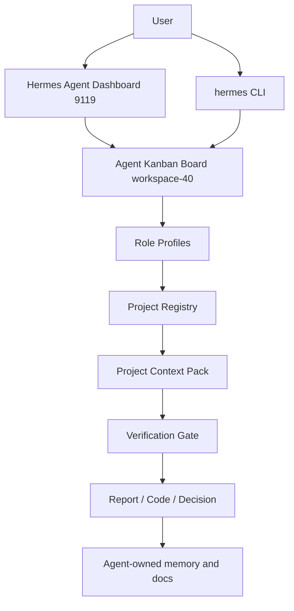

# 02 Architecture

## Target State

```text
Hermes Agent
  .hermes/
    config.yaml
    .env
    profiles/
    skills/
    kanban/
    sessions/
    logs/

  docs/hermes-agent-standalone/
    registry
    architecture
    roles
    Obsidian bridge
    compliance
```

Hermes Agent owns all new orchestration. Old systems are not imported as services.

## Boundary Contract

| ID | Rule | Enforcement |
|---|---|---|
| B-01 | No runtime call to Hermes Labs `7421` | use direct filesystem project scan instead |
| B-02 | No runtime call to HermesNous `7422` | use Agent-owned docs and registry |
| B-03 | No writes into HermesNous or Hermes Labs | all new artifacts live in Hermes Agent |
| B-04 | No symlink from Agent `.hermes` to old systems | use copied/exported knowledge packs only |
| B-05 | No secret in docs | docs contain paths/counts/status only |
| B-06 | Per-project writes require explicit later task | onboarding registry is read-only |

## Data Ownership

| Data | Owner | Storage |
|---|---|---|
| Agent config and keys | Hermes Agent | `.hermes/config.yaml`, `.hermes/.env` |
| Project registry | Hermes Agent | `docs/hermes-agent-standalone/03-project-registry.md` |
| Role descriptions | Hermes Agent | profiles + `04-roles-skills-kanban.md` |
| Work tracking | Hermes Agent | kanban board `workspace-40` |
| Reusable knowledge | Hermes Agent | standalone Obsidian bridge/export packs |
| Historical knowledge | HermesNous | read-only reference, no runtime dependency |
| Historical runtime memory | Hermes Labs | read-only reference, no runtime dependency |

## Operating Flow



## Role Routing

Hermes Agent should replace the old `conductor-router + nous-conductor` split with one local operating rule:

1. classify phase;
2. classify domain;
3. choose one primary role profile;
4. optionally attach one domain skill;
5. create or update kanban task;
6. run verification before delivery.

## Phase Model

| Phase | Meaning | Required Gate |
|---|---|---|
| define | convert request into scope and acceptance criteria | no ambiguous owner/action |
| plan | issue checklist and dependencies | all issues have owner role and verification |
| build | implementation or artifact production | changed files listed |
| test | local checks | command output or route status captured |
| review | risk, regression, and boundary check | no forbidden dependency |
| ship | final handoff | compliance table 100/0 |

## WOW Operator Experience

The best user experience is not another hidden daemon. It is a visible command center:

- dashboard chat for direct work;
- kanban board for execution state;
- project registry for context;
- role profiles for accountability;
- Obsidian bridge for long-term knowledge;
- numeric compliance for every phase.

## Localhost/VPS Rule

Before any delivery:

| Target | Required Check |
|---|---|
| localhost dashboard | `curl http://127.0.0.1:9119/` and `/chat` |
| local docs/artifacts | file existence and grep for required headers |
| kanban | `hermes kanban boards list` and task/board status |
| VPS | only when a VPS host is part of the issue; otherwise mark as not applicable |

