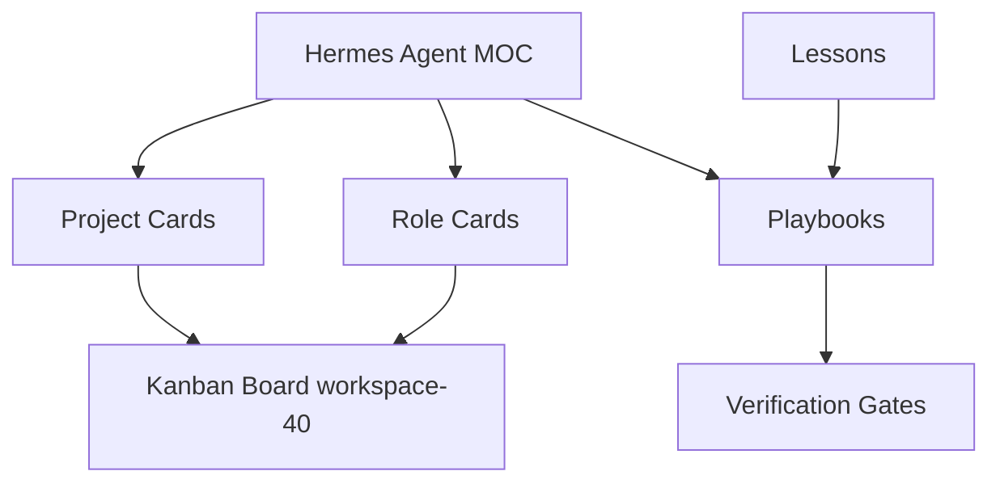

# 05 Obsidian Bridge

## Superseded Decision

The original standalone vault decision below was superseded on 2026-05-24.
User chose migration option 1: restore/rename the existing HermesNous graph as
the HermesAgent Knowledge Center.

Current source of truth:

```text
~/ObsidianVault/HermesAgent
```

This vault is now based on the restored HermesNous graph, with real files copied
from:

```text
~/Documents/Viber Project/Tech Tools/_archived-hermes-20260524/HermesNous.retired-20260524
```

The short-lived generated HermesAgent vault was moved to migration backup and is
not the Knowledge Center source of truth.

## Current Bridge Model

| Layer | Storage | Rule |
|---|---|---|
| Knowledge Center hub | `~/ObsidianVault/HermesAgent/MOC.md` | single entry point |
| AI memory contract | `~/ObsidianVault/HermesAgent/AI_MEMORY.md` | session-start memory |
| Graph routing | `docs/OBSIDIAN_LINK_INDEX.md`, `docs/AI_SKILL_ROUTER.md`, `docs/SKILL_GRAPH.md` | route before writing |
| Raw sources | `sources/`, `review-queue/` | unreviewed input and lineage |
| Durable knowledge | `knowledge/`, `lessons/`, `patterns/`, `playbooks/`, `training-packs/`, `skills/` | reviewed/promoted layers |

## Merge-First Rule

Before creating a new note, scan the source-of-truth hubs and existing layer
files. If the new item is near an existing note, append/merge with source
lineage instead of creating another disconnected file.

## Historical Decision

The following was the earlier standalone-vault design and is retained only as
audit history.

## Created Vault

```text
~/ObsidianVault/HermesAgent
```

This standalone interpretation is no longer the active rule.

## Bridge Model

| Layer | Storage | Rule |
|---|---|---|
| Agent runtime | `Hermes Agent/.hermes` | private, gitignored |
| Agent docs | `Hermes Agent/docs/hermes-agent-standalone` | reviewed source of truth |
| Obsidian vault | `~/ObsidianVault/HermesAgent` | readable knowledge workspace |
| Legacy HermesNous vault | `~/ObsidianVault/HermesNous` | historical reference only |

## Import Policy

| Source | Import Method | Runtime Link |
|---|---|---:|
| HermesNous skills | copy selected concepts into Agent docs/skills | no |
| HermesNous lessons/patterns/playbooks | export reviewed packs into Agent vault | no |
| Hermes Labs atlas/memory | do not import live memory; use direct project scan | no |
| Project `.hermes` folders | read-only scan into Agent registry | no writes |

## Obsidian Note Types

| Note Type | Purpose | Required Fields |
|---|---|---|
| Project card | one project summary | owner role, risk, path, stack, commands |
| Role card | role operating contract | skill, allowed files, forbidden systems |
| Decision note | architectural decision | context, options, decision, verification |
| Playbook | repeatable workflow | trigger, steps, verification, rollback |
| Lesson | incident or learning | source, lesson, prevention, evaluation |

## Graph Design



## Anti-Drift Rules

| Rule | Reason |
|---|---|
| O-01 no symlink to HermesNous | prevents old doc drift from becoming Agent truth |
| O-02 no symlink to Hermes Labs | prevents runtime memory coupling |
| O-03 no vault root dumping | keeps graph readable |
| O-04 every imported note gets source and import date | makes lineage auditable |
| O-05 imported knowledge is draft until reviewed | prevents stale legacy knowledge from becoming truth |

## Creation Checklist

| Step | Status |
|---|---:|
| create `~/ObsidianVault/HermesAgent` | 100 |
| add `MOC.md` | 100 |
| add folders `projects`, `roles`, `playbooks`, `lessons`, `decisions`, `imports`, `reports` | 100 |
| avoid symlinks to legacy systems | 100 |
| keep import folder for reviewed copies only | 100 |
| open in Obsidian and verify graph visually | manual user check |
