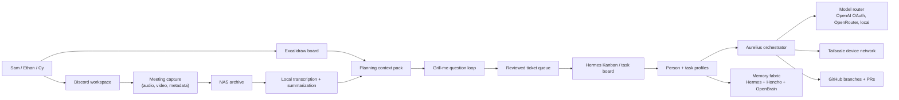

# Aurelius OS Multi-User Buildout Implementation Plan

> **For agentic workers:** REQUIRED SUB-SKILL: Use superpowers:subagent-driven-development (recommended) or superpowers:executing-plans to implement this plan task-by-task. Steps use checkbox (`- [ ]`) syntax for tracking.

**Goal:** Turn the current Sam-centered Aurelius/Hermes setup into a shared, approval-driven, multi-person agent workspace for Sam, Ethan, Cy, and future collaborators.

**Architecture:** Hermes remains the agent runtime and gateway spine. Aurelius becomes the opinionated coordination layer: profiles, shared memory routing, Discord meeting capture, a visible task board, device-network orchestration, and a small planning UI that converts group conversations into reviewed tickets before agents act.

**Tech Stack:** Hermes Agent, Discord gateway, Hermes profiles, Honcho, OpenBrain MCP, local models, Tailscale, NAS storage, Kanban/task tooling, cron, Excalidraw planning artifacts, Markdown docs, GitHub pull requests.

---

## Source Inputs

| Input | Location | Notes |
|---|---|---|
| Meeting transcript | Provided in the Codex thread on 2026-05-21 Alaska time | Treated as the source of truth because the corrected `3120 E 41st Ave 6` audio file was not visible in the local filesystem scan. |
| Whiteboard | `/Users/samuelmchargue/Documents/Untitled-2026-05-21-1917.excalidraw` | The only `.excalidraw` file found on the machine. |
| Existing repo | `/Users/samuelmchargue/.hermes/hermes-agent` | Current branch contains many unrelated local edits, so implementation should stage only files touched by a specific task. |

## North Star

Aurelius should feel like a shared command system: friends can join, talk through ideas, draw on a board, and have the system turn that context into a clear backlog. Agents can prepare work and propose options, but product changes move through explicit approval, tests, and GitHub PRs.

The system should not become a giant autonomous blob. It needs visible boundaries: who owns a profile, where memories live, which model is allowed to spend money, which device is doing work, what task is being executed, and what must wait for human review.

## Principles

1. **PRs before updates.** GitHub is the shared source of truth. Agents can prepare branches and draft PRs, but shared behavior changes should not land silently.
2. **Profiles are first-class.** Sam, Ethan, Cy, tasks, recurring jobs, and service modes all need separable profile identity, memory scope, and model policy.
3. **Shared does not mean leaked.** Personal memories stay personal unless intentionally promoted into shared project memory.
4. **Conversation becomes tickets.** Discord calls, Excalidraw notes, and audio transcripts become candidate tickets with acceptance criteria, not immediate side effects.
5. **Local-first where possible.** OpenBrain, local models, NAS processing, and Tailscale devices should carry routine work before paid APIs are used.
6. **Respectful personas only.** Replace demeaning or identity-targeted persona requests with respectful service-mode profiles such as `concierge`, `operator`, or `assistant`.
7. **Test first for build work.** New behavior gets acceptance criteria and tests before implementation.

## System Map

## Ubiquitous Language

| Term | Meaning |
|---|---|
| Aurelius | The shared operating layer built on top of Hermes. |
| Hermes | The base agent runtime, gateway, tools, profiles, cron, and task execution system. |
| Profile | A person, task, or recurring-job identity with separate config, memory policy, model policy, and tool permissions. |
| Personal memory | Private memory scoped to one human or one profile. |
| Shared memory | Project-level memory deliberately visible to the group. |
| OpenBrain | Local, single-brain memory/MCP system running in Docker. |
| Honcho | API-backed profile-aware memory service, primarily for Sam unless other users bring their own keys. |
| Capture pack | A bundle of meeting audio/video/metadata, transcript, whiteboard export, and summary. |
| Grill loop | A structured question flow that keeps asking clarifying questions until the next task is precise enough to build. |
| Ticket | A reviewed unit of work with owner, scope, acceptance criteria, model budget, and approval state. |
| Operator mode | A respectful fast-response service persona for routine execution. |
| Device node | A Mac, phone, laptop, or server reachable through Tailscale and registered for agent work. |

## Phase 0: Freeze the Conversation Into Project Docs

**Outcome:** The group has a durable source-of-truth folder before code changes begin.

**Files:**
- Create: `docs/aurelius/README.md`
- Create: `docs/aurelius/ubiquitous-language.md`
- Create: `docs/aurelius/source-notes/2026-05-21-whiteboard-and-call.md`

- [ ] Create `docs/aurelius/README.md` with the product north star, status, owners, and links to the source notes.
- [ ] Create `docs/aurelius/ubiquitous-language.md` using the language table above.
- [ ] Create `docs/aurelius/source-notes/2026-05-21-whiteboard-and-call.md` with a cleaned summary of the transcript and Excalidraw notes.
- [ ] Verify the docs do not include secrets, raw tokens, private email addresses, or demeaning persona language.
- [ ] Commit only the three docs files.

## Phase 1: Profiles, Identity, and Access

**Outcome:** Sam, Ethan, Cy, task profiles, and recurring-job profiles can be represented without mixing memories or credentials.

**Candidate files to inspect first:**
- `hermes_cli/profiles.py`
- `hermes_cli/main.py`
- `gateway/run.py`
- `tests/hermes_cli/test_profiles.py`
- `tests/hermes_cli/test_profile_distribution.py`
- `plugins/memory/honcho/`

- [ ] Document the current profile lifecycle: create, switch, export credentials, gateway profile behavior, and update behavior.
- [ ] Add a profile policy model covering owner, role, allowed tools, memory scope, budget class, and default model route.
- [ ] Add tests proving a person profile and a task profile resolve separate `HERMES_HOME` paths and do not share private config by default.
- [ ] Add a migration helper that can create `sam`, `ethan`, `cy`, `shared`, and `operator` profile skeletons without copying secrets.
- [ ] Add a profile status command that shows active profile, memory backends, model route, allowed device nodes, and pending tickets.

## Phase 2: Memory Fabric

**Outcome:** Hermes, Honcho, OpenBrain, local files, and NAS artifacts have clear routing rules.

**Candidate files to inspect first:**
- `plugins/memory/`
- `plugins/memory/honcho/`
- `plugins/context_engine/`
- `tools/memory_tool.py`
- `tests/agent/test_memory_provider.py`
- `tests/agent/test_memory_session_switch.py`

- [ ] Write `docs/aurelius/memory-routing.md` defining private, shared, task, and archival memory.
- [ ] Add a memory-scope field to profile/task metadata.
- [ ] Add tests proving personal memories are not returned in shared profile context unless promoted.
- [ ] Add an OpenBrain adapter spike that can query the local Docker MCP service through a feature flag.
- [ ] Add a capture-pack importer that stores transcript summaries as shared project memory and raw audio/video as NAS references.

## Phase 3: Discord Collaboration and Meeting Capture

**Outcome:** The Discord workspace becomes the live planning surface: chat replies, call capture, summaries, timelines, and tickets.

**Candidate files to inspect first:**
- `gateway/platforms/discord.py`
- `tools/discord_tool.py`
- `tools/send_message_tool.py`
- `gateway/channel_directory.py`
- `tests/gateway/test_discord_*`
- `scripts/discord-voice-doctor.py`

- [ ] Confirm the `Aurelius Fan Club` guild/channel IDs and set a safe Discord home channel.
- [ ] Add a `/aurelius status` or equivalent command that posts the current profile, board, and next planning step.
- [ ] Add a call-session detector for configured voice channels.
- [ ] Implement capture-pack metadata for call start, participants, channel, start time, end time, audio path, video path, and Excalidraw link.
- [ ] Store raw media to the NAS path configured for Aurelius captures.
- [ ] Run local transcription after calls and attach a short summary to the Discord thread.
- [ ] Convert summary action items into candidate tickets, never active tickets, until approved.
- [ ] Add tests for channel authorization, call metadata creation, and candidate-ticket creation.

## Phase 4: Ticket System and Approval Board

**Outcome:** Conversations become work items the group can approve, assign, and track.

**Candidate files to inspect first:**
- `hermes_cli/kanban.py`
- `hermes_cli/kanban_db.py`
- `tools/kanban_tools.py`
- `plugins/kanban/`
- `tests/hermes_cli/test_kanban_*.py`
- `tests/tools/test_kanban_tools.py`

- [ ] Extend the task schema with source, profile owner, shared/private flag, acceptance criteria, budget class, and approval state.
- [ ] Add candidate-ticket creation from transcript summaries and whiteboard notes.
- [ ] Add an approval flow: proposed -> clarified -> approved -> in progress -> PR opened -> merged/done.
- [ ] Add a "2 out of 3" review policy as a configurable option, not a hard-coded rule.
- [ ] Add tests for queue counts so broken dashboards cannot show zero when hundreds of tasks exist.
- [ ] Add a GitHub PR link field to completed or in-review tickets.

## Phase 5: Device Network and Model Routing

**Outcome:** Aurelius can see available devices, know which models run where, and avoid accidental shared API-account misuse.

**Candidate files to inspect first:**
- `tools/environments/`
- `tools/code_execution_tool.py`
- `hermes_cli/model_switch.py`
- `agent/credential_pool.py`
- `tests/agent/test_credential_pool.py`
- `tests/hermes_cli/test_model_provider_persistence.py`

- [ ] Write `docs/aurelius/device-network.md` describing Mac Mini, MacBook, iPhone app, future laptops/phones, NAS, and Tailscale.
- [ ] Add a device inventory record with hostname, Tailscale name, capabilities, local model set, and current availability.
- [ ] Add a model policy that prevents shared users from spending Sam's paid API keys unless explicitly allowed.
- [ ] Add "smart" and "fast" local model slots per device, updated by the existing Tuesday model benchmark job.
- [ ] Add a broken-device dashboard test for the networking devices tab.
- [ ] Add inactivity-aware background task assignment that respects the 30-minute local-computer-use rule.

## Phase 6: Simple UI for Humans

**Outcome:** The group has one plain, usable surface for profiles, devices, tickets, and decisions.

**Candidate files to inspect first:**
- `web/src/App.tsx`
- `web/src/pages/ChatPage.tsx`
- `web/src/pages/EnvPage.tsx`
- `ui-tui/`
- `tests/hermes_cli/test_web_ui_build.py`

- [ ] Create an Aurelius dashboard route with tabs for Board, Profiles, Devices, Captures, and Decisions.
- [ ] Keep the UI dense and operational: no landing page, no decorative hero, no vague marketing copy.
- [ ] Add a "question card" planning mode that shows one grill-loop question, records the answer, and advances to the next question.
- [ ] Add a comparison view for generated options so humans can choose one of several implementation/design candidates.
- [ ] Add build and browser checks for desktop and mobile widths.

## Phase 7: Planning Loop

**Outcome:** The system can ask the group sharper questions before building.

**Files to create:**
- `docs/aurelius/grill-loop.md`
- `docs/aurelius/question-bank.md`

- [ ] Define question categories: product intent, users, permissions, memory, data retention, device access, UI, budget, tests, and launch criteria.
- [ ] Add a `/grill` command plan for Discord that starts a focused question session.
- [ ] Add a local HTML fallback for question-card sessions when Discord screen sharing is enough.
- [ ] Convert answers into updated docs and candidate tickets.
- [ ] Add a rule that unclear tickets return to the grill loop instead of being assigned.

## Phase 8: Startup Sequence and Brand Surface

**Outcome:** The "Aurelius Artificial Intelligence Systems -> AAIS" boot sequence has a buildable design spec.

**Files to create:**
- `docs/aurelius/startup-sequence.md`

- [ ] Preserve the visual direction: dark command system, photorealistic Roman bust, restrained red scans, storm/sea audio, small terminal diagnostics, "Let There Be Order."
- [ ] Split the spec into asset, animation, audio, and integration tasks.
- [ ] Add a prototype task for a full-screen boot scene before the app appears.
- [ ] Add accessibility criteria: skip animation, reduced motion, no required audio.

## Phase 9: Security, Privacy, and Operations

**Outcome:** The shared system is useful without becoming reckless.

**Candidate files to inspect first:**
- `gateway/pairing.py`
- `gateway/slash_access.py`
- `tools/approval.py`
- `tests/tools/test_approval*.py`
- `SECURITY.md`

- [ ] Add a privacy matrix for personal memory, shared memory, raw call media, transcripts, model credentials, and device access.
- [ ] Require explicit user consent before adding a new device node.
- [ ] Require explicit owner consent before using paid API credentials for another profile.
- [ ] Add retention settings for raw Discord recordings.
- [ ] Add audit logs for profile switches, task approvals, device access, and PR creation.
- [ ] Add an emergency stop procedure for gateway capture and background workers.

## First Build Slice

Start with a documentation-plus-readiness slice:

1. Land this plan and README link.
2. Send the Discord readiness message.
3. Create `docs/aurelius/README.md`, `ubiquitous-language.md`, and source notes.
4. Add profile skeleton generation for `sam`, `ethan`, `cy`, `shared`, and `operator`.
5. Add the candidate-ticket schema without changing existing task execution.
6. Add the Discord `/aurelius status` command.

This order gives the group something real to review while keeping the agent from making irreversible product decisions too early.

## Acceptance Checklist

- [ ] The group can point to one plan and one README section as the shared source of truth.
- [ ] The Excalidraw notes and transcript have been summarized into durable docs.
- [ ] The plan avoids raw secrets and avoids demeaning persona language.
- [ ] A Discord message says the plan is ready and building can start after approval.
- [ ] All future implementation begins from approved tickets with tests and PRs.
