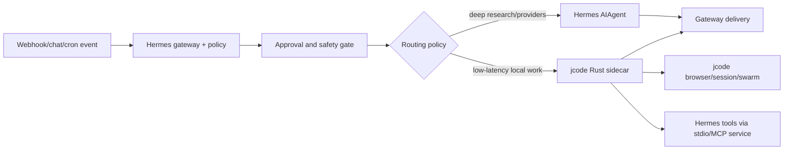

# Hermes/jcode mother repo blueprint

Date: 2026-05-23 PDT

## Decision

Build a bridge-first mother repo, not a fork-merge. The combined tool should
feel like jcode when latency matters and Hermes when autonomy, webhooks,
research breadth, and policy matter.

The split:

- jcode is the hot Rust execution sidecar: low-latency TUI, persistent local
  server, browser/session feel, swarm coordination, and performance-critical
  loops.
- Hermes is the orchestration and autonomy layer: webhooks, messaging gateway,
  provider-rich research, plugins, cron, memory-provider integrations,
  approvals, and update compatibility gates.
- The mother repo owns the contracts, routing policy, and glue. It should not
  edit either upstream directly for normal integration work.

## Why this beats a merged fork

A merged source tree would be fast to prototype and painful forever. Hermes and
jcode have different languages, release mechanics, auth/provider stacks, and UI
models. Pulling future upstream updates into a fork that rewrites internals on
both sides would repeatedly recreate the same merge conflicts.

A mother repo with pinned upstreams and versioned contracts has better
properties:

- Upstream bumps are mechanical: update SHA, run Graphify, run contract gates,
  inspect the report.
- Bridge code can evolve independently of Hermes and jcode internals.
- The Rust hot path remains Rust. Hermes does not need to become Rust to
  benefit from jcode's startup and TUI work.
- Hermes remains the policy owner for webhooks, account actions, and
  sensitive-data boundaries.

## Proposed repo layout

```text
mother-agent/
|-- upstreams/
|   |-- hermes/                  # submodule or subtree: NousResearch/hermes-agent
|   `-- jcode/                   # submodule or subtree: 1jehuang/jcode
|-- bridges/
|   |-- hermes-plugin-jcode/      # current plugins/jcode_bridge lifted out
|   |-- jcode-tool-hermes/        # Rust client for Hermes service calls
|   |-- hermes-mcp-server/        # stdio MCP wrapper for jcode's MCP manager
|   |-- browser-provider/         # future common browser provider adapter
|   `-- memory-sync/              # future one-way then two-way memory bridge
|-- contracts/
|   |-- jcode_bridge/v1/          # current portable schemas
|   |-- hermes_service/v1/        # reverse jcode -> Hermes service schemas
|   |-- hermes_mcp/v1/            # jcode-facing MCP transport schemas
|   |-- browser_provider/v1/
|   |-- memory_event/v1/
|   `-- outbound_action/v1/
|-- tests/
|   |-- contract/
|   |-- smoke/
|   `-- fixtures/
|-- scripts/
|   |-- upstream-sync
|   |-- graphify-both
|   `-- release-bundle
`-- docs/
    |-- architecture.md
    |-- routing-policy.md
    |-- safety-policy.md
    `-- upstream-sync.md
```

Submodules are best when exact upstream SHAs matter more than contributor
ergonomics. Subtrees are best when contributors dislike submodule workflow. The
key rule is the same either way: bridge code lives outside upstream directories.

## Current portable boundary

Hermes now includes two versioned boundaries.

Hermes -> jcode:

```text
contracts/jcode_bridge/v1/
|-- README.md
|-- debug_command.schema.json
|-- debug_response.schema.json
|-- run_json.schema.json
|-- run_ndjson_event.schema.json
|-- run_ndjson_stream.schema.json
`-- upstream_sync_report.schema.json
```

The Hermes plugin validates these artifacts during `jcode_contract_check`, and
the same schemas can be consumed by a mother repo, Rust tests, CI jobs, or
external bridge clients.

`plugins/jcode_bridge/contracts.py` remains the stdlib Python implementation of
the same boundary. The schemas are the portable contract. The Python validators
are the Hermes-local enforcement layer.

jcode -> Hermes:

```text
contracts/hermes_service/v1/
|-- README.md
|-- service_request.schema.json
`-- service_response.schema.json
```

`plugins/jcode_bridge/hermes_service.py` implements a newline-JSON service
contract for selected Hermes tools. Its default allowlist is deliberately small:
`web_search`, `web_extract`, `session_search`, and `memory`. Higher-side-effect
tools such as `send_message` require explicit operator allowlisting and
confirmation fields.

`bridges/jcode-tool-hermes/` is the first Rust-side caller for that service. It
is dependency-free and keeps the call path simple: start the Hermes service
wrapper, send one request line, read one response line. This can be adapted into
a native jcode `Tool` later without changing the contract.

`bridges/hermes-mcp-server/` exposes the same `hermes-service.v1` boundary as a
small dependency-free stdio MCP server. jcode already has an MCP manager, so
this is the first no-upstream-patch route for jcode to call Hermes services as
`mcp__hermes__...` tools.

jcode-facing MCP transport:

```text
contracts/hermes_mcp/v1/
|-- README.md
|-- initialize_response.schema.json
|-- tools_list_response.schema.json
`-- tools_call_response.schema.json
```

The MCP contract is deliberately separate from `hermes-service.v1`: MCP proves
that jcode can discover and call the bridge; the service contract proves what
Hermes dispatch receives and returns.

## Control flow



Interactive local work should start in jcode when speed and UI matter. Remote
events should start in Hermes when auth, webhooks, delivery, and policy matter.
The routing policy decides when one side calls the other.

## Routing policy

Use jcode first for:

- local interactive coding where TUI latency and persistent sessions matter
- browser workflows that depend on jcode's profile/session model
- same-repo swarm work and file-change awareness
- low-latency search or simple fetch tasks

Use Hermes first for:

- incoming webhooks and external messaging platforms
- deep research that benefits from multiple providers or extraction backends
- cron/background tasks, fanout, and delivery workflows
- plugin-heavy operations or memory-provider integrations
- anything requiring explicit approval, audit, or policy enforcement before
  contacting people or handling sensitive private-person data

The first implemented bridge is Hermes -> jcode. The first reverse bridge is
now a local newline-JSON Hermes service that jcode can call for selected Hermes
capabilities without importing Hermes Python internals.

## Upstream update gate

For every Hermes or jcode bump:

1. Update the pinned upstream SHA.
2. Run Graphify for both upstreams.
3. Run `scripts/jcode_bridge_compat.py`.
4. Run `scripts/jcode_bridge_smoke.py`.
5. Run `scripts/jcode_bridge_upstream_report.py --smoke`.
6. Run `scripts/hermes_service_bridge.py check`.
7. Run `python3 bridges/hermes-mcp-server/hermes_mcp_server.py --check --live`.
8. Run `scripts/jcode_bridge_latency_probe.py --iterations 50`.
9. Run any mother-repo contract tests against `contracts/*/v*`.
10. Run smoke routes:
   - Hermes webhook -> jcode sidecar
   - jcode local task -> Hermes research tool
   - browser/profile task with explicit outbound-action approval
   - memory read/write sync dry run
11. Record the generated report next to the upstream SHA bump.

If a contract breaks, prefer one of these in order:

1. Add adapter logic in bridge code.
2. Version the contract from `v1` to `v2` and support both during migration.
3. Carry a tiny patch queue against one upstream only when no public boundary
   can support the integration.

Do not silently update fixtures to match a breaking upstream without also
updating the schema and docs. Fixtures are canaries, not wallpaper.

## Safety boundary

The combined tool should be powerful without becoming invisible. Hermes should
remain the owner of approval semantics for:

- outbound human contact: DMs, posts, replies, texts, calls, emails
- private personal-data lookup: personal phone numbers, home addresses,
  personal email, SSN, date of birth, or similar identity data
- authenticated browser form submission on social, financial, health, job, or
  government sites

jcode can execute the approved work quickly. Hermes decides whether the work is
approved, logs the confirmation, and preserves the route-level policy.

## Implementation phases

Phase 1 is already scaffolded in Hermes:

- `plugins/jcode_bridge/` provides `jcode_run`, `jcode_status`,
  `jcode_contract_check`, direct debug-socket execution, server startup retry,
  webhook `dispatch: jcode`, and safety confirmation gates.
- `contracts/jcode_bridge/v1/` provides portable JSON Schema artifacts.
- `contracts/hermes_service/v1/` provides reverse-service JSON Schema
  artifacts.
- `contracts/hermes_mcp/v1/` provides the jcode-facing MCP transport schemas
  and fixtures.
- `scripts/jcode_bridge_*` provide compatibility, smoke, and upstream-sync
  gates.

Phase 2 should lift the bridge into the mother repo:

- run `scripts/hermes_jcode_mother_repo.py scaffold --output <mother-repo>`
  to generate the first workspace
- copy or package `plugins/jcode_bridge/` as `bridges/hermes-plugin-jcode/`
- copy `contracts/jcode_bridge/v1/`, `contracts/hermes_service/v1/`,
  `contracts/hermes_mcp/v1/`, `tests/fixtures/jcode_bridge/`,
  `tests/fixtures/hermes_service/`, and `tests/fixtures/hermes_mcp/`
- pin Hermes and jcode upstream SHAs
- run `python3 scripts/check_bridge_contract.py` inside the scaffold
- run the existing Hermes-side compatibility and smoke gates from the Hermes
  checkout

Phase 3 now has its first scaffold:

- `scripts/hermes_service_bridge.py check` validates the reverse-service
  fixtures and schemas
- `scripts/hermes_service_bridge.py stdio` runs a newline-JSON service that
  dispatches allowlisted Hermes tools
- `plugins/jcode_bridge/hermes_service.py` provides the dispatcher and contract
  validators
- `bridges/jcode-tool-hermes/` provides a standalone Rust client that can call
  the stdio service from the mother repo or from a future jcode tool wrapper
- `bridges/hermes-mcp-server/` provides a stdio MCP server that jcode can load
  through `.jcode/mcp.json` today
- `python3 bridges/hermes-mcp-server/hermes_mcp_server.py --check --live`
  validates the MCP fixtures, schemas, and a live mock roundtrip
- `scripts/jcode_bridge_latency_probe.py --iterations 50` measures persistent
  local MCP bridge overhead without model or network calls
- the scaffold still needs a native in-tree jcode `Tool` only if we want to
  remove MCP as the reverse-bridge transport

Phase 4 should add browser and memory contracts:

- define a browser-provider contract that can represent jcode's Firefox Agent
  Bridge and Hermes' browser backends
- define one-way memory event export from jcode into a Hermes memory provider
  mirror
- add conflict logs before any bidirectional memory sync

Phase 5 should optimize the hot path:

- replace subprocess fallback with persistent direct socket/client execution
  whenever a jcode server is available
- stream NDJSON/progress back into Hermes gateway events
- keep CLI execution as the portable fallback

## Stop conditions

Stop merging ideas from one side into the other when a bridge keeps the same
capability portable. Port only when the bridge proves repeated value and the
target repo already has a natural extension point.

Hermes does not currently encapsulate jcode. jcode does not currently replace
Hermes. The combined product should make that a strength: Rust-speed local work
inside a Hermes-grade autonomous orchestration shell.

## Scaffold command

The current Hermes checkout includes a stdlib scaffold generator:

```bash
scripts/hermes_jcode_mother_repo.py manifest
scripts/hermes_jcode_mother_repo.py scaffold --output /path/to/mother-agent
```

The generated workspace includes:

- `hermes-jcode.manifest.json` with the current Hermes/jcode paths, branches,
  commits, dirty-state samples, routing policy, and update gate
- `bridges/hermes-plugin-jcode/plugins/jcode_bridge/`
- `bridges/jcode-tool-hermes/`
- `bridges/hermes-mcp-server/`
- `contracts/jcode_bridge/v1/`
- `contracts/hermes_service/v1/`
- `contracts/hermes_mcp/v1/`
- `tests/fixtures/jcode_bridge/`
- `tests/fixtures/hermes_service/`
- `tests/fixtures/hermes_mcp/`
- `configs/jcode-mcp.hermes.json`, a generated jcode MCP config pointing at
  the scaffold's Hermes MCP server
- copied plan docs under `docs/plans/`
- `scripts/check_bridge_contract.py`, which validates the copied bridge
  fixtures and schemas without importing Hermes gateway internals
- `scripts/hermes_service_bridge.py`, which can validate or run the reverse
  jcode -> Hermes service from inside the scaffold
- `scripts/jcode_bridge_latency_probe.py`, which measures local MCP bridge
  overhead inside the scaffold

Build and smoke the Rust client:

```bash
cargo build --manifest-path bridges/jcode-tool-hermes/Cargo.toml
cargo run --manifest-path bridges/jcode-tool-hermes/Cargo.toml -- \
  --service-command "python3 scripts/hermes_service_bridge.py stdio" \
  --tool web_search \
  --args-json '{"query":"Hermes jcode bridge","limit":3}'
```

This is intentionally a scaffold, not the final product. Its job is to make the
future-update boundary concrete and testable before building deeper jcode ->
Hermes service access.

Smoke the no-patch MCP route:

```bash
printf '%s\n' '{"jsonrpc":"2.0","id":1,"method":"tools/list","params":{}}' | \
  python3 bridges/hermes-mcp-server/hermes_mcp_server.py --mock
```

jcode can load the generated `configs/jcode-mcp.hermes.json` shape as its
`.jcode/mcp.json` config and then call Hermes services as MCP tools.

Measure the local bridge overhead:

```bash
python3 scripts/jcode_bridge_latency_probe.py --iterations 50
```
