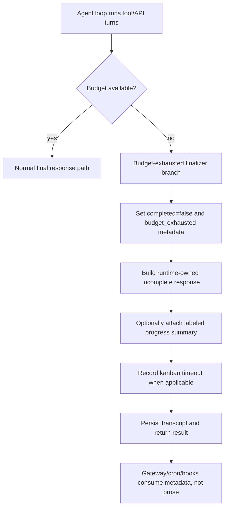
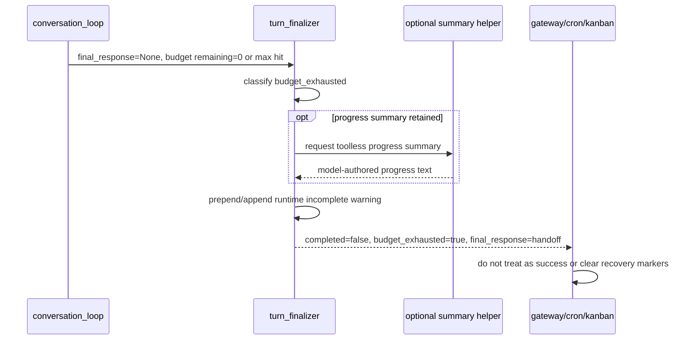

# fix: Make iteration-budget exhaustion visibly incomplete

## Summary

Fix the practical failure mode where Hermes exhausts its iteration budget and returns a fluent, model-authored summary that can read like successful completion. The plan keeps the solution small: make budget exhaustion an explicit incomplete turn state, add deterministic user-facing wording, preserve existing resume/failure semantics, and leave startup context audit work out of the fix.

---

## Problem Frame

Hermes already detects iteration exhaustion in the agent loop and finalizer, but the current finalizer asks the model for a toolless “final response” summarizing what it accomplished. That extra summary can overclaim, especially after a tool result or mid-plan state, even though `completed` is often false internally.

This is not a startup-context sizing problem. Exhaustion should be uncommon in normal interactive turns with the default budget, but it matters when it occurs: long coding tasks, constrained `max_turns`, cron/kanban workers, subagents, and runaway tool loops are exactly the cases where a false “done” is costly. The right fix is a narrow runtime contract, not a new startup order book.

---

## Requirements

### User-facing completion truth

- R1. When a turn stops because `max_iterations` or `IterationBudget` is exhausted, the final visible response must state that the task is incomplete.
- R2. A model-generated progress summary, if retained, must be labeled as progress/handoff text and must not be the authority on completion.
- R3. Budget exhaustion after a tool result must not look like a verified final answer.

### Runtime result semantics

- R4. Both `max_iterations` exhaustion and `IterationBudget.remaining <= 0` exhaustion must return `completed=False`.
- R5. The result dict must expose structured budget-exhaustion metadata that gateway, cron, kanban, and tests can rely on without parsing prose.
- R6. Existing cron and kanban failure behavior must continue to treat budget exhaustion as unsuccessful work.

### Scope discipline

- R7. The fix must not introduce startup context audit, automatic tool disabling, model/provider changes, auto-resume loops, or a new session-resume subsystem.
- R8. The fix must be covered by focused regression tests at the finalizer and gateway status seams.

---

## Key Technical Decisions

- KTD1. Fix the finalizer seam, not startup context assembly. `agent/turn_finalizer.py` already owns post-loop completion, result assembly, kanban timeout recording, verifier footers, turn explanations, and plugin hooks.
- KTD2. Use deterministic runtime wording for budget exhaustion. Model prompts are advisory; runtime-owned prefix/footer text is what prevents false “done” claims.
- KTD3. Preserve `_handle_max_iterations()` only as optional progress summary plumbing. It can still produce text if the implementation chooses, but its output must be wrapped or demoted under an incomplete-state warning.
- KTD4. Treat `IterationBudget` exhaustion the same as `max_iterations` exhaustion for completion state. The current `completed` calculation can incorrectly return true when shared budget reaches zero before `api_call_count` reaches `max_iterations`.
- KTD5. Do not reuse `resume_pending` for budget exhaustion. Budget exhaustion is a clean turn end with a resume recommendation, not a gateway restart interruption.
- KTD6. Keep cross-system changes metadata-first. Add budget fields to the agent result before touching gateway events or plugin hooks; a dedicated hook is follow-up material unless tests prove an immediate consumer needs it.

---

## High-Level Technical Design

---

## Implementation Units

### U1. Normalize budget-exhausted turn state in the finalizer

**Goal:** Make both budget systems produce the same incomplete result semantics.

**Requirements:** R1, R3, R4, R5

**Dependencies:** None

**Files:**
- `agent/turn_finalizer.py`
- `tests/agent/test_turn_finalizer_budget_exhaustion.py`

**Approach:**
- Add a local budget-exhausted classification in `finalize_turn()` that distinguishes `max_iterations` and `IterationBudget` exhaustion but treats both as incomplete.
- Ensure `completed=False` whenever budget exhaustion was detected, even when `api_call_count < agent.max_iterations`.
- Add result metadata such as `budget_exhausted`, `budget_used`, `budget_max`, and a stable `failure_reason` or `turn_exit_reason` value.
- Keep existing kanban timeout recording in this branch and make it fire for both max-iteration and shared-budget exhaustion.

**Execution note:** Start with finalizer unit tests that reproduce `IterationBudget.remaining == 0` with `api_call_count < max_iterations`; that is the subtle false-success path.

**Patterns to follow:**
- Existing finalizer result assembly and diagnostic logging in `agent/turn_finalizer.py`.
- Existing file-mutation verifier footer pattern in `agent/turn_finalizer.py`.
- Existing `IterationBudget` counters in `agent/iteration_budget.py`.

**Test scenarios:**
- Max iterations hit with `final_response=None` returns `completed=False`, `budget_exhausted=True`, and a budget-related `turn_exit_reason`.
- Shared `IterationBudget` exhausted while `api_call_count < max_iterations` returns `completed=False`, not the current success-shaped result.
- Messages ending with a tool result still produce incomplete metadata and do not get treated as a normal successful final answer.
- Kanban task environment set during budget exhaustion records a timed-out task failure for both exhaustion sources.

**Verification:** Finalizer tests prove metadata and completion state are correct without depending on prose wording alone.

### U2. Add deterministic incomplete-response wording

**Goal:** Prevent fluent summaries from becoming false “done” claims.

**Requirements:** R1, R2, R3

**Dependencies:** U1

**Files:**
- `agent/turn_finalizer.py`
- `agent/chat_completion_helpers.py`
- `tests/run_agent/test_turn_completion_explainer.py`
- `tests/agent/test_turn_finalizer_budget_exhaustion.py`

**Approach:**
- Build a runtime-owned budget-exhausted message that leads with “iteration budget exhausted” and “not verified complete”.
- If `_handle_max_iterations()` remains in the default path, demote its output under a label such as “Progress summary from the model”.
- Tighten the summary request wording in `handle_max_iterations()` so it asks for progress and remaining uncertainty, not a “final response”.
- Avoid extra summary retries becoming the primary fix; if summary generation fails, the deterministic handoff text must still be enough.

**Patterns to follow:**
- `AIAgent._format_turn_completion_explanation(...)` and its tests for abnormal-turn explanations.
- Existing post-response footer pattern in `agent/turn_finalizer.py`.

**Test scenarios:**
- `_handle_max_iterations()` returns `Done, everything is complete.` and the final visible response still contains the runtime-owned incomplete warning.
- `_handle_max_iterations()` returns empty or raises, and the final visible response still explains budget exhaustion with resume guidance.
- A normal short successful reply such as `Done.` does not receive the budget-exhaustion warning.
- A budget-exhausted response includes a clear resume instruction such as “send continue” without promising automatic continuation.

**Verification:** Tests assert the warning survives overclaiming model text and that healthy turns stay quiet.

### U3. Preserve gateway, cron, and resume semantics

**Goal:** Ensure downstream consumers do not treat budget exhaustion as success.

**Requirements:** R4, R5, R6, R8

**Dependencies:** U1, U2

**Files:**
- `gateway/run.py`
- `cron/scheduler.py`
- `tests/gateway/test_restart_resume_pending.py`
- `tests/gateway/test_run_progress_topics.py` or the closest existing gateway final-send test
- Relevant cron scheduler test module if one already covers agent result failure handling

**Approach:**
- Prefer relying on `completed=False` and structured metadata so `gateway/run.py` and `cron/scheduler.py` need little or no behavior change.
- Add a regression test proving `_should_clear_resume_pending_after_turn()` returns false for budget-exhausted results.
- Only touch gateway final-send suppression if tests show a budget-exhausted explanation can be suppressed after interim streamed content.
- Keep cron’s existing `completed=False` failure rule; add coverage for shared-budget exhaustion if current tests miss it.

**Patterns to follow:**
- `_should_clear_resume_pending_after_turn(...)` in `gateway/run.py`.
- Cron result failure handling in `cron/scheduler.py`.
- Existing stream final-delivery truth conventions in `gateway/stream_consumer.py`.

**Test scenarios:**
- Gateway resume-pending clearing rejects `{"completed": False, "budget_exhausted": True}`.
- Gateway does not suppress the budget-exhausted explanation solely because interim commentary or tool-progress text was streamed earlier.
- Cron treats a non-empty budget-exhausted final response as job failure because `completed=False`.
- Existing successful final responses still clear resume markers and are not affected by budget metadata fields being absent.

**Verification:** Gateway and cron tests demonstrate result metadata drives success/failure state, not message fluency.

### U4. Carry budget metadata only through existing result consumers

**Goal:** Keep downstream consumers honest without creating a new hook system.

**Requirements:** R5, R7

**Dependencies:** U1

**Files:**
- `agent/turn_finalizer.py`
- `gateway/run.py`
- `tests/gateway/test_restart_resume_pending.py`
- Existing gateway event tests if they already cover `agent:end`

**Approach:**
- Keep the first PR centered on the `result` dict returned by `finalize_turn()`.
- Add budget metadata to gateway `agent:end` only if implementation finds an existing observer that needs the signal there.
- Do not add a new `on_turn_budget_exhausted` hook in the first PR.
- Do not expand plugin hook signatures unless a current test or plugin consumer fails without the metadata.

**Patterns to follow:**
- Existing result dict assembly in `agent/turn_finalizer.py`.
- Gateway `agent:end` event emission in `gateway/run.py`.

**Test scenarios:**
- Budget metadata is present in the finalizer result.
- Gateway resume-pending and final-send decisions use `completed=False` rather than parsing warning text.
- If `agent:end` is extended, it carries `completed=False` and `budget_exhausted=True` without changing response text.
- Existing plugin hook tests remain unchanged unless implementation touches hook payloads.

**Verification:** Result and gateway tests prove metadata is available to current consumers without introducing a new extension surface.

### U5. Split or draft the startup context audit PR as observability-only

**Goal:** Keep PR #49183 from masquerading as the budget-exhaustion fix.

**Requirements:** R7

**Dependencies:** None

**Files:**
- PR #49183 metadata/body
- `agent/context_audit.py`
- `agent/system_prompt.py`
- `tests/agent/test_context_audit.py`
- `tests/cli/test_context_audit_command.py`
- `website/docs/user-guide/features/context-audit.md`

**Approach:**
- Draft or retitle PR #49183 so it is explicitly “startup context audit observability”, not a fix for iteration-budget exhaustion.
- If the audit is still desired, keep it opt-in, redacted, and diagnostic only.
- Do not couple the budget-exhaustion PR to context audit metrics, startup ordering, or automatic optimization recommendations.
- If scope pressure is high, close #49183 and open a smaller observability proposal later.

**Patterns to follow:**
- Existing context-audit redaction and opt-in tests.
- Hermes planning rule that startup context audits must separate visible prompt from hidden schema load.

**Test scenarios:**
- Test expectation: none for PR disposition itself; existing context-audit tests remain the quality gate if the observability PR survives.

**Verification:** The active budget-exhaustion fix PR has no dependency on startup context audit code or configuration.

---

## Scope Boundaries

### In Scope

- Budget-exhausted finalization for `max_iterations` and `IterationBudget` exhaustion.
- Runtime-owned incomplete wording and resume guidance.
- Structured result metadata for downstream consumers.
- Focused gateway, cron, and kanban regression tests.
- PR disposition guidance for #49183.

### Out of Scope

- Startup prompt/context optimization as a prerequisite for this fix.
- Automatic tool disabling or provider/model changes.
- New auto-resume loops after budget exhaustion.
- Broad rewrite of the conversation loop, stream consumer, or session store.
- Durable task-state reconstruction beyond what the existing transcript and todo state already provide.

### Deferred to Follow-Up Work

- A richer handoff artifact writer if real usage shows the deterministic response is not enough.
- A dedicated `on_turn_budget_exhausted` hook if real plugin consumers need it.
- Context-audit observability as a separate opt-in feature if #49183 is still valuable.

---

## System-Wide Impact

Interactive gateway users get an honest incomplete-state message instead of a plausible “done” summary. Cron and kanban workers keep treating exhausted turns as unsuccessful. Existing plugin behavior should remain unchanged in the first PR. The change reduces trust damage from rare exhaustion events without increasing startup cost or adding a second planning/order-book system.

---

## Risks & Mitigations

- Risk: The warning becomes noisy for harmless turns that merely hit a configured low budget. Mitigation: fire only on explicit budget exhaustion and keep normal text responses untouched.
- Risk: Marking budget exhaustion as failed could overstate interactive partial progress. Mitigation: use `completed=False` and `budget_exhausted=True` as the stable contract; only set `failed=True` where existing cron/kanban semantics require it.
- Risk: Extension-surface work bloats a rare-edge fix. Mitigation: keep hook changes deferred unless an existing consumer needs budget metadata immediately.
- Risk: Removing `_handle_max_iterations()` outright would lose useful progress context. Mitigation: demote it first rather than deleting it; deletion can be a follow-up if summaries remain harmful.

---

## Sources & Research

- `agent/conversation_loop.py` — main loop budget gate and `_turn_exit_reason` assignment.
- `agent/turn_finalizer.py` — post-loop finalization, kanban timeout handling, verifier footers, result dict assembly, plugin hooks.
- `agent/chat_completion_helpers.py` — `_handle_max_iterations()` prompt and toolless summary call.
- `agent/iteration_budget.py` — shared budget counters and `remaining` semantics.
- `gateway/run.py` — final response normalization, resume-pending clearing, gateway `agent:end` emission.
- `cron/scheduler.py` — cron job failure handling for `completed=False`.
- `tests/run_agent/test_turn_completion_explainer.py` — existing abnormal-turn explanation pattern.
- `tests/gateway/test_restart_resume_pending.py` — gateway recovery marker semantics.
- `docs/plans/2026-06-09-003-fix-telegram-stream-overflow-continuations-plan.md` — prior narrow gateway/final-delivery plan style to mirror.
