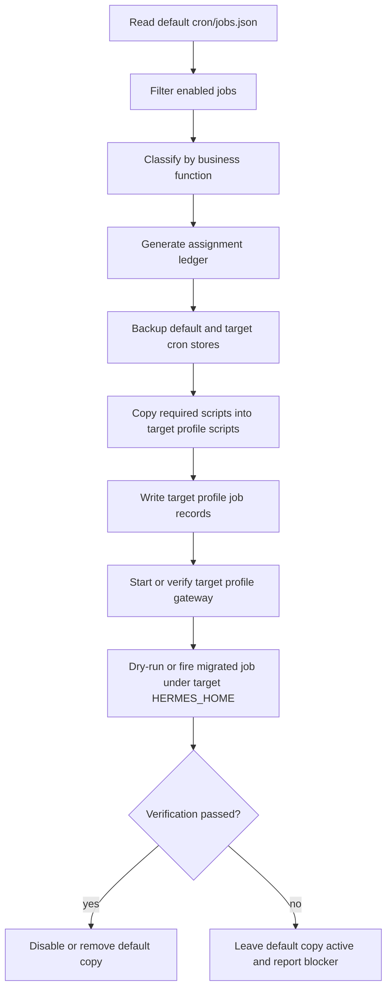

# Cron Profile Assignment - Plan

## Goal Capsule

Create a safe, reversible migration path that reviews all active Hermes cron jobs, assigns each job to the agent profile that owns its business function, and moves each job only after the target profile can execute it with its own scripts, config, credentials, and gateway.

Target repository: `hermes-agent`.

Authority order:

1. Cron profile isolation contract in `cron/jobs.py`, `cron/scheduler.py`, and `tests/cron/test_cron_profile_isolation.py`.
2. Existing profile and gateway behavior documented in `website/docs/user-guide/profiles.md` and `website/docs/developer-guide/gateway-internals.md`.
3. Current live cron inventory from the active default profile.
4. This plan.

Stop conditions:

- Do not centralize all jobs in one shared `cron/jobs.json` with a new `profile` field.
- Do not move a script-backed job before its script exists under the target profile's `scripts/` directory.
- Do not move an agent-driven job until the target profile's provider/model is accepted for that job's output quality.
- Do not delete jobs from default until a profile-scoped gateway has fired or dry-run-executed the migrated copy successfully.
- Do not migrate paused jobs as part of the active-job pass.

---

## Product Contract

### Summary

Hermes cron is intentionally profile-local: a job stored under one profile runs with that profile's `HERMES_HOME`, `.env`, `config.yaml`, skills, scripts, locks, and output directory. Today all 60 jobs are stored in the default profile, but only 59 are active. The desired behavior is to turn that flat default-profile schedule into a profile-owned schedule: CRM lead workflows under `rva-leads`, firm operations under `rva-firm-ops`, tax research under `cpa-tax-researcher`, profit and content workflows under `rva-profit-pulse`, and core Hermes/GBrain/runtime diagnostics under `default`.

### Problem Frame

The current default profile is overloaded. It owns business workflows, client communication watches, content automation, GBrain health checks, backups, infrastructure self-healing, and Hermes loop diagnostics. That makes ownership hard to reason about and makes profile-specific agents ineffective because their cron work does not live with their memories, skills, or model configuration.

The migration is risky because cron isolation is a security boundary. Moving a job is not just editing a label. It means copying any referenced script into the target profile, writing the job record into the target profile's `cron/jobs.json`, running the job under the target profile's gateway, and only then removing or disabling the default-profile copy.

### Requirements

**Inventory and assignment**

- R1. Review every currently enabled cron job in the default profile and produce a deterministic assignment to `default`, `cpa-tax-researcher`, `personal`, `rva-dev`, `rva-firm-ops`, `rva-leads`, or `rva-profit-pulse`.
- R2. Keep paused jobs out of the active migration plan while still reporting them as follow-up candidates.
- R3. Classify jobs by the business function they perform, not by the channel they deliver to.

**Cron isolation and migration safety**

- R4. Preserve Hermes's per-profile cron model: each moved job must live under the target profile's `cron/jobs.json`, not a shared default store.
- R5. Copy script dependencies into the target profile's `scripts/` directory before the moved job is eligible to run.
- R6. Preserve job identity and behavior during migration: schedule, prompt, script, `no_agent`, delivery target, toolsets, model override, context links, workdir, paused state, repeat counters, and recent output metadata.
- R7. Back up every affected profile's cron store and script target before writing migrations.
- R8. Migrate in batches by target profile so one failed profile does not block unrelated profiles.

**Runtime readiness and verification**

- R9. Start or configure a profile-scoped gateway only for profiles that receive active jobs.
- R10. Verify that each migrated profile can list, dry-run, or fire at least one migrated job under its own `HERMES_HOME`.
- R11. Treat agent-driven jobs as model-sensitive: the target profile's provider/model must be accepted or overridden before the default copy is removed.
- R12. Document the final assignment ledger, skipped jobs, gateway requirements, rollback steps, and follow-up work.

### Recommended Active Assignment Ledger

| Target profile | Active jobs | Rationale |
|---|---:|---|
| `default` | 29 | Core Hermes runtime, GBrain bridge, backups, global diagnostics, and self-referential loop jobs. |
| `rva-leads` | 13 | Lead intake, CRM pipeline, consultation follow-up, quote suggestions, SMS opt-out handling, and lead lifecycle checks. |
| `rva-profit-pulse` | 10 | Content CMS, Square sales, weekly digest, topic discovery, and revenue/content loop checks. |
| `rva-firm-ops` | 5 | Client email capture, TaxDome alerting, calendar nudges, Gmail watch refresh, and meeting-note processing. |
| `cpa-tax-researcher` | 2 | Tax research archive lint and tax research integrity checks. |
| `personal` | 0 | No active cron job currently performs personal-profile work. |
| `rva-dev` | 0 | No active cron job currently performs RVA development-profile work distinct from default runtime operations. |

#### Job-level target map

| Job | Target profile | Execution type | Notes |
|---|---|---|---|
| `backup-daily` | `default` | script-only | Global backup coverage should remain with the runtime owner profile. |
| `crm-daily-scan` | `rva-leads` | agent | CRM pipeline summary belongs with lead operations; verify target model quality before cutover. |
| `crm-lead-check` | `rva-leads` | script-only | Squarespace lead check belongs with lead operations. |
| `crm-weekly-scores` | `rva-leads` | agent | Relationship scoring belongs with CRM/lead ownership; verify target model quality. |
| `taxdome-client-alert` | `rva-firm-ops` | script-only | Client-service alerting is firm operations, not research. |
| `cron-integrity-selfcheck` | `default` | script-only | It checks the live default cron runtime and should remain self-referential. |
| `calendar-aware-nudges` | `rva-firm-ops` | agent | Workday operational nudges belong with firm operations; verify target model quality. |
| `client-email-capture` | `rva-firm-ops` | script-only | Direct client email capture is firm operations. |
| `crm-lead-reconcile` | `rva-leads` | script-only | Late lead conversion reconciliation belongs with lead operations. |
| `gbrain-live-sync` | `default` | script-only | GBrain bridge is shared runtime infrastructure. |
| `gbrain-daily-check` | `default` | agent | GBrain health is shared runtime infrastructure. |
| `gbrain-weekly-health` | `default` | agent | GBrain health is shared runtime infrastructure. |
| `tax-research-archive-lint` | `cpa-tax-researcher` | script-only | Tax research archive quality belongs with the tax researcher profile. |
| `critical-repo-git-sync` | `default` | script-only | Cross-repo backup/sync is global runtime infrastructure. |
| `crm-gbrain-client-export` | `rva-leads` | script-only | CRM client export belongs with CRM ownership even though it writes to GBrain. |
| `content-squarespace-sync` | `rva-profit-pulse` | agent | Content CMS sync belongs with the profit/content profile; verify target model quality. |
| `content-topic-miner` | `rva-profit-pulse` | script-only | Content topic mining belongs with the profit/content profile. |
| `content-distribution-audit` | `rva-profit-pulse` | agent | Content distribution audit belongs with the profit/content profile. |
| `content-weekly-strategy-report` | `rva-profit-pulse` | agent | Weekly content strategy belongs with the profit/content profile. |
| `gmail-watch-refresh` | `rva-firm-ops` | script-only | Gmail push-watch maintenance supports client communication capture. |
| `crm-meeting-notes-sync` | `rva-leads` | script-only | CRM meeting note sync feeds lead/client follow-up workflows. |
| `content-idea-proposer` | `rva-profit-pulse` | agent | Content ideation belongs with the profit/content profile; verify target model quality. |
| `process-meeting-notes` | `rva-firm-ops` | script-only | Meeting-note processing is general firm operations. |
| `squarespace-hourly-intake` | `rva-leads` | agent with script context | Lead intake review belongs with lead operations; verify target model quality. |
| `lead-no-response-watchdog` | `rva-leads` | script-only | Lead nonresponse monitoring belongs with lead operations. |
| `crm-funnel-digest` | `rva-leads` | script-only | CRM funnel reporting belongs with lead operations. |
| `stall-followup-draft` | `rva-leads` | script-only | Follow-up draft generation belongs with lead operations. |
| `crm-quote-suggestions` | `rva-leads` | script-only | Quote suggestions belong with lead operations. |
| `square-daily-sales-capture` | `rva-profit-pulse` | script-only | Square sales capture belongs with the profit profile. |
| `infra-self-heal-loop` | `default` | agent with script context | Shared infra self-healing should stay with the default runtime owner. |
| `hermes-backend-update-canary` | `default` | script-only | Backend canary is default runtime infrastructure. |
| `hermes-loop:contract-registry` | `default` | script-only | Core loop governance should stay self-referential unless cloned per profile later. |
| `hermes-loop:semantic-audit` | `default` | script-only | Core semantic audit should stay with default. |
| `hermes-loop:loop-truth-maintenance` | `default` | script-only | Core loop truth maintenance should stay with default. |
| `hermes-loop:delivery-integrity` | `default` | script-only | Delivery integrity is global runtime infrastructure. |
| `hermes-loop:cron-wrapper-truth` | `default` | script-only | Cron wrapper truth checks the default cron system. |
| `hermes-loop:high-risk-gates` | `default` | script-only | Global high-risk gate checks should stay with default. |
| `hermes-loop:observability-reconciliation` | `default` | script-only | Observability reconciliation should stay with default. |
| `hermes-loop:dashboard-loop-health` | `default` | script-only | Dashboard loop health is default runtime infrastructure. |
| `hermes-loop:gateway-plugin-readiness` | `default` | script-only | Gateway/plugin readiness is default runtime infrastructure. |
| `hermes-loop:model-provider-readiness` | `default` | script-only | Model-provider readiness is global runtime infrastructure. |
| `hermes-loop:cost-no-progress-guard` | `default` | script-only | Cost/no-progress guard remains global. |
| `hermes-loop:crm-lead-lifecycle` | `rva-leads` | script-only | CRM lifecycle loop belongs with lead ownership. |
| `hermes-loop:meeting-to-action` | `default` | script-only | Current loop is global until a profile-specific clone is designed. |
| `hermes-loop:tax-research-integrity` | `cpa-tax-researcher` | script-only | Tax integrity loop belongs with tax research. |
| `hermes-loop:content-production-quality` | `rva-profit-pulse` | script-only | Content production quality belongs with profit/content ownership. |
| `hermes-loop:square-sales-pipeline-verification` | `rva-profit-pulse` | script-only | Square sales verification belongs with profit ownership. |
| `hermes-loop:gbrain-bridge-health` | `default` | script-only | GBrain bridge health is shared runtime infrastructure. |
| `hermes-loop:credential-security-drift` | `default` | script-only | Credential drift is shared security infrastructure. |
| `hermes-loop:backup-restore-verification` | `default` | script-only | Backup/restore verification is shared runtime infrastructure. |
| `hermes-loop:skill-promotion-upgrade` | `default` | script-only | Skill promotion/upgrade checks are default profile infrastructure. |
| `hermes-loop:test-suite-truth-targeted` | `default` | script-only | Test-suite truth checks the Hermes runtime repo. |
| `hermes-loop:skill-promotions` | `default` | script-only | Skill promotion checks remain with default. |
| `hermes-loop:ingest-observability` | `default` | script-only | Ingest observability remains global. |
| `hermes-loop:orphan-metric-cleanup` | `default` | script-only | Orphan metric cleanup remains global. |
| `rva-profit-pulse-topic-discovery-weekly` | `rva-profit-pulse` | script-only | Already names the profit pulse domain. |
| `square-weekly-digest` | `rva-profit-pulse` | script-only | Square reporting belongs with profit ownership. |
| `ringcentral-sms-opt-out-watchdog` | `rva-leads` | script-only | Lead/client SMS opt-out handling belongs with lead operations. |
| `notcrawl-nightly-sync` | `default` | script-only | Nightly sync wrapper is shared runtime infrastructure. |

### Paused Job Handling

`stale-draft-alert` is paused with reason `blocked_pending_profile_shadow_readiness_approval`. It should not be migrated during the active-job pass. The assignment candidate is `rva-firm-ops`, but only after the shadow-readiness blocker is resolved and delivery configuration is verified.

### Scope Boundaries

#### In scope

- Inventorying the active default-profile jobs.
- Producing and documenting a target profile assignment for each active job.
- Creating a dry-run migration tool that stages job records and scripts into target profiles.
- Starting or documenting profile-scoped gateway requirements for profiles that receive jobs.
- Verifying moved jobs under target profile homes.

#### Deferred to Follow-Up Work

- Cloning the full `hermes-loop:*` diagnostic suite into every profile. This may be valuable later, but it changes the loop design from one default-owned monitor set to many profile-owned monitor sets.
- Moving the paused `stale-draft-alert` job after its shadow-readiness blocker is resolved.
- Assigning any jobs to `personal` or `rva-dev` after new jobs exist that actually match those domains.

---

## Planning Contract

### Key Technical Decisions

- KTD1. Use profile-local cron stores, not a central assignment field. `cron/jobs.py` and `tests/cron/test_cron_profile_isolation.py` make profile locality a security boundary, so the migration writes target jobs into each target profile's own `cron/jobs.json`.
- KTD2. Keep default-owned runtime diagnostics self-referential. Most `hermes-loop:*` jobs monitor default's gateway, skills, model providers, delivery, cron wrappers, and backup posture. Moving those jobs would make them observe a different profile without redesigning their semantics.
- KTD3. Move business-domain script-only jobs first. Script-only jobs avoid model-quality changes; they mainly need script staging, config parity, delivery validation, and profile gateway readiness.
- KTD4. Treat agent-driven jobs as shadow migrations. Agent-driven CRM and content jobs may change behavior when moved from default's `gpt-5.5` runtime to the target profile's provider/model, so the target copy should run in shadow mode before default is disabled.
- KTD5. Start only needed profile gateways. This pass needs gateways for `cpa-tax-researcher`, `rva-firm-ops`, `rva-leads`, and `rva-profit-pulse`; `personal` and `rva-dev` receive no active jobs and should not get new gateway process burden.
- KTD6. Use backups plus idempotent migration state. Job moves should be replayable: a second run should detect already-staged scripts, already-copied jobs, and already-disabled default copies without duplicating records.
- KTD7. Prefer profile-scoped subprocesses for live profile operations. `cron/jobs.py` binds its store globals at import time, so live migration and verification should use `hermes -p <profile> ...` subprocesses rather than retargeting already-imported module globals in a long-running process.

### High-Level Technical Design

### Implementation Constraints

- Script validation must respect the existing constraint from `cron/scheduler.py`: cron scripts execute only from the active profile's `scripts/` directory.
- The dashboard profile-routing helpers in `hermes_cli/web_server.py` are useful reference behavior, but the migration should not rely on mutating imported module globals in a long-running process.
- Job IDs are immutable and are also output-directory keys, so target profile stores must be checked for ID and output-history collisions before copying records.
- Jobs that reference `skills` or profile-specific tool availability must verify those skills and tools exist in the target profile before cutover.
- There is no built-in selective cron migration command today; `--clone-all` copies an entire `cron/` and `scripts/` tree, but this plan needs selective per-job movement.
- Live path references in reports should use profile names and symbolic profile homes, not absolute machine paths.
- The migration tool should default to dry-run and require an explicit apply flag.

### Sources and Research

- `cron/jobs.py` defines cron storage under the active profile home and warns not to anchor jobs at the shared root.
- `cron/scheduler.py` resolves `HERMES_HOME` dynamically for execution and lock paths.
- `tests/cron/test_cron_profile_isolation.py` pins storage, execution, and lock paths to the profile home.
- `tests/hermes_cli/test_web_server_cron_profiles.py` shows dashboard-side profile routing and script path normalization for profile cron jobs.
- `hermes_cli/profiles.py` provides the nearest precedent: `--clone-all` copies `cron/` and `scripts/`, but only as a whole-profile clone.
- `hermes_cli/gateway.py` builds profile gateway commands; service-mode startup is `hermes -p <profile> gateway start`, while foreground debugging can use `hermes -p <profile> gateway run`.
- `hermes_cli/cron.py` exposes list/create/edit/pause/resume/run/remove/status/tick operations but no selective move or migrate command.
- `website/docs/developer-guide/cron-internals.md` and `website/docs/guides/cron-troubleshooting.md` document cron execution, locks, status, and script-path failure modes.
- `docs/design/profile-builder.md` documents the module-global import seam and why profile-scoped subprocesses are safer than mutating globals in a live process.
- `docs/kanban/multi-gateway.md` documents multi-gateway deployment concerns, including single-owner dispatcher settings that should not be accidentally duplicated across profiles.
- `website/docs/user-guide/profiles.md` explains that each profile has separate config, `.env`, memory, sessions, skills, cron jobs, and state.
- `website/docs/developer-guide/gateway-internals.md` identifies `gateway/status.py` as token-lock management for profile-scoped gateway instances.

---

## Implementation Units

### U1. Build the active cron inventory and assignment report

- **Goal:** Create a read-only tool that inventories enabled jobs, reports paused jobs separately, and emits the assignment ledger in machine-readable and human-readable forms.
- **Requirements:** R1, R2, R3, R12
- **Dependencies:** None
- **Files:** `scripts/cron_profile_assignment_audit.py`, `tests/cron/test_cron_profile_assignment_audit.py`
- **Approach:** Load the default profile's `cron/jobs.json`, support both wrapped `{"jobs": [...]}` and legacy list shapes, filter enabled jobs by default, preserve disabled jobs under a paused section, and classify each enabled job using explicit rules keyed on job name, script name, workdir domain, and prompt keywords. Output a summary by target profile plus a full job-level ledger.
- **Patterns to follow:** Use profile-home resolution conventions from `hermes_constants.py`; mirror JSON-store compatibility expectations from `cron/jobs.py`.
- **Test scenarios:**
  - Given a wrapped jobs store with two enabled jobs and one disabled job, the report counts only the enabled jobs as active and lists the disabled job under paused follow-up.
  - Given a CRM job with a lead-check script, the classifier assigns it to `rva-leads`.
  - Given a GBrain health job, the classifier assigns it to `default`.
  - Given a tax research lint job, the classifier assigns it to `cpa-tax-researcher`.
  - Given an unknown job, the classifier assigns `default` and marks the decision as review-needed rather than silently inventing a business owner.
  - Given a legacy list-form jobs store, the report still produces the same active and paused counts.
- **Verification:** The tool reports 59 active jobs and one paused job against the current default store, with target counts matching the ledger in this plan.

### U2. Add a dry-run migration planner with backups and rollback metadata

- **Goal:** Produce a safe migration manifest that describes every script copy, job copy, default-profile disable/remove action, profile gateway requirement, and rollback operation before any live write occurs.
- **Requirements:** R4, R6, R7, R8, R11
- **Dependencies:** U1
- **Files:** `scripts/cron_profile_rebalance.py`, `tests/cron/test_cron_profile_rebalance.py`
- **Approach:** Accept the U1 assignment ledger as input, resolve each target profile home, plan backups for default plus every target profile, and emit a dry-run manifest. The manifest should include source job ID, target profile, required script files, ID/output collision status, skill requirements, whether the job is script-only or agent-driven, whether a profile gateway is needed, and rollback instructions.
- **Patterns to follow:** Preserve `jobs.json` structure used by `cron/jobs.py`; preserve profile isolation verified by `tests/cron/test_cron_profile_isolation.py`.
- **Test scenarios:**
  - Given an assignment that moves a script-backed job, the dry-run includes a script copy into the target profile's `scripts/` directory before the job write.
  - Given an agent-driven job, the dry-run marks it as shadow-required and does not schedule default-copy removal in the same step.
  - Given a target profile without `cron/jobs.json`, the dry-run plans directory creation and a wrapped jobs store.
  - Given an existing target job with the same ID, the dry-run treats it as already staged and does not duplicate it.
  - Given an existing unrelated target job with the same ID, the dry-run blocks the move and reports the immutable-ID/output-history collision.
  - Given a job with a `skills` reference missing from the target profile, the dry-run blocks cutover and reports the missing skill.
  - Given a missing source script, the dry-run blocks that job and leaves the default copy untouched.
  - Given an apply request, the tool writes timestamped backups before modifying any cron store.
- **Verification:** A dry-run against the current default store produces no live changes and names every target profile that would receive jobs.

### U3. Stage scripts and profile cron stores safely

- **Goal:** Copy required scripts to target profiles and create target `cron/` directories without enabling migrated jobs prematurely.
- **Requirements:** R4, R5, R7, R8
- **Dependencies:** U2
- **Files:** `scripts/cron_profile_rebalance.py`, `tests/cron/test_cron_profile_rebalance.py`
- **Approach:** Add an apply phase that can stage scripts and target job stores while leaving default jobs active. Script staging should preserve executable bits for shell scripts, avoid copying cache files or backups, and skip scripts for jobs that stay on default.
- **Patterns to follow:** Follow script validation behavior tested in `tests/hermes_cli/test_web_server_cron_profiles.py`, where profile cron APIs normalize scripts to profile-local paths and reject scripts outside the profile scripts directory.
- **Test scenarios:**
  - Given a shell script source, the staged target script preserves executable permissions.
  - Given a Python script source, the staged target script is copied once and is not duplicated on a second run.
  - Given a job that stays on default, no target script copy is planned.
  - Given a script path that points outside the source profile's scripts directory, the staging phase blocks the job.
  - Given four target profiles, the staging phase creates each required `cron/` and `scripts/` directory without modifying profiles that receive no jobs.
- **Verification:** Target profiles that receive jobs have the required scripts present before any migrated job is enabled there.

### U4. Migrate jobs by target profile and verify profile-scoped execution

- **Goal:** Move jobs in batches by profile, verify target execution, and only then disable or remove default copies.
- **Requirements:** R6, R8, R9, R10, R11
- **Dependencies:** U2, U3
- **Files:** `scripts/cron_profile_rebalance.py`, `tests/cron/test_cron_profile_rebalance.py`, `tests/cron/test_cron_profile_isolation.py`
- **Approach:** Add per-profile apply steps: write target job records through profile-scoped subprocesses, start or confirm the profile-scoped gateway outside the migration tool, and run a verification command or scheduled dry run under the target profile. Script-only jobs can cut over after target output is verified. Agent-driven jobs should remain in shadow mode until a reviewer accepts target-profile model output.
- **Execution note:** Use characterization-first verification for agent-driven jobs: capture current default-profile output shape before comparing target-profile output.
- **Patterns to follow:** Use `hermes -p <profile> gateway start` for service-mode profile gateways and `hermes -p <profile> gateway run` for foreground debugging; use `tests/cron/test_cron_profile_isolation.py` as the invariant that target execution follows target profile home.
- **Test scenarios:**
  - Given a target job copy, the tool can verify it exists only in the target profile store after cutover.
  - Given a script-only job with successful target verification, the default copy is disabled or removed according to the chosen cutover mode.
  - Given an agent-driven job, the default copy remains active until shadow verification is accepted.
  - Given a failed target verification, the default copy remains active and the target job is marked blocked.
  - Given two target profiles, a failure in one profile does not prevent migration of an unrelated profile batch.
  - Given a target profile with kanban dispatcher settings, gateway startup verification confirms only the intended profile owns dispatcher behavior.
- **Verification:** At least one migrated job per target profile is proven to execute or dry-run under that profile's `HERMES_HOME` before any default copy from that profile's batch is removed.

### U5. Document final ownership, gateway operations, and rollback

- **Goal:** Leave an operator-facing record of the final state, including assignment rationale, gateway process requirements, rollback steps, and follow-up jobs.
- **Requirements:** R9, R10, R12
- **Dependencies:** U1, U2, U3, U4
- **Files:** `docs/operations/cron-profile-assignment.md`, `tests/cron/test_cron_profile_assignment_audit.py`
- **Approach:** Generate or maintain a runbook that includes the assignment ledger, target profile counts, active gateway expectations, verification evidence format, and rollback procedure. Include `stale-draft-alert` as a paused follow-up rather than an active assignment.
- **Patterns to follow:** Keep operational docs concise and path-safe; reference profile names and symbolic profile homes instead of absolute paths.
- **Test scenarios:**
  - Given a completed migration manifest, the generated runbook includes target profile counts and all migrated job IDs.
  - Given a paused job, the generated runbook lists it under follow-up and not in active counts.
  - Given a blocked job, the generated runbook includes the blocker and rollback action.
- **Verification:** A reader can identify which profile owns each active job, which gateways must run, and how to roll back a failed profile batch without reading the migration tool source.

---

## Verification Contract

| Gate | Applies to | Done signal |
|---|---|---|
| Unit tests | U1-U5 | `scripts/run_tests.sh tests/cron/test_cron_profile_isolation.py tests/hermes_cli/test_web_server_cron_profiles.py tests/cron/test_cron_profile_assignment_audit.py tests/cron/test_cron_profile_rebalance.py` passes. |
| Read-only audit | U1 | The audit report shows 59 active jobs, one paused job, and target counts `default=29`, `rva-leads=13`, `rva-profit-pulse=10`, `rva-firm-ops=5`, `cpa-tax-researcher=2`. |
| Dry-run manifest | U2 | The dry-run prints every planned script copy, job copy, gateway requirement, and default-copy action without modifying live files. |
| Staging verification | U3 | Every moved script-backed job has its script present in the target profile's `scripts/` directory before target job enablement. |
| Profile gateway status | U4 | `hermes -p <profile> cron status` and `hermes -p <profile> gateway status` show a live profile-scoped gateway for every target profile that receives jobs. |
| Profile execution verification | U4 | Each target profile that receives jobs has at least one migrated job verified under its own `HERMES_HOME`. |
| Shadow output review | U4 | Agent-driven jobs are accepted under the target profile's provider/model before their default copies are disabled. |
| Runbook review | U5 | `docs/operations/cron-profile-assignment.md` matches the final migration manifest and names all deferred items. |

---

## Risks & Dependencies

| Risk | Mitigation |
|---|---|
| Profile-scoped gateways are not running for target profiles. | Stage jobs first, then start gateways only for `cpa-tax-researcher`, `rva-firm-ops`, `rva-leads`, and `rva-profit-pulse`. |
| A script-backed job fails after migration because the target profile lacks the script. | Block target job enablement until script staging verifies the target profile `scripts/` file. |
| Agent-driven jobs change tone or reasoning because target profiles use different providers/models. | Shadow-run target copies and compare output before disabling default copies. |
| Discord or Telegram delivery behaves differently from a non-default profile. | Verify one delivered message per target profile before cutover. |
| Job IDs or output histories collide in a target profile. | Block the move unless the target record is the same staged job; never rename an existing job ID in place. |
| A migrated job references a skill missing from the target profile. | Verify `skills` references before cutover and install/copy the missing skill or keep the job on default. |
| Multi-gateway startup duplicates dispatcher ownership. | Check profile gateway config before start and preserve single-owner dispatcher behavior. |
| Duplicate jobs fire during shadow migration. | Mark shadow copies clearly and keep destructive/default-disable actions separate from staging. |
| A stale branch or future fix re-centralizes cron storage. | Keep `tests/cron/test_cron_profile_isolation.py` in the verification gate. |

---

## Definition of Done

- U1-U5 are complete and verified.
- The active cron inventory has been reviewed and every active job has an explicit target profile.
- The migration plan is reversible, with backups for every touched profile cron store.
- Script-backed jobs have target-profile script copies before execution.
- Target profile gateways are running or explicitly scheduled for only the profiles that receive active jobs.
- Agent-driven jobs have accepted target-profile output before default copies are removed.
- The paused `stale-draft-alert` job remains out of the active migration and is documented as follow-up.
- The final runbook records the completed ownership ledger and rollback path.
- Abandoned experimental scripts, temp manifests, and dead-end migration artifacts are removed before declaring the work complete.
