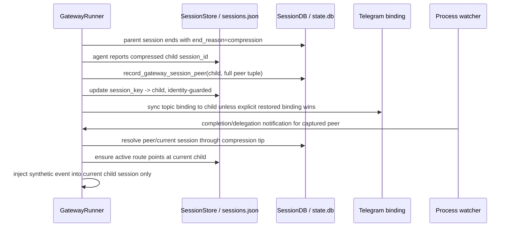

# fix: Preserve gateway routing across compression handoffs

## Summary

Make Hermes compression routing durable: when a gateway session compresses into a child session, every routing surface must follow the child, and stale background/process notifications must not resurrect an older session in the same Telegram topic.

The implementation should be upstream-first: consume or adapt the official last-30-day PRs that already target this bug class, preserve contributor credit where possible, and fill the remaining background-notification gap with focused regression coverage.

---

## Problem Frame

The incident shape is a real gateway/session-routing failure, not model confusion. Compression can rotate an agent from a parent session into a child session, but the gateway routing index, durable session metadata, Telegram topic binding, and background notification source can temporarily disagree. If a stale route still points at the compression-ended parent, a synthetic completion notification can re-enter the wrong live session and revive old context in the same Telegram thread.

Hermes already treats conversation prompt caching, role alternation, and route isolation as core invariants. This fix must keep those invariants by repairing the session identity handoff at the compression boundary rather than adding a manual recovery path after the wrong session is selected.

---

## Due Diligence Findings

### Public recent-signal scan

A `/last30days` scan across GitHub, Hacker News, Reddit, X, and web grounding for the last 30 days found no broad public cluster of users reporting this exact Telegram compression-routing failure. The only notable non-official signal was weak X chatter about a “delivery-edge” class of agent messages landing in old sessions; it was useful as color, not as implementation evidence.

### Official GitHub-only scan, last 30 days

All official references below were created or updated inside the last-30-day window.

| Source | Status | Relevance to this fix |
|---|---:|---|
| [PR #55300](https://github.com/NousResearch/hermes-agent/pull/55300) `fix(gateway): preserve peer routing across compression recovery` | Open, LGTM comment, blocked checks | Direct hit: records gateway peer metadata after compression session-id rotation and repoints stale `sessions.json` entries to recovered live children. |
| [PR #55721](https://github.com/NousResearch/hermes-agent/pull/55721) `fix(gateway): ignore stale compression session splits` | Open, blocked/no checks | Direct hit: identity-guards stale in-flight runs so old compression children cannot overwrite a newer `/new` or moved binding. |
| [PR #43766](https://github.com/NousResearch/hermes-agent/pull/43766) `fix(gateway): keep Telegram topic bindings on compression descendants` | Open, dirty | Direct hit for Telegram topic rewind: prefers compression descendants when topic binding and session-store entry disagree, while preserving explicitly restored bindings. |
| [PR #50517](https://github.com/NousResearch/hermes-agent/pull/50517) `fix(gateway): preserve platform + gateway_session_key on /compress temporary agent` | Open, approved, dirty | Adjacent compression identity fix: manual `/compress` temporary agents should carry the same platform/session key as normal gateway turns. |
| [PR #56416](https://github.com/NousResearch/hermes-agent/pull/56416) `fix(gateway): queue interrupts during in-flight context compression` | Merged | Related downstream fix already on `origin/main`; local checkout is behind and should pick this up before new work lands. |
| [Issue #51058](https://github.com/NousResearch/hermes-agent/issues/51058) | Closed | User-visible wrong-chat/wrong-session symptom after compression across TUI/Desktop surfaces. |
| [Issue #39260](https://github.com/NousResearch/hermes-agent/issues/39260) | Closed | Root cause family: gateway sessions not persisting enough chat metadata for reliable recovery. |
| [Issue #52804](https://github.com/NousResearch/hermes-agent/issues/52804) | Closed | Stale `sessions.json` / live-gateway stale route variant related to routing-time healing. |

Conclusion: a fix is coming downstream, but not as one fully-merged patch yet. The safest plan is to base local work on current `origin/main`, cherry-pick or adapt the relevant open PRs with attribution, then add the missing background-notification regression before shipping.

---

## Requirements

- R1. Compression session-id rotation preserves the gateway peer tuple in durable state: `session_key`, source platform, user id, chat id, chat type, and thread id.
- R2. A stale `sessions.json` entry pointing at a compression-ended parent is recovered to the live compression descendant for the same peer instead of being dropped or resolving to an unrelated older session.
- R3. Telegram topic bindings follow compression descendants without overwriting explicit restored bindings or rewinding a topic to an old parent.
- R4. Background process, watch, completion, and async-delegation notifications re-enter the owning session’s current compression tip, not merely the original parent session id captured when the process started.
- R5. Stale in-flight runs cannot publish their compressed child after the session binding or run generation has moved to a newer session.
- R6. Manual `/compress` temporary agents carry the same platform and gateway session key identity as normal gateway turns.
- R7. The implementation preserves Hermes’ prompt-cache and message-alternation invariants: no synthetic notification should become a same-role duplicate or rebuild the system prompt unnecessarily.
- R8. Regression tests cover the incident shape end-to-end enough to fail if Telegram routing metadata, topic binding, or background notification delivery regresses again.

---

## Key Technical Decisions

- **Upstream-first integration:** Start from `origin/main` and salvage the official PR work rather than rewriting it. The repo guidance explicitly prefers contributor-credit-preserving salvage, and the open PRs already isolate most of the bug class.
- **Durable peer metadata is the canonical recovery key:** Recovery should key off the full gateway peer tuple stored in `state.db`, with `sessions.json` treated as a fast routing index that can be healed.
- **Compression lineage beats timestamp guesses:** Prefer `SessionDB.get_compression_tip()` / lineage checks over `started_at >= ended_at` heuristics; existing code documents that gateway/compression races can invert those timestamps.
- **Identity-guard session split publication:** When a run starts on session A and later reports child C, only publish C if the active binding is still A and the run generation is current.
- **Synthetic notifications must resolve late:** Process/delegation notifications should use the captured routing metadata for the peer, but resolve the live session id at injection time so long-running work survives compression.
- **Telegram restored bindings stay explicit:** Topic bindings with restored/manual meaning should not be auto-rewritten just because a descendant exists; otherwise recovery can destroy operator intent.

---

## High-Level Technical Design

The critical design point is late binding: the process watcher may capture the original parent session id, but the injection path must resolve the current compression descendant before it creates a synthetic gateway message.

---

## Scope Boundaries

### In scope

- Gateway session routing around compression, including `sessions.json`, `state.db`, Telegram topic bindings, and process/delegation notification injection.
- Regression tests for stale compression parents, stale run publication, Telegram topic rewind, manual `/compress` identity, and background notification re-entry after compression.
- A light documentation update to keep session lifecycle docs aligned with the new invariant.

### Deferred to Follow-Up Work

- A broader refactor of `gateway/run.py` into smaller mixins/modules. This bug touches a god-file, but the durable fix should be narrow.
- General session-store cleanup or schema redesign unrelated to compression routing.
- Public release/update automation after the fix is merged; this plan covers the implementation-ready fix, not deployment scheduling.

---

## System-Wide Impact

This change crosses the gateway hot path, durable session state, Telegram topic mode, and long-running tool notification delivery. It affects multi-platform behavior even though the visible incident was Telegram-first, because `SessionStore`, `SessionDB`, and synthetic notification injection are shared infrastructure.

The change must keep prompt caching stable: session keys identify cached agent instances, and compression is the sanctioned exception that may rotate context. The plan therefore updates route metadata and bindings rather than creating a new session family or forcing a `/new`-style reset.

---

## Implementation Units

### U1. Rebaseline onto current upstream compression fixes

- **Goal:** Put the working branch on a current `origin/main` baseline and identify which official fixes are already present before writing local code.
- **Requirements:** R1, R2, R3, R5, R6
- **Dependencies:** None
- **Files:**
  - `gateway/run.py`
  - `gateway/session.py`
  - `hermes_state.py`
  - `gateway/slash_commands.py`
  - `tests/gateway/test_session_store_stale_prune.py`
  - `tests/gateway/test_compression_failure_session_sync.py`
  - `tests/gateway/test_telegram_topic_mode.py`
  - `tests/gateway/test_compress_command.py`
  - `tests/test_hermes_state.py`
- **Approach:** Start by diffing local code against `origin/main` and the official PRs. Keep already-merged PR #56416 from upstream. Cherry-pick or adapt PR #55300, PR #55721, PR #43766, and PR #50517 where they still apply, preserving authorship where practical.
- **Patterns to follow:** `AGENTS.md` contributor-credit guidance; existing comments in `hermes_state.py` around `get_compression_tip()`; existing gateway session recovery helpers in `gateway/session.py`.
- **Test scenarios:**
  - Test expectation: none directly for this unit; it is integration preparation. Behavioral coverage lands in U2–U6.
- **Verification:** The implementer can point to which upstream fixes are present, adapted, or intentionally deferred, and no unrelated local work is mixed into the routing fix.

### U2. Preserve peer metadata when compression rotates session ids

- **Goal:** When an agent returns a different `session_id` after compression, persist the new child session’s full gateway peer metadata immediately.
- **Requirements:** R1, R2
- **Dependencies:** U1
- **Files:**
  - `gateway/run.py`
  - `gateway/session.py`
  - `tests/gateway/test_session_store_stale_prune.py`
- **Approach:** Extend the session-id-rotation path in `GatewayRunner._handle_message_with_agent()` and the failed-turn/approval-notification path in `_run_agent()` so a successful compression handoff updates `SessionEntry.session_id`, saves `sessions.json`, and calls the existing `SessionStore._record_gateway_session_peer()` helper for the child. Do not bypass the existing `SessionStore` abstraction.
- **Patterns to follow:** Existing `SessionStore._record_gateway_session_peer()` and `SessionDB.record_gateway_session_peer()`; PR #55300’s direct patch shape.
- **Test scenarios:**
  - Happy path: a Telegram gateway turn starts on parent A, compression returns child B, and `record_gateway_session_peer()` is called with B plus the original peer tuple.
  - Error path: peer recording raises; the gateway logs/debugs but still completes the response without dropping the user turn.
  - Integration scenario: a failed model turn that compressed before failing still records the child session id for recovery, matching `tests/gateway/test_compression_failure_session_sync.py` behavior.
- **Verification:** After compression, durable state can recover the child by the original `session_key` and Telegram peer tuple.

### U3. Recover stale `sessions.json` entries to compression descendants

- **Goal:** Startup and routing-time stale-entry pruning should repoint compression-ended parents to live descendants when the peer matches exactly.
- **Requirements:** R2, R8
- **Dependencies:** U2
- **Files:**
  - `gateway/session.py`
  - `tests/gateway/test_session_store_stale_prune.py`
  - `tests/gateway/test_session_store_runtime_stale_guard.py`
- **Approach:** In `_prune_stale_sessions_locked()`, treat an entry whose DB row has `end_reason='compression'` as recoverable when `entry.origin` is present. Use `_recover_session_from_db()` to find the latest durable peer row and reopen/repoint only when it returns a different session id. If recovery finds the same ended session or no match, keep the existing prune behavior.
- **Patterns to follow:** Existing `_recover_session_from_db()` / `_create_entry_from_recovered_row()` and PR #55300’s stale-parent repoint tests.
- **Test scenarios:**
  - Happy path: `sessions.json` points at compression parent A, DB finder returns live child B for the same peer, and the store keeps the key mapped to B.
  - Runtime path: a live gateway route whose session id has become ended in `state.db` is recovered or dropped before it can swallow a follow-up message.
  - Failure path: DB finder raises; the store does not crash startup and falls back to safe prune behavior.
  - Safety path: finder returns A or an unrelated peer; the stale entry is pruned rather than reopened.
  - Persistence path: a recovered entry causes `_save()` so the on-disk route is repaired before the next message.
- **Verification:** A gateway restart after compression cannot leave the conversation with no resumable route or silently route to an older live session.

### U4. Guard stale in-flight compression publication

- **Goal:** Old runs that finish after `/stop`, `/new`, or another lifecycle move must not overwrite the active session binding with their compressed child.
- **Requirements:** R5, R7
- **Dependencies:** U2
- **Files:**
  - `gateway/run.py`
  - `tests/gateway/test_compression_failure_session_sync.py`
- **Approach:** Capture the run-start session id before `_run_agent()` and only publish `agent_result['session_id']` if the active `SessionEntry.session_id` still equals that run-start id. In `_run_agent()`’s failed-turn compression sync, also require the run generation to remain current before saving the child or syncing Telegram binding.
- **Patterns to follow:** PR #55721’s identity guard and existing `_session_run_generation` stale-result checks.
- **Test scenarios:**
  - Happy path: current run starts on A, compresses to B, and updates the binding because the active entry still points at A.
  - Stale generation: run generation 1 returns after generation 2 exists; no session-store save or topic-binding sync happens.
  - Moved binding: active entry has moved from A to fresh session N; compressed child B from old run is ignored.
  - Failure path: a failed turn that compressed before failing still publishes the split only when identity guards pass.
- **Verification:** A stale compressed child cannot replace a newer conversation lane.

### U5. Heal Telegram topic binding lineage without destroying restored bindings

- **Goal:** Telegram topic routes should follow compression descendants when stale, while explicit restored/manual bindings stay authoritative.
- **Requirements:** R3, R8
- **Dependencies:** U2, U3, U4
- **Files:**
  - `gateway/run.py`
  - `hermes_state.py`
  - `tests/gateway/test_telegram_topic_mode.py`
  - `tests/test_hermes_state.py`
- **Approach:** Add or reuse a lineage helper such as `SessionDB.is_session_descendant()` so `_handle_message_with_agent()` can distinguish “binding points at a stale ancestor” from “binding intentionally restored.” If the current `SessionEntry.session_id` is a descendant of the bound session and the binding is not restored, prefer the current descendant and rewrite the binding through `_sync_telegram_topic_binding()`.
- **Patterns to follow:** PR #43766’s descendant-preference logic; existing `get_telegram_topic_binding()` / `bind_telegram_topic()` tests.
- **Test scenarios:**
  - Happy path: topic binding points at old parent A, session store points at descendant B, and the next Telegram message runs on B without `switch_session()` rewinding to A.
  - Restored binding: managed mode is `restored`; the binding stays on the restored session even if a descendant exists.
  - Compression-tip path: `get_compression_tip()` returns canonical child B and the binding is rewritten to B.
  - Lineage helper: `is_session_descendant()` returns true for direct and multi-hop descendants, false for siblings and unrelated sessions.
- **Verification:** Telegram topic mode cannot drag a compressed conversation back to an old parent unless the operator explicitly restored that binding.

### U6. Make background and delegation notifications compression-tip-aware

- **Goal:** Synthetic notifications generated after the user turn ends should resolve the current compression descendant before re-entering the gateway.
- **Requirements:** R4, R7, R8
- **Dependencies:** U2, U3, U5
- **Files:**
  - `gateway/run.py`
  - `tools/process_registry.py`
  - `tools/terminal_tool.py`
  - `tests/gateway/test_background_process_notifications.py`
  - `tests/gateway/test_compression_notification_routing.py`
  - `tests/gateway/test_internal_event_never_interrupts_busy_session.py`
  - `tests/gateway/test_internal_event_bypass_pairing.py`
- **Approach:** Keep process watcher metadata capture unchanged for platform/chat/thread/user identity, but update the injection path around `_build_process_event_source()` / `_inject_watch_notification()` to late-resolve the owning session by `session_key` and compression lineage before creating the synthetic `MessageEvent`. If a current descendant is found, ensure the session store route and event source are aligned to that descendant. If no route can be resolved, drop rather than guessing across peers.
- **Technical design:** Directional only: `captured peer tuple -> find current session by session_key -> get_compression_tip(current or captured session id) -> verify same peer metadata -> inject synthetic event using current session key/source`.
- **Patterns to follow:** Existing agent-triggered completion flow in `_run_process_watcher()`; `_enrich_async_delegation_routing()` for async delegation routing metadata; `SessionStore._recover_session_from_db()` for conservative peer matching.
- **Test scenarios:**
  - Happy path: process starts under parent A, compression rotates to child B before process completion, and `notify_on_complete` re-enters B.
  - Async delegation path: delegation completion event with captured parent route resolves to child B before `_inject_watch_notification()`.
  - Busy-session path: an internal completion event queues behind an active user turn instead of interrupting it, preserving the existing internal-event behavior.
  - Pairing path: internal completion events keep bypassing platform authorization/pairing checks while still using compression-tip routing.
  - Missing metadata: completion event without `session_key` or platform peer metadata is dropped/logged rather than routed to any live session in the topic.
  - Wrong-peer safety: another live Telegram session exists in the same chat/thread, but the peer tuple does not match; notification does not re-enter that session.
  - Alternation safety: injected notification is handled as a synthetic user event through the existing gateway path without creating duplicate same-role assistant messages.
- **Verification:** The original incident shape fails before this unit and passes after it: long-running background work finishing after compression continues the compressed child session, not an older session in the same topic.

### U7. Preserve manual `/compress` gateway identity

- **Goal:** Manual `/compress` should use the same platform and `gateway_session_key` identity as a normal gateway turn.
- **Requirements:** R6, R8
- **Dependencies:** U1
- **Files:**
  - `gateway/slash_commands.py`
  - `tests/gateway/test_compress_command.py`
- **Approach:** Adapt PR #50517 so the temporary compression agent gets the source-derived platform config key and stable gateway session key in runtime kwargs, overriding stale resolver values without passing duplicate keyword arguments.
- **Patterns to follow:** `_platform_config_key()` in `gateway/run.py`; existing `/compress` tests.
- **Test scenarios:**
  - Happy path: a Telegram `/compress` temporary agent receives `platform='telegram'` and the same gateway session key as the live turn.
  - Stale resolver path: runtime kwargs already contain stale platform/session values; source-derived identity wins and no duplicate-kwarg error is raised.
  - Backward compatibility: source without platform metadata keeps the previous default behavior.
- **Verification:** Manual compression cannot create an unbound “cli” identity for a gateway conversation.

### U8. Document and verify the invariant

- **Goal:** Make the new compression-routing invariant discoverable for future gateway work.
- **Requirements:** R7, R8
- **Dependencies:** U2, U3, U4, U5, U6, U7
- **Files:**
  - `docs/session-lifecycle.md`
  - `website/docs/user-guide/sessions.md`
  - `website/docs/developer-guide/session-storage.md`
  - `tests/gateway/test_session_store_stale_prune.py`
  - `tests/gateway/test_session_store_runtime_stale_guard.py`
  - `tests/gateway/test_compression_failure_session_sync.py`
  - `tests/gateway/test_compression_concurrent_sessions.py`
  - `tests/gateway/test_telegram_topic_mode.py`
  - `tests/gateway/test_background_process_notifications.py`
  - `tests/gateway/test_compression_notification_routing.py`
  - `tests/gateway/test_internal_event_never_interrupts_busy_session.py`
  - `tests/gateway/test_internal_event_bypass_pairing.py`
  - `tests/gateway/test_compress_command.py`
  - `tests/test_hermes_state.py`
- **Approach:** Add a concise “Compression routing handoff” note to the session lifecycle docs: `sessions.json` is a fast index, `state.db` peer metadata is the recovery source, Telegram bindings must follow compression descendants, and synthetic notifications resolve late. Keep the docs factual and linked to existing concepts rather than adding a new policy surface.
- **Test scenarios:**
  - Integration suite: the targeted gateway/session tests pass together so fixes do not only work in isolation.
  - Regression naming: test names explicitly mention stale compression parent, stale run split, Telegram topic descendant, and background notification routing so future maintainers can map failures to the invariant.
- **Verification:** A reviewer can understand the compression handoff rule from `docs/session-lifecycle.md` and confirm every rule has an executable regression.

---

## Risks & Dependencies

- **Local branch drift:** The checkout is behind `origin/main`; rebasing or merging upstream first is necessary to avoid re-solving fixes already merged downstream.
- **Open PR conflicts:** PR #43766 and PR #50517 are dirty against current main; they should be adapted, not blindly applied.
- **CI signal is mixed:** PR #55300 has an LGTM comment and many passing checks, but required checks are blocked by at least one test slice, attribution, and Docker arm failures. Treat it as strong design evidence, not a ready merge.
- **Gateway god-file risk:** Several changes touch `gateway/run.py`; keep units narrow and regression-led to avoid accidental behavior drift.
- **Synthetic notification safety:** The background notification fix is the least-covered upstream area. It needs its own regression rather than relying on PR #55300/#55721 transitively.

---

## Acceptance Examples

- AE1. Given a Telegram topic session A compresses into child B, when the gateway restarts with `sessions.json` still pointing at A, then startup recovery repoints the route to B for the same peer.
- AE2. Given a background process started under A and finishes after compression to B, when `notify_on_complete` fires, then the synthetic event re-enters B and not an older live Telegram session.
- AE3. Given `/new` moves the active binding from A to N while old run A finishes compression into B, then B does not replace N.
- AE4. Given a Telegram topic binding intentionally restored to session R, when a descendant exists, then automatic compression healing does not rewrite the restored binding.
- AE5. Given manual `/compress` is invoked from Telegram, when the temporary agent is constructed, then it uses Telegram platform identity and the gateway session key rather than an unbound CLI identity.

---

## Sources / Research

- `AGENTS.md` — repo contribution rubric: fix the whole bug class, preserve contributor credit, verify real paths with temp `HERMES_HOME` where integration matters.
- `docs/session-lifecycle.md` — current session key, `sessions.json`, reset/restart recovery, background expiry, and agent cache contracts.
- `website/docs/user-guide/sessions.md` — public docs state that `state.db` is the canonical session/message store and `sessions/sessions.json` is only the gateway routing index.
- `website/docs/developer-guide/session-storage.md` — developer docs state that session storage uses WAL, FTS5, `parent_session_id` lineage, and source tagging.
- `gateway/session.py` — `SessionStore`, `_recover_session_from_db()`, `_record_gateway_session_peer()`, stale prune, session-key mapping persistence.
- `gateway/run.py` — gateway turn handling, compression session-id publication, Telegram topic binding sync, process/delegation notification injection.
- `hermes_state.py` — `SessionDB`, durable peer metadata, `get_compression_tip()`, session lineage and topic binding tables.
- `tools/process_registry.py` and `tools/terminal_tool.py` — captured process watcher metadata and completion event construction.
- `tests/gateway/test_background_process_notifications.py`, `tests/gateway/test_internal_event_never_interrupts_busy_session.py`, and `tests/gateway/test_internal_event_bypass_pairing.py` — existing background/internal notification invariants to preserve while adding compression-tip routing.
- `tests/gateway/test_session_store_runtime_stale_guard.py` and `tests/gateway/test_compression_concurrent_sessions.py` — existing live stale-route and concurrent-compression coverage to extend rather than duplicating.
- Official GitHub last-30-day sources: PR #55300, PR #55721, PR #43766, PR #50517, PR #56416, issues #51058, #39260, and #52804.
- `/last30days` public scan — no broad external cluster found; official GitHub evidence is the load-bearing external input.

---

## Handoff Notes

Start with U1 and do not implement U6 last “if there is time”; the background notification path is the incident-specific gap and must be regression-tested before the fix is considered complete. If upstream merges PR #55300/#55721/#43766/#50517 before implementation starts, consume the merged commits instead of carrying local copies, then run the same acceptance examples against the merged code.
