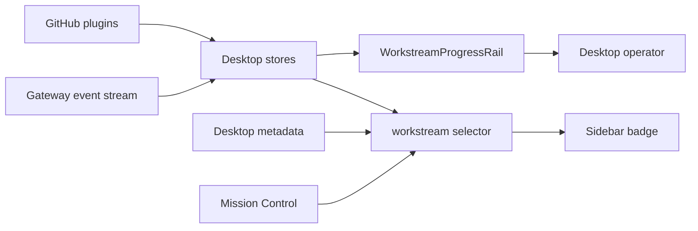

# Desktop Workstreams Phases 2-7 Implementation Plan

created: 2026-07-02
modified:
- 2026-07-02
commits:
- pending
agents:
- gpt-5.5/default
- deleg_46d70830/dual-plan-complete
- deleg_e586f727/dual-plan-complete
sessions:
- telegram-thread-61951
back refs:
- `docs/plans/2026-07-02-desktop-workstreams-mvp.md` — Phase 1 state model
fwd refs:
- `docs/plans/2026-07-02-desktop-workstreams-phases-2-7.planner-opus.md` — secondary planner artifact moved into this worktree

## SPEC

- **Goal:** Make Desktop the primary Workstreams UI. Telegram becomes optional pager, not the work surface.
- **Acceptance criteria:**
  1. Right rail shows live work for selected session: status, todos, subagents, background tools, workflow phases when available.
  2. Lifecycle states exist in Desktop-local metadata: close, safe-to-delete, restart-required, reopen.
  3. Sidebar filters and hotkeys cover active, blocked, review, closed workstreams.
  4. GitHub PR/deep-review plugin events open or update Desktop workstreams without Desktop-side GitHub auth.
  5. Plan-review blocks render natively for `wireframe`, `data-model`, `file-tree`, `mermaid`, `question-form`, `tabs`.
  6. Mission Control dashboard summarizes active, blocked, review, restart, and safe-delete workstreams.
- **Validation method:** TDD per phase. Run targeted UI tests, `npm run typecheck`, targeted ESLint, full build. Full lint may stay blocked only by documented pre-existing unrelated errors.
- **Out of scope:** new backend schema, new GitHub auth flow, new core tool schema, Telegram removal.
- **Constraints:** phase-by-phase commits to `main`; reuse Phase 1 `store/workstream.ts`; no plannotator approval wait; dual-plan runs in background.

> [!DECISION]
> Defaults locked by Alfredo: phase commits to `main`; Phase 2 uses a right-rail/collapsible panel; lifecycle metadata stays Desktop-local; GitHub bridge reuses existing plugin events; renderer starts with core block types.

```wireframe
surface: desktop
url: hermes://desktop/workstreams
<div class="wf-row" style="height:420px;gap:0">
  <div class="wf-col" style="width:220px;border-right:1px solid #394150;padding:10px">
    <b>Sessions</b>
    <div class="wf-card wf-row" style="justify-content:space-between"><span>Desktop Workstreams</span><span>✍️ 2</span></div>
    <div class="wf-card wf-row" style="justify-content:space-between"><span>PR review</span><span>🤖 3</span></div>
  </div>
  <div class="wf-col" style="flex:1;padding:14px">
    <h2>Chat thread</h2>
    <div class="wf-card" style="height:260px">Messages stay primary. Sidebar stays scan-only.</div>
    <div class="wf-card">Composer</div>
  </div>
  <div class="wf-col" style="width:304px;border-left:1px solid #394150;padding:10px;gap:10px">
    <div class="wf-row" style="justify-content:space-between"><b>Workstream</b><button>×</button></div>
    <div class="wf-card"><b>❓ needs your input</b><br><small>2 todos · 1 agent</small></div>
    <div class="wf-card"><b>Todos</b><br>✓ Scope defaults<br>⠋ Build progress rail</div>
    <div class="wf-card"><b>Subagents</b><br>⠋ Audit implementation<br><small>Search Files("workstream")</small></div>
    <div class="wf-card"><b>Tool activity</b><br>● npm run test:ui</div>
  </div>
</div>
```

```file-tree
{"title":"Main footprint","entries":[
  {"path":"apps/desktop/src/store/workstream.ts","change":"modified","note":"Phase 1 state selector reused by all phases"},
  {"path":"apps/desktop/src/store/workflows.ts","change":"added","note":"Optional workflow phase state for UI consumers"},
  {"path":"apps/desktop/src/app/workstream/workstream-progress-rail.tsx","change":"added","note":"Phase 2 right rail"},
  {"path":"apps/desktop/src/app/desktop-controller.tsx","change":"modified","note":"Pane + titlebar toggle wiring"},
  {"path":"apps/desktop/src/store/layout.ts","change":"modified","note":"Workstream pane registration"},
  {"path":"apps/desktop/src/app/shell/app-shell.tsx","change":"modified","note":"left-edge titlebar inset when flipped"}
]}
```

```data-model
{"entities":[
  {"name":"WorkstreamActivity","fields":[
    {"name":"sessionId","type":"string","pk":true},
    {"name":"state","type":"WorkstreamState"},
    {"name":"activeTodoCount","type":"number"},
    {"name":"activeSubagentCount","type":"number"},
    {"name":"needsInput","type":"boolean"}
  ]},
  {"name":"WorkflowProgress","fields":[
    {"name":"id","type":"string","pk":true},
    {"name":"title","type":"string"},
    {"name":"phases","type":"WorkflowPhaseProgress[]"}
  ]},
  {"name":"WorkflowPhaseProgress","fields":[
    {"name":"id","type":"string","pk":true},
    {"name":"title","type":"string"},
    {"name":"status","type":"pending|running|completed|failed|skipped"}
  ]}
],"relations":[
  {"from":"WorkstreamActivity","to":"WorkflowProgress","kind":"one-to-zero-or-one","label":"optional live workflow"}
]}
```



## Phase slices

| Phase | Build | Tests | Ship gate |
|---|---|---|---|
| 2 | Right-rail live progress panel | `workstream-progress-rail.test.tsx` | Targeted UI + typecheck + lint on changed files |
| 3 | Desktop-local lifecycle metadata/actions | lifecycle store tests + menu tests | Close/safe-delete/restart/reopen visible and persisted |
| 4 | Filters + hotkeys | sidebar filter/hotkey tests | active/blocked/review/closed filters, Alt navigation |
| 5 | GitHub bridge | plugin event adapter tests | PR/deep-review opens/updates workstream, no Desktop GitHub auth |
| 6 | Plan-review block renderer | block component tests | six block types render and sanitize |
| 7 | Mission Control cockpit | dashboard selector/component tests | active/blocked/review matrix matches workstream store |

## Phase 2 tasks

- [x] Write RED test: `apps/desktop/src/app/workstream/workstream-progress-rail.test.tsx`.
- [x] Add workflow phase store: `apps/desktop/src/store/workflows.ts`.
- [x] Add `WorkstreamProgressRail` consuming runtime-keyed selected-session stores.
- [x] Render the pending clarify question/choices as the needs-input reason.
- [x] Register `WORKSTREAM_PANE_ID` and wire `<Pane>` into `DesktopController`.
- [x] Add titlebar toggle and close button.
- [x] Run final Phase 2 gates.
- [x] Dual-review Phase 2 diff.
- [ ] Commit, merge to `main`, push.

## Phase 3 tasks

- [ ] Add `apps/desktop/src/store/workstream-metadata.ts` with persistent local metadata keyed by stored lineage id.
- [ ] Extend `WorkstreamState` derivation to honor explicit metadata states.
- [ ] Add SessionActionsMenu actions: Close, Reopen, Safe to delete, Restart required.
- [ ] Tests: metadata persistence, explicit-state priority, menu actions.

## Phase 4 tasks

- [ ] Add sidebar filter store: active, blocked, review, closed, safe-delete.
- [ ] Apply filters in virtual session list without changing session fetch shape.
- [ ] Add hotkeys: Alt+J/K navigation, Alt+M toggle filter/menu, Alt+, focus workstream panel.
- [ ] Tests: filter selector, hotkey handler.

## Phase 5 tasks

- [ ] Spike existing GitHub plugin event payloads from `gh-review-opener` and `gh-deepreview-opener`.
- [ ] Add Desktop event adapter only if event signal already exists.
- [ ] No new GitHub auth in Desktop.
- [ ] Tests: payload opens existing session or creates workstream metadata.

> [!RISK]
> GitHub bridge marker may not be stable. First task is a spike. If no marker exists, use explicit plugin-emitted metadata, not Desktop-side GitHub API calls.

## Phase 6 tasks

- [ ] Add native block renderer components for core plannotator fences.
- [ ] Start with JSON/HTML-safe rendering only. No raw unsanitized HTML in main document.
- [ ] Tests per block type: render valid, degrade invalid, sanitize attacker-controlled content.

## Phase 7 tasks

- [ ] Add Mission Control route/dashboard fed by workstream selectors.
- [ ] Cards: active, blocked, review, restart, safe-delete.
- [ ] Tests: selector grouping and dashboard empty/loaded states.

## Validation loop

- [x] `npm run test:ui -- src/app/workstream/workstream-progress-rail.test.tsx src/store/workstream.test.ts src/app/chat/sidebar/session-row.test.tsx` — 17 passing.
- [x] `npm run typecheck` — passing.
- [x] `npx eslint <changed files>` — passing after local fixes.
- [x] `git diff --check` — passing.
- [x] `npm run build` — passing. Warnings only: existing CSS token warning, large Tabler barrel warning.
- [x] `npm run lint` — blocked by six errors in unchanged baseline files: `electron/titlebar-overlay-width.cjs`, `src/app/session/hooks/use-prompt-actions/index.ts`, `src/app/session/hooks/use-prompt-actions/submit.ts`, `src/store/projects.ts`.
- [x] dual-review Phase 2 diff — 3 reviewers PASS, no blockers (`deleg_6e2a27fe`).

## Build Notes (deviations from plan)

- Fresh worktree had no `node_modules`; linked root/app `node_modules` from main checkout to run UI tests.
- Full `npm run lint` currently reports unrelated pre-existing lint errors outside Phase 2 files; changed-file ESLint passes.
- Workflow phase backend event source not verified yet; Phase 2 adds an optional store and renders it only when populated. No new gateway/core event added.
