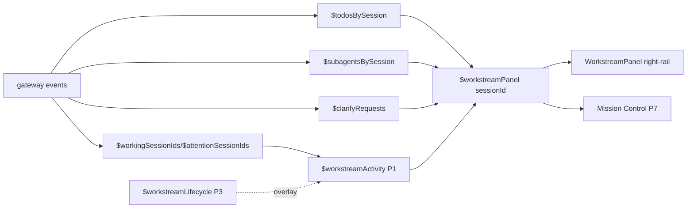

## SPEC

spec-stakes: high
planner-lane: planner-opus
base-sha: 800d605da (main; Phase 1 already merged)

**Goal:** Grow the Phase-1 Desktop Workstreams read model (sidebar badges) into a full monitoring + light-management surface: a collapsible right-rail Workstream panel (live progress), Desktop-local lifecycle actions, hotkeys/filters, a GitHub PR bridge that consumes existing event/plugin surfaces, native plan-approval block rendering, and a Mission Control cockpit — all renderer/store work, no new core model tools, no backend schema, no new user-facing `HERMES_*` env vars.

**Observable acceptance (per phase, all Desktop-testable):**

1. **P2 — Live progress panel.** A collapsible right-rail `Workstream` pane renders, for the active session: workstream state header (icon/label/tone from `WORKSTREAM_STATE_META`), todo roster (status-grouped), subagent roster (goal + status + `currentTool`), needs-input reason (clarify `question`/`choices`), and last tool activity. Empty/idle sessions render a quiet empty state. Panel reads only existing stores; no new event types.
2. **P3 — Lifecycle actions.** Each workstream (active + selected stored) can be set to a Desktop-local lifecycle: `reopen` (default/none), `restart-required`, `close`/`safe-to-delete`. State persists in `localStorage`, survives reload, is keyed by lineage-root id, and overlays the derived state (explicit lifecycle wins over derivation for `close`/`restart`). No backend write.
3. **P4 — Hotkeys + filters.** Sidebar/cockpit expose filters `active | blocked | needs-input | closed`; a hotkey cycles a Telegram-topic-style "jump to next needs-input/blocked workstream" navigation. Filter state is a store, testable in isolation.
4. **P5 — GitHub PR bridge.** PR / deep-scan events already emitted by the existing Hermes GitHub surfaces (gateway session events / webhook-driven sessions tagged as PR review) open or update a Desktop workstream row (state + label) via the existing session/event pipeline. No GitHub auth or API client inside Desktop; Desktop only classifies/labels sessions it already receives.
5. **P6 — Plan-approval blocks.** Fenced code blocks `wireframe`, `data-model`, `file-tree`, `mermaid`, `question-form`, `tabs` render as native components inside Desktop messages (and plan-approval views) instead of raw code. Unknown/obscure block languages fall back to today's code rendering unchanged.
6. **P7 — Mission Control cockpit.** A native Desktop dashboard (route) lists workstreams grouped by `active / blocked / needs-input`, each row linking to its session, reusing the P2 panel components and P3 lifecycle chips.

**Validation method (every slice):**
- Targeted Vitest: `cd apps/desktop && npm run test:ui -- <changed test files>`.
- `cd apps/desktop && npm run typecheck`.
- Changed-file lint: `cd apps/desktop && npx eslint <changed files>`.
- `cd apps/desktop && npm run build` (consequential slices only, and always before a phase's final commit).
- Cache/narrow-core guard per slice: `rg -n "HERMES_[A-Z_]+|new .*Tool\\(|def .*_tool" <changed backend files>` must return no new user-facing env var or new core model tool. P5 additionally: `rg` proves no new GitHub API client / OAuth in `apps/desktop/src`.
- Independent quality gate (dual-review + `dual-verify`) before merging P3, P5, P6 (the consequential slices that add persistence, cross-surface data, or new renderers).

**Out of scope:** backend SessionDB schema for workstream state; Telegram API parity; GitHub auth/OAuth or a PR API client in Desktop; obscure plan blocks beyond the six listed; multi-user/shared cockpit; mobile.

**Constraints / assumptions:** Phase-by-phase commits straight to `main` (short-lived worktree per phase, merge, clean). React 19 / TS / Nanostores / Vitest / Testing Library only in `apps/desktop`. Preserve prompt caching + narrow core (renderer/store over tools/backends). TDD per slice (test before production). Reuse Phase-1 `store/workstream.ts` vocabulary; do not fork it.

---

# Desktop Workstreams — Phases 2-7 Implementation Plan

> **For Hermes:** Build phase-by-phase in an isolated worktree per phase, test-first. Run per-slice verification; gate P3/P5/P6 with an independent review before merge to `main`. **Phase 2 is fully shippable on its own** — it depends on nothing from P3-P7. Ship P2 first while P3-P7 remain planned.

**Architecture:** Extend the renderer-only Workstream read model. Phase 1 gave a per-session derived `WorkstreamActivity`. Phases 2-7 add (a) a *panel projection* store that assembles the full roster from existing stores, (b) a *lifecycle overlay* store persisted in localStorage, (c) a *filter/navigation* store, (d) a session *classifier* that tags PR-review sessions from data Desktop already receives, (e) a set of *plan-block renderers*, and (f) a cockpit route composing the panel + lifecycle. No new gateway event types, no core tools, no backend schema.

**Tech Stack:** React 19, TypeScript, Nanostores, Vitest, Testing Library.

---

created: 2026-07-02
base: 800d605da
lane: planner-opus

## Right-rail Workstream panel wireframe

```wireframe
surface: desktop
url: hermes://desktop/chat (right rail, Workstream pane open)
<div class="wf-row" style="gap:0;width:760px;height:420px">
  <div class="wf-col" style="flex:1;border-right:1px solid #333;padding:8px">
    <div class="wf-row" style="justify-content:space-between"><b>Chat transcript</b><span class="wf-pill">⌘⇧W panel</span></div>
    <div class="wf-card" style="height:100%;opacity:.5">…messages…</div>
  </div>
  <div class="wf-col" style="width:300px;gap:8px;padding:8px">
    <div class="wf-row" style="justify-content:space-between">
      <div class="wf-row" style="gap:6px"><span>✍️</span><b>working on it now</b></div>
      <span class="wf-pill">⌘⇧W</span>
    </div>
    <div class="wf-card wf-col" style="gap:4px">
      <b>Todos · 4</b>
      <div class="wf-row" style="gap:6px"><span>◐</span>Wire panel store</div>
      <div class="wf-row" style="gap:6px"><span>○</span>Render roster</div>
      <div class="wf-row" style="gap:6px;opacity:.6"><span>✓</span>Read stores</div>
    </div>
    <div class="wf-card wf-col" style="gap:4px">
      <b>Subagents · 2</b>
      <div class="wf-row" style="gap:6px"><span>◐</span>planner-opus <span class="wf-pill">Read(…)</span></div>
      <div class="wf-row" style="gap:6px"><span>◐</span>planner-gpt <span class="wf-pill">Grep(…)</span></div>
    </div>
    <div class="wf-card wf-col warn" style="gap:4px">
      <b>❓ Needs your input</b>
      <div>Approve the migration plan? [Yes / Revise]</div>
    </div>
    <div class="wf-card wf-row" style="justify-content:space-between">
      <span>Lifecycle</span>
      <span class="wf-row" style="gap:4px"><span class="wf-pill">↩︎ reopen</span><span class="wf-pill warn">⚡ restart</span><span class="wf-pill muted">📁 close</span></span>
    </div>
    <div class="wf-card" style="opacity:.7">Last tool · Edit("workstream-panel.ts")</div>
  </div>
</div>
```

## Mission Control cockpit wireframe (P7)

```wireframe
surface: desktop
url: hermes://desktop/command-center (workstreams tab)
<div class="wf-col" style="width:720px;gap:8px;padding:10px">
  <div class="wf-row" style="gap:6px"><b>Mission Control</b><span class="wf-pill accent">active 3</span><span class="wf-pill warn">blocked 1</span><span class="wf-pill warn">needs input 2</span><span class="wf-pill muted">closed 5</span></div>
  <div class="wf-row" style="gap:6px"><span class="wf-pill">All</span><span class="wf-pill accent">Active</span><span class="wf-pill">Blocked</span><span class="wf-pill">Needs input</span><span class="wf-pill">Closed</span></div>
  <div class="wf-card wf-row" style="gap:8px"><span>❓</span><b>Plan review</b><span class="wf-pill warn">needs input</span><span style="margin-left:auto" class="wf-pill">open →</span></div>
  <div class="wf-card wf-row" style="gap:8px"><span>❗️</span><b>Migration branch</b><span class="wf-pill danger">blocked · failed agent</span><span style="margin-left:auto" class="wf-pill">open →</span></div>
  <div class="wf-card wf-row" style="gap:8px"><span>🤖</span><b>PR #43512 deep scan</b><span class="wf-pill">2 agents</span><span style="margin-left:auto" class="wf-pill">open →</span></div>
</div>
```

## State model (renderer-only; additions over Phase 1)

```data-model
{"entities":[
 {"name":"WorkstreamActivity","note":"Phase 1, unchanged","fields":[{"name":"sessionId","type":"string","pk":true},{"name":"state","type":"WorkstreamState"},{"name":"needsInput","type":"boolean"},{"name":"activeTodoCount","type":"number"},{"name":"activeSubagentCount","type":"number"},{"name":"failedSubagentCount","type":"number"}]},
 {"name":"WorkstreamPanel","note":"P2 projection assembled from existing stores","fields":[{"name":"sessionId","type":"string","pk":true},{"name":"activity","type":"WorkstreamActivity"},{"name":"todos","type":"TodoItem[]"},{"name":"subagents","type":"SubagentProgress[]"},{"name":"clarify","type":"ClarifyRequest|null"},{"name":"lastTool","type":"string|null"}]},
 {"name":"WorkstreamLifecycle","note":"P3 localStorage overlay, keyed by lineage-root id","fields":[{"name":"lineageId","type":"string","pk":true},{"name":"phase","type":"'reopen'|'restart-required'|'close'"},{"name":"updatedAt","type":"number"}]},
 {"name":"WorkstreamFilter","note":"P4 store","fields":[{"name":"active","type":"'all'|'active'|'blocked'|'needs-input'|'closed'","pk":true}]},
 {"name":"PrWorkstreamTag","note":"P5 classification derived from SessionInfo Desktop already has","fields":[{"name":"sessionId","type":"string","pk":true},{"name":"kind","type":"'pr-review'|'deep-scan'"},{"name":"prLabel","type":"string"}]}
 ],
 "relations":[
 {"from":"WorkstreamPanel","to":"WorkstreamActivity","kind":"one-to-one","label":"wraps"},
 {"from":"WorkstreamPanel","to":"WorkstreamLifecycle","kind":"many-to-one","label":"overlaid by (via lineage id)"},
 {"from":"PrWorkstreamTag","to":"WorkstreamPanel","kind":"one-to-one","label":"labels"}
 ]}
```

## File footprint (all phases)

```file-tree
{"title":"Phases 2-7","entries":[
 {"path":"apps/desktop/src/store/workstream-panel.ts","change":"created","note":"P2 per-session panel projection selector (todos+subagents+clarify+lastTool)"},
 {"path":"apps/desktop/src/store/workstream-panel.test.ts","change":"created","note":"P2 projection identity + roster assembly tests"},
 {"path":"apps/desktop/src/app/chat/workstream/panel.tsx","change":"created","note":"P2 right-rail panel component"},
 {"path":"apps/desktop/src/app/chat/workstream/panel.test.tsx","change":"created","note":"P2 render tests: roster, needs-input reason, empty state"},
 {"path":"apps/desktop/src/store/layout.ts","change":"modified","note":"P2 register WORKSTREAM_PANE_ID + open/toggle helpers"},
 {"path":"apps/desktop/src/app/desktop-controller.tsx","change":"modified","note":"P2 mount workstreamPane in the rail panes array"},
 {"path":"apps/desktop/src/store/workstream-lifecycle.ts","change":"created","note":"P3 persisted lifecycle overlay + merge into activity"},
 {"path":"apps/desktop/src/store/workstream-lifecycle.test.ts","change":"created","note":"P3 persistence, lineage keying, overlay precedence"},
 {"path":"apps/desktop/src/app/chat/workstream/lifecycle-actions.tsx","change":"created","note":"P3 reopen/restart/close chips"},
 {"path":"apps/desktop/src/app/chat/workstream/lifecycle-actions.test.tsx","change":"created","note":"P3 action + persistence render tests"},
 {"path":"apps/desktop/src/store/workstream-filter.ts","change":"created","note":"P4 filter + next-attention navigation store"},
 {"path":"apps/desktop/src/store/workstream-filter.test.ts","change":"created","note":"P4 filter predicate + cycle-order tests"},
 {"path":"apps/desktop/src/lib/keybinds/actions.ts","change":"modified","note":"P4 register workstream filter/jump keybind actions"},
 {"path":"apps/desktop/src/app/hooks/use-keybinds.ts","change":"modified","note":"P4 wire hotkey → filter/jump"},
 {"path":"apps/desktop/src/store/workstream-github.ts","change":"created","note":"P5 classify PR-review/deep-scan sessions from existing SessionInfo/events"},
 {"path":"apps/desktop/src/store/workstream-github.test.ts","change":"created","note":"P5 classifier tests from fixture SessionInfo/events"},
 {"path":"apps/desktop/src/components/assistant-ui/plan-blocks/index.tsx","change":"created","note":"P6 dispatcher: language → block renderer, fallback to code"},
 {"path":"apps/desktop/src/components/assistant-ui/plan-blocks/wireframe.tsx","change":"created","note":"P6"},
 {"path":"apps/desktop/src/components/assistant-ui/plan-blocks/data-model.tsx","change":"created","note":"P6"},
 {"path":"apps/desktop/src/components/assistant-ui/plan-blocks/file-tree.tsx","change":"created","note":"P6"},
 {"path":"apps/desktop/src/components/assistant-ui/plan-blocks/mermaid.tsx","change":"created","note":"P6 (mermaid dep already vendored in node_modules/.vite)"},
 {"path":"apps/desktop/src/components/assistant-ui/plan-blocks/question-form.tsx","change":"created","note":"P6"},
 {"path":"apps/desktop/src/components/assistant-ui/plan-blocks/tabs.tsx","change":"created","note":"P6"},
 {"path":"apps/desktop/src/components/assistant-ui/plan-blocks/index.test.tsx","change":"created","note":"P6 dispatcher + per-block render + fallback tests"},
 {"path":"apps/desktop/src/components/assistant-ui/markdown-text.tsx","change":"modified","note":"P6 route fenced code with known plan language to dispatcher"},
 {"path":"apps/desktop/src/app/command-center/workstreams.tsx","change":"created","note":"P7 cockpit dashboard reusing panel + lifecycle + filter"},
 {"path":"apps/desktop/src/app/command-center/workstreams.test.tsx","change":"created","note":"P7 grouping + navigation tests"}
]}
```

## Data flow (P2)



---

## Phase 2 — Live progress panel  *(ships first, standalone)*

**Data source note:** todos = `$todosBySession`; subagents = `$subagentsBySession` (use `SubagentProgress.currentTool`/`goal`/`status`); needs-input reason = `$clarifyRequests[keyFor(activeSessionId)]`; last tool = derive from the most recent running subagent `currentTool` or, when none, from the latest tool part — start with subagent `currentTool` to avoid coupling to transcript internals. Reuse P1 `$workstreamActivity(sessionId)` for the header. No workflow-phase source exists → render workflow phases only if a `workflow` state is derived; otherwise omit the section (do not invent an event).

- [ ] **2.1** Write failing `workstream-panel.test.ts`: projection assembles roster from the four stores; returns a stable object (identity preserved) when an *unrelated* session's stores change; surfaces clarify reason for the active session only; `lastTool` reflects newest running subagent.
- [ ] **2.2** Create `store/workstream-panel.ts`: `$workstreamPanel(sessionId)` keyed computed atom (mirror P1's cache + `same*` identity guard) composing `$workstreamActivity`, `$todosBySession`, `$subagentsBySession`, `$clarifyRequests`, resolving the selected-stored→active runtime id exactly as P1 does.
- [ ] **2.3** Write failing `panel.test.tsx`: renders state header, todo roster (grouped active/completed), subagent roster with `currentTool` chip, needs-input card with `question` + `choices`, and an idle empty state.
- [ ] **2.4** Create `app/chat/workstream/panel.tsx` consuming `$workstreamPanel(activeSessionId)`; reuse `agents/index.tsx` subagent-row vocabulary (status glyph) where cheap.
- [ ] **2.5** Register `WORKSTREAM_PANE_ID` in `store/layout.ts` (`ensurePaneRegistered(..., { open:false })`, `$workstreamPaneOpen`, `toggleWorkstreamPane`), add `workstreamPane` `<Pane>` in `desktop-controller.tsx` rail array (default closed, `hoverReveal`, `side={railSide}`).
- [ ] **2.6** Verify: targeted Vitest (2 test files), typecheck, changed-file eslint, `npm run build`. Commit → merge to `main`.

## Phase 3 — Lifecycle actions  *(consequential: adds persistence)*

- [ ] **3.1** Failing `workstream-lifecycle.test.ts`: set/clear `restart-required`/`close`/`reopen`; persists to localStorage; keyed by `sessionPinId` (lineage root) so compression rotation preserves it; `reopen` clears the entry.
- [ ] **3.2** Create `store/workstream-lifecycle.ts` (`persistentAtom<Record<lineageId,{phase,updatedAt}>>`), plus a pure `applyLifecycleOverlay(activity, phase)` mapping `close→'close'`, `restart-required→'restart'` (explicit wins over derived; `reopen`/absent = derived state untouched).
- [ ] **3.3** Wire overlay into `$workstreamActivity` **read path** without breaking P1 tests: prefer a thin wrapper selector so P1's `deriveWorkstreamActivity` stays pure (keeps P1 tests green, preserves narrow core).
- [ ] **3.4** Failing `lifecycle-actions.test.tsx`: chips set phase, reflect persisted state, and `reopen` restores derived state.
- [ ] **3.5** Create `app/chat/workstream/lifecycle-actions.tsx`; mount in the P2 panel footer.
- [ ] **3.6** Verify (full gate incl. build) + independent quality-gate review. Commit → merge.

## Phase 4 — Hotkeys + filters

- [ ] **4.1** Failing `workstream-filter.test.ts`: predicate for `active|blocked|needs-input|closed` over `WorkstreamActivity` (+ lifecycle); `nextAttentionSessionId(list, current)` cycles blocked/needs-input in a stable order.
- [ ] **4.2** Create `store/workstream-filter.ts` (`$workstreamFilter` atom + pure predicate + cycle helper).
- [ ] **4.3** Register keybind actions in `lib/keybinds/actions.ts` (cycle filter; jump-to-next-attention) and wire in `use-keybinds.ts` (no new env var; follows existing action registry).
- [ ] **4.4** Apply filter to sidebar recents list (reuse existing entry list; filter is opt-in, default `all` so existing scan-only sidebar is unchanged when no filter active).
- [ ] **4.5** Verify (targeted + typecheck + lint; build). Commit → merge.

## Phase 5 — GitHub PR bridge  *(consequential: cross-surface data)*

**Principle:** Desktop already receives PR-review/deep-scan sessions as ordinary sessions (webhook/gateway-driven). We *classify* them from `SessionInfo` fields Desktop already has (source/title/handoff/cwd/branch) + existing events — no new event type, no GitHub API, no auth in Desktop.

- [ ] **5.1** Confirm the signal: inspect `SessionInfo` (`types/hermes.ts`) + gateway `session.info`/webhook session metadata for a stable PR marker (source id, title pattern like `PR #\d+`, or handoff origin). Pick the most stable, document it in the test as a fixture. If no reliable signal exists, scope P5 to title/branch heuristic + explicit tag and record the limitation (do not fabricate a backend field).
- [ ] **5.2** Failing `workstream-github.test.ts`: classifier maps fixture `SessionInfo`/events → `{kind:'pr-review'|'deep-scan', prLabel}`; non-PR sessions → null.
- [ ] **5.3** Create `store/workstream-github.ts`: pure `classifyPrWorkstream(session, events?)`; expose a derived tag map. No side effects on the session pipeline.
- [ ] **5.4** Surface the PR label in the P2 panel header + cockpit row (open/update = the session already opens/updates via the existing pipeline; we only relabel).
- [ ] **5.5** Verify: targeted + typecheck + lint + build; `rg` proves no OAuth/API client added under `apps/desktop/src`. Independent quality-gate review. Commit → merge.

## Phase 6 — Plan-approval blocks  *(consequential: new renderers)*

- [ ] **6.1** Failing `plan-blocks/index.test.tsx`: dispatcher renders each of the six languages to its component; unknown language falls through to existing code rendering; malformed payloads render a graceful fallback (never throw).
- [ ] **6.2** Create per-block components (`wireframe`, `data-model`, `file-tree`, `mermaid`, `question-form`, `tabs`) — parse the fenced payload (JSON for data-model/file-tree/question-form/tabs; the Phase-1 doc's own `wireframe`/`data-model`/`file-tree` payloads are the canonical fixtures). `mermaid` uses the mermaid dep already present in `node_modules/.vite`.
- [ ] **6.3** Create `plan-blocks/index.tsx` dispatcher (map language→component, safe fallback).
- [ ] **6.4** Route fenced code in `markdown-text.tsx` through the dispatcher **only** for the six known languages (preserve all other code rendering byte-for-byte; guard the streaming/`SmoothStreamingText` path so partial fences don't crash mid-stream).
- [ ] **6.5** Verify: targeted + typecheck + lint + build. Independent quality-gate review (renderer surface is high blast-radius). Commit → merge.

## Phase 7 — Mission Control cockpit

- [ ] **7.1** Failing `command-center/workstreams.test.tsx`: given a fixture session list + activities, groups into `active/blocked/needs-input`; applies P4 filter; each row exposes an "open session" affordance; reuses P3 lifecycle chips.
- [ ] **7.2** Create `app/command-center/workstreams.tsx` composing: per-session `$workstreamPanel` summaries, P4 filter store, P3 lifecycle chips, P5 PR labels. Mount under the existing `command-center` route (already a declared route stub in `desktop-controller.tsx`).
- [ ] **7.3** Verify: targeted + typecheck + lint + build. Commit → merge.

---

## Risks & sequencing choices

1. **Panel re-render churn (P2).** The sidebar already proved that whole-map store subscriptions thrash every mounted row. The panel mounts once for the active session, so risk is lower, but still assemble the projection through a keyed computed atom with a `same*` identity guard (mirror P1) so token-stream subagent heartbeats don't re-render the whole roster each frame. *Mitigation baked into 2.2.*
2. **No workflow-phase event exists.** `rg` found zero `workflow_phase`/phase-event surfaces in the backend. Do **not** add one (would violate narrow-core). Render the workflow section only when a `workflow` state is derived; otherwise omit. *Locked in P2 data-source note.*
3. **Lifecycle overlay vs P1 purity (P3).** Folding lifecycle into `deriveWorkstreamActivity` would break P1's pure-function tests and couple derivation to persistence. Keep derivation pure; overlay in a wrapper selector (3.3). Key on lineage root (`sessionPinId`) so auto-compression doesn't drop the state.
4. **P5 signal uncertainty.** The riskiest phase: it assumes a stable PR marker exists on `SessionInfo`/events Desktop already receives. 5.1 is a spike-first gate — if no reliable marker exists, P5 degrades to a title/branch heuristic + explicit tag rather than inventing a backend field or adding an API client. This keeps "no new auth / no new core" intact.
5. **Markdown renderer blast radius (P6).** `markdown-text.tsx` is on the hot streaming path (`SmoothStreamingText`, block cache). Only intercept the six known languages; everything else must render exactly as today. Guard against partial/streaming fences (6.4). This is why P6 gets an independent gate.
6. **Sequencing:** P2 is independent and ships first. P3 depends on P1 activity + P2 panel (chips live in the panel footer). P4 depends on P3 (for the `closed` filter). P5 and P6 are independent of P3/P4 and of each other — they can be built in parallel worktrees after P2. P7 depends on P2 (panel components), P3 (chips), P4 (filter), and P5 (labels), so it lands last. Recommended merge order: **P2 → P3 → P4 → (P5 ∥ P6) → P7.**

## What ships as Phase 2 first
Phase 2 (the right-rail live progress panel) has **zero dependency** on P3-P7: it only reads existing stores (`$todosBySession`, `$subagentsBySession`, `$clarifyRequests`, `$workingSessionIds`/`$attentionSessionIds`) and the already-merged P1 `$workstreamActivity`. It mounts through the existing `<Pane>` rail machinery. It can be committed to `main` and used immediately while P3-P7 remain in this plan. Everything after P2 is additive overlay/filter/renderer/cockpit work.
