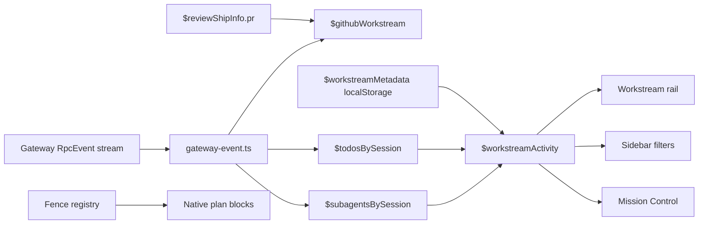

## SPEC

- **Goal:** Make Hermes Desktop the primary Workstreams UI for lifecycle control, filters, GitHub-triggered workstreams, native plan blocks, and a Mission Control cockpit.
- **Acceptance criteria:**
  1. Desktop-local persisted lifecycle metadata supports `closed`, `safe_delete`, `restart_required`, and reopen, keyed by stored session id.
  2. Lifecycle metadata feeds `deriveWorkstreamActivity` through existing `explicitState`, not a second state model.
  3. Sidebar filters and rebindable hotkeys cover active, blocked, review, closed, and safe-delete workstreams.
  4. A grounded Desktop review signal (`$reviewShipInfo.pr`) can enrich the current workstream with PR context without Desktop-side GitHub API auth; GitHub-triggered open/reopen is spike-gated and not assumed until a concrete session-keyed event source is verified.
  5. Chat fences render native plan blocks for `wireframe`, `data-model`, `file-tree`, `question-form`, and `tabs`; `mermaid` already exists.
  6. Mission Control overlay groups workstreams by active, blocked, review, restart, and safe-delete state and can jump to the owning session.
  7. Each phase ships as its own verified commit to `main`.
- **Validation method:** TDD per phase, targeted `npm run test:ui`, `npm run typecheck`, changed-file `eslint`, `npm run build`, `git diff --check`. Full `npm run lint` can be `baseline-blocked` only with unchanged failing files listed.
- **Out of scope:** backend lifecycle schema, Desktop GitHub auth, Desktop GitHub REST/GraphQL calls, Telegram removal, new core tool schema, broad rewrite of session loading.
- **Constraints and assumptions:** Phase-by-phase commits to `main`; no plannotator approval wait; reuse Phase 1/2 workstream model; primary worktree may be unrelated, so build in isolated phase worktrees.

# Desktop Workstreams Phases 3-7 Implementation Plan

> **For Hermes:** Use subagent-driven-development style: TDD, small phase slices, verify before ship. Alfredo pre-approved defaults, so save artifact and implement without `plan_review_start`.

created: 2026-07-03T01:11Z
modified:
- 2026-07-03T01:11Z
- 2026-07-03T01:25Z - folded plan-review blockers for Phase 4 hotkeys, Phase 5 grounded GitHub scope, Phase 7 overlay routing, and closed-vs-safe-delete coverage.
- 2026-07-03T02:17Z - backfilled shipped Phase 3 commit SHA.
commits:
- phase3: 0e699beba458844ea86d2489c318078f92818d8a
agents:
- planner-codex / dual-plan
- planner-opus / dual-plan
- gpt-5.5 / synthesis
- gpt-5.5 / plan-review synthesis
sessions:
- telegram-thread-61951
back refs:
- `docs/plans/2026-07-02-desktop-workstreams-mvp.md` - Phase 1 state model
- `docs/plans/2026-07-02-desktop-workstreams-phases-2-7.md` - Phase 2 shipped seed plan
fwd refs:
- pending

## Ground truth checked

| Claim | Verdict |
|---|---|
| `origin/main` | `c057299f1049347fddac2b37283a1a8b95b77d5c` |
| Phase 2 plan exists | yes |
| `plugins/gh-review-opener` | absent on `origin/main` |
| `plugins/gh-deepreview-opener` | absent on `origin/main` |
| `scripts/mission-control-context.py` | absent on `origin/main` |
| `gateway/todo_card.py` | present on `origin/main` |
| `gateway/subagent_roster.py` | present on `origin/main` |
| `WorkstreamState` has `close`, `restart`, `plan_review`, `verify` | yes |
| `deriveWorkstreamActivity` accepts `explicitState` | yes |
| fence registry has `mermaid` + `svg` only | yes |
| route/keybind seams exist | `routes.ts`, `keybinds/actions.ts`, `use-keybinds.ts` |

> [!DECISION]
> Lifecycle is a Desktop-local persisted overlay keyed by stored session id. It maps to existing `WorkstreamState` values through `explicitState`. No server schema. No new enum for `closed` or `safe_delete`.

> [!DECISION]
> Phase 5 is enrichment-first and spike-gated. The named GitHub opener plugins are absent in this repo, and `$reviewShipInfo.pr` is grounded but not session-keyed. Do not claim external GitHub events open workstreams unless a concrete Desktop-consumed session-keyed source is found.

> [!RISK]
> A planner incorrectly reported `gateway/todo_card.py` and `gateway/subagent_roster.py` absent. They are present. This plan treats them as current gateway surfaces, but Phase 3 does not need them.

```wireframe
surface: desktop
url: hermes://desktop/workstreams
<div class="wf-row" style="height:440px;gap:0;background:#10151d;color:#dbe4ef">
  <div class="wf-col" style="width:238px;border-right:1px solid #334155;padding:10px;gap:8px">
    <b>Sessions</b>
    <div class="wf-row" style="gap:4px;flex-wrap:wrap">
      <button>Active</button><button>Blocked</button><button>Review</button>
      <button>Closed</button><button>Safe delete</button>
    </div>
    <div class="wf-card wf-row" style="justify-content:space-between"><span>PR review</span><span>🗳 2</span></div>
    <div class="wf-card wf-row" style="justify-content:space-between"><span>Desktop phase 5</span><span>⚡</span></div>
    <div class="wf-card wf-row" style="justify-content:space-between;opacity:.6"><span>Old worktree</span><span>📁</span></div>
  </div>
  <div class="wf-col" style="flex:1;padding:14px;gap:10px">
    <h2>Chat thread</h2>
    <div class="wf-card" style="height:260px">Messages + native plan blocks render here.</div>
    <div class="wf-card">Composer</div>
  </div>
  <div class="wf-col" style="width:320px;border-left:1px solid #334155;padding:10px;gap:10px">
    <div class="wf-row" style="justify-content:space-between"><b>Workstream</b><button>×</button></div>
    <div class="wf-card"><b>⚡ restart required</b><br><small>2 todos · 1 agent</small></div>
    <div class="wf-card"><b>Lifecycle</b><br><button>Close</button> <button>Safe delete</button> <button>Reopen</button></div>
    <div class="wf-card"><b>Todos</b><br>✓ Read current seams<br>⠋ Wire Desktop overlay</div>
    <div class="wf-card"><b>Mission Control</b><br>Active 4 · Blocked 1 · Review 2 · Restart 1 · Safe delete 3</div>
  </div>
</div>
```

```data-model
{"entities":[
  {"name":"WorkstreamLifecycleMetadata","fields":[
    {"name":"storedSessionId","type":"string","pk":true},
    {"name":"lifecycle","type":"active|closed|safe_delete|restart_required"},
    {"name":"updatedAt","type":"number"}
  ]},
  {"name":"GithubWorkstreamLink","fields":[
    {"name":"sessionId","type":"string","pk":true},
    {"name":"source","type":"review-ship-info|plugin-event"},
    {"name":"repo","type":"string|null"},
    {"name":"prNumber","type":"number|null"},
    {"name":"url","type":"string|null"},
    {"name":"title","type":"string|null"},
    {"name":"updatedAt","type":"number"}
  ]},
  {"name":"WorkstreamBucket","fields":[
    {"name":"bucket","type":"active|blocked|review|restart|safe_delete|closed"},
    {"name":"sessionIds","type":"string[]"},
    {"name":"count","type":"number"}
  ]}
],"relations":[
  {"from":"WorkstreamLifecycleMetadata","to":"WorkstreamActivity","kind":"one-to-one-overlay","label":"maps to explicitState"},
  {"from":"GithubWorkstreamLink","to":"WorkstreamActivity","kind":"many-to-one","label":"enriches rail and cockpit"}
]}
```

```file-tree
{"title":"Main footprint","entries":[
  {"path":"apps/desktop/src/store/workstream-metadata.ts","change":"added","note":"Phase 3 persisted lifecycle overlay"},
  {"path":"apps/desktop/src/store/workstream.ts","change":"modified","note":"Phase 3 consume lifecycle metadata via explicitState; Phase 4 exposes filter helpers"},
  {"path":"apps/desktop/src/app/chat/sidebar/session-actions-menu.tsx","change":"modified","note":"Phase 3 lifecycle menu actions"},
  {"path":"apps/desktop/src/store/workstream-filter.ts","change":"added","note":"Phase 4 filter atom, predicates, buckets"},
  {"path":"apps/desktop/src/app/chat/sidebar/sessions-section.tsx","change":"modified","note":"Phase 4 filter chips and filtered list"},
  {"path":"apps/desktop/src/lib/keybinds/actions.ts","change":"modified","note":"Phase 4 and Phase 7 rebindable actions"},
  {"path":"apps/desktop/src/app/hooks/use-keybinds.ts","change":"modified","note":"Phase 4 hotkey handlers"},
  {"path":"apps/desktop/src/store/github-workstream.ts","change":"added","note":"Phase 5 PR/ref metadata store"},
  {"path":"apps/desktop/src/app/session/hooks/use-message-stream/gateway-event.ts","change":"modified","note":"Phase 5 additive event consumer if existing stream carries signal"},
  {"path":"apps/desktop/src/components/assistant-ui/embeds/registry.tsx","change":"modified","note":"Phase 6 register five plan block embeds"},
  {"path":"apps/desktop/src/components/assistant-ui/embeds/wireframe-embed.tsx","change":"added","note":"Phase 6 sanitized wireframe renderer"},
  {"path":"apps/desktop/src/components/assistant-ui/embeds/data-model-embed.tsx","change":"added","note":"Phase 6 JSON renderer"},
  {"path":"apps/desktop/src/components/assistant-ui/embeds/file-tree-embed.tsx","change":"added","note":"Phase 6 JSON renderer"},
  {"path":"apps/desktop/src/components/assistant-ui/embeds/question-form-embed.tsx","change":"added","note":"Phase 6 display-only form renderer"},
  {"path":"apps/desktop/src/components/assistant-ui/embeds/tabs-embed.tsx","change":"added","note":"Phase 6 display-only tabs renderer"},
  {"path":"apps/desktop/src/store/mission-control.ts","change":"added","note":"Phase 7 grouping selectors"},
  {"path":"apps/desktop/src/app/workstreams/index.tsx","change":"added","note":"Phase 7 overlay view"},
  {"path":"apps/desktop/src/app/routes.ts","change":"modified","note":"Phase 7 route and overlay registration"},
  {"path":"apps/desktop/src/app/desktop-controller.tsx","change":"modified","note":"Phase 7 lazy mount; Phase 4 focus hook"}
]}
```



## Phase 3 - Lifecycle metadata + actions

**Objective:** Desktop-local persisted lifecycle overrides derived state and exposes close/restart/delete-ready actions.

- [x] Task 3.1 - Add RED store tests in `apps/desktop/src/store/workstream-metadata.test.ts`.
  - `setWorkstreamLifecycle('stored-1', 'restart_required')` persists and maps to `restart`.
  - `setWorkstreamLifecycle('stored-1', 'safe_delete')` persists and maps to `close`.
  - `setWorkstreamLifecycle('stored-1', 'closed')` persists as `closed`, maps to `close` only for derived activity, and stays distinct from `safe_delete` for later filters/cockpit grouping.
  - `setWorkstreamLifecycle('stored-1', 'active')` clears the entry.
- [x] Task 3.2 - Create `apps/desktop/src/store/workstream-metadata.ts`.
  - Use existing persistence helpers/patterns in Desktop stores.
  - Export `WorkstreamLifecycle = 'active' | 'closed' | 'safe_delete' | 'restart_required'`.
  - Export `$workstreamMetadata`, `setWorkstreamLifecycle`, `workstreamLifecycle`, `explicitStateForLifecycle`.
- [x] Task 3.3 - Feed metadata into `apps/desktop/src/store/workstream.ts`.
  - Add `$workstreamMetadata` through a split computed selector so Nanostores tuple typing stays stable.
  - Map lifecycle to display state with `explicitStateForLifecycle(workstreamLifecycle(sessionId))`.
  - Keep runtime id fallback intact.
- [x] Task 3.4 - Add RED menu tests in `apps/desktop/src/app/chat/sidebar/session-actions-menu.lifecycle.test.tsx`.
  - Close sets `closed`.
  - Safe to delete sets `safe_delete`.
  - Restart required sets `restart_required`.
  - Reopen clears metadata and only appears for metadata-backed sessions.
- [x] Task 3.5 - Add lifecycle actions to `session-actions-menu.tsx`.
  - Labels: `Close workstream`, `Mark safe to delete`, `Mark restart required`, `Reopen workstream`.
  - Use current menu/action patterns and existing icon set.
- [x] Task 3.6 - Update plan metadata with Phase 3 commit SHA after ship.
  - Shipped Phase 3 commit: `0e699beba458844ea86d2489c318078f92818d8a`.
- [x] Phase 3 gate:
  - [x] `cd apps/desktop && npm run test:ui -- src/store/workstream-metadata.test.ts src/store/workstream.test.ts src/app/chat/sidebar/session-actions-menu.lifecycle.test.tsx src/app/chat/sidebar/session-actions-menu.test.ts src/app/chat/sidebar/session-row.test.tsx` → 5 files / 31 tests passed.
  - [x] `cd apps/desktop && npm run typecheck` → pass.
  - [x] explicit changed/untracked-file `npx eslint ...` → pass.
  - [x] `cd apps/desktop && npm run build` → pass.
  - [x] `git diff --check` → pass.
  - [x] `cd apps/desktop && npm run lint` attempted → baseline-blocked by unchanged files: `electron/titlebar-overlay-width.cjs`, `src/app/session/hooks/use-prompt-actions/index.ts`, `src/app/session/hooks/use-prompt-actions/submit.ts`, `src/store/projects.ts`; changed-file eslint passed.

## Phase 4 - Filters + hotkeys

**Objective:** Filter the sidebar by workstream state and add rebindable navigation/focus hotkeys.

- [x] Task 4.1 - Add `apps/desktop/src/store/workstream-filter.test.ts` with predicate coverage.
  - `closed` and `safe_delete` metadata must filter/group separately even though both display through `WorkstreamState.close`.
- [x] Task 4.2 - Add `apps/desktop/src/store/workstream-filter.ts`.
  - `WORKSTREAM_FILTERS = ['all','active','blocked','review','closed','safe-delete']`.
  - `$workstreamFilter` persisted locally.
  - `cycleWorkstreamFilter()`.
  - `workstreamFilterPredicate(filter)` over `WorkstreamActivity` + lifecycle metadata.
- [x] Task 4.3 - Apply filters in `apps/desktop/src/app/chat/sidebar/sessions-section.tsx` before passing rows to `VirtualSessionList`.
- [x] Task 4.4 - Add filter chips in sidebar. Keep `virtual-session-list.tsx` render-only.
- [x] Task 4.5 - Add rebindable keybind actions in `apps/desktop/src/lib/keybinds/actions.ts`.
  - `workstream.navNext` default `alt+j`.
  - `workstream.navPrev` default `alt+k`.
  - `workstream.cycleFilter` default `alt+m`.
  - `view.focusWorkstream` default `alt+,`.
- [x] Task 4.6 - Add handlers in `apps/desktop/src/app/hooks/use-keybinds.ts`.
  - Navigate within filtered list.
  - Cycle filter.
  - Open + focus workstream pane.
  - Because `comboAllowedInInput(combo)` currently suppresses `alt+...` in editable targets, explicitly allow these workstream action IDs while editable targets are focused, or choose non-conflicting `mod`/`ctrl` defaults before coding.
  - Add `apps/desktop/src/app/hooks/use-keybinds.test.tsx` coverage proving the chosen defaults fire while the composer/input has focus.
- [x] Phase 4 gate:
  - [x] `cd apps/desktop && npm run test:ui -- src/store/workstream-filter.test.ts src/app/chat/sidebar/sessions-section.test.tsx src/app/hooks/use-keybinds.test.tsx` → 18 tests passed.
  - [x] `cd apps/desktop && npm run typecheck` → pass.
  - [x] changed-file `eslint` → pass.
  - [x] `cd apps/desktop && npm run build` → pass.
  - [x] `git diff --check` → pass.
  - [x] `cd apps/desktop && npm run lint` attempted → baseline-blocked by unchanged files: `electron/titlebar-overlay-width.cjs`, `src/app/session/hooks/use-prompt-actions/index.ts`, `src/app/session/hooks/use-prompt-actions/submit.ts`, `src/store/projects.ts`; warnings also remain in unchanged `src/app/settings/model-settings.tsx`, `src/app/shell/context-usage-panel.tsx`, and `src/app/starmap/node-context-menu.tsx`.

## Phase 5 - GitHub bridge, enrichment first

**Objective:** Enrich the current/selected Desktop workstream from grounded Desktop review PR state. No Desktop GitHub auth, no new core/gateway schema, and no claim that external GitHub events open workstreams unless the spike proves a concrete session-keyed event source.

- [x] Task 5.1 - Read-only spike.
  - `git grep -ni "reviewShipInfo\|HermesReviewShipInfo\|pull_request\|github\|prNumber" origin/main -- apps/desktop/src gateway plugins`
  - Current grounded Desktop signal source: `desktopGit().review.shipInfo(repoPath)` feeds `refreshShipInfo()` and `$reviewShipInfo.pr` in `apps/desktop/src/store/review.ts`; type source is `HermesReviewShipInfo.pr` in `apps/desktop/src/global.d.ts`.
  - No Desktop-consumed session-keyed GitHub event exists in `origin/main`; Phase 5 continues as `$reviewShipInfo.pr` enrichment only and external open/reopen remains out of scope.
- [x] Task 5.2 - Add `apps/desktop/src/store/github-workstream.test.ts`.
  - Link current/selected stored session id to `$reviewShipInfo.pr`.
  - When enrichment updates a session whose lifecycle metadata is `closed` or `safe_delete`, clear lifecycle via `setWorkstreamLifecycle(sessionId, 'active')`.
- [x] Task 5.3 - Add `apps/desktop/src/store/github-workstream.ts`.
  - Atom keyed by live/stored session id as needed.
  - Upsert/read helper.
  - Subscriber or handler for `$reviewShipInfo.pr` if it is the grounded source.
  - Reopen only the specifically enriched current/selected session; do not infer or create sessions from PR data.
- [x] Task 5.4 - Additive event consumer skipped: spike found no grounded Desktop-consumed, safe opt-in, session-keyed GitHub event. No gateway/core event invented in this phase.
- [x] Task 5.5 - Render GitHub chip in `WorkstreamProgressRail` when link exists.
- [x] Phase 5 gate:
  - [x] `cd apps/desktop && npm run test:ui -- src/store/github-workstream.test.ts src/app/workstream/workstream-progress-rail.test.tsx` → 10 tests passed.
  - [x] Combined Phase 4+5 targeted suite `npm run test:ui -- src/store/workstream-filter.test.ts src/app/chat/sidebar/sessions-section.test.tsx src/app/hooks/use-keybinds.test.tsx src/store/github-workstream.test.ts src/app/workstream/workstream-progress-rail.test.tsx` → 28 tests passed.
  - [x] `cd apps/desktop && npm run typecheck` → pass.
  - [x] changed-file `eslint` → pass.
  - [x] `cd apps/desktop && npm run build` → pass.
  - [x] `git diff --check` → pass.
  - [x] `cd apps/desktop && npm run lint` attempted → baseline-blocked by unchanged files: `electron/titlebar-overlay-width.cjs`, `src/app/session/hooks/use-prompt-actions/index.ts`, `src/app/session/hooks/use-prompt-actions/submit.ts`, `src/store/projects.ts`; warnings also remain in unchanged `src/app/settings/model-settings.tsx`, `src/app/shell/context-usage-panel.tsx`, and `src/app/starmap/node-context-menu.tsx`.

## Phase 6 - Native plan block renderer

**Objective:** Add plan block embeds for five missing plannotator blocks. `mermaid` already ships.

- [x] Task 6.1 - Add tests for valid, invalid, and attacker input.
  - `wireframe-embed.test.tsx`
  - `data-model-embed.test.tsx`
  - `file-tree-embed.test.tsx`
  - `question-form-embed.test.tsx`
  - `tabs-embed.test.tsx`
- [x] Task 6.2 - Create five embed components under `apps/desktop/src/components/assistant-ui/embeds/`.
  - `wireframe`: HTML input, sanitized with DOMPurify, framed display.
  - `data-model`, `file-tree`, `question-form`, `tabs`: JSON input, display-only, safe fallback on invalid JSON.
- [x] Task 6.3 - Register lazy chunks in `registry.tsx`.
- [x] Phase 6 gate:
  - [x] `cd apps/desktop && npm run test:ui -- src/components/assistant-ui/embeds/wireframe-embed.test.tsx src/components/assistant-ui/embeds/data-model-embed.test.tsx src/components/assistant-ui/embeds/file-tree-embed.test.tsx src/components/assistant-ui/embeds/question-form-embed.test.tsx src/components/assistant-ui/embeds/tabs-embed.test.tsx` → 15 tests passed.
  - [x] `cd apps/desktop && npm run typecheck` → pass.
  - [x] changed-file `eslint` → pass.
  - [x] `cd apps/desktop && npm run build` → pass.
  - [x] `git diff --check` → pass.
  - [x] `cd apps/desktop && npm run lint` attempted → baseline-blocked by unchanged files: `electron/titlebar-overlay-width.cjs`, `src/app/session/hooks/use-prompt-actions/index.ts`, `src/app/session/hooks/use-prompt-actions/submit.ts`, `src/store/projects.ts`; warnings also remain in unchanged `src/app/settings/model-settings.tsx`, `src/app/shell/context-usage-panel.tsx`, and `src/app/starmap/node-context-menu.tsx`.

## Phase 7 - Mission Control cockpit

**Objective:** Add Desktop overlay overview of workstreams by bucket, with session jump actions.

- [ ] Task 7.1 - Add `apps/desktop/src/store/mission-control.test.ts`.
  - Empty buckets.
  - Active/blocked/review/restart/safe-delete grouping.
- [ ] Task 7.2 - Add `apps/desktop/src/store/mission-control.ts` pure grouping helpers.
- [ ] Task 7.3 - Add route/view registration in `apps/desktop/src/app/routes.ts`.
  - `WORKSTREAMS_ROUTE = '/workstreams'` or existing route idiom.
  - Add to `OVERLAY_VIEWS`.
- [ ] Task 7.4 - Wire overlay routing in `apps/desktop/src/app/shell/hooks/use-overlay-routing.ts`.
  - Import/use `WORKSTREAMS_ROUTE`.
  - Add `workstreamsOpen = currentView === 'workstreams'`.
  - Return `workstreamsOpen` from the hook.
- [ ] Task 7.5 - Add `apps/desktop/src/app/workstreams/index.tsx` Mission Control overlay.
  - Five cards: active, blocked, review, restart, safe-delete.
  - Include tests proving `closed` and `safe_delete` metadata stay separate buckets.
  - Click jumps to session.
- [ ] Task 7.6 - Lazy mount in `desktop-controller.tsx` following `agents` / `command-center` pattern.
  - Destructure `workstreamsOpen` from `useOverlayRouting()`.
  - Add corresponding null `<Route path="workstreams" />` if that is the current overlay route idiom.
- [ ] Task 7.7 - Add optional keybind action `nav.workstreams` with no default or a non-conflicting default if the registry already supports it.
- [ ] Phase 7 gate:
  - [ ] `cd apps/desktop && npm run test:ui -- src/store/mission-control.test.ts src/app/workstreams/mission-control.test.tsx`
  - [ ] typecheck, changed-file `eslint`, build, diff-check

## Rejected alternatives

| Rejected | Why |
|---|---|
| New backend lifecycle table | Desktop-local metadata is locked default. |
| New `WorkstreamState` members for `closed` and `safe_delete` | Lifecycle is separate from display state. Existing `close` covers display. |
| Desktop GitHub API calls | Violates no-auth default. |
| Patch absent GitHub opener plugins | They are absent from `origin/main`; spike first. |
| Rebuild sidebar loading | Existing virtualized list stays render-only. Filter before it. |
| Re-add `mermaid` renderer | Already registered. |
| Interactive plan `question-form` submission in Desktop | No plannotator round-trip in Desktop for this scope. Display-only. |

## Global validation

- [ ] Every phase commit contains tests or documented baseline blocker.
- [ ] `cd apps/desktop && npm run typecheck`
- [ ] `cd apps/desktop && npm run build`
- [ ] `git diff --check`
- [ ] Full `npm run lint` attempted. If blocked, list unchanged files and targeted changed-file eslint pass.
- [ ] Dual-review each implementation slice before merge/push.
- [ ] Merge/push to `main` phase by phase.

## Build Notes

- Phase 2 is already shipped at merge `c057299f1049347fddac2b37283a1a8b95b77d5c`.
- This plan replaces stale Phase 5 assumptions from the seed plan.
- No `plan_review_start`: Alfredo explicitly locked defaults and asked to implement without approval wait.
- Phase 4 pre-ship review found two hotkey-navigation blockers: visible-id feed excluded pinned/search/project/messaging rows, and section-level refilter used selected stored id instead of the live runtime id. Fixed with regression coverage before re-review.
- Phase 4 final review found the visible-id feed still mirrored model arrays instead of actual rendered rows for collapsed/capped project groups. Fixed by marking rendered rows with `data-workstream-session-id`, collecting actual mounted rows via `MutationObserver`, and adding grouped-row cap regression coverage.
