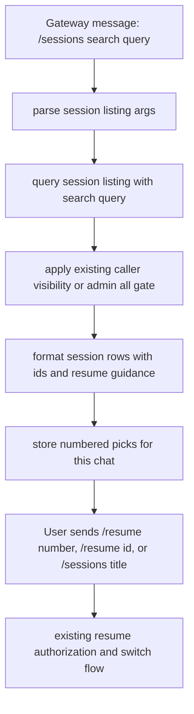

# Gateway Sessions Search - Plan

## Goal Capsule

- **Objective:** Add `/sessions search <query>` to gateway slash-command surfaces so Telegram, WhatsApp, Slack, Discord, Matrix, and other gateway platforms can search sessions that are relevant and visible to the caller; explicit admins can combine `all` with search to inspect the broader non-tool session set.
- **Authority:** User request and current `AGENTS.md` contribution rubric govern scope. Existing command behavior in `gateway/slash_commands.py` and `hermes_cli/session_listing.py` is the implementation pattern to extend.
- **Execution profile:** Small gateway feature, no new model tool, no new dependency, no prompt-context mutation, and no user-facing `.env` setting.
- **Stop conditions:** Stop implementation if a current exact issue or open PR for gateway `/sessions search <query>` is found before shipping. Related but non-exact work (#17193 cross-session management and #49038 Telegram resume picker) should be cited, not duplicated.
- **Tail ownership:** The PR should follow `CONTRIBUTING.md` and `.github/PULL_REQUEST_TEMPLATE.md`; use the existing broad issue as related context rather than creating a duplicate feature request unless maintainers require one.

---

## Product Contract

### Summary

Gateway users can already run `/sessions` to list scoped sessions, `/sessions <id-or-title>` to delegate to resume, and `/resume <id-or-title>` to switch chats. This plan adds the missing discovery step: `/sessions search <query>` searches older title/id matches beyond the short recent list, filters them to the caller-visible chat/session origin, returns numbered rows, and lets the user resume a result with `/resume <number>` or `/sessions <number>`. Explicit admins can use `/sessions all search <query>` to search the broader non-tool session set.

### Problem Frame

Messaging platforms are constrained text surfaces. When a user remembers only part of a session title or id, the current gateway flow makes them scan the newest named sessions or leave the chat to search elsewhere. The code already has the right gateway command route and security boundary, so the feature should extend the shared listing policy instead of adding a new command or platform-specific implementation.

### Requirements

**Search behavior**

- R1. `/sessions search <query>` lists sessions whose title or session id contains `<query>`, case-insensitively, including older matching sessions that are not present in the short recent `/sessions` or `/resume` list.
- R2. Search results keep the existing gateway listing shape with session title, id, optional source when cross-origin listing is allowed, and resume guidance.
- R3. Empty search queries return a helpful usage response rather than treating `search` as a resume target.

**Resume continuity**

- R4. Existing `/resume <session id>`, `/resume <title>`, `/sessions <session id>`, and `/sessions <title>` behavior remains unchanged.
- R5. Numeric `/resume <number>` and `/sessions <number>` resume the numbered rows from the latest session list or search result for that chat; bare `/resume` refreshes that numbered list with the recent titled sessions.

**Security and scope**

- R6. Ordinary search results respect the same source, user, chat, thread, Matrix room, and admin override boundaries as existing gateway session listing and resume behavior.
- R7. Explicit admin `/sessions all search <query>` searches the broader non-tool, non-archived session set while preserving the existing admin gate.
- R8. Legacy DM sessions created before full chat-origin persistence remain searchable and resumable when the row proves the same source, user, and thread but has a blank `chat_id`.

**Contribution workflow**

- R9. Before opening the PR, search current open and closed issues and PRs for an exact `/sessions search` gateway duplicate and stop if one appears.
- R10. The PR body cites related session-management work without claiming to fix a broader issue that this narrow feature does not close.

### Scope Boundaries

- In scope: gateway slash-command behavior and shared session-listing helper behavior used by gateway surfaces.
- In scope: tests for parser behavior, title/id matching, no-query feedback, caller-visible search scope, admin `all search`, and unchanged non-search gateway origin scoping.
- Out of scope: Telegram inline keyboard search, full-text message search, fuzzy matching, pagination, `/resume search`, and cross-medium session sharing.
- Deferred to follow-up work: an interactive Telegram picker can add search UI later, likely in the same platform-specific path as #49038.

### Acceptance Examples

- AE1. Given a Telegram chat with owned sessions titled `Billing audit` and `Release planning`, when the user sends `/sessions search bill`, then the response lists `Billing audit` and does not list `Release planning`.
- AE2. Given a matching session id `abc123-release`, when the user sends `/sessions search 123`, then the response lists that session and shows resume guidance.
- AE3. Given a different user's same-platform session with a matching title, when the caller sends `/sessions search <matching text>`, then that session is not listed and cannot be resumed.
- AE4. Given `/sessions search bill` returns `1. Billing audit`, when the same chat sends `/resume 1`, then Hermes switches that chat to the `Billing audit` session.
- AE5. Given an existing titled session, when the user sends `/sessions Existing Title`, then Hermes resumes it exactly as before.
- AE6. Given an explicit admin caller, when the caller sends `/sessions all search <matching text>`, then matching cross-origin non-tool sessions are listed with source labels.
- AE7. Given an older Telegram DM session with the same `user_id` and blank `chat_id`, when that user sends `/sessions search <matching text>` from the current Telegram DM, then the session is listed and can be resumed by number.

---

## Planning Contract

### Key Technical Decisions

- KTD1. Extend the existing `/sessions` command instead of adding `/session` or `/switch`. The command is already gateway-registered and accepted on messaging platforms, and adding a new slash command would widen public command surface without need.
- KTD2. Put query parsing and result selection in `hermes_cli/session_listing.py`. Gateway should keep enforcing caller visibility for ordinary search, while explicit admin `all search` can use the broader browser-style session set.
- KTD3. Store the latest numbered session rows per gateway session key for a short TTL. This matches existing messenger numbered-list ergonomics while still rechecking resume authorization before switching sessions.
- KTD4. Treat related GitHub work as context, not a duplicate. Search found no exact `/sessions search <query>` issue or PR, while #17193 covers broader cross-session management and #49038 covers a Telegram picker.

### High-Level Technical Design

### Assumptions

- The intended spelling is `/sessions search <query>` because `/sessions` is the registered command; `/session search` is treated as a typo in the prompt, not a new command request.
- Search is for session title and id only. Message full-text search is already a different dashboard/API capability and is not part of this gateway command.
- Numbered search results are transient server-side picks scoped to the gateway session key and expire after a short TTL. Resume remains explicit, and the existing authorization guard still runs before any switch.

### Sources and Research

- `CONTRIBUTING.md` requires searching issues, PRs, and source before building; current searches found no exact `/sessions search <query>` feature or PR.
- `.github/PULL_REQUEST_TEMPLATE.md` requires duplicate-search confirmation, tests, focused changes, and a clear test plan.
- `gateway/slash_commands.py` already handles `/resume`, `/sessions`, target delegation, and resume authorization.
- `hermes_cli/session_listing.py` is the shared listing policy behind gateway `/sessions`.
- `tests/gateway/test_resume_command.py` already covers gateway `/sessions` dispatch, source scoping, and resume authorization.
- Related GitHub context: #17193 is an open broad cross-session management request; #49038 is an open Telegram inline resume-picker PR; neither is an exact gateway `/sessions search <query>` implementation.

---

## Implementation Units

### U1. Add Search Parsing and Listing Policy

- **Goal:** Teach the shared session-listing helper to distinguish `/sessions search <query>` from `/sessions <resume-target>` and to filter rows by title or id with offset support for paged gateway search.
- **Requirements:** R1, R2, R3, R4, R5
- **Dependencies:** None
- **Files:** `hermes_cli/session_listing.py`, `hermes_state.py`, `tests/hermes_cli/test_session_listing.py`, `tests/test_hermes_state.py`
- **Approach:** Extend the parser with a search intent while preserving existing list aliases, `all`, `--all`, `full`, `--full`, and target delegation. Add title/id search, persisted gateway-origin filters, and offset plumbing to the listing helper and session DB query path so gateway callers can page through older matching rows without changing formatter behavior.
- **Patterns to follow:** Existing `parse_session_listing_args`, `query_session_listing`, and `format_gateway_session_listing` helpers.
- **Test scenarios:**
  - Parse `/sessions search billing` as a search query, not a resume target.
  - Parse `/sessions search` and `/sessions search "   "` as a missing query case.
  - Preserve `/sessions list`, `/sessions all full`, and `/sessions Existing Title` behavior.
  - Match title and id substrings case-insensitively while keeping non-matching rows out.
- **Verification:** Helper tests prove the new parsing and filtering contract without requiring a live gateway adapter.

### U2. Wire Gateway `/sessions search`

- **Goal:** Route gateway `/sessions search <query>` through the shared listing helper, format a caller-visible numbered result list, and make those numbers resumable in the same chat.
- **Requirements:** R1, R2, R3, R5, R6, R7, R8
- **Dependencies:** U1
- **Files:** `gateway/slash_commands.py`, `tests/gateway/test_resume_command.py`
- **Approach:** Update `_handle_sessions_command` to branch on the parsed search intent. For ordinary callers, prefilter by the persisted gateway origin fields, with a DM-only legacy fallback for same-source, same-user, same-thread rows that have blank `chat_id`, page through title/id matches until enough caller-visible rows are found, keep current non-search target delegation to `_handle_resume_command`, keep current admin cross-origin handling, and keep `_resume_row_visible` filtering after the query. Store the displayed row ids per gateway session key so `/resume <number>` and `/sessions <number>` resolve against the latest session list or search output before the normal resume authorization guard runs. For explicit admins, `/sessions all search <query>` widens the query the same way `/sessions all` already does.
- **Patterns to follow:** Existing `/sessions all` admin gate, non-admin cross-origin filtering, and `/resume` IDOR guard comments.
- **Test scenarios:**
  - Covers AE1. A title match appears in `/sessions search <query>`.
  - Covers AE2. An id match appears in `/sessions search <query>`.
  - Covers AE3. A different user's or different chat's matching row is not listed.
  - Covers AE4. `/resume <number>` after `/sessions search <query>` switches to the numbered search result.
  - Covers AE6. Admin `/sessions all search <query>` can list matching cross-origin non-tool rows with source labels.
  - Covers AE7. A legacy same-user DM row with blank `chat_id` appears in search and can be resumed by number.
  - A missing query returns a usage/help response and does not call resume.
  - Existing `/sessions <title>` still delegates to resume and switches sessions.
  - Older visible matches still appear when newer hidden same-source matches would otherwise fill the first candidate page.
- **Verification:** Gateway tests exercise the real `SessionDB` against a temp database so source, user, and chat scoping are tested through persisted rows.

### U3. Prepare PR-Ready Evidence

- **Goal:** Make the feature easy to review under the repo's contribution guide and PR template.
- **Requirements:** R8, R9
- **Dependencies:** U1, U2
- **Files:** `.github/PULL_REQUEST_TEMPLATE.md` as reference only, no expected modification
- **Approach:** Re-run duplicate searches before PR creation, record related issue and PR context in the PR body, and include the targeted pytest commands that prove parser and gateway behavior.
- **Patterns to follow:** `CONTRIBUTING.md` duplicate-search guidance and the existing PR template sections.
- **Test scenarios:** Test expectation: none - this unit prepares shipping evidence and does not change runtime behavior.
- **Verification:** PR body states what was searched, names related non-duplicate work, and includes passing targeted test commands.

---

## Verification Contract

| Gate | Applies To | Done Signal |
|---|---|---|
| Duplicate search | U3 | `gh search issues` and `gh search prs` find no exact open or closed `/sessions search <query>` gateway implementation before PR creation. |
| Helper tests | U1 | Parser and listing helper tests pass for search, missing query, existing list flags, existing target delegation, and title/id matching. |
| Gateway tests | U2 | `tests/gateway/test_resume_command.py` passes for new search scenarios and existing resume/session behavior. |
| Focused regression | U1, U2 | Targeted pytest run covering `tests/hermes_cli/test_session_listing.py` and `tests/gateway/test_resume_command.py` passes. |
| PR template | U3 | PR body follows `.github/PULL_REQUEST_TEMPLATE.md`, marks the feature checkbox, links related work without overclaiming closure, and includes test commands. |

---

## Definition of Done

- `/sessions search <query>` works on gateway slash-command surfaces that already accept `/sessions`.
- Search matches title and id substrings case-insensitively, including older caller-visible matches beyond the short recent list.
- Numbered search rows can be resumed with `/resume <number>` or `/sessions <number>` in the same gateway chat.
- Ordinary search results respect the same source, user, chat, thread, Matrix room, and admin override boundaries as existing gateway session listing and resume behavior.
- Legacy same-user DM rows with blank `chat_id` remain searchable and resumable from the current DM without exposing other users' rows.
- Admin `/sessions all search <query>` uses the broader non-tool, non-archived session set behind `/sessions all` and shows source labels.
- Existing `/sessions`, `/sessions list`, `/sessions full`, `/sessions all`, `/sessions <target>`, `/resume <target>`, and `/resume <number>` behavior remains compatible.
- No new core model tool, plugin, dependency, `.env` key, or prompt-cache-affecting behavior is introduced.
- Targeted tests pass and the PR body carries duplicate-search evidence plus related issue/PR context.
- The final diff contains no unrelated branch cleanup, no assistant/tool attribution, and no local-only agent artifacts.
