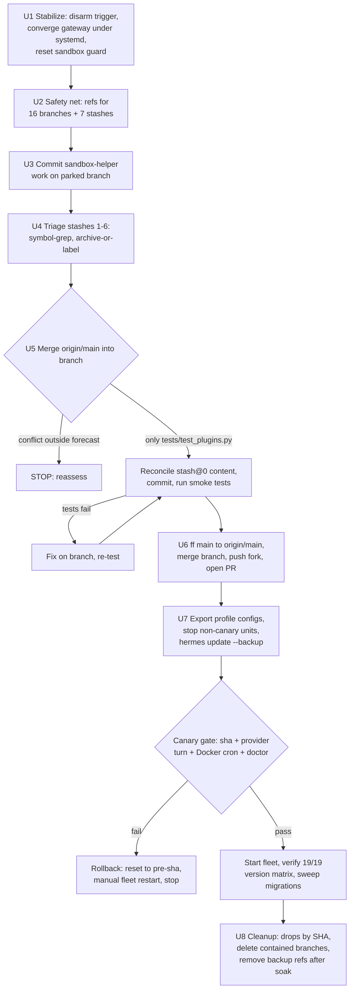

# Hermes Branch Consolidation and Fleet Update - Plan

**Target repo:** this repository (`hermes-agent`, fork of `NousResearch/hermes-agent`; push remote `fork` = `TheRVAAccountant/hermes-agent`). The live fleet runs from this single checkout at `~/.hermes/hermes-agent` — 19 gateway services across 17 profiles, supervised by systemd (5 named user-scope units, 11 system-scope units, 1 multiplex unit `hermes-gateway.service` serving ~12 profiles). Host state outside the repo (systemd units, `~/.hermes/config.yaml`, guard scripts) is referenced with `~/` paths and must never be treated as disposable.

## Goal Capsule

- **Objective:** Unblock `hermes update` by consolidating all genuinely-unmerged local work into local `main`, restoring a clean updatable checkout, and bringing the 19-service fleet onto current code with verified health — losing zero local work in the process.
- **Authority hierarchy:** repo `AGENTS.md` (test runner contract, fleet-update contract) > this plan's KTDs > per-unit approach. Where the plan and live host state disagree, stop and re-verify before mutating anything.
- **Stop conditions:** halt and reassess if (a) the racing update trigger remains live even under the `updates.auto_switch_parked_branch: false` interlock (the interlock alone permits proceeding; investigate the trigger separately), (b) stash reconciliation cannot decide between divergent versions of the runtime-independence work, (c) the canary unit fails its verification gate after the update (execute rollback — pre-update code and state restored, fleet restarted on pre-update code — and never start the fleet on new code), or (d) a merge conflict appears outside the forecast file.
- **Execution profile:** one operator session on the live host, units executed in dependency order; every destructive step is preceded by the U2 safety net.
- **Tail ownership:** after this plan lands, the upstream PR follow-through (watch, rebase, eventual main re-alignment) is standing operator work owned by the plan's Definition of Done discipline, not a new unit.

## Product Contract

### Summary

Consolidate the parked cron-runtime-independence and brokered-approvals work (plus its stash continuation and the uncommitted sandbox-helper fix) into local `main`, triage and disposition every other branch, worktree, and stash, then run one governed `hermes update` with a stop-first canary so the 19-service fleet lands on current code verified healthy.

### Problem Frame

The shared checkout is parked on `fix/restore-cron-runtime-independence` with a dirty tree, which makes every `hermes update` hard-skip at the parked-branch guard — three attempts already failed this way today (exit-1 receipts at 19:13 EDT). The fleet is 480–561 commits behind upstream while carrying ~3.3k lines of unmerged local feature work, a 224-line uncommitted fix, and seven autostashes accumulated since June. The baseline is also broken in three ways the update machinery cannot fix itself: a multiplex gateway crash-looping against a detached PID systemd cannot control, a setuid-sandbox guard unit flapped to `start-limit-hit`, and an unidentified trigger that keeps firing updates. Local `main` is a clean fast-forward candidate (0 ahead, 561 behind). Upstream landed no competing implementation of either local feature (verified by `git grep` over `origin/main`), so the local work is novel and worth landing.

### Requirements

**Update unblocking**

- R1. The checkout ends on `main` with a clean tree, and `hermes update` completes exit 0 from the default home terminal.
- R2. Every local branch, worktree, and stash receives an explicit disposition (merged / archived / verified-landed-then-dropped / kept-as-PR-branch); nothing is deleted on assumption.

**Consolidation**

- R3. The cron runtime-independence guard, the brokered plugin-approval work, the stash continuation of the cron work, and the setuid sandbox-helper fix all land in local `main` as commits — no value survives only in a stash.
- R4. stash@{0} is reconciled by content against the branch's tracked versions (the stash is newer on the two runtime-independence files), never applied as a patch.

**Fleet health**

- R5. Before the update, every gateway is supervised by systemd — no detached gateway processes holding singleton locks, no unit in a crash loop.
- R6. A canary unit passes verification — code hash match, one real outbound provider turn, one Docker-backed cron dispatch on `rva-leads`, `hermes doctor` SSL section clean — before any other unit is started.
- R7. After the fleet restart, the updater's version matrix reports every runtime on the new HEAD (19/19), and per-profile migration notes from the update output are reviewed.

**Hygiene and safety**

- R8. The six stale autostashes are triaged individually: drop only when equivalent work verifiably landed upstream; archive the rest to branches; drops execute by pinned SHA, never by index.
- R9. Branches contained in `origin/main` and the prunable `/tmp` worktree are removed; the pre-rebase backup branch is removed once superseded.
- R10. Open-PR branches (`chore/cron-profile-assignment` → PR #55870, `cursor/zai-glm53-profile-auth-1efe` → PR #86348) and their worktrees remain untouched.
- R11. The consolidation survives future updates: the integration branch and fork pushes exist as the recovery path, and HEAD is verified on `main` after every subsequent `hermes update`.
- R12. Host-level config outside the repo (systemd drop-ins incl. `~/.config/systemd/user/hermes-gateway.service.d/90-runtime-independence.conf`, `~/.local/bin/hermes-sandbox-suid-guard`, profile homes) is preserved, and the setuid `chrome-sandbox` inode is verified still root-owned 4755 after the update's desktop rebuild.

### Actors

- A1. Operator — executes the units, owns judgment calls the plan defers.
- A2. Update machinery — `hermes update` (guard, autostash, merge, snapshots, fleet restart, version matrix); its behavior is a constraint, not an opponent.
- A3. Fleet — systemd gateway units (user + system scope) and the desktop/dashboard runtimes without relaunch authority.
- A4. Remotes — `origin` (upstream NousResearch) and `fork` (TheRVAAccountant, PR source).

### Acceptance Examples

- AE1. **Covers R1.** Given a clean tree on `main`, when `hermes update --backup` runs from the default home, then it exits 0 and the receipt's `post_update.sha` equals the new HEAD.
- AE2. **Covers R6.** Given the update finished with only the canary unit running, when canary verification runs, then `gateway_state.json` `code_sha` matches HEAD, a provider turn succeeds, and a `rva-leads` Docker cron job fires with `cron.script_backend` intact — otherwise the fleet is not started and rollback executes.
- AE3. **Covers R8.** Given a stash whose distinctive added symbols all exist in `origin/main`, when triage concludes, then it is dropped by pinned SHA; given any symbol missing upstream, then it is archived to a branch instead.
- AE4. **Covers R11.** Given a later `hermes update` after `origin/main` advanced, when the updater resets `main`, then the post-update check detects the wiped merge and re-merges from the integration branch in one step.

### Scope Boundaries

- In scope: git consolidation in this checkout, stash/branch/worktree disposition, the one governed update, fleet restart and verification, and the standing post-update discipline.
- Out of scope: feature-level code review or redesign of the consolidated work (tests + conflict resolution only); continued development in the CFO worktree; fixing the failed `hermes-git-backup.service` lane; changes to profile routing or cron provider config.
- Deferred to follow-up work: watching and rebasing the upstream PR; re-aligning `main` to pure `origin/main` once the PR lands; deciding the fate of `fix/hermes-linux-desktop-venv-path` as its own upstream PR; the CFO worktree's next iteration.

## Planning Contract

### Key Technical Decisions

- KTD1. **Land the consolidation as a merge into local `main`, checkout on `main`** (session-settled: user-directed — chosen over running the fleet on a consolidated branch via `parked_branch_strategy: update_in_place`; the user accepts the updater's `git reset --hard origin/main` on diverged main, hermes_cli/update_cmd.py:9178–9186, in exchange for main carrying the work). Mitigations are mandatory: merge and update happen in one sitting (U6→U7), the integration branch and fork push are the recovery path, and every future update ends with a HEAD check that re-merges in one step if wiped.
- KTD2. **Consolidate by patch-equivalence, not per-branch merges.** The two approval-brokering commits exist patch-equivalently on at least four refs (parked branch, CFO branch, pre-rebase backup, tag `pre-update-20260901-192844`) — `git cherry` verified. Only the parked branch is merged; the duplicates are recognized, not re-merged.
- KTD3. **Merge-forward instead of rebase.** The branch already carries two `origin/main` merges; a single additional `git merge origin/main` into the branch is cheaper than replaying three commits, and a `merge-tree` dry run predicts exactly one textual conflict (`tests/hermes_cli/test_plugins.py`, upstream hunks at lines ~933–1278 vs local at ~47–350). Everything else auto-merges; `tools/approval.py` did not change upstream since the merge-base.
- KTD4. **Reconcile stash@{0} as content.** Its base is the `fix/hermes-linux-desktop-venv-path` tip (not main, despite the stash message), it carries `cron/runtime_independence.py` and its guard test as *untracked* files that the branch already *tracks*, and its `cron/scheduler.py` diff (+311) diverges from the branch's own (+329) on a file upstream also changed. A `stash apply` fails on the untracked collision and conflicts on the scheduler; extraction (`git show 'stash@{0}^3:<path>'` plus the tracked diff) and manual reconciliation is the only safe path. Line counts cannot decide recency — the stash (14:25 Aug 31) predates the branch's `c06522f419` commit (19:38 Aug 31), so the commit plausibly descends from the stashed draft; U5 resolves direction by ancestry: if `c06522f419` descends from the stash content, the branch wins on divergence, and only genuinely divergent drafts invoke stop condition (b).
- KTD5. **Stabilize before mutating.** A clean tree on the parked branch is an armed tripwire: the unidentified 19:13 trigger will fire a real in-place update the moment the tree is clean, and an update landing mid-rebase runs `git reset` on unmerged entries (hermes_cli/update_cmd.py:2578–2580). U1 (disarm trigger, converge the crash-looping gateway under systemd, reset-failed the sandbox guard) gates every later unit.
- KTD6. **Single owner for the setuid helper.** The in-repo park/restore (the uncommitted posix.sh work, committed in U3) becomes the owner of record; the out-of-tree systemd guard is reset and kept armed as belt-and-braces only because it stands down automatically when the in-tree fix is greppable — two live owners would race over the privileged inode.
- KTD7. **Stop-first canary at unit granularity.** The updater restarts *all running* units by design (AGENTS.md: leaving siblings on stale `sys.modules` is the repo's largest dupe-PR class), and the multiplex unit restarts ~12 profiles at once. A canary therefore requires stopping every non-canary unit before the update (stopped units stay stopped through the restart phase), letting the updater restart the canary, verifying, then starting the rest.
- KTD8. **Run the update as `hermes update --backup`.** Pre-update quick snapshots are file-loss recovery only (emptied cron jobs, corrupt state.db) — not code rollback. `--backup` is the only real code-rollback insurance; the receipt's `pre_update.sha` plus a recorded pre-merge HEAD complete the manual rollback path.
- KTD9. **Triage stashes by symbol-grep, drop by SHA.** Squash-merges upstream make subject matching useless (AGENTS.md: "squash merges from stale branches silently revert recent fixes"). For each stash: pick distinctive added symbols, `git grep` them in `origin/main`; landed → drop, else → archive branch. stash@{2} (skills-hub work, 3.5k insertions, based on the PR #55870 branch) is dispositioned toward that branch's lineage, never dropped as "not landed upstream". All drops reference SHAs pinned in U2 because indices renumber.

### Assumptions

- The 19:13 update trigger is dashboard- or session-initiated (no auto-update cron exists in any profile's `jobs.json` — checked); it can be identified and disabled for the window. Verified at U1 execution; if not, the stop condition fires.
- The June stashes are largely landed or obsolete after 5k–13k upstream commits; symbol-grep will confirm per stash at U4.
- The upstream PR will not merge during this plan's execution window; main re-alignment is post-plan work.
- `hermes gateway stop` retires the detached multiplex PID and systemd's auto-restart takes ownership cleanly (the unit's ExecStart is correct; only the singleton lock holder is wrong).

### High-Level Technical Design

Sequencing constraints the diagram encodes: U3 is the tripwire arming point (nothing may run between U1's disarm and U3 except U2); U6 and U7 happen in one sitting so `origin/main` cannot advance between the merge and the update (KTD1); worktree pruning precedes branch deletion (git refuses to delete a branch checked out in the prunable worktree).

### Risks and Dependencies

| Risk | Mitigation |
| --- | --- |
| Updater hard-resets diverged main in a future update, wiping the merge | KTD1 discipline: post-update HEAD check; integration branch + fork push are one-command recovery (AE4) |
| Update trigger fires mid-consolidation and resets a half-resolved merge | U1 disarm + verify no new receipts during U3–U6; update lock is per-home, so also never run updates from another profile concurrently |
| Partial venv refresh post-update (ssl-cacert RCA class) surfaces only at first provider call | Canary gate requires a real provider turn and `hermes doctor` SSL check, not just liveness (R6) |
| Config migrations silently apply new defaults across 17 profiles | Pre-update export of per-profile `config.yaml` + `cron/jobs.json`; post-update diff against exports and sweep migration notes |
| Desktop rebuild clobbers the setuid `chrome-sandbox` inode | U3 commits the in-tree park/restore; guard reset in U1; `stat` ownership check in U7 (R12) |
| Stash apply destroys the only copy of newer runtime-independence files | KTD4 content reconciliation; U2 refs keep every stash's three parents reachable |

## Implementation Units

### U1. Stabilize the baseline and disarm the update trigger

- **Goal:** Make the host safe to operate on: no racing update trigger, no crash-looping unit, sandbox guard armed.
- **Requirements:** R5 (partially — supervisor convergence), gates all other units.
- **Dependencies:** none.
- **Files:** none in-repo (host operations; evidence in `~/.hermes/logs/update_receipts/`, journalctl, systemctl).
- **Approach:** Identify what fired `hermes update` three times at 19:13 (check receipts' argv and triggering session; dashboard update surface and agent sessions are the candidates — no profile cron fires updates) and disable it for the window — but do not bet the plan on identification: set `updates.auto_switch_parked_branch: false` in `~/.hermes/config.yaml` for the U1–U7 window (revert after U7) so any trigger provably skips at the guard instead of mutating the checkout. Derive and record the live unit inventory from `systemctl --user list-units 'hermes-gateway*'` AND `systemctl list-units 'hermes-gateway*'` — there are two multiplex `hermes-gateway.service` units (user and system scope), and U7's stop-list comes from this live inventory, not from plan counts. Retire the detached multiplex gateway holding PID 3833 (`hermes gateway stop`), let the unit's auto-restart take ownership, and confirm `systemctl --user is-active hermes-gateway.service` is active with a new MainPID and a reset restart counter. `systemctl --user reset-failed hermes-sandbox-suid-guard.service` and re-arm its `.path` unit (KTD6).
- **Execution note:** The evidence that matters is operational state, not command output alone: active unit, new MainPID, zero new update receipts for the remainder of the window.
- **Test expectation:** none — operational stabilization; verification is the state checks above.

### U2. Safety net over every ref

- **Goal:** Guarantee every branch and stash is recoverable before anything is mutated.
- **Requirements:** R2.
- **Dependencies:** U1.
- **Files:** none in-repo (refs under `refs/backups/`).
- **Approach:** For each of the 16 branches create `refs/backups/branch-<name>`; for each of the 7 stashes create `refs/backups/stash-<i>-<sha8>` pointing at the stash commit (this keeps all three parents — including the untracked-files parent — reachable). Record the pinned SHA list to a scratch file outside the repo (`~/.hermes/`). The existing `backup/fix-restore-cron-runtime-independence-pre-rebase-20260901` branch stays as-is; these refs are additional.
- **Test expectation:** none — git-ref bookkeeping; verification is `git show-ref` listing every backup and `git fsck --no-reflogs` finding nothing newly dangling.

### U3. Commit the sandbox-helper work on the parked branch

- **Goal:** Convert the 224-line uncommitted setuid sandbox-helper preservation work into a commit so the tree is clean and the work is safe.
- **Requirements:** R3 (sandbox portion), precondition for the update (R1).
- **Dependencies:** U1, U2.
- **Files:** `scripts/desktop-update/posix.sh`, `scripts/desktop-update/repro.sh`.
- **Approach:** Commit both files on `fix/restore-cron-runtime-independence` with a conventional `fix(desktop):` message describing the park/restore-inode mechanism. Before committing, run the self-test matrix the work itself ships: `bash scripts/desktop-update/repro.sh gate` and `suid` (the `suid` mode is part of this work).
- **Execution note:** From this commit onward the clean tree is an armed tripwire (KTD5) — proceed directly to U4 without pausing.
- **Test scenarios:** `repro.sh gate` passes; `repro.sh suid` passes; `git status --porcelain` is empty afterward (including untracked — a stray untracked file would ride a future `--include-untracked` autostash).
- **Verification:** Commit exists on the branch; working tree fully clean.

### U4. Triage the six stale autostashes

- **Goal:** Disposition stashes 1–6 (June–August autostashes) without losing unlanded work.
- **Requirements:** R8.
- **Dependencies:** U2 (backup refs exist), U3.
- **Files:** none in-repo (git refs; archive branches named `archive/stash-<date>-<topic>`).
- **Approach:** Per KTD9: for each stash, extract 2–3 distinctive added symbols from `git stash show -p`, `git grep` them in `origin/main` — all present → mark droppable; any missing → create an archive branch from the stash. Special cases: stash@{2} (skills-hub, based on the PR #55870 branch) is preserved toward that branch's lineage and its overlap noted for the PR, not dropped; stash@{1} (MCP OAuth, based on a cursor branch) archives alongside that branch. No drops execute here — U8 drops by pinned SHA after everything else verified.
- **Test expectation:** none — disposition records; verification is a written per-stash verdict (drop / archive / preserve-for-PR) with the grep evidence.
- **Execution note:** The symbol-grep is the proof; "probably landed" is not a disposition.

### U5. Consolidate the parked branch onto current upstream

- **Goal:** One branch containing the local feature work reconciled with the 481 upstream commits and the stash@{0} continuation.
- **Requirements:** R3, R4.
- **Dependencies:** U3, U4.
- **Files:** `cron/runtime_independence.py`, `cron/jobs.py`, `cron/scheduler.py`, `tools/approval.py`, `hermes_cli/plugins.py`, `hermes_cli/config_defaults.py`, `tests/cron/test_cron_script.py`, `tests/cron/test_runtime_independence_guard.py`, `tests/tools/test_request_tool_approval.py`, `tests/hermes_cli/test_plugins.py`.
- **Approach:** `git merge origin/main` into `fix/restore-cron-runtime-independence` (KTD3). Expected single conflict in `tests/hermes_cli/test_plugins.py` — resolve keeping both suites. Then reconcile stash@{0} as content (KTD4): extract `git show 'stash@{0}^3:cron/runtime_independence.py'` and the guard test, compare against the branch's tracked versions, take the stash's newer content where it wins, and apply the tracked `cron/jobs.py` / `cron/scheduler.py` diffs by hand against the merged files. Commit as one reconciliation commit. A conflict appearing anywhere other than the forecast file trips the stop condition.
- **Execution note:** Smoke-first proof before declaring the unit done: the test subsets below are the gate, and the runtime-independence tests the stash carries are the arbitration for version conflicts.
- **Test scenarios:** `scripts/run_tests.sh tests/cron/` passes (includes the 14 guard tests plus the 89-file cron suite); `scripts/run_tests.sh tests/tools/test_request_tool_approval.py` passes; `scripts/run_tests.sh tests/hermes_cli/test_plugins.py` passes (both upstream's new suite and local's discovery suite); `scripts/run_tests.sh tests/hermes_cli/test_cmd_update.py` passes; `hermes cron doctor` runs clean from the merged tree.
- **Verification:** Merge commit + reconciliation commit on the branch; all listed suites green; `git status` clean.

### U6. Land in local main and push the fork

- **Goal:** `main` carries the consolidation; the fork and an upstream PR make it recoverable and landable.
- **Requirements:** R1 (main state), R3, R11.
- **Dependencies:** U5.
- **Files:** none new (git operations + GitHub PR).
- **Approach:** Fast-forward `main` to `origin/main`, then merge the consolidated branch into `main` (one merge commit; KTD1/KTD2). Push the consolidated branch and `main` to `fork`. Open the upstream PR from the branch with a conventional-commit title summarizing cron runtime independence + brokered approvals (+ sandbox-helper fix noted as included). Record the post-merge `main` SHA. Proceed to U7 in the same sitting.
- **Test expectation:** none — git/GitHub operations; verification is `git log --oneline -3 main` showing the merge, the fork branch existing, and the PR URL recorded.
- **Execution note:** Do not pause between this unit and U7 — an `origin/main` advance in between converts the next update into the reset-hard hazard (KTD1).

### U7. Governed update, canary gate, fleet restart

- **Goal:** The whole fleet on current code, verified beyond liveness, with rollback insurance.
- **Requirements:** R1, R5, R6, R7, R11, R12.
- **Dependencies:** U6 (same sitting).
- **Files:** host state: per-profile `config.yaml` / `cron/jobs.json` exports, systemd units, `apps/desktop/release/linux-unpacked/chrome-sandbox`.
- **Approach:** Export every profile's `config.yaml` and `cron/jobs.json` to a 0700-mode directory under `~/.hermes/`. Derive the stop-list from the U1 live inventory (`systemctl --user` AND `systemctl`, both scopes) and stop every gateway unit except the canary (`hermes-gateway-rva-dev.service` — lowest-stakes named unit), asserting zero non-canary active units immediately before the update. Drive the setuid park/restore around the terminal update via the script's phase interface — `--suid-phase park` before the update, `--suid-phase restore` after the rebuild — because `posix.sh`'s park/restore otherwise only runs via the desktop hand-off, never a terminal update. From the default home terminal run `hermes update --backup` (KTD8); it snapshots all profiles, merges, refreshes deps, rebuilds desktop, restarts running units (the canary), and runs the version matrix. Immediately after the update exits, verify the recorded post-merge SHA is still an ancestor of HEAD (`git merge-base --is-ancestor <recorded-sha> HEAD`); if the updater reset it away, re-merge from the integration branch (the AE4 one-step recovery) BEFORE the canary gate. At the canary gate verify: `gateway_state.json` `code_sha` == new HEAD; one real outbound provider turn; one manually-triggered `rva-leads` Docker-backed cron dispatch with `cron.script_backend` intact; `hermes doctor` SSL section clean (AE2). Only then start the remaining units (named units individually; the multiplex unit restarts its ~12 profiles together — KTD7). Verify the fleet via the post-start per-profile `gateway_state.json` sweep (the updater's in-run matrix covers only the canary), `stat -c '%U %a' apps/desktop/release/linux-unpacked/chrome-sandbox` shows `root 4755`, sweep the update output's per-profile migration notes, and diff the config exports against the pre-update copies to catch the rva-leads regression class. Relaunch the desktop app manually (no relaunch authority exists for it). On canary failure: `git reset --hard` to the recorded pre-update SHA, restore profile configs from the pre-update exports where the update migrated them, restart the canary alone and re-run the gate checks on rolled-back code, and only then start the remaining units — a canary failing on rolled-back code is the stop condition (do not debug on a live half-updated host).
- **Execution note:** Smoke-first verification dominates: liveness alone proves nothing (the ssl-cacert RCA is the canonical counterexample). A failed provider turn or missing cron dispatch is a failed canary even with the process green.
- **Test scenarios:** Canary unit passes all four gate checks (AE2); version matrix reports 19/19 on the new SHA; config diffs show no silently stripped `cron.script_backend`/`script_env`; sandbox inode ownership survives the rebuild; `bash scripts/desktop-update/repro.sh gate` and `suid` pass after the desktop rebuild; `hermes -p <profile> cron doctor` exits clean for every profile; `hermes -p <profile> gateway status --deep [--system]` healthy for every profile; update receipt shows exit 0 and `post_update.sha` == HEAD (AE1).
- **Verification:** All checks above recorded; fleet fully started.

### U8. Cleanup and the standing discipline

- **Goal:** Remove what is now redundant; leave the standing post-update discipline in place.
- **Requirements:** R2, R8, R9, R10, R11.
- **Dependencies:** U7 verified.
- **Files:** git refs and worktrees only.
- **Approach:** Prune the `/tmp/hermes-fix-sandbox-helper` worktree first, then delete `fix/desktop-update-restore-sandbox-helper`, `fix/cfo-zai-glm-5-3`, `feat/compound-engineering-skills` (all verified ahead-0) and the superseded `backup/fix-restore-cron-runtime-independence-pre-rebase-20260901`; keep `fix/restore-cron-runtime-independence` (the integration branch) until the upstream PR merges, per the Appendix and Definition of Done — it is the AE4 re-merge source. Drop U4's droppable stashes by pinned SHA. Leave open-PR branches and worktrees untouched (R10). Keep `refs/backups/` for a soak period (e.g., one week of clean fleet operation), then remove. Record the standing discipline: after every future `hermes update`, check `git log --oneline -3 main` for the consolidation merge; if the updater reset it away, re-merge from the integration branch (AE4).
- **Test expectation:** none — cleanup; verification is `git branch` / `git stash list` / `git worktree list` matching the intended end state exactly.

## Verification Contract

| Gate | Command / check | Applies to |
| --- | --- | --- |
| Unit tests (only sanctioned runner — AGENTS.md forbids raw pytest) | `scripts/run_tests.sh tests/cron/ tests/tools/test_request_tool_approval.py tests/hermes_cli/test_plugins.py tests/hermes_cli/test_cmd_update.py` | U5, pre-merge |
| Desktop-update self-tests | `bash scripts/desktop-update/repro.sh gate` and `suid` | U3, U7 post-rebuild |
| Cron health per profile | `hermes -p <profile> cron doctor` (read-only; exit 1 = actionable issue) | U7 |
| Gateway health per profile | `hermes -p <profile> gateway status --deep [--system]` | U7 |
| Update success | exit 0 + receipt `post_update.sha` == HEAD in `~/.hermes/logs/update_receipts/` | U7 (AE1) |
| Canary gate | code_sha match + real provider turn + `rva-leads` Docker cron dispatch + `hermes doctor` SSL | U7 (AE2) |
| Fleet version matrix | updater's own 19/19 report + per-profile `gateway_state.json` sweep | U7 |
| Sandbox inode | `stat -c '%U %a' apps/desktop/release/linux-unpacked/chrome-sandbox` == `root 4755` | U7 (R12) |
| Ref recoverability | `git show-ref` covers all backups; `git fsck --no-reflogs` clean | U2, U8 |

## Definition of Done

- Global: checkout on `main`, clean tree; `hermes update` exit 0; canary gate passed before fleet start; 19/19 version matrix green; sandbox inode verified; every branch/stash/worktree dispositioned per the tables above; U2 backup refs retained through the soak window; no new leaked autostash created by this work (tree was clean at update time).
- Per unit: each unit's Verification block satisfied and recorded before the next unit starts; U6→U7 executed in one sitting.
- Cleanup criterion: no dead-end artifacts from this work remain — scratch files, temporary exports, and (after soak) `refs/backups/` entries are removed; the integration branch is retained until the upstream PR merges.

## Appendix: Branch disposition table

| Branch | vs origin/main | Disposition | Unit |
| --- | --- | --- | --- |
| `fix/restore-cron-runtime-independence` | ahead 5 / behind 481 | Consolidate (this is the integration branch), merge into main, keep until PR merges | U5, U6 |
| `feat/openclaw-cfo-core-20260901` (worktree) | ahead 2 (patch-equivalent subset) | Keep worktree + branch for CFO development; no merge (KTD2) | none |
| `chore/cron-profile-assignment` (worktree, PR #55870) | ahead 2, fork-tracked | Keep untouched; stash@{2} noted against it | R10 |
| `cursor/zai-glm53-profile-auth-1efe` (PR #86348) | ahead 3 (1 local parking commit) | Keep untouched | R10 |
| `cursor/glm-5-3-zai-6531`, `cursor/xai-oauth-usable-pool-b55d` | ahead 2–4, fork-tracked, no open PR | Keep; check landed-status by symbol-grep before any future cleanup | U4 rules |
| `fix/hermes-linux-desktop-venv-path` | ahead 1 | Keep (stash@{0}'s base); future upstream PR — deferred | deferred |
| Other local 1–2-commit branches: `fix/named-custom-provider-resolve`, `fix/remote-cron-profile-scope`, `feat/plugin-tool-human-approval`, `park/2026-08-16-host-experiments` | ahead 1–2 each | Keep; symbol-grep triage same as stashes before any future cleanup | U4 rules |
| `fix/cfo-zai-glm-5-3` | ahead 0 | Delete (contained) | U8 |
| `fix/desktop-update-restore-sandbox-helper` (prunable /tmp worktree) | ahead 0 | Prune worktree, then delete branch | U8 |
| `feat/compound-engineering-skills` | ahead 0 | Delete (contained) | U8 |
| `backup/fix-restore-cron-runtime-independence-pre-rebase-20260901` | ahead 3 (older copy) | Delete once U5 lands | U8 |
| `main` | ahead 0 / behind 561 | Fast-forward, then receive consolidation merge | U6 |
