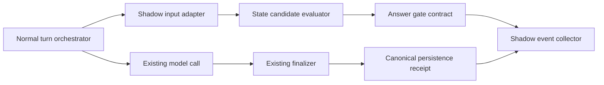

# State Answer Gate Shadow 接続設計

- Repository: `moatinside/hermes-agent`
- Branch: `feat/state-answer-gate-shadow`
- Base: `origin/main` `e8b57ead7c881ab06e4d1934598087f81c50f451`
- Status: 設計段階。Runtimeコード未接続。

## 1. 目的

mainに反映済みのState Answer Gate契約層を、通常turnへShadow modeで接続する。
Shadow modeでは判定を記録するが、既存のmodel call・回答・外部delivery・current stateを変更しない。

目的は、通常turnにおける以下の入力が実際に取得できるか、またStrict化した場合にどの程度block対象となるかを観測すること。

- active scope
- current state snapshot
- attributed evidence
- requested state keys
- candidate evaluation result
- answer gate decision
- canonical persistence receipt

## 2. 非目的

このPRでは以下を行わない。

- Strict enforcement
- model callの抑止
- current stateの更新
- pending candidateの保存
- approval／applyの自動化
- 本番DB schema変更
- raw user/model/provider/error textのShadow event保存
- 既存のpersistence／delivery経路の置換

## 3. 現行Runtimeの観測事実

通常turnは次の順序で実行される。

```text
run_conversation
  → assemble_api_request
  → run_preflight_gate
  → provider/model call
  → normalize_model_response
  → run_tool_round または finish_text_response
  → finalize_turn
  → canonical persistence receipt
  → trajectory / observer / delivery
```

候補接続点はmodel call直前だが、現在の契約層には通常turnから渡すstate/evidenceの生成器がない。
このため、Shadow adapterは既存Runtimeの入力を勝手に推測せず、明示的なprovider interfaceから受け取る。

## 4. 構成



Shadow event collectorは、既存model callとfinalizerの制御経路を横取りしない。

## 5. 明示インターフェース

### 5.1 Shadow input

```text
ShadowInput:
  run_id: bounded opaque identifier
  turn_id: bounded opaque identifier
  active_scope: nonblank string or unavailable
  current_state: validated state snapshot or unavailable
  evidence: attributed evidence or unavailable
  current_state_validated: explicit boolean validation result
  evidence_validated: explicit boolean validation result
  requested_state_keys: materialized list of nonblank strings or unavailable
```

### 5.2 Shadow event

```text
ShadowEvent:
  schema_version
  run_id
  turn_id
  origin = normal_turn
  mode = shadow
  active_scope_status
  current_state_status
  evidence_status
  candidate_status
  gate_decision
  model_call_status
  persistence_receipt_status
  reason_code
  created_at
```

イベントには回答本文、evidence本文、provider error、例外本文、prompt、credential、filesystem pathを含めない。

`gate_decision`、`model_call_status`、`persistence_receipt_status`は別フィールドとして保持する。
Shadowでblocked相当と記録されても、実際のmodel callが抑止されたことを意味しない。

## 6. 実行順序

```text
1. 通常turnから明示入力を取得
2. 入力を一度だけnormalize
3. pure evaluatorを呼ぶ
4. pure answer gateを呼ぶ
5. sanitized Shadow eventをローカルcollectorへ渡す
6. 既存model callを実行
7. 既存finalizerのreceiptを取得
8. receipt statusだけを同一turnのeventへ追記
```

collectorの失敗は、Shadow modeでは既存turnを止めない。ただし、collector失敗はeventのstatusに記録し、成功扱いにしない。

## 7. 境界とガード

- Shadow disabled時は、既存コードパスと出力をbyte-levelで変更しない。
- Shadow enabled時も、model call、response、delivery、current stateを変更しない。
- requested state keysはgeneratorを含め一度だけlist化する。
- scope不一致、malformed input、gate例外はイベントへ記録する。
- 不正入力を「依存なし」へ変換してmodel callを許可する実装は禁止する。
- Shadow eventはmetadata-firstで保存し、raw contentを保存しない。
- canonical persistence receiptはfinalizer完了後にのみ記録する。
- collectorが未設定／不正設定の場合はShadowを無効化し、Strictへ暗黙fallbackしない。

## 8. 未確定事項（実装前に確認）

1. active scopeのSSOTはどのruntime objectか。
2. current stateを通常turnで取得できる既存providerがあるか。
3. evidenceのsource attributionをどの時点で得られるか。
4. requested state keysを呼び出し側が明示できるか。
5. Shadow eventの保存先は既存のsafe local sinkか、新規isolated JSONLか。
6. collectorの所有者とretention policyは何か。
7. API server／codex_app_server／background turnを同じShadow対象に含めるか。

上記が未確定のままの場合、実装で推測せず`unavailable`としてイベント化する。

### 8.1 SSOT監査結果（2026-09-13）

read-only検索の結果、現行repositoryでは以下を確認できなかった。

- authoritative `current_state` tableのschema定義
- `current_state`を読み出すRuntime provider
- `current_state`を通常turnへ供給するcaller
- State Gate用のattributed evidenceを通常turnで生成するowner
- `evaluate_answer_gate`、`save_pending`、`apply_approved_to_current`のproduction caller

確認できたのは、`pending_state_store.apply_approved_to_current`がcaller-provisionedな`current_state` tableを参照する契約だけである。この関数はauthoritative tableを作成・migrationせず、現在のRuntimeからも呼ばれていない。

したがって、現時点のSSOT判定は次のとおり。

```text
current state owner: 未確認／現行Runtime未接続
evidence owner: 未確認／State Gate用Runtime生成なし
requested keys owner: 未確認／通常turn入力に存在しない
source.scope_id: routing scopeとして存在。ただしState Gate scopeとの同一性は未証明
```

この結果により、実データを読むproviderや本番DB接続をこのPRで新設しない。次の実装対象は、SSOTが未接続であることを正しく`input_unavailable`／`not_evaluated`として観測するfake-provider接続に限定する。

## 9. 受入条件

### 契約

- evaluator／answer gateの既存52テストが継続green。
- Shadow event schemaのpositive／malformed／scope mismatchを検証する。

### Wired seam

- 実際のnormal-turn orchestratorがShadow adapterを呼ぶ。
- disabled時はadapter未実行で既存動作が変わらない。
- enabled時もmodel callとdeliveryの結果が変わらない。

### Side effect

- current state、pending state、canonical transcriptをShadowが変更しない。
- collectorにはallowlisted metadataだけが保存される。
- collector例外・timeout・malformed outputが既存turnへraw textとして流れない。

### Evidence

- `gate_decision`と`model_call_status`を分離してread-backできる。
- finalizer前のeventにpersistence receipt successを記録しない。
- finalizer後にreceipt statusが正しく追記される。

### 未達として扱うもの

- Shadow観測なし
- Strict enforcement
- Runtime E2Eでの外部delivery抑止
- 本番運用実績

## 10. 実装順序

1. 本設計書の論理レビュー
2. active scope／state／evidenceのSSOT調査
3. isolated Shadow event schema＋collector
4. fake inputによるorchestrator call-order test
5. 実normal-turn seamへのdisabled接続
6. enabled Shadow接続
7. malformed／exception／collector failure test
8. 独立レビュー
9. focused／adjacent test
10. Runtime E2E（本番外部送信なし）

Strict enforcementはShadowの実測後に別PRとして扱う。

## 11. 独立レビュー指摘1〜5への設計修正

### 11.1 Receipt相関とterminal lifecycle

pre-model判定とfinalizer receiptは、同一の`shadow_event_id`で相関する。ただし、pre-modelイベントを完了イベントとして扱わない。

イベントの状態は次のとおり。

```text
created → evaluated → model_call_observed → terminal_observed → receipt_observed
```

途中終了は`preflight_return`、`retry_exhausted`、`provider_error`、`interrupted`、`exception`、`completed`のいずれかで明示する。`persistence_receipt_status`は`true`／`false`／`unobserved`の三値とし、finalizer未通過は`unobserved`で終了する。未設定値を成功として解釈しない。

turn orchestratorが相関IDを所有し、pre-model adapterが初期イベント、finalizer側の薄いobserverがterminal updateを担当する。

### 11.2 Input ownershipと未評価状態

Shadow adapterはstate情報を生成・推測しない。専用のread-only `StateAnswerShadowInputProvider`をRuntime境界に要求する。

```text
InputProviderResult:
  status: ready | input_unavailable | disabled | provider_error | malformed_input
  active_scope: validated string, only when ready
  answer_scope: validated string, only when ready
  candidates: bounded materialized tuple/list (max 128), only when ready
  requested_state_keys: bounded materialized tuple/list (max 128), only when ready
  candidate_key_pairs: max 32, otherwise not evaluated
```

`input_unavailable`、`disabled`、`provider_error`、`malformed_input`では既存のcandidate evaluator／answer gateを呼ばない。`HOLD`や`model_call_disallowed`へ変換せず、Shadow専用の`not_evaluated`として記録する。データ欠落とStrict gate判定を混同しない。

providerの所有者は、通常turnのcurrent-state／evidence SSOTを実際に管理するRuntime componentとする。所有者が確定するまで、本番providerを実装せずfake providerだけで契約を検証する。

### 11.3 複数candidate・複数keyの集約

Shadow eventは複数candidateを許容し、candidateごと・requested keyごとの結果を保持する。

```text
candidate_outcomes: [
  {candidate_ref, key_outcomes: [{key_ref, decision, reason_code}]}
]
aggregation:
  dependent if any requested key has a dependent candidate
  malformed if any input is malformed
  not_evaluated if provider status is not ready
```

`candidate_ref`はbounded opaque IDとし、state valueやevidence本文は保存しない。既存pure evaluatorが一組ずつしか受け取らないため、adapterがcandidate/evidenceの組を決定論的に分割して呼び、keyごとの結果を明示的に集約する。`answer_scope`を必須にし、`active_scope`との一致はcandidate単位で検証する。

### 11.4 相関ID・reason codeの秘匿境界

collectorへ渡す前に、すべての識別子とenumを検証する。

- `shadow_event_id`、`run_id`、`turn_id`はadapterが生成するUUID由来の固定長opaque ID
- `candidate_ref`、`key_ref`は入力値から決定論的に導出せず、発行ごとに新規生成するrandom opaque referenceのみ
- caller supplied `task_id`やsession文字列をそのままイベントへ保存しない
- `reason_code`、status、modeは固定allowlist enumのみ
- timestampはUTC ISO 8601形式、schema versionを必須化
- serialized eventには最大サイズを設定し、超過時はイベント全体を保存しない
- raw input、prompt、answer、provider exception、filesystem path、credentialはcollectorへ渡さない
- 不正なID／enumは`invalid_metadata`としてcollectorへ送らず、ローカルカウンタのみ更新する

「raw contentを保存しない」は禁止事項ではなく、adapter境界のvalidationとallowlistで強制する。

### 11.5 Collector失敗の隔離

collectorはbounded non-blocking interfaceとする。

```text
observe_initial(event) -> enqueue result
observe_terminal(shadow_event_id, update) -> enqueue result
```

turn処理はcollectorの同期完了を待たない。キュー投入不能、timeout、serialization error、worker exceptionは既存turnの結果へ影響させず、`collector_failed`メトリクスへ分類する。

初期イベントとterminal updateは同じopaque `shadow_event_id`を使い、sink側はidempotent upsertまたは重複排除可能なappend形式を選ぶ。receipt updateが届かない場合は`receipt_unobserved`として扱い、成功を補完しない。

collectorのretention、rotation、sink所有者は実装前に決定する。決定まではprocess-local bounded queueを使い、永続化を実施しない。
