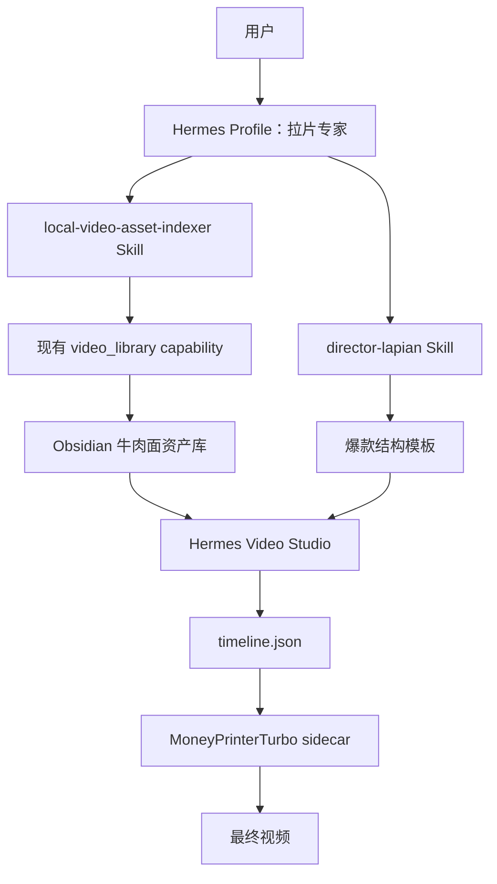

# Obsidian 视频资产库与“拉片专家”设计

日期：2026-07-11

状态：已完成产品设计，等待用户复核

范围：Hermes Desktop、`capabilities/video_library`、Hermes Profile/Skill、Obsidian Vault、MoneyPrinterTurbo Video Studio

## 1. 目标

把指定目录中的门店实拍视频自动整理为可被 Video Studio 检索和匹配的镜头级资产库，并让同一个 Hermes“拉片专家”智能体同时承担两种任务：

1. 自有素材入库：切镜、抽取关键帧、理解画面、分类、打标签、评分、建立索引。
2. 爆款参考拉片：分析钩子、文案节拍、镜头语言、声音、情绪曲线和可迁移结构。

最终闭环：

```text
门店实拍素材 -> 牛肉面资产库 -> 文案/分镜 -> 镜头匹配
爆款参考视频 -> 爆款结构模板 -----------^          |
                                                   v
                                  timeline.json -> MoneyPrinterTurbo -> 成片
```

## 2. 已确认的产品决策

- 素材同时包含短视频和长时间连续素材。
- 短且无明显切镜的视频可以整条作为一个镜头；长视频或多镜头视频先切镜。
- 默认只保存源视频路径和镜头起止时间；高分镜头或实际被项目选中的镜头再裁成实体文件。
- AI 分析完成后自动入库，不设置人工审核门槛。
- 低置信度、不可用和重复镜头仍可入库，但必须带状态，默认不参与或降低匹配优先级。
- 原始素材不移动、不改名、不删除。
- 第一版由用户向“拉片专家”下达扫描命令后全自动处理整个目录；暂不做常驻文件监听。
- 使用一个 Hermes Profile，挂两套职责清晰的 Skill，不把两种输出塞进一个超大 Skill。

## 3. 当前代码基础

现有 `capabilities/video_library` 已完成 Phase 1：

- SHA-256 内容去重。
- FFprobe 媒体探测。
- FFmpeg scene detection 和固定时长 fallback。
- MP4 镜头切片和 JPEG 关键帧。
- SQLite 中的 `assets`、`clips`、`tags`、`clip_tags`、`analysis_jobs`。
- 素材查询、`timeline.json` 创建和 MoneyPrinter local material 接入。
- Desktop API 与 MCP 调用面。

因此本项目不得建立平行的第二套素材数据库或第二套切镜流水线。实现应扩展现有 `capabilities/video_library`：

1. 增加“引用外部原片、派生文件按需生成”的资产模式。
2. 增加 AI 语义分析和受控标签词典。
3. 增加全文/向量检索和文案镜头匹配。
4. 增加 Obsidian 可读页面与资产库配置。
5. 增加 Profile + Skill 编排入口。

现有默认 `$HERMES_HOME/video-library/` 仍作为普通用户的默认素材库。牛肉面项目使用显式配置的 Obsidian 资产库，不通过新的 `HERMES_*` 环境变量配置。

## 4. 系统边界



职责分配：

| 组件 | 职责 | 不负责 |
| --- | --- | --- |
| 拉片专家 Profile | 理解命令、选择 Skill、汇报执行结果 | 逐条直接写 SQLite、视频渲染 |
| `local-video-asset-indexer` | 规定批量入库步骤、标签规范和结果要求 | 爆款导演长报告 |
| `director-lapian` | 爆款视频导演分析和结构模板提炼 | 门店素材批量索引 |
| `video_library` | 扫描、指纹、切镜、派生文件、事务、索引、检索、timeline | 对话编排、最终视频渲染 |
| Video Studio | 选择资产库、编辑文案、分镜规划、镜头匹配、预览 | 保存分析状态 |
| MoneyPrinterTurbo | 配音、字幕、BGM、拼接、渲染 | 素材资产管理和语义理解 |

该能力停留在 Hermes 边缘：CLI/Skill + capability/API/MCP。不得增加常驻 Hermes Agent Core model tool。

## 5. 资产库配置

资产库是显式配置对象，不依赖隐式扫描整个 Vault：

```yaml
video_libraries:
  - id: beef-noodle
    name: 牛肉面资产库
    root: /Users/ruoyu/Documents/Obsidian Vault/牛肉面资产库
    source_roots:
      - /Users/ruoyu/Documents/Obsidian Vault/牛肉面资产库/01_原始素材
    mode: linked
    auto_ingest: false
    locale: zh-CN
    taxonomy: beef-noodle-v1
```

规则：

- `root` 和 `source_roots` 必须经显式配置。
- 第一版只允许扫描 `source_roots` 内的视频。
- `mode: linked` 表示原片留在 Obsidian，数据库只记录路径、指纹和元数据。
- 高分或已选镜头的实体文件写入资产库的受管派生目录。
- API、CLI 和 Skill 通过 `library_id` 选择资产库，不接受任意未配置输出路径。

## 6. Obsidian 目录

```text
牛肉面资产库/
├── 资产库首页.md
├── 01_原始素材/
├── 02_精选镜头/
├── 03_关键帧/
├── 04_素材分析/
│   ├── 单条视频分析/
│   ├── 镜头清单/
│   └── 素材统计.md
├── 05_爆款参考/
│   ├── 原始视频/
│   └── 导演级拉片报告/
├── 06_创作模板/
│   ├── 开头钩子/
│   ├── 制作过程/
│   ├── 品牌故事/
│   └── 探店转化/
└── .hermes-assets/
    ├── index.sqlite
    ├── manifests/
    ├── analysis-jobs/
    ├── failed-jobs/
    ├── embeddings/
    ├── cache/
    └── logs/
```

约束：

- `01_原始素材` 是源文件真相，不由 Hermes 改写。
- `02_精选镜头` 只包含高分或被实际采用后按需裁出的文件。
- `03_关键帧` 和 `04_素材分析` 面向人浏览。
- `.hermes-assets` 面向程序；用户不需要手动编辑。
- Markdown 是可读投影，SQLite 是检索和状态真相。两者冲突时以 SQLite 和源文件指纹为准，重新生成 Markdown。

## 7. 混合素材切分策略

分析前先探测时长和镜头边界：

1. 短视频且没有可信切点：整条作为一个镜头。
2. 短视频但包含多个明显硬切：按检测结果拆分。
3. 长视频：按 scene detection 拆分；无可信切点时使用固定时长 fallback。
4. 过短碎片与相邻镜头合并，避免生成无法使用的片段。
5. 仅先记录原片时间范围；除非镜头成为精选或进入 timeline，否则不生成独立 MP4。
6. 关键帧默认取镜头中点，并可增加首尾帧或视觉变化峰值帧。

现有 Phase 1 会为每个镜头立即生成 MP4。`linked` 模式需要新增延迟裁切路径，但必须保留原有 managed 模式兼容性。

## 8. 标签体系

采用“固定维度 + 自由标签 + 检索描述”，禁止只用自由生成标签。

| 维度 | 示例 |
| --- | --- |
| 主体 | 厨师、顾客、牛肉、面条、汤锅、门店 |
| 场景 | 后厨、前厅、门头、餐桌、街景 |
| 动作 | 拉面、切肉、浇汤、撒香菜、端碗、吃面 |
| 工序 | 和面、醒面、拉面、煮面、装碗、出餐 |
| 景别 | 特写、近景、中景、全景、环境远景 |
| 机位 | 平视、俯拍、仰拍、第一视角 |
| 运镜 | 固定、推进、拉远、横移、跟拍、环绕 |
| 画面特点 | 热气、汤汁、油亮、火焰、慢动作、烟火气 |
| 情绪 | 食欲、温暖、忙碌、专业、热闹、治愈 |
| 文案用途 | 开头钩子、产品证明、制作过程、品牌故事、结尾召唤 |
| 音频 | 有效对白、环境声、噪声、静音、适合保留原声 |
| 质量 | 清晰度、稳定性、曝光、主体完整度、可用时长 |
| 门店信息 | 门头、Logo、价格、员工、顾客、地理标识 |

固定标签采用命名空间，例如 `场景/后厨`、`工序/煮面`。自由标签可以补充“热气升腾”“手工现拉”，但不替代固定标签。

## 9. 镜头记录 Schema

每个镜头的规范数据至少包含：

```json
{
  "schema_version": "1.0",
  "library_id": "beef-noodle",
  "asset_id": "asset_4fd21d07a8c2b10e6d0149a3",
  "shot_id": "clip_4fd21d07a8c2_0003",
  "source": {
    "path": "01_原始素材/2026-07-门店拍摄/厨师下午拉面01.mp4",
    "file_hash": "sha256:4fd21d07a8c2b10e6d0149a32f68f2b384ec92f92771cf3d3f78b1d57d64b804",
    "start_seconds": 8.4,
    "end_seconds": 13.7,
    "duration_seconds": 5.3
  },
  "content": {
    "summary": "厨师将拉好的细面快速下入沸水锅",
    "subjects": ["厨师", "面条", "汤锅"],
    "scene": ["后厨"],
    "actions": ["拉面", "下锅"],
    "production_stage": ["拉面", "煮面"],
    "visible_text": [],
    "brand_elements": []
  },
  "cinematography": {
    "shot_size": "近景",
    "angle": "轻微俯拍",
    "camera_motion": "固定",
    "composition": ["主体居中"],
    "visual_features": ["热气", "沸腾", "手部动作"]
  },
  "creative": {
    "mood": ["烟火气", "专业", "食欲"],
    "commercial_functions": ["制作过程", "品质证明"],
    "hook_strength": 0.68,
    "suggested_script": ["每一碗面，都是师傅现场手工拉制"]
  },
  "quality": {
    "sharpness": 0.91,
    "stability": 0.88,
    "exposure": 0.82,
    "subject_integrity": 0.95,
    "overall_score": 0.89,
    "usability": "recommended"
  },
  "audio": {
    "has_audio": true,
    "has_dialogue": false,
    "original_sound_value": "medium",
    "noise_level": "medium"
  },
  "retrieval": {
    "controlled_tags": ["场景/后厨", "主体/厨师", "工序/煮面", "动作/下锅"],
    "free_tags": ["热气升腾", "手工现拉"],
    "search_text": "后厨近景，厨师将手工拉好的细面下入沸水锅，适合表现现拉现煮和制作专业度"
  },
  "derived": {
    "keyframes": ["03_关键帧/厨师下午拉面01/shot_003_01.jpg"],
    "clip_path": null
  },
  "analysis": {
    "analyzer_version": "semantic-v1",
    "model": "configured-vision-model-id",
    "confidence": 0.92,
    "status": "complete",
    "analyzed_at": "2026-07-11T18:30:00+08:00"
  }
}
```

程序字段与模型字段必须分离：路径、哈希、时间、媒体元数据由确定性代码写入；视觉描述、情绪和用途由模型生成；标签最终通过 schema 校验和词典规范化后入库。

## 10. 数据库演进

在现有表上向前兼容扩展，避免删除或重建 Phase 1 数据：

- `libraries`：资产库配置快照和 taxonomy 版本。
- `assets`：增加 `library_id`、`source_mode`、`source_path`、`source_mtime`、`source_size`。
- `clips`：增加语义描述、质量字段、音频字段、分析状态、派生文件状态。
- `clip_tags`：继续保存标签、confidence、source；固定标签的 `source` 使用 `semantic-controlled`。
- `clip_embeddings`：保存 embedding provider/model/version/vector reference。
- `analysis_jobs`：增加阶段、重试次数、断点、模型版本和失败分类。
- `duplicate_groups`：记录近似重复镜头组，不删除重复资产。

SQLite migration 必须可重复执行，并保留现有数据库可读性。

## 11. 两套 Skill

### 11.1 `local-video-asset-indexer`

触发示例：

- “扫描牛肉面实拍素材目录。”
- “把所有新增视频加入牛肉面资产库。”
- “给这批门店视频分类打标签。”
- “更新本地视频素材索引。”

执行顺序：

1. 解析已配置的 `library_id`，不接受未授权目录。
2. 扫描支持的视频扩展名。
3. 计算指纹并排除已完成的同内容资产。
4. 创建或恢复分析 job。
5. 探测、切镜、关键帧、可选音频/ASR。
6. 调用视觉模型生成严格 schema 输出。
7. 规范化标签、计算质量与状态。
8. 在事务中提交 SQLite，再生成 Obsidian Markdown 投影。
9. 输出新增、跳过、失败、不可用和低置信度统计。

Skill 不自行实现数据库；它调用现有 capability 的 CLI/API/MCP 边界。优先增加 CLI 命令供 Skill 调用，MCP 作为已有 Agent 接口继续保留。

### 11.2 `director-lapian`

保留用户提供的导演级拉片 Skill，服务爆款参考视频。它继续生成：

- 帧/自适应详细拉片报告。
- 专业导演分析。
- 源片风格圣经。
- 新增机器可读的 `reference-pattern.json`。

`reference-pattern.json` 包含钩子类型、文案节拍、镜头节奏、情绪曲线、声音策略、段落画面功能、可迁移规则和不可照搬内容。

用户提供的 Skill 安装前还需修复其离线测试中 `lapian_delivery_status.py` 对稳定 QA JSON 的选择优先级问题。该问题不阻断本设计，但必须在 Skill 入库验收中覆盖。

## 12. 拉片专家 Profile

建议 Profile 标识：

```text
display name: 拉片专家
profile id: video-analysis-expert
```

Profile 的 SOUL/说明应明确：

- 自有素材任务调用 `local-video-asset-indexer`。
- 爆款参考任务调用 `director-lapian`。
- 不修改源视频。
- 不绕过资产库配置扫描其他目录。
- 不把长篇导演报告当作机器素材索引。
- 所有批量任务必须用 job 状态，可恢复、可汇报。

Skill 是主要能力载体，Profile 只提供角色边界和路由，不复制 Skill 正文。

## 13. 全自动批量入库

第一版命令语义：

```text
扫描牛肉面实拍素材目录，把所有新增视频分析并加入牛肉面资产库。
```

状态机：

```text
discovered -> hashing -> probing -> segmenting -> extracting_evidence
           -> semantic_analysis -> indexing -> projecting_markdown -> complete
```

失败状态保留 `failed_stage`、错误类别和可重试标记。一次文件失败不得中断整批任务。

自动入库策略：

- 正常镜头：`recommended` 或 `usable`。
- 低置信度：`low_confidence`，可检索但默认降权。
- 严重模糊、全黑、损坏：`unusable`，默认排除。
- 高度重复：加入 `duplicate_group`，匹配时降低连续重复概率。
- 模型调用失败：有限次数重试后写入失败队列。

## 14. Video Studio 素材匹配

素材来源 UI 从单一 `Local materials` 升级为：

```text
本地资产库
├── 牛肉面资产库
├── 火锅资产库
└── 其他已配置资产库
```

选择资产库后：

1. 将最终文案拆成画面需求。
2. 对每段文案生成检索文本和约束条件。
3. 使用全文/向量召回候选镜头。
4. 按语义相关度、画质、可用时长、商业用途、重复率和镜头连续性重排。
5. 生成镜头计划和 `timeline.json`。
6. 只为最终选中且尚未裁切的镜头生成实体 MP4。
7. 将选中片段交给 MoneyPrinter local material/render 路径。
8. 渲染完成后记录本次镜头使用历史，供后续减少重复。

第一版匹配可以先使用已有的匹配方案；本设计要求资产索引提供稳定的语义字段和检索接口，不重写已解决的匹配算法。

## 15. 错误处理与恢复

- 源文件在扫描后消失：标记 `source_missing`，不删除旧索引。
- 文件在分析期间变化：丢弃本次结果，按新指纹重新排队。
- FFmpeg 失败：保留 job 和受限错误摘要，不提交半成品 clips。
- 模型超时/限流：指数退避，达到上限后进入 `failed-jobs`。
- 模型返回非法 schema：修复重试一次，再失败则记录原始校验错误。
- SQLite 提交失败：不更新 Markdown 投影，不交换 staging 目录。
- Markdown 生成失败：SQLite 仍是完成真相，单独重试投影步骤。
- 批处理中断：下次从未完成 stage 恢复，不重复已完成模型调用。
- Obsidian 目录不可写：在写入前失败并报告权限，不反复尝试。

## 16. 安全与隐私

- 目录访问采用 allowlist，拒绝 `..`、符号链接逃逸和未配置根目录。
- 原始视频只读。
- 派生文件只能写入当前 asset library root。
- 模型 Provider 和是否允许上传关键帧必须在资产库/模型配置中可见；不得默认为用户不知情地上传整段原视频。
- 优先发送必要关键帧和短音频片段，不发送整库。
- 日志不记录 API Key，不保存未经限制的模型原始请求头。
- 对顾客人脸、车牌和联系方式预留隐私标签与后续脱敏策略；第一版至少能标记其存在。

## 17. 验收标准

### 17.1 素材入库

- 一批同时包含短视频和长视频的目录可以一次性完成扫描。
- 短单镜头素材不被机械切成碎片；长素材能生成合理镜头边界。
- 每个镜头具有关键帧、结构化描述、固定标签、自由标签和质量状态。
- 第二次扫描相同内容不会重复创建资产或重复调用语义分析。
- 文件改名但内容不变时仍识别为同一内容。
- 单个文件失败不影响整批任务，重启后能恢复。
- 原始视频的名称、位置、内容保持不变。

### 17.2 检索与匹配

- “厨师拉面”“牛肉切片”“热汤浇入碗中”等查询能返回正确镜头。
- `unusable` 镜头默认不参与匹配。
- 重复镜头不会在同一 timeline 中被无意义连续使用。
- 选中镜头能按需裁切，并生成根目录约束内的 timeline。

### 17.3 Video Studio 闭环

- Video Studio 能列出并选择“牛肉面资产库”。
- 文案可以生成镜头计划。
- timeline 能交给 MoneyPrinterTurbo。
- 最终成片包含配音、字幕、BGM 和匹配的本地实拍镜头。
- 成片完成后可追溯每个画面来自哪个源文件和时间范围。

### 17.4 Skill/Profile

- 同一“拉片专家”能根据请求稳定选择正确 Skill。
- 素材入库任务不生成无必要的几十页导演报告。
- 爆款拉片任务不污染牛肉面自有素材索引。
- 用户提供的 `director-lapian` 离线测试全部通过。

## 18. 实施阶段建议

1. 修正并安装 `director-lapian`，增加 `reference-pattern.json` 契约。
2. 为现有 `video_library` 增加 library config 和 linked source 模式。
3. 增加 AI semantic analyzer、taxonomy 校验和数据库 migration。
4. 创建 `local-video-asset-indexer` Skill 与“拉片专家”Profile。
5. 增加批量扫描 CLI/job 恢复和 Obsidian Markdown 投影。
6. 增加 Video Studio 资产库选择和语义检索调用。
7. 打通按需裁切、timeline、MoneyPrinter 渲染和使用历史。
8. 用真实牛肉面混合素材完成端到端验收。

## 19. 非目标

第一版不包含：

- 常驻目录监听。
- 删除或自动整理原始视频。
- 强制人工审核标签。
- 完整非线性编辑器或专业时间线 UI。
- 替换 MoneyPrinterTurbo 渲染引擎。
- 把素材能力加入 Hermes Agent Core 常驻工具集合。
- 一开始就支持任意行业的无限 taxonomy；先以牛肉面资产库验证通用骨架。
