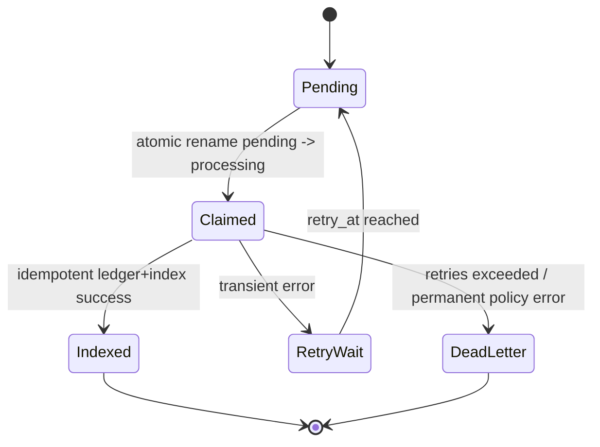
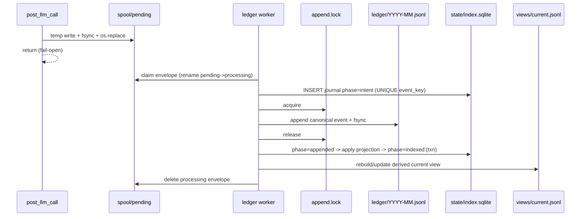

# Truth Ledger storage, concurrency, and failure architecture (T3)

Date: 2026-07-17
Task: t_682fbfbc
Plan reference: /Users/hermes/.hermes/hermes-agent/.hermes/plans/2026-07-17_143520-truth-ledger-option-2.md

## Scope and constraints

This document specifies storage/reliability architecture only (no production code):

- Durable spool for fail-open post-turn capture.
- Immutable append-only lifecycle ledger.
- Disposable SQLite idempotency index and `views/current.jsonl` projection.
- Locking, transaction boundaries, ordering, caps, retries/backoff/jitter, dead letters.
- Rotation/retention, partial-tail recovery, crash windows, permissions, fail-open behavior.

Non-goals for this stage:

- No automatic writes to curated memory (`USER.md`, `MEMORY.md`) or GBrain.
- No hard-delete automation.
- No cloud storage dependencies.

## Invariants

1. Chat delivery is fail-open even if ledger capture/processing fails.
2. Capture is at-least-once; logical processing is idempotent.
3. Canonical source of history is immutable JSONL ledger.
4. SQLite/index and `current.jsonl` are disposable/rebuildable from ledger.
5. No raw `conversation_history`, secrets, or chain-of-thought are persisted.
6. Storage remains profile-scoped under `${HERMES_HOME}/truth-ledger/`.

## Directory layout and file semantics

```text
${HERMES_HOME}/truth-ledger/
├── spool/
│   ├── pending/           # newly captured envelopes (durable queue)
│   ├── processing/        # claimed envelopes in-flight
│   └── dead-letter/       # permanent failures with redacted metadata
├── ledger/
│   └── YYYY-MM.jsonl      # immutable append-only lifecycle events
├── views/
│   ├── current.jsonl      # disposable latest-active projection
│   └── review.jsonl       # optional quarantined/inferred candidates
├── state/
│   ├── index.sqlite       # disposable idempotency+projection index
│   └── locks/             # advisory lock files (append, rebuild)
└── errors/
    └── errors.jsonl       # non-fatal diagnostics (no secrets)
```

Permissions (POSIX):

- Directories: `0700`
- Files: `0600`
- Enforced at create/open, corrected on startup reconciliation.

## Data ownership model

- Canonical: `ledger/YYYY-MM.jsonl` (append-only, never edited in place).
- Derived: `state/index.sqlite`, `views/current.jsonl`, `views/review.jsonl` (safe to rebuild).
- Ephemeral: `spool/pending`, `spool/processing` (durable queue state).
- Quarantine: `spool/dead-letter` + `errors/errors.jsonl`.

## Envelope and idempotency keys

Envelope key (capture identity):

`capture_key = profile + session_id + turn_id`

Logical event key (idempotency identity):

`event_key = profile + session_id + turn_id + operation + scope + subject + key + canonical_value_hash`

Rules:

- Missing/unstable `turn_id` marks envelope non-promotable (review-only path).
- `event_id` is deterministic from `event_key` to enable replay detection.
- SQLite UNIQUE constraints are applied on `capture_key` and `event_key`.

## Capture path (synchronous hook, fail-open)

Capture path performs only local filesystem operations and returns immediately.
No model/network calls.

Steps:

1. Build minimal envelope payload (no raw conversation history).
2. Validate size cap (frozen defaults: soft `64 KiB`, hard `128 KiB`; oversize -> compact metadata-only envelope with explicit `envelope_oversize` reason).
3. Write `spool/pending/.tmp-<uuid>.json`.
4. `flush + fsync(tmp)`.
5. `os.replace(tmp, pending/<ts>-<uuid>.json)`.
6. `fsync(parent_dir)` best effort.
7. Return success/failure to logs only; never block chat response.

If any step fails, emit sanitized diagnostic into `errors/errors.jsonl` and continue (fail-open).

## Processing state machine



Envelope metadata fields used for flow control:

- `attempt_count`
- `first_seen_at`
- `last_error_code`
- `next_retry_at`
- `processing_owner`

## Concurrency and locking model

### Lock hierarchy

1. Spool claim: lock-free via atomic rename (`pending` -> `processing`) on same filesystem.
2. Ledger append lock: advisory file lock (`state/locks/append.lock`) around append critical section.
3. Rebuild lock: separate exclusive lock (`state/locks/rebuild.lock`) so rebuild and append cannot interleave unsafely.

Cross-platform notes:

- POSIX/macOS: `fcntl.flock` for advisory lock.
- Windows fallback (future implementation detail): mandatory equivalent via `msvcrt` or portalocker-compatible adapter.
- Lock scope is narrow; no global long-lived lock around retries/backoff.

### Ordering guarantee

Per-event ordering is guaranteed by append critical section and deterministic timestamp/event_id sorting in projection rebuild. Global wall-clock total ordering is best-effort; causal correctness is provided by `event_id`, `occurred_at`, and `supersedes` edges.

## Transaction boundaries and crash safety

Because JSONL append is outside SQLite transactions, we use a two-phase idempotent journal in SQLite.

### SQLite tables (conceptual)

- `capture_index(capture_key UNIQUE, envelope_name, status, updated_at)`
- `event_journal(event_key UNIQUE, event_id UNIQUE, phase, ledger_file, ledger_offset, checksum, updated_at)`
- `projection_state(logical_key PRIMARY KEY, fact_id, status, updated_at)`

`phase` transitions:

- `intent` -> `appended` -> `indexed`

### Processing sequence per event

1. Begin SQLite transaction (`BEGIN IMMEDIATE`).
2. Insert/confirm `event_journal(event_key, event_id, phase='intent')`.
   - If UNIQUE conflict and phase=`indexed`, treat as duplicate success.
3. Commit transaction.
4. Acquire append lock.
5. Append canonical event JSONL line to monthly ledger; `flush + fsync(file)`.
6. Record `ledger_offset` and `checksum`; release append lock.
7. Begin SQLite transaction.
8. Update journal phase to `appended` (if not already).
9. Apply projection/index mutations; set phase=`indexed`.
10. Commit transaction.
11. Remove processing envelope atomically.

Why this prevents duplicate logical events:

- `event_key UNIQUE` admits only one logical event identity.
- Retries may repeat side effects, but `event_key`/`event_id` prevent double-activation in index/projection.
- Recovery probes ledger tail for `event_id` when phase ambiguity exists.

## Sequence diagram



## Frozen operational thresholds (Q1 C3 remediation; defaults for T8)

These values are now frozen to prevent ad hoc implementation drift. They are intentionally conservative and may be overridden by config in T8, but these defaults are the required baseline for implementation and test parity.

| Domain | Frozen default | Why conservative | Configurability target | Acceptance tests |
|---|---|---|---|---|
| Envelope payload cap | `envelope_soft_bytes=64 KiB`, `envelope_hard_bytes=128 KiB` | Keeps post-turn capture bounded for hook p95 < 10ms and prevents transcript-like blobs from entering storage | `truth_ledger.capture.envelope_soft_bytes`, `truth_ledger.capture.envelope_hard_bytes` | TL-STOR-001, TL-STOR-008 |
| Canonical record cap | `ledger_record_hard_bytes=64 KiB` per JSONL line | Protects append latency and avoids oversized replay records | `truth_ledger.ledger.record_hard_bytes` | TL-STOR-009 |
| Spool queue bounds | soft: `pending_count<=5000` and `pending+processing_bytes<=256 MiB`; hard: `count<=8000` or `bytes<=384 MiB` | Prevents unbounded disk growth while leaving enough headroom for transient outages | `truth_ledger.spool.soft_count`, `truth_ledger.spool.soft_bytes`, `truth_ledger.spool.hard_count`, `truth_ledger.spool.hard_bytes` | TL-STOR-008, TL-STOR-010 |
| Overflow behavior | At soft cap, shed oldest pending to dead-letter (`queue_overflow`); at hard cap, reject new capture envelope to diagnostic-only drop (`queue_hard_cap`) while preserving chat fail-open | Preserves service responsiveness and explicit audit trail under pressure | `truth_ledger.spool.overflow_policy` | TL-STOR-010 |
| Projection update strategy | SQLite projection/index mutates per indexed event; `views/current.jsonl` refreshed atomically in batches (`max 100 events` or `30s`, whichever first) and fully rebuildable from ledger | Prioritizes determinism and correctness over write amplification while keeping derived view freshness bounded | `truth_ledger.projection.refresh_every_events`, `truth_ledger.projection.refresh_every_seconds` | TL-STOR-011, TL-STOR-004 |
| Ambiguity probe depth | `tail_probe_max_records=4096` OR `tail_probe_max_bytes=8 MiB` (whichever reached first); if miss, run bounded full-file scan before retry/dead-letter | Ensures crash-window ambiguity resolution without unbounded tail scans | `truth_ledger.recovery.tail_probe_max_records`, `truth_ledger.recovery.tail_probe_max_bytes` | TL-STOR-003, TL-STOR-005 |
| Retry/backoff/dead-letter | `max_attempts=6`, base `500ms`, exponential `2^attempt`, full jitter, delay cap `60s`; dead-letter after max attempts or explicit permanent class | Bounded retry pressure prevents lock storms and queue amplification | `truth_ledger.retry.max_attempts`, `truth_ledger.retry.base_delay_ms`, `truth_ledger.retry.max_delay_ms` | TL-STOR-006 |
| Lock/timeout behavior | append lock timeout `200ms`; rebuild lock timeout `2s`; SQLite busy timeout `250ms`; processing stale-claim timeout `15m` | Short lock waits avoid cascading contention and preserve throughput under load | `truth_ledger.lock.append_timeout_ms`, `truth_ledger.lock.rebuild_timeout_ms`, `truth_ledger.sqlite.busy_timeout_ms`, `truth_ledger.spool.processing_stale_seconds` | TL-STOR-001, TL-STOR-006, TL-STOR-012 |
| Rotation/retention | Ledger rotates monthly; ledger auto-delete disabled by default (manual retention policy required); dead-letter retained `30d` before archive review; error logs retain `30d` | Keeps append-only history intact by default and avoids silent evidence loss | `truth_ledger.ledger.retention_days` (`null` default), `truth_ledger.dead_letter.retention_days`, `truth_ledger.errors.retention_days` | TL-STOR-013 |
| Fail-open degradation | If capture write fails: skip capture, emit sanitized diagnostic, rate-limit duplicate diagnostics to 1/min per code; never block user response. If worker/index unavailable: continue capture path, defer projection freshness | Protects user-facing latency and availability while preserving observability | `truth_ledger.fail_open.diagnostic_rate_limit_seconds` | TL-STOR-007 |

## Retry, backoff, jitter, and dead letters

Frozen retry policy:

- `max_attempts = 6`
- Base delay: `500ms`
- Backoff: exponential (`2^attempt`)
- Jitter: full jitter in `[0, delay]`
- Max delay cap: `60s`

Error classes:

- Transient: `SQLITE_BUSY`, append/rebuild lock timeout, temporary IO error -> retry.
- Permanent: schema-invalid event payload, policy denial, identity hard-fail -> dead letter.
- Ambiguous crash: recovered via journal phase and bounded ledger probe before retry/dead-letter.

Dead-letter payload includes:

- envelope id, capture/event keys, attempt count, redacted error class, first/last timestamps
- no raw source transcript

## Rotation and retention

- Ledger files rotate monthly (`YYYY-MM.jsonl`).
- Active write target derived from `occurred_at` UTC month.
- `spool/pending` and `spool/processing` follow frozen queue bounds in the table above.
- Exceeding soft cap triggers oldest-pending shedding to dead letter with `queue_overflow` reason.
- Exceeding hard cap rejects new capture envelopes with diagnostic-only `queue_hard_cap` reason.
- Derived artifacts (`index.sqlite`, `current.jsonl`) remain disposable and rebuildable.
- Ledger auto-delete is disabled by default to preserve append-only history; any retention delete requires explicit config opt-in.

## Partial-tail and corruption recovery

On startup/rebuild:

1. Scan each ledger file line-by-line.
2. Accept only full UTF-8 JSON objects ending at newline boundaries.
3. On first malformed terminal fragment, quarantine suffix to `errors/corrupt-tail-<file>-<ts>.jsonl`.
4. Continue from valid prefix only.
5. Rebuild index/projection deterministically from accepted lines.

Bounded ambiguity probe policy for journal phase gaps:

- Probe tail up to `4096` records or `8 MiB`, whichever reached first.
- If event not found, perform one bounded full-file scan of the active ledger file before deciding retry/dead-letter.

Never mutate canonical valid prefix; quarantine corrupt suffix separately.

## Crash window matrix

| Crash window | Risk | Recovery action | Safety result |
|---|---|---|---|
| Before temp spool fsync | Envelope lost | No record; fail-open only | Chat unaffected; potential missed capture |
| After temp fsync, before rename | Orphan temp file | Startup temp sweep removes/recovers by age/name | No corruption |
| After rename to pending, before worker claim | Stuck pending | Session-start worker picks up | At-least-once preserved |
| After claim rename to processing, before intent row | Ambiguous in-flight | Processing-age timeout returns to pending | Retryable |
| After intent row commit, before ledger append | Intent not materialized | Retry resumes append | No duplicate activation |
| After ledger append, before phase=appended | Phase ambiguity | Probe ledger for `event_id`, then advance phase | No duplicate logical event |
| After phase=appended, before phase=indexed commit | Projection lag | Replay journal rows with phase=appended | Canonical ledger preserved |
| During current.jsonl write | Derived view torn write | Write temp + replace + fsync dir | View repairable from ledger |
| During rebuild | Mixed derived state | rebuild.lock + replace-on-complete semantics | No canonical damage |

## Fail-open behavior

Fail-open applies to user-visible response path only.

- Hook never raises to user path.
- All failures are logged as sanitized diagnostics.
- If spool is unavailable, system skips capture rather than delaying response.
- Worker failures do not affect live turns; they only affect ledger freshness.

## Proof points from throwaway spikes

Reference: `docs/truth-ledger/discovery/t3-storage-spikes.md`

Observed in local throwaway runs:

- Atomic replace cycles: 100/100 parseable writes.
- Locked append: 1600 expected/1600 unique lines under 8-thread contention.
- SQLite idempotency: 1000 concurrent insert attempts on same key -> exactly 1 row.
- Partial tail recovery: valid prefix length 2, malformed suffix quarantined.

These results justify the selected primitives for T3.

## Acceptance mapping

- At-least-once capture + idempotent processing: covered by spool durability, retry policy, and UNIQUE event keys.
- Duplicate logical events prevented under concurrency: covered by SQLite UNIQUE constraints and journal phase recovery.
- Concurrent corruption prevention: covered by atomic rename + append lock + temp/replace writes.
- Crash windows have recovery: explicit matrix above.
- Ledger as source history, projection disposable: canonical/derived ownership model and rebuild protocol.

## Proposed executable test cases for T8/Q2

1. TL-STOR-001: Multi-process concurrent append with lock contention; assert no malformed lines and append lock timeout handling (`200ms`).
2. TL-STOR-002: Duplicate callback replay with same `event_key`; assert one indexed logical event.
3. TL-STOR-003: Kill between append and index commit; restart recovery should converge to `indexed` once via bounded ambiguity probe.
4. TL-STOR-004: Kill during `current.jsonl` write; assert old/new whole-file validity, never partial JSON line; verify batch refresh boundaries (`<=100 events` or `30s`).
5. TL-STOR-005: Inject malformed tail plus phase ambiguity; assert quarantine, `4096-record/8MiB` tail probe behavior, and deterministic rebuild from valid prefix.
6. TL-STOR-006: Force `SQLITE_BUSY`/lock timeout; assert `max_attempts=6`, bounded backoff (`500ms` base, `60s` cap), and eventual success/dead-letter.
7. TL-STOR-007: Permission-denied on spool path; assert fail-open response and sanitized, rate-limited diagnostic behavior.
8. TL-STOR-008: Envelope oversize (`>128 KiB`) and soft oversize (`64-128 KiB`) cases; assert compact metadata behavior and no raw transcript persistence.
9. TL-STOR-009: Record oversize (`>64 KiB`) rejected with policy classification; assert no malformed ledger append.
10. TL-STOR-010: Queue soft/hard cap pressure (`5000/8000`, `256/384 MiB`); assert oldest-shed and hard-cap reject semantics with explicit reasons.
11. TL-STOR-011: Projection strategy checks; assert SQLite is authoritative per event and `current.jsonl` remains rebuildable/disposable.
12. TL-STOR-012: Stale processing claim (`>15m`) requeue behavior and idempotent reprocessing.
13. TL-STOR-013: Rotation/retention defaults; assert monthly rotation and no implicit ledger deletion without explicit opt-in.

## Closed Q1 decisions (C3)

Q1 C3 operational threshold decisions are now frozen in this document and mapped to TL-STOR-001..013. The remaining implementation choice is limited to Windows lock adapter specifics, which does not change any frozen threshold values above.
