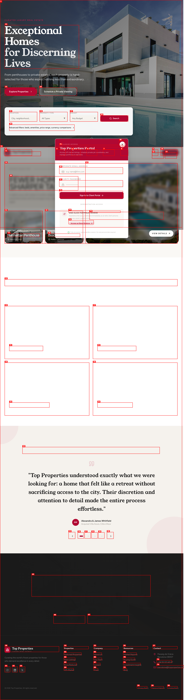
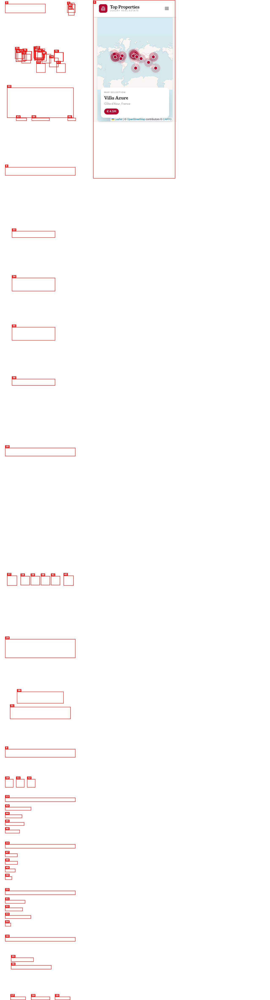
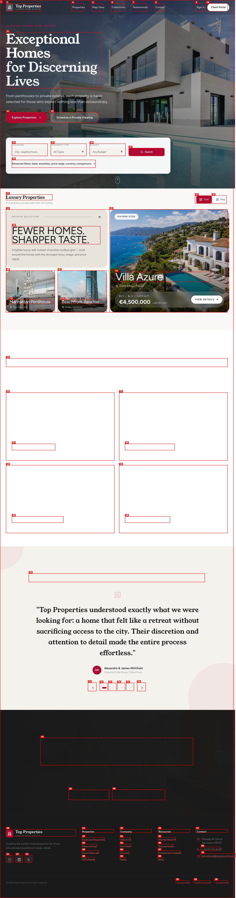
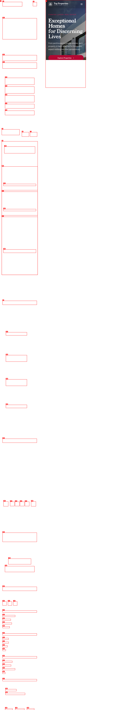

## 🎨 Visual UI Review — 2026-05-22

### Rubric Scores
| Dimension | Score | Notes |
|-----------|-------|-------|
| Hierarchy | 3/5 | Strong premium framing, but several primary CTAs don't lead to a deeper state and the featured trio doesn't create a clear entry point. |
| Rhythm | 3/5 | Nice spacing in the hero, but the featured-property row breaks rhythm because one card is much taller than the others. |
| Trust | 4/5 | The tone, typography, and image treatment feel upscale and curated. |
| Usability | 2/5 | Search/filter actions feel inert, and the listing cards don't open a real detail surface. |
| Mobile | 3/5 | The mobile layout stays readable, but the map state is heavy and the selected-property summary sits low. |
| Craft | 4/5 | Overall polish is good, with only a few layout/state issues standing out. |

### 🔴 Top Issues

- **[P1] Portal modal is clipped instead of centering in the viewport**
  - **Screenshot**: 
  - **What's wrong**: the client-portal overlay opens with its top edge cut off, which makes the modal feel attached to the scrolled page instead of a true viewport-level dialog.
  - **Fix direction**: render the modal through a top-level portal, lock background scrolling, and center the dialog against the viewport rather than an ancestor container.

- **[P1] Featured property row breaks the visual rhythm**
  - **Screenshot**: 
  - **What's wrong**: the rightmost feature card (`Villa Azure`) is dramatically taller than the two supporting cards, so the row reads as one oversized slab next to two short tiles instead of a deliberate editorial composition.
  - **Fix direction**: either redesign all three cards for the taller treatment or keep the trio at one consistent rhythm/height and use a separate hero treatment for the flagship listing.

- **[P2] Search and listing CTAs look actionable but don't reach a results/detail state**
  - **Screenshot**: 
  - **What's wrong**: the hero search controls and the property cards read like primary actions, but there is no visible transition into a search-results or property-detail surface.
  - **Fix direction**: wire the search CTA to a dedicated results route/state and make the cards open a real listing detail view; until then, visually downgrade them so they don't promise a flow that isn't there.

### 🟡 Quick Wins

- **[P2] Make the mobile map state feel less bottom-heavy**
  - **Screenshot**: 
  - **What's wrong**: the map consumes most of the 390px viewport, so the selected-property summary lands low and the surface reads more like a map demo than a browse-and-compare view.
  - **Fix direction**: reduce map height on mobile or move the summary into a tighter bottom sheet so the selection signal is visible sooner.

### 🟢 What's Working

- **Premium hero framing is strong**
  - **Screenshot**: 
  - **Why it works**: the headline scale, restrained palette, and private-edit language give the page a credible luxury tone immediately.

- **Map mode has clear selection context**
  - **Screenshot**: 
  - **Why it works**: the selected property is named directly and the map/selection pairing makes the browsing mode understandable at a glance.

### 📱 Mobile-specific

- **[P2] Mobile homepage keeps the hierarchy intact, but the hero/search stack is long**
  - **Screenshot**: 
  - **What's wrong**: the page stays legible, but the top-of-page stack is still fairly tall before users reach the property edit.
  - **Fix direction**: collapse or condense one layer of hero/filter chrome so the curated listings surface sooner on small screens.

### 🔧 Recommended Fixes

1. Fix the modal/dialog mounting so overlays are viewport-centered and scroll-locked.
2. Decide whether the featured trio is a true editorial bento or a standard card row; redesign the card internals accordingly.
3. Connect search and listing cards to real navigation states.
4. Tighten the mobile map presentation so the summary card arrives earlier.
5. After those changes, re-check the mobile homepage and map state for spacing/overflow regressions.
