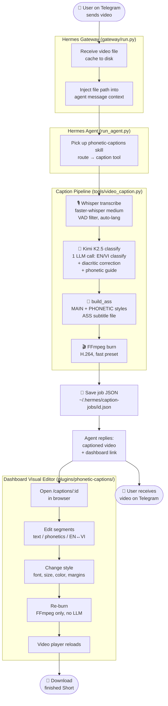
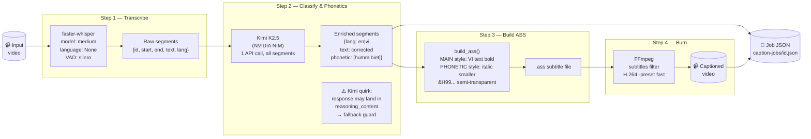
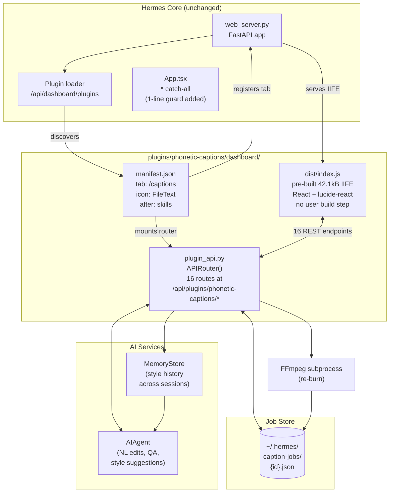
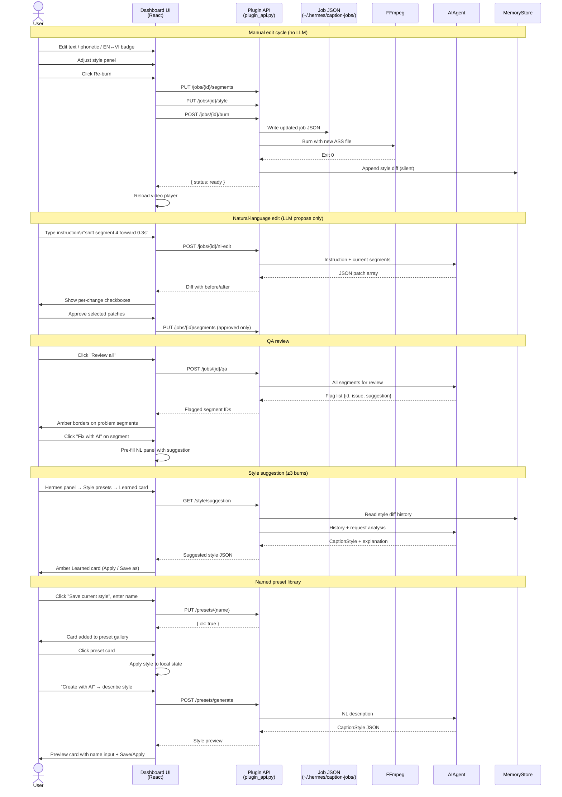
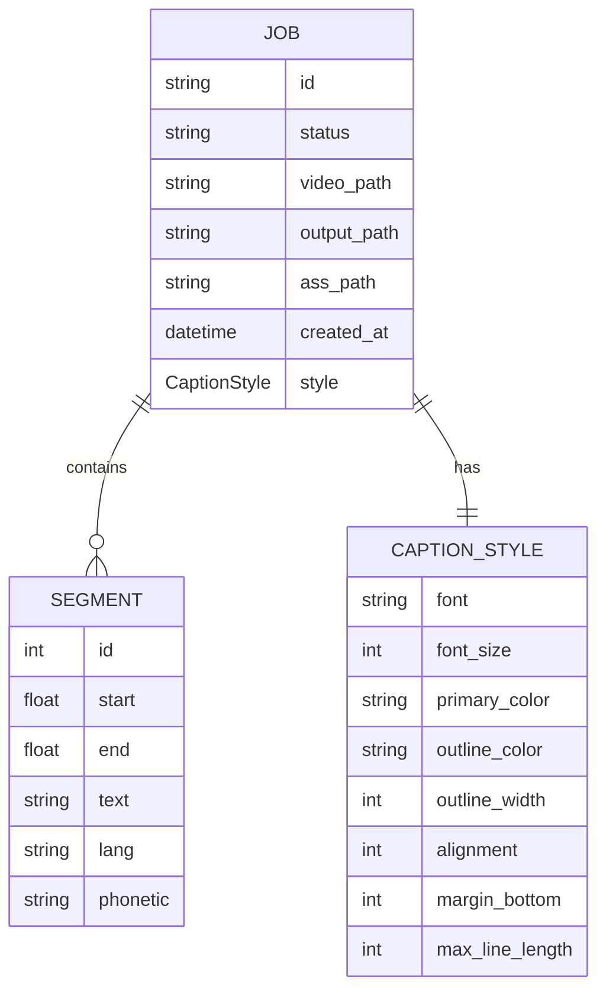
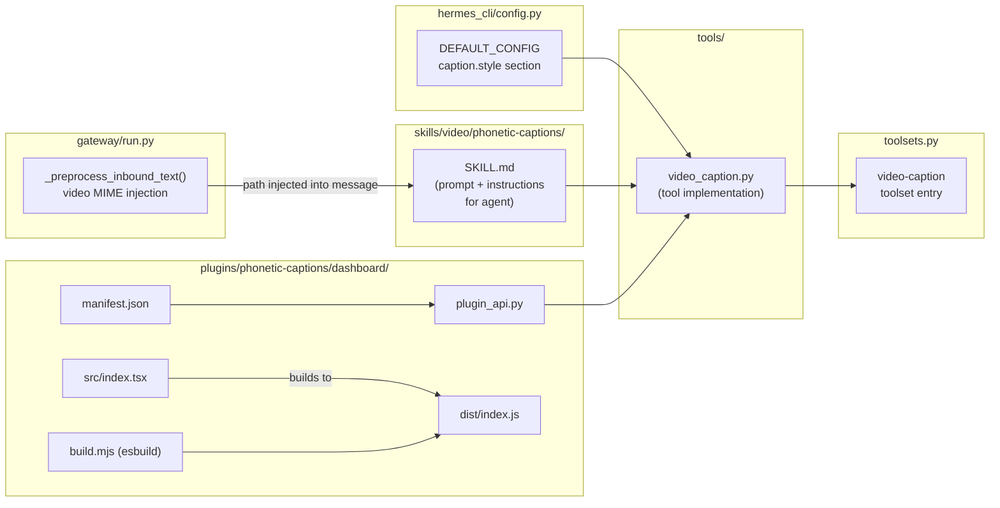

# Phonetic Captions — Architecture Diagrams

Visual reference for the end-to-end system built during the hackathon.

---

## 1. End-to-End System Flow

How a video goes from a Telegram message to a polished, captioned Short.



---

## 2. Caption Pipeline — Internal Detail

What happens inside `tools/video_caption.py` for a single `caption` operation.



---

## 3. Dashboard Plugin Architecture

How the plugin slots into the Hermes dashboard without touching core files.



**Plugin API surface** (all at `/api/plugins/phonetic-captions/`):

| Endpoint | Purpose |
|---|---|
| `GET /jobs` | Job list with status badges |
| `GET /jobs/{id}` | Full job: segments + style + paths |
| `PUT /jobs/{id}/segments` | Save edited segments |
| `PUT /jobs/{id}/style` | Save style changes |
| `POST /jobs/{id}/burn` | Re-burn + write style diff to MemoryStore |
| `GET /jobs/{id}/video` | Stream video for browser player |
| `GET /jobs/{id}/download` | Download final output |
| `POST /upload` | Create job from upload; pipeline in background thread |
| `GET /jobs/{id}/status` | Poll status (`pending/transcribing/generating_phonetics/ready/error`) |
| `POST /jobs/{id}/nl-edit` | NL instruction → JSON patch array (propose only) |
| `POST /jobs/{id}/qa` | AI quality review → segment flag list |
| `GET /style/suggestion` | Cross-session style via MemoryStore + AIAgent |
| `GET /presets` | List all named style presets |
| `PUT /presets/{name}` | Save or overwrite a named preset |
| `DELETE /presets/{name}` | Delete a named preset |
| `POST /presets/generate` | NL description → AIAgent → CaptionStyle (not auto-saved) |

---

## 4. Interactive Edit Loop

The full cycle once the user is in the dashboard editor. No LLM tokens spent on re-burn — only on NL edits, QA, and style suggestions.



---

## 5. On-Screen Caption Layout

What the burned video actually looks like for each segment type.

```
┌─────────────────────────────────────────────────────────┐
│                                                         │
│                  [ video content ]                      │
│                                                         │
│                                                         │
│                                                         │
│   Vietnamese segment:                                   │
│                                                         │
│              không biết                                 │
│            ─────────────                                │
│             [humm biet]                                 │
│                                                         │
│   ──────────────────────────────────────────────────    │
│                                                         │
│   English segment:                                      │
│                                                         │
│           Today we learn how to say...                  │
│                                                         │
└─────────────────────────────────────────────────────────┘

  MAIN style:      bold, white, black outline, bottom-center
  PHONETIC style:  italic, smaller (~80% size), semi-transparent
                   only rendered for lang=vi segments
```

**ASS style params** (defaults from `caption.style` in config.yaml):

| Style | Font | Size | Color | Outline | Alignment |
|---|---|---|---|---|---|
| MAIN | Arial | 48 | White `&H00FFFFFF` | Black 3px | 2 (bottom-center) |
| PHONETIC | Arial | 38 | White `&H99FFFFFF` | Black 2px | 8 (top-center of MAIN) |

---

## 6. Segment Data Model

The shape of data through the pipeline and stored in the job JSON.



**`lang` values**: `"en"` — English text only (MAIN style); `"vi"` — Vietnamese text + phonetic guide (MAIN + PHONETIC styles)

**`phonetic` field**: Only populated when `lang = "vi"`. Format: `[space-separated English approximation]` e.g. `[humm biet]` for `không biết`. Empty string for `lang = "en"` segments.

---

## 7. Component Dependency Map

Where each piece lives in the repo and how they relate.


