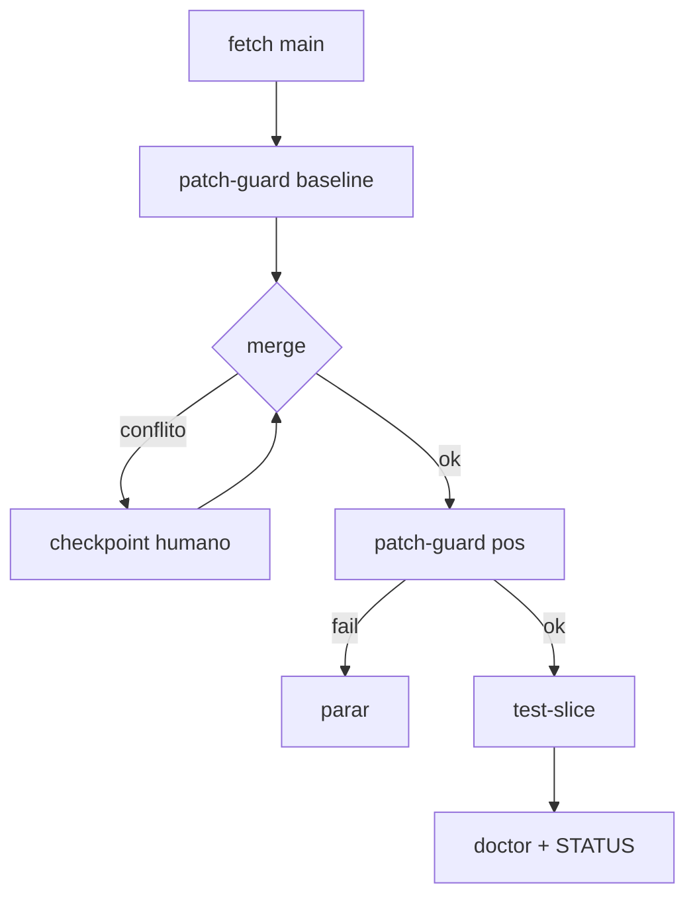

# Fluxos de Trabalho — Hermes Agent Harness

---

## Fluxo 1 — Sync seguro upstream + patches

**Gatilho:** Nova versão em `NousResearch/hermes-agent main` ou rotina semanal.

**Objetivo:** Atualizar checkout local sem perder patches Hermes One.

| # | Skill / ação | Paralelo | Checkpoint |
|---|---|---|---|
| 1 | Stash ou commit WIP local | — | Humano se diff grande |
| 2 | `git fetch origin main` | — | — |
| 3 | `hermes-patch-guard` (baseline pré-merge) | — | — |
| 4 | `git merge origin/main` | — | **Humano** se conflito |
| 5 | Resolver conflitos (PATCHES_LOCAIS.md) | — | **Humano** |
| 6 | `hermes-patch-guard` (pós-merge) | — | Falha = parar |
| 7 | `hermes-test-slice` paths afetados (via **Git Bash** / MinGit — ver D-006) | — | — |
| 8 | `hermes doctor` | — | — |
| 9 | Atualizar `registros/STATUS.md` + `LOG_EXECUCAO.md` | — | — |
| 10 | Commit merge local (se aplicável) | — | **Humano** |

**Falha:**

- 3 falhas consecutivas no mesmo passo → parar e diagnosticar
- patch-guard fail → não commitar; restaurar ou fix manual

**Artefato:** entrada em `registros/LOG_EXECUCAO.md` (criar na 1ª execução)

---

## Fluxo 2 — Operação gateway diária

**Gatilho:** Cron harness ou pedido manual.

**Objetivo:** Gateway saudável, logs limpos, zero secret leak.

| # | Skill / ação | Checkpoint |
|---|---|---|
| 1 | `hermes-gateway-ops` action=status | — |
| 2 | `hermes-gateway-ops` action=logs follow=false | — |
| 3 | `hermes-credential-audit` | — |
| 4 | Se unhealthy → restart | **Humano** |
| 5 | Mensagem teste Telegram (manual ou bot) | Humano opcional |

**Condição de parada:** restart falha 2x → escalar humano.

---

## Fluxo 3 — Smoke pós-mudança model library

**Gatilho:** Edição em `web_server.py` (bloco `HERMES_ONE_*`) ou `models.json`.

**Objetivo:** API `/api/model/library` funcional para cliente Hermes One / SSH picker.

**Pré-requisito auth:** obter token de sessão antes dos passos HTTP:
- Ler token gerado por `hermes serve` / handshake dashboard, **ou**
- Usar `HERMES_DASHBOARD_SESSION_TOKEN` fixo no smoke local

| # | Skill / ação | Checkpoint |
|---|---|---|
| 1 | `hermes serve` (background) | — |
| 2 | Bootstrap token de sessão | — |
| 3 | GET `/api/model/library` com header auth — schema válido | — |
| 4 | POST shortcut teste → DELETE (com auth) | — |
| 5 | `hermes-patch-guard` | — |
| 6 | *(Opcional, separado)* Smoke desktop upstream: `/api/model/options` via `hermes-desktop-smoke` | — |

**Nota:** `apps/desktop` deste repo **não** consome `/api/model/library` — usa `hermes.ts` → `/api/model/options` + `/api/model/set`.

**Artefato:** pass/fail em LOG_EXECUCAO

---

## Fluxo 4 — Contribuição upstream (opcional)

**Gatilho:** Bug fix genérico (ex. OpenRouter prune) sem dependência Hermes One.

**Pré-requisito:** Decisão D-003 inclui upstream.

| # | Ação | Checkpoint |
|---|---|---|
| 1 | Branch limpo **sem** blocos HERMES_ONE | — |
| 2 | Reproduzir bug em main | — |
| 3 | Fix mínimo + teste invariante | — |
| 4 | `scripts/run_tests.sh` full slice | — |
| 5 | `gh pr create` | **Humano** |

**Excluído:** model library API (escopo Hermes One).

---

## Diagrama Fluxo 1

---

## Aprovações humanas obrigatórias

| Fluxo | Ponto |
|---|---|
| 1 | Merge com conflito; commit merge local (passo 10) |
| 2 | Restart gateway |
| 3 | Nenhum (smoke local autenticado) |
| 4 | Abertura PR |
| deploy-swarm | Sempre |
