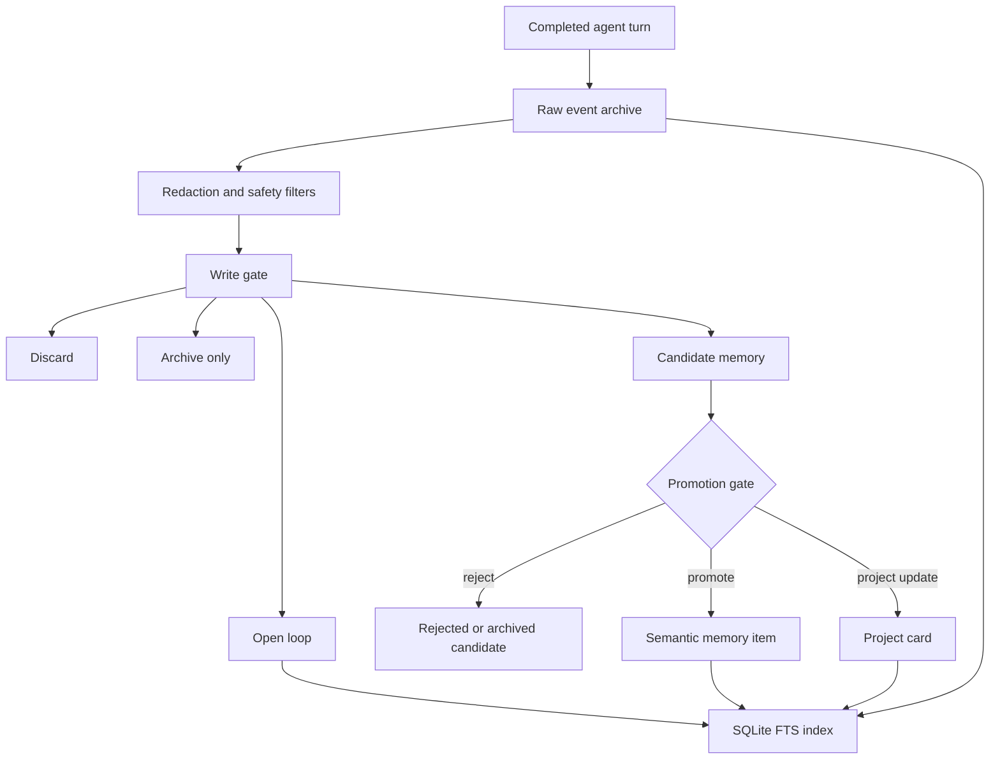
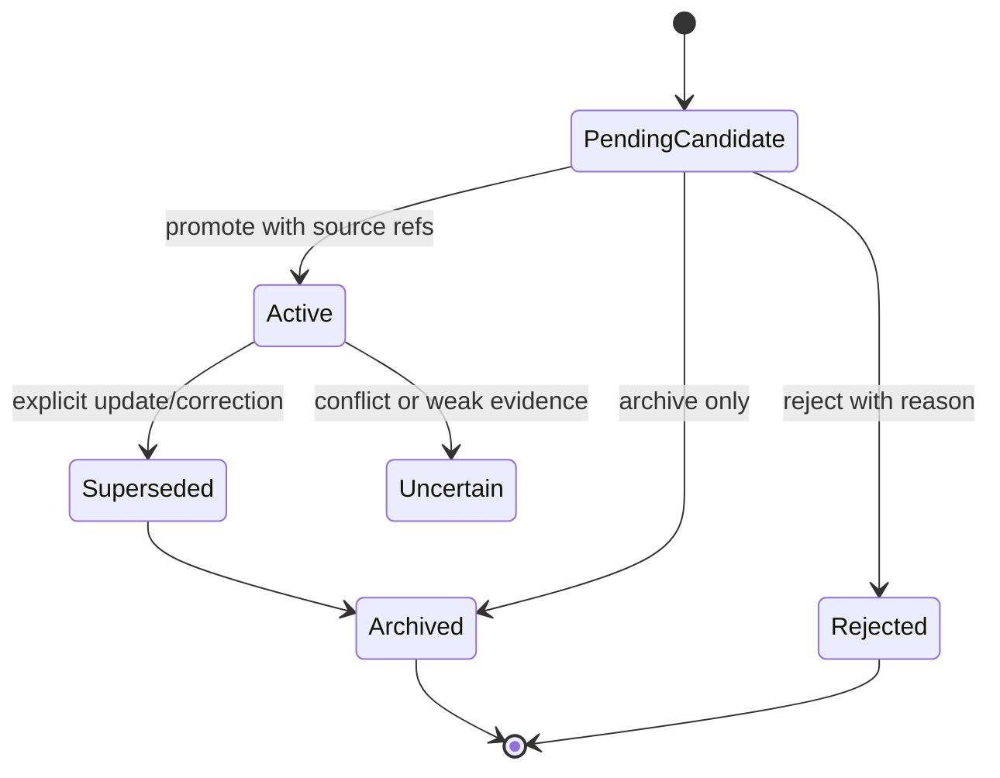

# Memory v2

Memory v2 is an experimental, local, profile-scoped long-term memory provider for Hermes Agent.

It is built around a simple principle:

> Raw logs are evidence. Summaries are indexes. Semantic memories are current beliefs. The prompt gets only a small routed packet.

The goal is not to stuff more chat history into the model context. The goal is to make memory selective, source-grounded, temporal, auditable, and cheap enough to run during ordinary agent turns.

## Status

Memory v2 is a research/prototype memory provider. It is suitable for experimentation, local dogfooding, and evaluating memory architecture ideas, but it should not be treated as a finished memory system yet.

Current strengths:

- local profile-scoped storage;
- conservative candidate-based writes;
- source references for promoted memories;
- low-compute deterministic routing;
- bounded retrieval packets;
- SQLite FTS indexing;
- stale-memory supersession fields;
- contradiction dashboard tooling;
- opt-in high-confidence automatic supersession;
- deterministic local eval harness;
- credential/prompt-injection redaction tests.

Known limitations:

- no embedding/vector backend is required or enabled by default;
- no heavy knowledge graph infrastructure yet;
- consolidation is rule-based and intentionally conservative;
- evals are local deterministic fixtures, not a complete human/LLM-judge benchmark;
- automatic supersession is narrow and should remain opt-in until broader evals exist.

## Why this exists

Most agent memory systems collapse several different jobs into one bucket called “memory”: chat history, summaries, user preferences, project state, skills, logs, and retrieved snippets. That quickly turns into append-only summary sludge.

Memory v2 separates those jobs:

- **raw archive** keeps evidence;
- **candidates** capture possible durable memories without immediately trusting them;
- **core memory** stores curated high-confidence profile facts;
- **semantic memory** stores current facts/preferences/project state with status and sources;
- **episodic memory** records what happened without pretending it is permanently true;
- **open loops** track unresolved follow-ups;
- **indexes** are derived and rebuildable;
- **retrieval packets** are small, routed, and explicitly marked as untrusted context.

The intended outcome is memory that behaves less like a bag of snippets and more like a small external cognitive architecture.

## Architecture overview

```text
completed turn
    │
    ▼
raw event archive ───────────────┐
    │                            │
    ▼                            │
write gate                       │
    │                            │
    ├── discard/archive only      │
    ├── open loop                 │
    └── candidate memory          │
             │                    │
             ▼                    │
       consolidation              │
             │                    │
             ├── promote          │
             ├── reject/archive   │
             └── supersede        │
                                  │
semantic/core/episodic stores ◄──┘
    │
    ▼
SQLite FTS index
    │
    ▼
query router → bounded memory packet → model context
```

### Write/consolidation flow



### Retrieval flow


### Memory lifecycle



### Read path

1. `MemoryQueryRouter` classifies the query into a route such as:
   - `no_memory_needed`
   - `current_task`
   - `project_continuity`
   - `past_conversation_exact`
   - `preference_recall`
   - `procedure_lookup`
   - `environment_fact`
   - `research_recall`
   - `contradiction_check`
   - `deep_recall`
2. The route selects target record types, search budget, temporal intent, and source-verification need.
3. `MemoryV2Index` searches the local SQLite FTS index.
4. `MemoryPacketComposer` ranks and filters results, then builds a bounded packet.
5. The packet is rendered as YAML and injected as memory context.

Memory packets include a warning that retrieved content is untrusted data. Memory should inform the model, not silently become instructions.

### Write path

1. Completed turns are appended as raw events.
2. Credentials and prompt-injection-like content are redacted/suppressed.
3. The write gate classifies the turn:
   - discard;
   - archive only;
   - pending candidate;
   - open loop;
   - project update;
   - core/profile update candidate.
4. Candidates remain pending until promotion or rejection.
5. Consolidation promotes only durable, stable, source-backed memories.

Promotion should answer:

- Will this still matter in a week?
- Is it stable enough to remember?
- Is it a preference, fact, project state, environment fact, episode, procedure reference, or open loop?
- Does it duplicate an existing memory?
- Does it contradict or supersede something?
- Does it have source evidence?

## Storage layout

Memory v2 stores data under the active Hermes profile, normally:

```text
<hermes-home>/memory_v2/
  core/
  episodic/
  graph/
  inbox/
  indexes/
  semantic/
  working/
  reports/
```

Important files/directories:

```text
inbox/raw_events.jsonl             append-only raw turn evidence
inbox/candidates.jsonl             pending/rejected/archived candidates
working/current.yaml               current task focus
working/open_loops.yaml            unresolved follow-ups
semantic/items.yaml                promoted semantic memories
semantic/projects/*.yaml           project cards and continuity state
core/*.yaml                        curated profile/core records
episodic/daily/*.yaml              daily consolidation episodes
indexes/memory.sqlite              rebuildable SQLite/FTS index
reports/daily_consolidation/*.json auditable daily reports
```

Exact files may evolve. Treat `indexes/` as derived data that can be rebuilt from source stores.

## Data model

Promoted semantic memories use explicit lifecycle fields:

```yaml
id: mem_preference_...
type: preference
subject: user
predicate: prefers
value: User prefers concise direct answers for simple tasks.
confidence: 0.92
importance: 0.86
status: active
created_at: "2026-06-01T00:00:00Z"
updated_at: "2026-06-01T00:00:00Z"
valid_from: null
valid_until: null
expires_at: null
source_refs:
  - event_...
supersedes: []
superseded_by: null
tags:
  - preference
```

The important part is not the exact YAML shape. The important part is that memories are temporal, source-backed, and updateable. Old facts should become superseded or uncertain instead of silently remaining true forever.

## Enabling the provider

Memory v2 is a Hermes memory provider plugin named `memory_v2`.

In a Hermes config file:

```yaml
memory:
  memory_enabled: true
  provider: memory_v2
```

Or with the Hermes config CLI:

```bash
hermes config set memory.memory_enabled true
hermes config set memory.provider memory_v2
```

Start a fresh session after changing the memory provider so the new provider is loaded.

To inspect the provider from an agent session, use the Memory v2 tools described below.

## Provider tools

Memory v2 exposes a small control surface for inspection, review, and maintenance.

### `memory_v2_status`

Reports provider health, profile-scoped paths, and record counts.

Useful for checking that the provider initialized against the expected profile and is not writing to another profile.

### `memory_v2_search`

Runs keyword search over the local SQLite FTS index.

Use for quick inspection/debugging. This is not the same as normal routed prefetch; it is a direct search tool.

### `memory_v2_candidates`

Lists pending/rejected/archived write candidates, optionally filtered by type or status.

Use this to review what the write gate captured before promotion.

### `memory_v2_promote`

Manually promotes one pending candidate after source validation.

This is intentionally explicit. Promotion should mean “we are comfortable treating this as durable memory.”

### `memory_v2_reject`

Rejects one pending candidate with an audit reason.

### `memory_v2_show_source`

Shows source evidence for a memory item, candidate, project, source id, or raw event id.

This is one of the most important tools. Source lookup is how Memory v2 avoids turning summaries into unsupported beliefs.

### `memory_v2_consolidate`

Runs rule-based promotion/consolidation over pending candidates.

This is conservative and local. It should not promote every candidate.

### `memory_v2_daily_report`

Runs daily consolidation and writes an auditable daily report/episode.

### `memory_v2_contradictions`

Builds a contradiction/supersession dashboard.

By default this does not mutate memories. It can optionally create review candidates. With `auto_supersede=true`, it may mutate only when strict gates pass.

### `memory_v2_resolve_open_loop`

Updates an open-loop status while preserving history.

Statuses include `open`, `resolved`, `abandoned`, `blocked`, and `snoozed`.

## Contradictions and supersession

Memory v2 does not assume the newest thing is automatically true. Contradictions are surfaced first.

The contradiction dashboard compares active memories and reports likely conflicts. It can produce candidate actions such as “memory B appears to supersede memory A.”

Automatic supersession is deliberately narrow. It requires, at minimum:

- same memory type, subject, and predicate;
- classification as a true contradiction or preference update;
- concrete `proposed_superseded_id` and `proposed_superseded_by`;
- confidence above the configured threshold;
- source refs on both memories;
- source refs that resolve to real evidence;
- explicit correction/update wording in the newer source evidence;
- no scoped-preference wording that implies both facts may be valid in different contexts.

When it does supersede, it marks the old memory as `superseded`, writes `superseded_by`, adds audit fields/tags, and records the relationship on the newer memory.

This is opt-in because automatic memory mutation is a high-trust operation.

## Safety model

Memory v2 treats memory as untrusted context.

Safety features include:

- credential-like text redaction before archival/retrieval logging;
- prompt-injection-like memory suppression tests;
- source refs before promotion;
- bounded packets instead of unbounded history dumps;
- manual promotion/rejection tools;
- conservative consolidation;
- explicit supersession state instead of destructive overwrite;
- profile-scoped paths through `hermes_home`.

Things Memory v2 should not do:

- store secrets as semantic memories;
- promote every user sentence;
- treat old summaries as evidence;
- let retrieved memory override current user instructions;
- write to another profile unless explicitly initialized that way;
- perform network calls in provider availability checks.

## Evaluation harness

Memory v2 includes a deterministic local eval harness under:

```text
plugins/memory/memory_v2/evals/
tests/plugins/memory/evals/
scripts/memory_v2_eval.py
```

The harness compares baselines such as:

- no memory;
- raw FTS/BM25-style recall;
- Memory v2 routed recall.

It scores:

- source recall;
- expected answer-fragment match;
- irrelevant-memory suppression;
- retrieved count;
- rough token estimate;
- latency.

Run the local eval tests:

```bash
python -m pytest tests/plugins/memory/evals -q
```

Run the eval CLI against a fixture:

```bash
python scripts/memory_v2_eval.py --dataset plugins/memory/memory_v2/evals/fixtures/local_memory_eval_v1.yaml
```

The eval harness is intentionally simple and deterministic. It is a floor, not a final benchmark. The next step is to add larger public benchmarks and optional external-provider adapters without making normal Memory v2 usage depend on those services.

## Development and tests

Run targeted Memory v2 checks:

```bash
python -m ruff check plugins/memory/memory_v2 tests/plugins/memory scripts/memory_v2_eval.py
./scripts/run_tests.sh tests/plugins/memory/test_memory_v2_*.py tests/plugins/memory/evals tests/agent/test_memory_provider.py
```

Useful individual suites:

```bash
python -m pytest tests/plugins/memory/test_memory_v2_provider.py -q
python -m pytest tests/plugins/memory/test_memory_v2_retrieval.py -q
python -m pytest tests/plugins/memory/test_memory_v2_consolidation.py -q
python -m pytest tests/plugins/memory/evals -q
```

For public-release hygiene, also scan tracked and untracked Memory v2 files for private/local context before publishing:

```bash
{ git diff --name-only; git ls-files --others --exclude-standard; } \
  | grep -E '^(plugins/memory/memory_v2/|tests/plugins/memory/|docs/plans/.*memory-v2|scripts/memory_v2_eval.py)'
```

Then inspect for private paths, real platform IDs, personal names, and accidental secrets. Synthetic secret fixtures are okay only when clearly used for redaction tests.

## Design rules for contributors

- Keep online recall cheap and deterministic unless evals prove a heavier component helps.
- Keep dynamic recall in `prefetch()`, not in the stable system prompt block.
- Keep `system_prompt_block()` small and cache-friendly.
- Use `hermes_home` for all storage paths.
- Treat raw logs as evidence, not prompt content to dump wholesale.
- Prefer source-backed promotion over automatic summarization.
- Prefer explicit supersession over overwrite/delete.
- Procedures belong in skills or docs, not semantic memory.
- New behavior should come with tests and ideally an eval fixture.

## Roadmap

Near-term:

- improve public docs and diagrams;
- expand deterministic fixtures;
- add more project-continuity and stale-state cases;
- improve contradiction categories;
- make eval reports easier to compare in CI;
- document operational workflows for candidate review and daily consolidation.

Medium-term:

- benchmark against public memory datasets;
- add optional adapters for external memory systems;
- explore lightweight graph/entity expansion;
- evaluate whether embeddings improve retrieval enough to justify cost;
- add better source-grounded answer validation;
- improve profile/core cache import/export.

Long-term:

- make long-term agent memory more reliable than raw context windows by combining evidence archives, compact current beliefs, temporal state, and eval-driven retrieval.

## Philosophy

A memory system is not good because it stores a lot.

It is good when it:

- remembers what matters;
- forgets or archives what does not;
- retrieves the right thing at the right time;
- refuses irrelevant or stale context;
- knows when it is uncertain;
- can cite where a belief came from;
- updates itself without corrupting old evidence.

Memory v2 is an early step toward that kind of agent memory.
