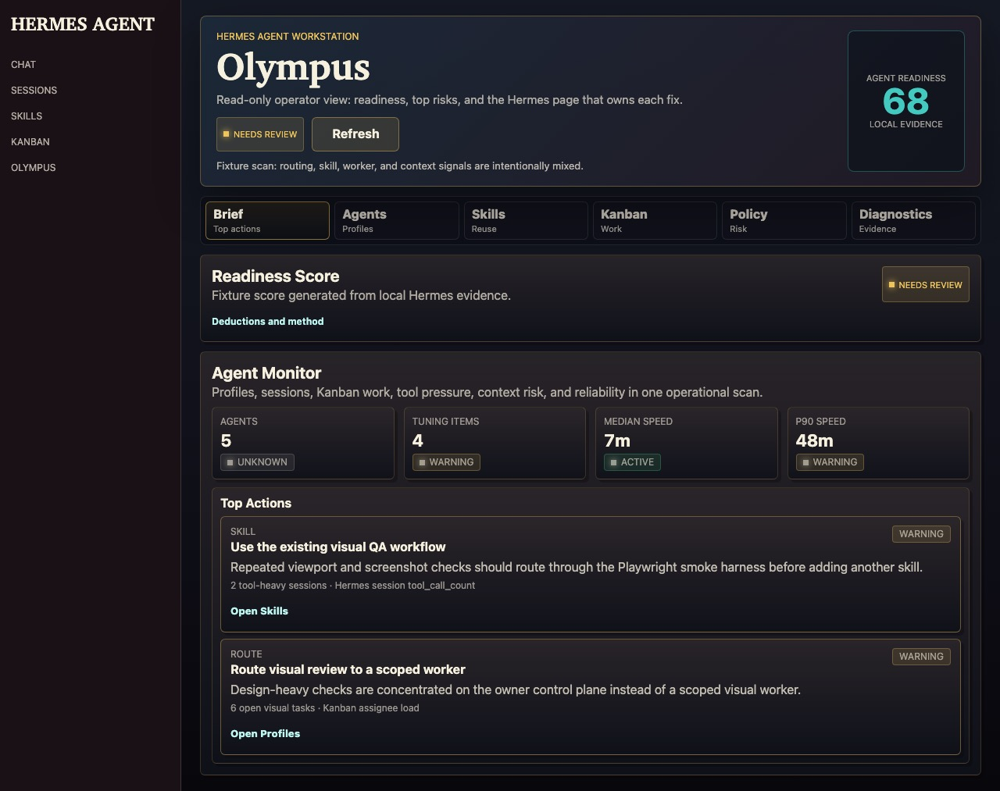

# Olympus

> **Bundled with Hermes Agent.** Olympus is a read-only dashboard plugin that
> turns local Hermes runtime evidence into an operator-facing agent workstation
> monitor. It ships in `plugins/olympus/` so the dashboard can load it without a
> separate user plugin install.

Olympus answers one operational question:

```text
What needs tuning, routing, unblocking, or review so my Hermes agents perform better?
```

It reads local Hermes evidence and links each recommendation back to the Hermes
surface that owns the fix. It does not mutate tasks, profiles, cron jobs,
gateways, routes, memory, credentials, or config.



## What It Shows

- Readiness score with a transparent deduction breakdown.
- Agent Monitor for profile count, tuning pressure, median speed, and p90 speed.
- Tuning queue with evidence and handoff links.
- Profile fitness, route pressure, skill coverage, and skill hygiene.
- Kanban pressure, worker/retry signals, and task-session Trace Spine refs.
- Tool policy, auxiliary-cost visibility, performance, operational evals, and
  evidence-source diagnostics.

## Privacy Contract

- Local session titles, Kanban task titles, cron names, exact route labels, raw
  IDs, and local paths are hidden by default.
- `.env` scanning reads variable names only, never values.
- Config policy reports safe counts and flags only; it does not return prompt
  text, base URLs, API keys, env values, or local paths.
- API responses are read-only and redact secret-like strings before returning
  diagnostics.
- Richer local labels require an explicit private-machine opt-in:

```bash
OLYMPUS_EXPOSE_LOCAL_LABELS=1 hermes dashboard --no-open --skip-build
```

## Dashboard API

Routes mount under `/api/plugins/olympus/`:

| Endpoint | Purpose |
| --- | --- |
| `GET /health` | Liveness and coarse runtime health. |
| `GET /overview` | Full dashboard read model for readiness, tuning, profiles, sessions, Kanban, skills, policy, performance, and diagnostics. |
| `GET /tuning` | Tuning-focused read model with score details and operational evidence. |

The routes are protected by the dashboard session-token flow. Project plugins
remain static-only; bundled Olympus can mount its Python backend because the
manifest `api` path stays inside `plugins/olympus/dashboard/`.

## Development Checks

```bash
python3 -m py_compile dashboard/plugin_api.py
python3 -m unittest discover -s tests -p 'test_*.py'
node --check dashboard/dist/index.js
```
