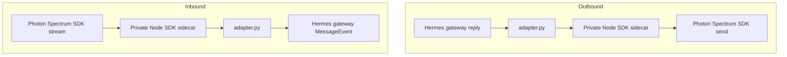

# Photon iMessage Platform Plugin

Photon connects Hermes to iMessage through the Photon Spectrum SDK. Use this
plugin when you want the Hermes gateway to receive iMessages and send replies
without exposing a local webhook or Cloudflare tunnel.

## Setup

Primary setup command:

```bash
hermes photon setup '+<country-code><number>'
```

Replace `+<country-code><number>` with your real E.164 phone number. Do not put
personal phone numbers in committed docs, examples, or bug reports.

Setup always uses the fixed Photon dashboard project name `hermes-agent`. Users
do not choose a project name on the primary setup path.

Setup reconciles:

1. Photon dashboard login.
2. Exact `hermes-agent` project lookup or creation.
3. Spectrum project credentials for the current Hermes home.
4. The first phone that can message this Hermes agent.
5. A default home channel for that operator DM, when unset.
6. Hermes authorization for that phone unless access is open.
7. Private sidecar dependencies.
8. `platforms.photon.enabled=true` in `config.yaml`.

The seeded home channel is `PHOTON_HOME_CHANNEL=any;-;+E164` and
`PHOTON_HOME_CHANNEL_NAME=You (iMessage)`. Setup never overwrites an existing
home channel, so custom proactive-delivery targets are preserved.

After setup, start or restart the Hermes gateway so it can load the Photon
adapter and subscribe to Spectrum events. Then check status:

```bash
hermes photon status
```

Photon supports multiple phones on the same `hermes-agent` project. Each phone
can message the same Hermes agent, and direct-message conversations stay
isolated by Spectrum conversation space so replies go back to the right phone.

Cron and proactive notifications can use Photon with:

```text
deliver=photon
```

When no live gateway adapter is available in the current process, Hermes uses a
private send-once sidecar to deliver to `PHOTON_HOME_CHANNEL`. This send path
does not subscribe to the inbound Spectrum stream.

Use explicit phone management to add, list, or remove authorized phones:

```bash
hermes photon phones list
hermes photon phones add '+<country-code><number>'
hermes photon phones remove '+<country-code><number>'
```

## Runtime Flow



`plugins/platforms/photon/adapter.py` is the Hermes boundary. It owns Spectrum
event normalization, `MessageEvent` creation, outbound payload construction,
`SendResult` mapping, adapter health, and current-home runtime state.

The Spectrum SDK currently runs in Node, so `adapter.py` starts a private sidecar
process over stdio. The sidecar is an implementation detail; it does not expose
HTTP endpoints.

The adapter writes runtime state to:

```text
<HERMES_HOME>/photon/adapter-runtime.json
```

Only one Hermes gateway process may stream a given Photon Spectrum project at a
time. If the adapter reports that the Photon Spectrum project is already in use,
stop the other gateway first, then start this one again. Send-once cron delivery
does not take this stream lock because it only sends one outbound message.

## Commands

```bash
# Authenticate with Photon.
hermes photon login

# Configure the fixed hermes-agent project with your first phone.
hermes photon setup '+<country-code><number>'

# Show project, credential, adapter, and sender-access state.
hermes photon status

# List every phone/user on the fixed hermes-agent project.
hermes photon phones list

# Add a phone as a Photon project user and authorize it in Hermes.
hermes photon phones add '+<country-code><number>'

# Remove a phone from Photon and deauthorize it in Hermes.
hermes photon phones remove '+<country-code><number>'

# Clear local Photon project/runtime identity.
hermes photon reset

# Clear local Photon project/runtime identity and dashboard login token.
hermes photon reset --all

# List visible Photon dashboard projects.
hermes photon projects list
```

## Important Environment

Setup and phone-management commands write these values to the current Hermes
home:

```text
PHOTON_PROJECT_ID
PHOTON_PROJECT_SECRET
PHOTON_ALLOWED_USERS
PHOTON_HOME_CHANNEL
PHOTON_HOME_CHANNEL_NAME
```

Optional runtime settings:

```text
PHOTON_NODE_BIN
PHOTON_API_HOST
PHOTON_DASHBOARD_HOST
PHOTON_ALLOW_ALL_USERS
```

## Debugging Logs

Photon adapter runtime logs are written through the Hermes gateway logger. Use
the built-in logs command when debugging Photon connect, inbound message, or send
failures:

```bash
hermes logs gateway -n 200
hermes logs gateway -f
```

The raw log file for the default Hermes home is:

```text
/Users/raysmacbookair/.hermes/logs/gateway.log
```

Search this file for `photon`, `photon-adapter`, `Spectrum`, `SDK_SIDECAR`, or
the relevant project ID when tracing a Photon issue.

## Reset Notes

`hermes photon reset` clears local Photon project/runtime identity for the
current Hermes home and keeps the dashboard login token.

`hermes photon reset --all` also clears the dashboard login token after
confirmation.

Neither reset command deletes Photon dashboard projects or users.
