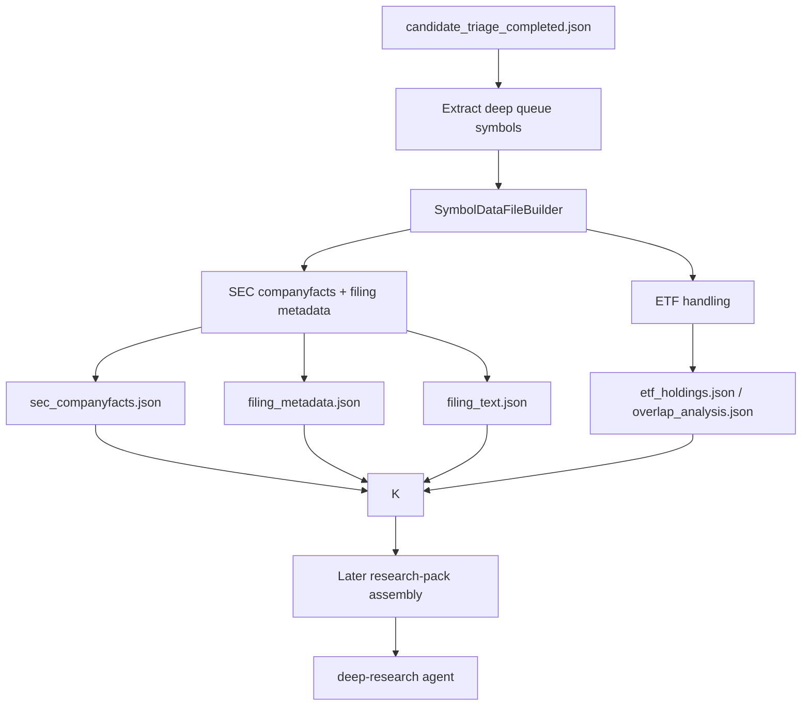

# Offline Data Miner Atomic Data Design

## Summary

Build an offline data miner for the investment assistant that prepares
symbol-level data files before `deep-research` runs. The miner collects and
normalizes facts, writes durable JSON files under
`data/investment_assistant/symbols/<MARKET.SYMBOL>/`, and records freshness and
data gaps. It does not author portfolio recommendations, target weights, trade
plans, or investment conclusions.

The data side and summarization side must be decoupled. The miner only fetches,
normalizes, validates, and persists source data. If narrative summaries or
interpretation are needed, they must be produced by a separate LLM stage that
reads the mined artifacts and writes separate summary artifacts.

The first version should make data preparation fast and auditable for the
current AI map flow: read a selected `candidate_triage` artifact, prepare the
deep queue symbols, and persist local raw/structured data files. A later
deep-research ticket should assemble these files into LLM-facing research packs.

## Goals

- Prepare offline data files for each symbol in a triage deep-research queue.
- Store all symbol evidence in a self-contained per-symbol directory.
- Make freshness, source status, and missing layers explicit.
- Keep Futu market data out of the offline miner. Live market data should be
  fetched by tools at analysis/planning time instead of cached here.
- Reuse existing `SecFilingsProvider` / `fundamental_tools` for SEC
  companyfacts and filing metadata.
- Support ETF anchors such as `US.QQQ` and `US.SOXX` with ETF-specific data
  instead of treating them as operating companies.
- Keep data mining deterministic. LLM analysis happens after facts are prepared.
- Do not call LLMs from the data miner. LLM-generated summaries belong in a
  separate summarization / deep-research step.

## Non-Goals

- No portfolio maps, weights, target prices, or trade plans.
- No deterministic investment recommendation fallback.
- No live order submission.
- No full multi-market support in V1 beyond normalized symbol paths.
- No broad news monitoring in V1.
- No filing narrative summarization in the data miner. The miner may download,
  extract, and persist raw filing text, but LLM summarization stays out of the
  data layer.

## Current State

Relevant existing pieces:

- `plugins/investment_assistant/candidate_triage.py`
  produces `candidate_triage` with `deep_enrichment_queue`, `watchlist`, layer
  audits, and research needs.
- `plugins/investment_assistant/lightweight_enrichment.py`
  produces Futu quote/K-line/liquidity/technical evidence for broad candidates.
- `plugins/investment_assistant/fundamental_tools.py`
  already exposes:
  - `read_data_layer_catalog()`
  - `inspect_fundamental_freshness()`
  - `build_fundamental_context()`
  - `read_fundamental_context()`
  - `request_fundamental_refresh()`
- `plugins/investment_assistant/sec_provider.py`
  uses edgartools to fetch SEC companyfacts and filing metadata.
- `plugins/investment_assistant/storage.py`
  persists workflow artifacts in SQLite, but symbol-level offline data currently
  has no dedicated filesystem cache.

Pain points:

- Deep research currently needs to reason over a large triage artifact directly.
- If SEC/filing data is missing, the workflow either blocks or becomes slow.
- Existing fundamental context is session-scoped, not a reusable symbol cache.
- There is no manifest saying which symbol data layers are fresh, stale,
  missing, or unavailable.

## Proposed Design

Add a deterministic offline miner that creates symbol data files:

```text
data/investment_assistant/
  symbols/
    US.NVDA/
      manifest.json
      sec_companyfacts.json
      filing_metadata.json
      filing_text.json
      news_events.json
      options_surface.json

    US.QQQ/
      manifest.json
      etf_holdings.json
      overlap_analysis.json

  runs/
    iaw_or_pyhitl_xxx/
      data_miner_run.json
      symbols.txt
```

The miner should be callable independently from Hermes and later reusable from
the workflow:

```bash
python scripts/ia_data_miner.py prepare \
  --triage .dev/ai_candidate_triage_completed.json \
  --output-root data/investment_assistant \
  --queue deep \
  --layers sec,filing_metadata,filing_text,etf \
  --max-symbols 40
```

## V1 Scope: How Much To Build

V1 should implement four layers.

### Layer 1: Manifest

Always write:

```text
manifest.json
```

`manifest.json` records:

- symbol
- market
- security type if known
- generated_at
- source artifact ids / file paths
- per-layer freshness
- per-layer source status
- missing layers
- warnings

`manifest.json` is the audit index for raw and structured data files. It should
not become an LLM-facing research summary. The LLM-facing `research_pack.json`
belongs to the later deep-research/input-assembly ticket.

### Layer 2: SEC Companyfacts And Filing Metadata

For US operating companies, write:

```text
sec_companyfacts.json
filing_metadata.json
```

Use `SecFilingsProvider` / edgartools for:

- latest 10-K / 10-Q / 8-K metadata
- filing date
- period of report
- accession number
- SEC URL
- revenue
- gross profit
- operating income
- net income
- assets
- liabilities
- equity
- debt-to-assets
- ROE
- net margin
- source status
- stale flags
- recent 8-K flag

Numerical values must remain provider-sourced. The miner may compute simple
ratios from provider values, but must mark derived fields explicitly.

### Layer 3: SEC Filing Text Capture

For US operating companies, optionally write:

```text
filing_text.json
```

This layer downloads or extracts raw filing text/HTML sections for the latest
10-K, 10-Q, and recent 8-K when available. It is data capture, not
summarization.

Fields:

- source form: 10-K / 10-Q / 8-K
- filing_date
- period_of_report
- accession_number
- source URL
- retrieval timestamp
- raw HTML/text path or compact extracted text
- section labels when extraction is available
- extraction method: edgartools_html, sec_archive, mineru, html_parser, etc.
- extraction status and warnings

Rules:

- Do not summarize or interpret the filing text in this layer.
- Do not extract exact financial numbers with LLM.
- If a filing is too large, store a local file path plus metadata instead of
  embedding all text inside JSON.
- If extraction fails, write `source_status: unavailable` or `partial` with the
  error; do not replace it with an LLM summary.

### Layer 4: ETF Handling

For ETF anchors, write:

```text
etf_holdings.json
overlap_analysis.json
```

V1 can be simple:

- detect ETF symbols from known Futu `security_type`, artifact hints, or
  explicit list `US.QQQ`, `US.SOXX`, `US.SMH`.
- if holdings provider is not implemented, write `source_status:
  not_implemented` and a clear warning.
- do not send ETF symbols into SEC companyfacts as if they were operating
  companies.

## P1 Scope

After V1 works, add:

- `earnings_materials.json`
  - raw transcript or presentation metadata/text when available
  - source URL, provider, retrieved_at, extraction quality

Narrative summaries should be produced later by a separate summarization agent:

```text
raw filing text / extracted sections
  -> LLM summarization agent
  -> filing_summary.json
```

The summarization agent may use MinerU / HTML extraction outputs as input, but
exact numbers still come only from structured numeric artifacts.

## P2 Scope

Later:

- `news_events.json`
- `options_surface.json`
- company presentation downloads
- automatic refresh scheduler
- per-symbol diffing across filing versions
- cross-symbol layer comparisons

## Data Flow



## Interfaces And Contracts

### CLI

Create:

```text
scripts/ia_data_miner.py
```

Commands:

```bash
prepare
  --triage PATH
  --output-root PATH
  --queue deep|watch|all
  --symbols US.NVDA US.SNDK
  --layers sec,filing_metadata,filing_text,etf
  --max-symbols N
  --skip-existing
  --force
  --json
```

### Python API

Create:

```python
build_data_files_from_triage(
    triage_state_path: str | Path,
    output_root: str | Path,
    queue: Literal["deep", "watch", "all"] = "deep",
    symbols: list[str] | None = None,
    layers: list[str] | None = None,
    max_symbols: int | None = None,
    skip_existing: bool = True,
    force: bool = False,
) -> DataMinerRunArtifact
```

### Artifact Schemas

Add Pydantic models:

- `DataLayerStatus`
- `SymbolDataManifest`
- `DataMinerRunArtifact`

Suggested status values:

```text
fresh
partial
stale
missing
unavailable
not_implemented
skipped
error
```

## Files To Create

| File | Purpose | Priority |
|---|---|---|
| `plugins/investment_assistant/data_miner.py` | Core offline miner orchestration and file writing. | P0 |
| `scripts/ia_data_miner.py` | Standalone CLI entrypoint using project `.venv`. | P0 |
| `tickets/todo/016-deep-research-pack-and-agent.md` | Follow-up implementation ticket for research-pack assembly and the interpreting agent. | P1 |
| `tickets/todo/017-filing-summarization-agent.md` | Follow-up ticket for LLM filing/earnings summaries from raw mined data. | P1 |

## Files To Modify

| File | Changes | Priority |
|---|---|---|
| `plugins/investment_assistant/schemas.py` | Add data miner artifact schemas, unless kept local to `data_miner.py`. | P0 |
| `plugins/investment_assistant/sec_provider.py` | Add ETF skip guard if needed. | P0 |
| `tests/plugins/test_investment_assistant.py` | Unit tests for pack creation, ETF skip, stale/missing flags. | P0 |
| `plugins/investment_assistant/skill_runtime.py` | Ensure `deep-research` skill is discoverable if the runtime uses explicit discovery checks. | P1 |

## Build Sequence

1. Add schemas for symbol data manifests and data miner run artifacts.
2. Implement symbol path normalization:
   - `US.NVDA` -> `data/investment_assistant/symbols/US.NVDA/`
   - reject unsafe path characters.
3. Implement triage loader:
   - accept HITL completed state or direct `candidate_triage` artifact.
   - choose `deep`, `watch`, or `all`.
4. Implement SEC layer writer through `SecFilingsProvider`.
5. Implement filing text capture for latest periodic filings and recent 8-Ks.
6. Implement ETF skip / not-implemented layer handling.
7. Write manifest and requested layer files.
8. Add CLI wrapper with `.venv` re-exec like `scripts/ia_pydantic_hitl.py`.
9. Add tests.

## Testing Strategy

Unit tests:

- Given a completed triage state, extract deep symbols correctly.
- Use a fake SEC provider and write `sec_companyfacts.json` and
  `filing_metadata.json`.
- Filing text capture writes source metadata and raw/extracted text path without
  LLM summaries.
- ETF symbols produce ETF artifacts or explicit `not_implemented`, and do not
  call SEC companyfacts.
- Missing SEC identity produces `unavailable` layer status, not fake data.
- Data miner tests assert no PydanticAI/LLM runtime is imported or called.
- `skip_existing` does not overwrite files.
- `force` overwrites files.
- Unsafe symbols are rejected.

Manual checks:

```bash
python scripts/ia_data_miner.py prepare \
  --triage .dev/ai_candidate_triage_completed.json \
  --output-root data/investment_assistant \
  --queue deep \
  --layers sec,filing_metadata,filing_text,etf \
  --max-symbols 5 \
  --json
```

## Rollout

V1 should run out-of-band from Hermes:

```text
candidate-triage completed
  -> user runs data miner
  -> inspect generated data files
  -> later research-pack assembly reads data files
  -> deep-research reads packs
```

After stable:

- workflow can call the miner automatically when packs are missing or stale.
- async/background refresh can be added.

## Risks And Mitigations

- Risk: SEC provider defaults to `IA_SEC_MAX_SYMBOLS=8`, which is too small for
  33 deep symbols.
  - Mitigation: miner should batch or instruct the user to set
    `IA_SEC_MAX_SYMBOLS`, and record unfetched symbols as `missing`.

- Risk: ETF anchors are mishandled as companies.
  - Mitigation: ETF-specific route and explicit `not_implemented` if holdings
    are unavailable.

- Risk: the data miner accidentally becomes a summarizer and mixes facts with
  LLM interpretation.
  - Mitigation: data miner imports no PydanticAI runtime and writes only raw,
    normalized, or provider-derived fields. LLM summaries are separate
    artifacts with separate provenance.

- Risk: too many files become hard to inspect.
  - Mitigation: always write `manifest.json` as the audit index. The later
    deep-research stage can build a compact `research_pack.json` for LLM input.

## Open Questions

- Which ETF holdings provider should V1 use, if any?
- Should symbol packs live inside the repo `data/` directory or under
  `~/.hermes/investment_assistant/data/` by default?
- Do we want a separate run-level copy of each pack, or only stable symbol
  cache plus run manifest references?
