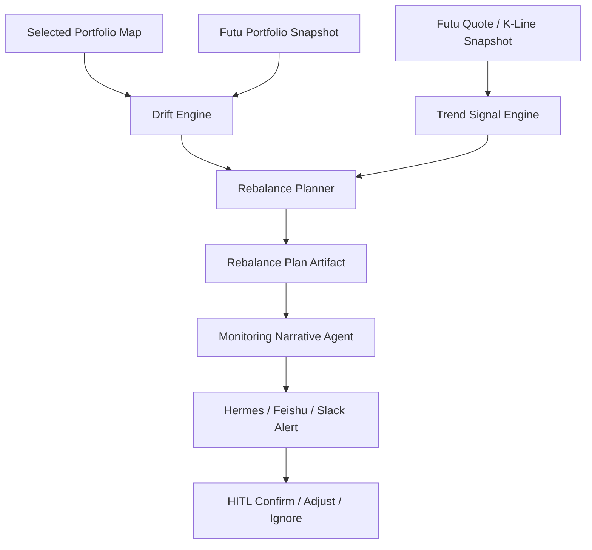

# Portfolio Monitoring And Dynamic Rebalance Design

## Summary

Build a portfolio monitoring layer after a user selects a target portfolio map.
The system reads the user's live Futu portfolio, compares actual weights against
the selected target map, and produces actionable add/trim/hold alerts.

This feature should keep the user's holdings close to the selected consensus
portfolio map while allowing limited tactical movement based on price trend
signals. The target map remains AI-authored. Drift calculation, position sizing,
cash impact, and simulated order parameters are deterministic and auditable.

V1 does not place real orders.

## Goals

- Track actual holdings versus the selected AI target portfolio map.
- Allow a tolerance band around each target weight instead of forcing exact
  daily matching.
- Generate add/build plans when a position is meaningfully underweight.
- Generate trim/take-profit plans when a position is meaningfully overweight.
- Use trend signals to adjust execution pace inside the tolerance band.
- Alert the user when action is needed, and support human confirmation before
  any simulated or future live execution step.
- Preserve evidence boundaries: the user-facing explanation may only interpret
  generated artifacts and must not invent new market facts.

## Non-Goals

- Do not generate a new target portfolio map in this workflow.
- Do not place live orders in V1.
- Do not add options overlays in this phase.
- Do not handle tax-lot optimization in V1.
- Do not persist market snapshots as long-term truth; live Futu data should be
  refreshed when monitoring runs.

## Current State

- `plugins/investment_assistant/portfolio_direct.py` can generate AI-authored
  target portfolio maps.
- `plugins/investment_assistant/planner.py` has an early one-shot construction
  planner, but it does not yet implement monitoring, drift bands, or trend-aware
  dynamic rebalance.
- Futu portfolio and quote access already exist in the investment assistant
  plugin and related skills.
- Existing workflow storage can persist artifacts and recover sessions.

## Proposed Architecture



## Core Modules

### `portfolio_monitor.py`

Orchestrates one monitoring run:

- load selected portfolio map
- fetch Futu portfolio snapshot
- fetch Futu quote and K-line data for relevant symbols
- call drift engine
- call trend signal engine
- call rebalance planner
- save artifacts
- optionally call a PydanticAI narrative agent for user-facing explanation

### `drift.py`

Computes where actual holdings differ from target.

Main responsibilities:

- normalize target and current weights
- compute current market value and total portfolio value
- compute underweight / overweight / within-band state
- apply tolerance bands
- detect missing positions, extra positions, cash mismatch, and unavailable
  sell quantity

### `trend_signals.py`

Computes deterministic trend artifacts from Futu K-line data.

V1 indicators:

- MA20 / MA50 / MA200
- RSI14
- ATR14
- 20-day and 60-day return
- distance from 52-week high/low when available
- local support and resistance
- volume trend or liquidity warnings when available

The output should be a compact signal artifact, not a trading conclusion.

### `rebalance_planner.py`

Converts drift plus trend signals into action candidates.

Main responsibilities:

- generate add plans when below lower band
- generate trim plans when above upper band
- generate watch / hold messages inside the band
- split trades into tranches
- respect cash reserve, minimum trade value, lot size, and `can_sell_qty`
- output simulated order parameters only

### `monitoring_narrative.py`

Optional PydanticAI agent that turns artifacts into a readable explanation.
It does not create new actions. It can only explain the `RebalancePlan`
artifact and surface warnings.

## Data Contracts

### `PortfolioMonitorSnapshot`

```json
{
  "monitor_id": "...",
  "portfolio_map_id": "...",
  "generated_at": "...",
  "data_asof": {
    "portfolio": "...",
    "quotes": "...",
    "kline": "..."
  },
  "total_assets": 0,
  "cash": 0,
  "cash_weight": 0,
  "positions": []
}
```

### `PortfolioDriftReport`

```json
{
  "portfolio_map_id": "...",
  "target_cash_weight": 0.05,
  "current_cash_weight": 0.08,
  "positions": [
    {
      "symbol": "US.NVDA",
      "target_weight": 0.13,
      "current_weight": 0.10,
      "lower_bound": 0.104,
      "upper_bound": 0.156,
      "drift_weight": -0.03,
      "drift_value": -3000,
      "status": "underweight"
    }
  ],
  "warnings": []
}
```

### `TrendSignal`

```json
{
  "symbol": "US.NVDA",
  "price": 0,
  "trend_state": "uptrend | extended_uptrend | neutral | weakening | downtrend | high_volatility",
  "ma20": 0,
  "ma50": 0,
  "ma200": 0,
  "rsi14": 0,
  "atr14": 0,
  "support_levels": [],
  "resistance_levels": [],
  "warnings": []
}
```

### `RebalanceAction`

```json
{
  "symbol": "US.NVDA",
  "action": "add | trim | hold | watch",
  "reason_code": "underweight | overweight | trend_take_profit | trend_stop_loss | within_band",
  "target_trade_value": 0,
  "quantity": 0,
  "cash_impact": 0,
  "tranches": [],
  "trigger": "...",
  "invalidation": "...",
  "simulated_order": {
    "code": "US.NVDA",
    "side": "BUY",
    "quantity": 0,
    "price": 0,
    "order_type": "NORMAL",
    "market": "US",
    "trd_env": "SIMULATE"
  },
  "requires_human_confirmation": true
}
```

## Tolerance Model

Tolerance should be configurable per map and per holding class.

Suggested V1 defaults:

- core holdings: target weight +/- 20%
- high-conviction single names: target weight +/- 25%
- satellite holdings: target weight +/- 35%
- minimum absolute band: 0.5% to 1.0% of portfolio value

Example:

```text
target_weight = 10%
relative_band = 25%
lower_bound = 7.5%
upper_bound = 12.5%
```

The monitor should not trade just because a holding is off by a tiny amount.
It should also respect minimum trade value to avoid noisy alerts.

## Action Rules

### Underweight

If `current_weight < lower_bound`, generate an add plan.

Trend overlay:

- uptrend but not extended: normal add plan
- near support: prefer first tranche
- extended uptrend or RSI extremely high: smaller first tranche or wait trigger
- downtrend: add only near support, or ask for confirmation

### Overweight

If `current_weight > upper_bound`, generate a trim plan.

Trend overlay:

- extended uptrend: trim partially or use trailing stop
- near resistance: trim tranche
- breakdown below key support: defensive trim
- strong uptrend but only slightly overweight: watch instead of forced trim

### Within Band

Default action is hold.

Trend overlay may generate a watch or optional tactical action, but it should
not push the position outside its strategic band without explicit user approval.

## HITL Design

The user can intervene at several points:

- confirm generated add/trim plan
- change tolerance profile
- pause monitoring for a symbol
- pin a symbol as strategic core and prevent full exit
- exclude a symbol from future actions
- ask why a position is above or below target
- request a revised target map if the disagreement is strategic, not tactical

Example user input:

```text
我想把 MU、SNDK 的比例提高一些。
```

Expected handling:

1. Treat this as a target-map revision request, not only a monitoring action.
2. Ask the portfolio map revision agent to update target weights with
   constraints.
3. Re-run drift monitoring against the revised map.
4. Generate build/trim plans from the new target weights.

## Scheduling

V1 should support manual runs first:

```bash
python scripts/ia_monitor_portfolio.py run \
  --portfolio-map .dev/.../direct_portfolio_map.json \
  --output-dir .dev/monitoring_runs/...
```

Later integration:

- daily pre-market check
- post-market drift summary
- event-driven check after large price movement
- Hermes heartbeat or cron automation
- Feishu / Slack notification through Hermes gateway

## Relationship To AI

AI responsibilities:

- author the target portfolio map
- explain monitoring artifacts in user language
- identify whether a user request is tactical monitoring or strategic map
  revision
- summarize tradeoffs when the user wants to override the map

Deterministic responsibilities:

- fetch portfolio and market data
- calculate weights, drift, tolerance bands, quantities, cash impact
- calculate technical indicators
- generate simulated order parameters
- validate that actions do not violate map constraints

This split keeps the investment thesis AI-authored while making execution math
auditable and reproducible.

## Test Plan

- Underweight position generates add action.
- Overweight position generates trim action.
- Within-band position generates hold/watch, not forced trading.
- Add plan respects cash reserve and minimum trade value.
- Trim plan respects `can_sell_qty`.
- Trend overlay delays add when a position is extremely extended.
- Trend overlay suggests defensive trim on support breakdown.
- Missing Futu data creates failed/stale artifact and does not create fake
  action plans.
- Narrative agent cannot introduce symbols or trades outside the
  `RebalancePlan` artifact.

## Implementation Phases

1. Define Pydantic schemas for monitor snapshot, drift report, trend signal,
   and rebalance plan.
2. Implement drift engine with tests.
3. Implement Futu portfolio snapshot adapter for monitor input.
4. Implement trend signal engine from Futu K-line data.
5. Implement rebalance planner with simulated orders only.
6. Add CLI script for manual monitoring runs.
7. Add workflow action for selected map monitoring.
8. Add HITL handling for confirm, adjust, pause, and revise-map requests.
9. Add Hermes gateway notification integration.

## Open Questions

- What should the default tolerance bands be for aggressive AI maps?
- Should tactical trend actions be enabled by default, or only after user opt-in?
- How should tax sensitivity be represented before tax-lot support exists?
- Should ETF holdings be monitored with different tolerance rules from single
  names?
- Should extra holdings outside the selected map be treated as trim candidates
  or separate user-managed positions?
