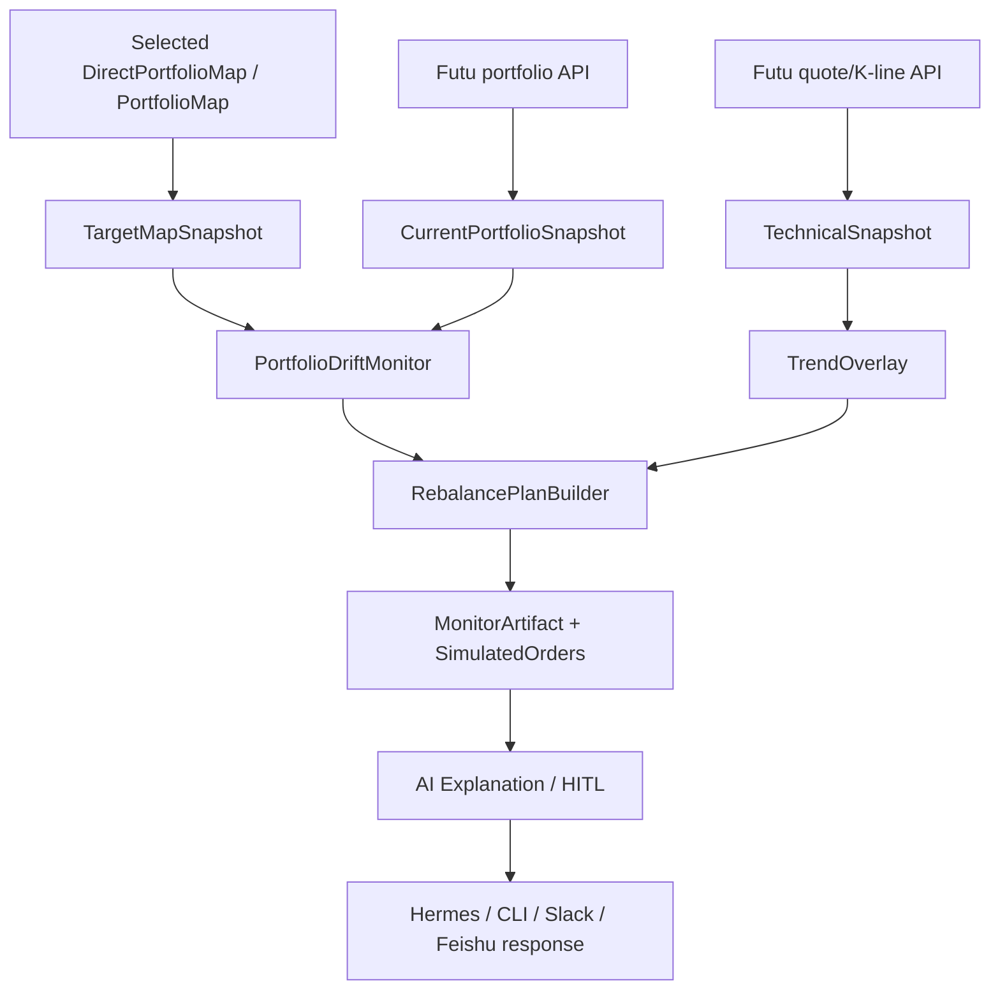

# Portfolio Monitoring And Rebalance Design

## Summary

Build the post-map-selection feature that continuously compares the user's
live Futu portfolio against a confirmed target portfolio map. The system should
monitor drift, explain whether holdings are underweight/within-band/overweight,
and generate staged build, trim, stop-loss, and take-profit plans. The target
portfolio map remains the strategic source of truth; live market indicators
only adjust execution pace and risk controls.

## Goals

- Keep the user's current holdings close to the selected target map, with
  configurable tolerance bands.
- Generate build plans when a holding is underweight.
- Generate trim/take-profit plans when a holding is overweight.
- Use trend and technical indicators to decide execution timing, not to rewrite
  the target map.
- Support recurring monitoring and user alerts.
- Keep V1 read-only / simulated: no live orders.
- Preserve the investment assistant rule that AI authors portfolio strategy,
  while deterministic code computes account deltas, quantities, bands, and
  simulated order parameters.

## Non-Goals

- Do not create a new target portfolio map in this module.
- Do not submit live trades.
- Do not use current holdings as input to candidate discovery or target map
  recommendation.
- Do not let technical indicators override a confirmed long-term thesis by
  themselves.
- Do not support complex options overlays in this first monitoring version.

## Current State

Relevant existing pieces:

- `plugins/investment_assistant/portfolio_direct.py`
  - Generates one AI-authored direct target portfolio map from deep research.
  - This is the preferred target-map input for monitoring.
- `plugins/investment_assistant/portfolio_weight_formula.py`
  - Experimental formula allocation. Useful as audit/reference, not preferred
    for final target weights.
- `plugins/investment_assistant/planner.py`
  - Early deterministic construction-plan engine.
  - Compares selected map target weights with current holdings.
  - Produces simple buy/sell tranches and simulated stock orders.
  - Current trigger text is placeholder-based and not tied to real technical
    levels.
- `plugins/investment_assistant/adapters.py`
  - Existing Futu integration surface for quotes/market data/portfolio-style
    inputs.
- `plugins/investment_assistant/workflow.py`
  - Already supports HITL and workflow state transitions.

The new module should reuse these patterns but avoid turning the monitor into
another portfolio architect.

## Proposed Design

Add a monitoring subsystem with four deterministic stages and one optional AI
explanation stage:

1. **Target map snapshot**
   - Read the selected target portfolio map artifact.
   - Normalize holdings, target weights, cash weight, and optional user
     constraints.

2. **Live portfolio snapshot**
   - Read Futu account cash, total assets, positions, market value, cost price,
     available sell quantity, open orders, and filled orders.
   - Read latest quote/K-line/technical indicators for target holdings and
     currently held extra symbols.

3. **Drift monitor**
   - Compute current weight, target weight, lower/upper tolerance bands, and
     dollar/share deltas.
   - Classify each target and extra position:
     - `underweight`
     - `within_band`
     - `overweight`
     - `critical_underweight`
     - `critical_overweight`
     - `unexpected_position`
     - `missing_position`

4. **Execution plan builder**
   - If underweight, generate staged build plan.
   - If overweight, generate staged trim/take-profit plan.
   - If trend is weak or risk trigger is active, slow or pause build.
   - If trend is extended, allow partial profit-taking before hard overweight.
   - If a hard stop condition is active, generate defensive trim / stop-loss
     plan while preserving the target-map thesis boundary.

5. **AI explanation / HITL**
   - AI explains the plan in user language, but only from monitor artifacts.
   - If the action is large, conflicts with target-map thesis, or requires
     selling a core holding, request user confirmation.

## Core Principle

```text
Target portfolio map = strategy
Portfolio drift = mechanical state
Technical trend = execution overlay
Risk controls = constraints
AI = explanation, judgment around conflicts, and HITL routing
```

## Data Flow



## Interfaces And Contracts

### TargetMapSnapshot

```json
{
  "artifact_type": "target_map_snapshot",
  "map_id": "ai_bottleneck_barbell_20260617",
  "generated_at": "...",
  "cash_weight": 0.05,
  "holdings": [
    {
      "symbol": "US.NVDA",
      "target_weight": 0.13,
      "role": "Primary direct AI compute platform anchor",
      "sleeve_key": "core_compute_custom_foundry",
      "conviction": "core"
    }
  ],
  "policy": {
    "single_name_limit": 0.15,
    "min_cash_weight": 0.05,
    "rebalance_style": "banded",
    "portfolio_style": "bottleneck_barbell"
  }
}
```

### CurrentPortfolioSnapshot

```json
{
  "artifact_type": "current_portfolio_snapshot",
  "generated_at": "...",
  "source": "futu",
  "cash": 10000,
  "total_assets": 200000,
  "positions": [
    {
      "symbol": "US.NVDA",
      "quantity": 100,
      "can_sell_qty": 100,
      "market_value": 26000,
      "cost_price": 180,
      "unrealized_pnl": 8000,
      "current_weight": 0.13
    }
  ],
  "open_orders": [],
  "warnings": []
}
```

### TechnicalSnapshot

Use live Futu data, not offline miner data.

```json
{
  "artifact_type": "technical_snapshot",
  "symbol": "US.NVDA",
  "generated_at": "...",
  "quote": {
    "last_price": 260,
    "asof": "..."
  },
  "daily_k": {
    "bars": 120,
    "asof": "..."
  },
  "indicators": {
    "ma20": 250,
    "ma50": 230,
    "ma200": 180,
    "atr14": 12,
    "rsi14": 67,
    "trend_state": "uptrend",
    "extension_from_ma20": 0.04,
    "support_levels": [],
    "resistance_levels": []
  },
  "warnings": []
}
```

### DriftPosition

```json
{
  "symbol": "US.NVDA",
  "target_weight": 0.13,
  "current_weight": 0.095,
  "lower_band": 0.104,
  "upper_band": 0.156,
  "drift": -0.035,
  "drift_value": -7000,
  "classification": "underweight",
  "severity": "medium",
  "allowed_float_reason": "core holding; relative band +/-20%"
}
```

### MonitoringPlan

```json
{
  "artifact_type": "portfolio_monitoring_plan",
  "plan_id": "iapm_...",
  "generated_at": "...",
  "map_id": "...",
  "data_asof": {
    "portfolio": "...",
    "quotes": "..."
  },
  "summary": {
    "total_underweight_value": 12000,
    "total_overweight_value": 6000,
    "cash_after_plan": 8000,
    "needs_human_confirmation": true
  },
  "positions": [],
  "actions": [],
  "simulated_orders": [],
  "alerts": [],
  "warnings": []
}
```

### MonitorAction

```json
{
  "action_id": "ma_...",
  "symbol": "US.NVDA",
  "action_type": "build | trim | take_profit | stop_loss | pause | alert_only",
  "reason": "underweight and trend constructive",
  "target_delta_value": 7000,
  "target_delta_qty": 26,
  "urgency": "low | medium | high",
  "requires_confirmation": false,
  "tranches": [
    {
      "side": "BUY",
      "quantity": 8,
      "limit_price": 260,
      "trigger": "near current price while above MA20",
      "invalidation": "pause if closes below MA50"
    }
  ]
}
```

## Drift Bands

Default V1 bands should be simple and configurable:

| Holding Type | Relative Band | Notes |
|---|---:|---|
| Core | +/-20% of target weight | e.g. 13% target allows 10.4%-15.6% |
| High conviction | +/-25% | Allows some trend expression |
| Satellite | +/-35% | Avoid noisy over-trading |
| Optional/watch | +/-50% | Usually alert-only |
| Cash | +/-2% absolute | Preserve liquidity floor |

Band selection should come from target-map role/conviction when available.
If missing, infer from target weight:

- `target_weight >= 8%`: core
- `4% <= target_weight < 8%`: high conviction
- `target_weight < 4%`: satellite

## Trend Overlay V1

Technical indicators should affect execution, not strategic weights.

Inputs:

- MA20 / MA50 / MA200
- ATR14
- RSI14
- 20-day and 60-day returns
- support/resistance levels if available
- price extension from MA20/MA50

Basic trend states:

| State | Rule Sketch | Execution Effect |
|---|---|---|
| `constructive_uptrend` | price > MA20 > MA50 and RSI < 75 | allow normal builds |
| `extended_uptrend` | price > MA20 and extension > 1.5 ATR or RSI > 75 | slow builds; allow take-profit if overweight |
| `neutral` | price near MA20/MA50 | use staged limit orders |
| `weakening` | price < MA20 or MA20 rolling over | pause new build unless critical underweight |
| `downtrend` | price < MA50 or MA50 < MA200 | no catch-up buys; defensive trims if overweight |
| `breakdown` | close below key support / high ATR drop | request human confirmation for defensive action |

## Action Logic

### Underweight Build

```text
desired_value = target_value - current_value
build_to = min(target_weight, lower_band midpoint or target_weight)
```

Default tranches:

- 30% near current price if trend is constructive/neutral
- 30% near first support or `last_price - 1 * ATR`
- 40% near second support or `last_price - 2 * ATR`

Pause or slow build if:

- trend_state in `weakening/downtrend/breakdown`
- upcoming earnings/event risk is near
- cash after plan breaches minimum reserve

### Overweight Trim / Take Profit

```text
excess_value = current_value - upper_band_value
```

Default tranches:

- 30%-50% immediate trim if critically overweight
- 25%-35% near first resistance
- remaining via trailing stop or second resistance

Take-profit can be suggested even inside upper band if:

- position has large unrealized gain
- price is extended above MA20/MA50
- RSI is high
- target role is satellite/high beta

### Stop Loss / Risk Cut

Stop-loss is not a mechanical liquidation of the target map. It should be
treated as risk control:

- For core holdings, prefer `pause build` and `trim to lower_band` before
  hard sell-down.
- For satellites, allow stricter stop-loss or removal recommendation if trend
  breaks and thesis confidence is low.
- If stop-loss conflicts with the target map, ask for HITL confirmation.

## AI Role

AI should not calculate account deltas or share quantities. Code computes:

- current weights
- drift
- target dollar deltas
- share quantities
- cash usage
- sellable quantity limits
- simulated order parameters

AI can:

- explain the monitor artifact
- summarize why actions are suggested
- point out conflicts between target-map strategy and trend/risk overlay
- ask for confirmation when a plan materially changes risk
- propose whether a target map should be reviewed, but not silently revise it

## HITL Rules

Ask for user confirmation when:

- selling a core holding below its lower band
- reducing a holding because of technical breakdown while the target thesis is
  still valid
- total planned buys exceed available cash after reserve
- total planned sells exceed a configurable percentage of portfolio value
- unexpected positions need liquidation
- open orders conflict with the proposed plan

Example prompt:

```text
NVDA is under target but trend is weakening. I can:
1. Pause NVDA build and monitor MA50.
2. Buy only 30% of the gap now.
3. Follow the original target and build normally.
```

## Files To Create

| File | Purpose | Priority |
|---|---|---|
| `plugins/investment_assistant/portfolio_monitor.py` | Drift monitor, band classification, monitoring plan models | P0 |
| `plugins/investment_assistant/trend_overlay.py` | MA/ATR/RSI/support/resistance calculation and trend-state classification | P0 |
| `plugins/investment_assistant/rebalance_planner.py` | Build/trim/take-profit/stop-loss tranche generation | P0 |
| `scripts/ia_portfolio_monitor.py` | CLI for local testing from selected map + Futu portfolio | P0 |
| `plugins/investment_assistant/agent_skills/portfolio-monitor/SKILL.md` | AI explanation/HITL expectations | P1 |
| `plugins/investment_assistant/docs/portfolio_monitoring.md` | Longer user-facing or developer docs after implementation | P2 |

## Files To Modify

| File | Changes | Priority |
|---|---|---|
| `plugins/investment_assistant/schemas.py` | Add monitor models if shared with workflow/tools | P0 |
| `plugins/investment_assistant/adapters.py` | Ensure Futu portfolio and K-line/quote APIs expose required fields | P0 |
| `plugins/investment_assistant/planner.py` | Either replace with `rebalance_planner.py` or keep as compatibility wrapper | P1 |
| `plugins/investment_assistant/workflow.py` | Add post-selection actions: read portfolio, monitor, confirm plan | P1 |
| `plugins/investment_assistant/tools.py` | Expose workflow action only, not low-level monitor internals, unless needed | P1 |
| `tests/plugins/test_investment_assistant.py` | Unit/integration coverage | P0 |

## Build Sequence

1. **Schemas and deterministic drift monitor**
   - Implement target snapshot, portfolio snapshot, drift position, and plan
     models.
   - Unit test underweight/overweight/within-band classification.

2. **Futu portfolio adapter**
   - Read live account snapshot.
   - Include open orders and `can_sell_qty`.
   - Return hard failure if portfolio data is unavailable.

3. **Trend overlay**
   - Compute MA20/50/200, ATR14, RSI14 from Futu K-line data.
   - Classify trend state.
   - Unit test with synthetic K-line sequences.

4. **Rebalance planner**
   - Generate build, trim, take-profit, pause, and stop-loss actions.
   - Generate simulated stock order params only.
   - Respect cash reserve, `can_sell_qty`, lot size, and open-order conflicts.

5. **CLI test path**
   - `scripts/ia_portfolio_monitor.py monitor --map-path ...`
   - Save artifacts under `.dev/` for audit.

6. **Workflow / Hermes HITL**
   - Add action after `TARGET_PORTFOLIO_MAP_SELECTED`:
     - `read_current_portfolio`
     - `build_monitoring_plan`
     - `confirm_monitoring_plan`
   - Return user-readable summary and pending confirmation when required.

7. **Recurring monitor**
   - Later: connect to Codex/Hermes automation or gateway scheduled checks.
   - Start with manual CLI/workflow invocation before recurring jobs.

## Testing Strategy

Unit tests:

- `underweight` generates buy plan.
- `overweight` generates trim plan.
- `within_band` generates no action.
- cash reserve blocks or downsizes build plan.
- `can_sell_qty` limits trim quantity.
- open sell order reduces available trim.
- trend `extended_uptrend` slows build and allows take-profit.
- trend `downtrend` pauses build.
- core breakdown requires HITL before defensive trim.
- unexpected position is flagged separately.

Integration tests:

- selected direct portfolio map + mocked Futu portfolio + mocked K-line data
  produces stable monitoring artifact.
- OpenD failure returns explicit error artifact and no fake plan.
- workflow cannot monitor before target map selection.

Manual tests:

- Run on paper/simulated Futu account.
- Inspect generated `.dev` artifacts.
- Confirm no live order placement.

## Rollout

V1:

- Manual invocation only.
- Simulated orders only.
- Basic trend overlay.
- No options.

V2:

- Scheduled morning/close monitor.
- User alert routing via Hermes gateway / Slack / Feishu.
- More advanced support/resistance and event-risk gating.

V3:

- Options overlays for covered call / sell put around drift bands.
- Tax-lot and realized-gain awareness.
- Multi-map comparison and target-map review trigger.

## Risks And Open Questions

- Risk: Over-trading due to noisy technical signals.
  - Mitigation: trend overlay changes execution pace, not strategy; use bands.

- Risk: AI explanation invents reasons not in monitor artifact.
  - Mitigation: output guard and prompt must restrict AI to monitor artifact.

- Risk: Formula-like precision creates false confidence.
  - Mitigation: expose bands, not just exact targets; show `why_this_action`.

- Risk: Live Futu data freshness or OpenD failures.
  - Mitigation: fail explicitly and do not generate a pseudo-live plan.

- Open question: Should target-map roles define bands, or should user select
  global rebalance aggressiveness first?

- Open question: How much tax/realized-gain awareness is required before
  trimming profitable positions?

- Open question: Should trend overlay be deterministic only, or should an AI
  risk-review agent decide when a technical break is meaningful?

## Acceptance Criteria

- A selected target map and a mocked/live portfolio snapshot produce a
  structured monitoring plan.
- Underweight and overweight examples produce staged simulated actions.
- Within-band holdings produce no action.
- Trend overlay can pause/slow/accelerate plan execution without changing
  target weights.
- Any large or thesis-conflicting action creates a HITL confirmation request.
- OpenD/Futu failures return explicit errors and no fake plan.
- Tests cover drift, bands, trend states, cash, sellable quantity, and HITL
  gating.
