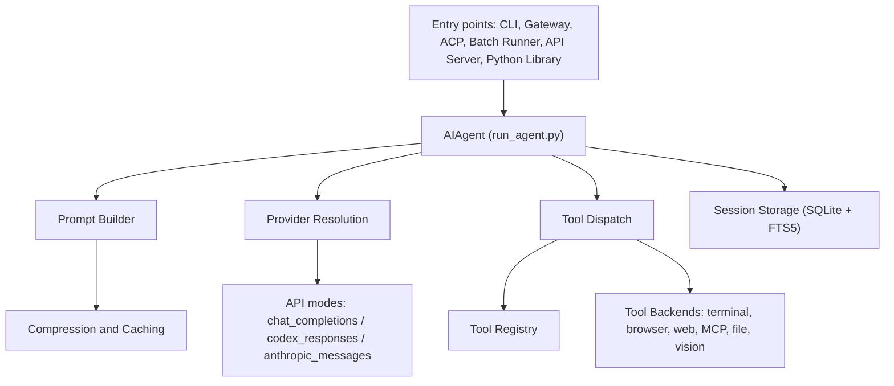

# Architecture

This page is the top-level map of Hermes Agent internals. Use it to orient yourself in the codebase, then dive into subsystem-specific docs for implementation details.

## System Overview



## Directory Structure

- `run_agent.py`: AIAgent core conversation loop
- `cli.py`: HermesCLI interactive terminal UI
- `model_tools.py`: tool discovery, schema collection, and dispatch
- `toolsets.py`: tool groupings and platform presets
- `hermes_state.py`: SQLite session/state database with FTS5
- `agent/`: prompt building, compression, caching, auxiliary clients, metadata, display, skills, memory, trajectories
- `hermes_cli/`: subcommands, config, commands, auth, runtime provider, model switching, setup, skins, skills/tools config, plugins
- `tools/`: registry plus tool implementations and backend integrations
- `gateway/`: GatewayRunner, sessions, delivery, pairing, hooks, platform adapters
- `acp_adapter/`: ACP server integration
- `cron/`: scheduler and jobs
- `plugins/`: pluggable memory/context-engine providers
- `environments/`: RL training environments
- `skills/` and `optional-skills/`: bundled and installable skills
- `website/`: Docusaurus documentation site
- `tests/`: pytest suite

## Data Flow

### CLI Session

```text
User input → HermesCLI.process_input()
  → AIAgent.run_conversation()
    → prompt_builder.build_system_prompt()
    → runtime_provider.resolve_runtime_provider()
    → API call (chat_completions / codex_responses / anthropic_messages)
    → tool_calls? → model_tools.handle_function_call() → loop
    → final response → display → save to SessionDB
```

### Gateway Message

```text
Platform event → Adapter.on_message() → MessageEvent
  → GatewayRunner._handle_message()
    → authorize user
    → resolve session key
    → create AIAgent with session history
    → AIAgent.run_conversation()
    → deliver response back through adapter
```

### Cron Job

```text
Scheduler tick → load due jobs from jobs.json
  → create fresh AIAgent (no history)
  → inject attached skills as context
  → run job prompt
  → deliver response to target platform
  → update job state and next_run
```

## Recommended Reading Order

If you are new to the codebase:

1. **This page** — orient yourself
2. **[Agent Loop Internals](./agent-loop.md)** — how AIAgent works
3. **[Prompt Assembly](./prompt-assembly.md)** — system prompt construction
4. **[Provider Runtime Resolution](./provider-runtime.md)** — how providers are selected
5. **[Adding Providers](./adding-providers.md)** — practical guide to adding a new provider
6. **[Tools Runtime](./tools-runtime.md)** — tool registry, dispatch, environments
7. **[Session Storage](./session-storage.md)** — SQLite schema, FTS5, session lineage
8. **[Gateway Internals](./gateway-internals.md)** — messaging platform gateway
9. **[Context Compression & Prompt Caching](./context-compression-and-caching.md)** — compression and caching
10. **[ACP Internals](./acp-internals.md)** — IDE integration
11. **[Environments, Benchmarks & Data Generation](./environments.md)** — RL training

## Major Subsystems

### Agent Loop

The synchronous orchestration engine (`AIAgent` in `run_agent.py`). Handles provider selection, prompt construction, tool execution, retries, fallback, callbacks, compression, and persistence. Supports three API modes for different provider backends.

→ [Agent Loop Internals](./agent-loop.md)

### Prompt System

Prompt construction and maintenance across the conversation lifecycle:

- **`prompt_builder.py`** — Assembles the system prompt from: personality (SOUL.md), memory (MEMORY.md, USER.md), skills, context files (AGENTS.md, .hermes.md), tool-use guidance, and model-specific instructions
- **`prompt_caching.py`** — Applies Anthropic cache breakpoints for prefix caching
- **`context_compressor.py`** — Summarizes middle conversation turns when context exceeds thresholds

→ [Prompt Assembly](./prompt-assembly.md), [Context Compression & Prompt Caching](./context-compression-and-caching.md)

### Provider Resolution

A shared runtime resolver used by CLI, gateway, cron, ACP, and auxiliary calls. Maps `(provider, model)` tuples to `(api_mode, api_key, base_url)`. Handles 18+ providers, OAuth flows, credential pools, and alias resolution.

→ [Provider Runtime Resolution](./provider-runtime.md)

### Tool System

Central tool registry (`tools/registry.py`) with 47 registered tools across 20 toolsets. Each tool file self-registers at import time. The registry handles schema collection, dispatch, availability checking, and error wrapping. Terminal tools support 6 backends (local, Docker, SSH, Daytona, Modal, Singularity).

→ [Tools Runtime](./tools-runtime.md)

### Session Persistence

SQLite-based session storage with FTS5 full-text search. Sessions have lineage tracking (parent/child across compressions), per-platform isolation, and atomic writes with contention handling.

→ [Session Storage](./session-storage.md)

### Messaging Gateway

Long-running process with 14 platform adapters, unified session routing, user authorization (allowlists + DM pairing), slash command dispatch, hook system, cron ticking, and background maintenance.

→ [Gateway Internals](./gateway-internals.md)

### Plugin System

Three discovery sources: `~/.hermes/plugins/` (user), `.hermes/plugins/` (project), and pip entry points. Plugins register tools, hooks, and CLI commands through a context API. Two specialized plugin types exist: memory providers (`plugins/memory/`) and context engines (`plugins/context_engine/`). Both are single-select — only one of each can be active at a time, configured via `hermes plugins` or `config.yaml`.

→ [Plugin Guide](/docs/guides/build-a-hermes-plugin), [Memory Provider Plugin](./memory-provider-plugin.md)

### Cron

First-class agent tasks (not shell tasks). Jobs store in JSON, support multiple schedule formats, can attach skills and scripts, and deliver to any platform.

→ [Cron Internals](./cron-internals.md)

### ACP Integration

Exposes Hermes as an editor-native agent over stdio/JSON-RPC for VS Code, Zed, and JetBrains.

→ [ACP Internals](./acp-internals.md)

### RL / Environments / Trajectories

Full environment framework for evaluation and RL training. Integrates with Atropos, supports multiple tool-call parsers, and generates ShareGPT-format trajectories.

→ [Environments, Benchmarks & Data Generation](./environments.md), [Trajectories & Training Format](./trajectory-format.md)

## Design Principles

| Principle | What it means in practice |
|-----------|--------------------------|
| **Prompt stability** | System prompt doesn't change mid-conversation. No cache-breaking mutations except explicit user actions (`/model`). |
| **Observable execution** | Every tool call is visible to the user via callbacks. Progress updates in CLI (spinner) and gateway (chat messages). |
| **Interruptible** | API calls and tool execution can be cancelled mid-flight by user input or signals. |
| **Platform-agnostic core** | One AIAgent class serves CLI, gateway, ACP, batch, and API server. Platform differences live in the entry point, not the agent. |
| **Loose coupling** | Optional subsystems (MCP, plugins, memory providers, RL environments) use registry patterns and check_fn gating, not hard dependencies. |
| **Profile isolation** | Each profile (`hermes -p <name>`) gets its own HERMES_HOME, config, memory, sessions, and gateway PID. Multiple profiles run concurrently. |

## File Dependency Chain

```text
tools/registry.py  (no deps — imported by all tool files)
       ↑
tools/*.py  (each calls registry.register() at import time)
       ↑
model_tools.py  (imports tools/registry + triggers tool discovery)
       ↑
run_agent.py, cli.py, batch_runner.py, environments/
```

This chain means tool registration happens at import time, before any agent instance is created. Adding a new tool requires an import in `model_tools.py`'s `_discover_tools()` list.
