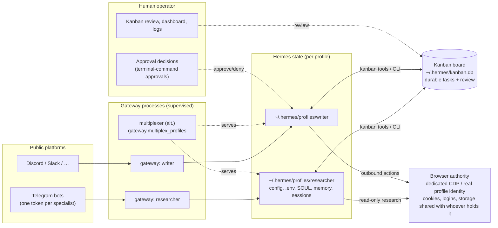

# Fleet Operator Reference

Hermes documents each building block of a multi-agent fleet separately —
[profiles](/user-guide/profiles),
[multi-profile gateways](/user-guide/multi-profile-gateways),
[Kanban](/user-guide/features/kanban),
[browser automation](/user-guide/features/browser),
and the [security model](/user-guide/security).
Operators running a real fleet of specialists on one host still have to
**infer how the boundaries compose**: what is isolated, what is shared, and
which layer enforces which rule.

This page is the integrated reference. It describes a reference architecture
built **only from existing, supported Hermes primitives** — no new machinery —
and states explicitly where the boundaries end, because the gaps are exactly
where unsafe assumptions form.

The reference fleet looks like this:

- N durable specialist identities (profiles), each with its own memory,
  skills, and credentials;
- one public-facing gateway process per specialist — or one multiplexing
  gateway as an alternative;
- one shared Kanban board for durable cross-profile work and review;
- one dedicated, authenticated browser profile granted to the specialists
  that need it;
- browser authority granted selectively, with the terminal-command
  approval system gating destructive shell commands and read-only vs
  outbound-mutation kept apart by policy;
- platform-native process supervision with post-restart verification.

## Reference architecture



Read the diagram as a set of **separate** boundaries:

1. **Identity boundary** — each profile is a distinct Hermes home
   (`HERMES_HOME`): config, `.env`, SOUL, memory, sessions, skills, cron jobs.
2. **Process boundary** — each public-facing specialist is a separate gateway
   process with its own PID, log files, and crash domain (or one multiplexing
   process serving all of them).
3. **Task boundary** — Kanban rows are durable state *shared by design*; any
   profile can read and write any task.
4. **Browser boundary** — the authenticated browser is a capability granted
   to a profile, not an identity of its own. It is the **shared** surface in
   this architecture.
5. **Human boundary** — approval and review are human decisions layered over
   everything else.

## One profile per durable specialist

A profile is a separate Hermes home: its own `config.yaml`, `.env`, `SOUL.md`,
memories, sessions, skills, and cron state. That is the unit of **durable
specialist identity** in a fleet — the agent that accumulates memory about
one job over weeks, not a throwaway subagent.

```bash
hermes profile create researcher --description "Reads source and external docs, writes findings."
hermes profile create writer --description "Turns findings into drafts for human review."
researcher setup
writer setup
```

Rules that hold the line:

- **One writer per home.** Never point two agent processes at the same
  profile — both write memory automatically and load each other's writes into
  their system prompts. Profiles exist exactly to prevent this.
- **One credential set per profile.** Each profile's `.env` holds its own
  bot tokens and API keys; credentials are never unioned across profiles.
- **Description matters for routing.** If a profile should receive Kanban
  work, set `--description` at create time (or `hermes profile describe`
  later) so the orchestrator knows what it is good at.

:::warning Profiles are not filesystem sandboxes
A profile isolates **Hermes state**, not the filesystem. On the default
`local` terminal backend every profile runs as your OS user with the **same
filesystem access** — a profile does not stop an agent from reading or
writing files anywhere that user can. If you need a predictable starting
directory, set `terminal.cwd` explicitly in that profile's config; if you
need real filesystem isolation, that must come from the container or OS
layer (see [Security](/user-guide/security)), not from the profile.
:::

## One gateway per public-facing specialist

The default and recommended topology is **one gateway process per profile**:
independent crash domains, independent restarts, per-profile logs and PIDs.

```bash
researcher gateway install   # LaunchAgent / systemd user unit / Scheduled Task
writer gateway install
researcher gateway start
writer gateway start
```

Each profile gets its own service unit (`ai.hermes.gateway-<name>.plist` on
macOS, `hermes-gateway-<name>.service` on Linux, a Scheduled Task on
Windows), its own PID file, and its own log pair
(`~/.hermes/profiles/<name>/logs/gateway.log`).

**Alternative: one multiplexing gateway.** On a host with many profiles — or
a container deployment where one process per profile is operationally heavy —
the default profile's gateway can serve *every* profile:

```bash
hermes config set gateway.multiplex_profiles true
hermes gateway restart
```

The trade-offs and contract changes (secondary profiles must not start their
own gateway, port-binding platforms only on the default profile, per-credential
tokens per profile, `/p/<profile>/` URL prefixes) are documented in
[Running Many Gateways at Once](/user-guide/multi-profile-gateways#alternative-one-gateway-for-all-profiles-multiplexing).

**Choosing:** keep one-process-per-profile when you want hard process-level
isolation between specialists. Prefer multiplexing when you want a single
thing to start, monitor, and restart.

## Kanban for durable cross-profile work

`delegate_task` is a fork-join call inside one agent's context; Kanban is a
durable task queue that **crosses agent boundaries** and survives restarts.
In a fleet, anything that outlives a single conversation — research
pipelines, scheduled ops, review handoffs, digital twins — belongs on the
board.

```bash
hermes kanban init
hermes kanban create "Survey X and summarize findings" --assignee researcher
hermes kanban create "Draft the report from the survey" --assignee writer \
  --link <survey-task-id>      # writer runs only after researcher completes
```

How the fleet uses it:

- **Handoffs are rows.** Every transition (`ready`, `running`, `blocked`,
  `review`, `done`) is a durable row in `~/.hermes/kanban.db` that any
  profile or human can read and edit.
- **Review is first-class.** `kanban_request_review` / `/kanban` put a task
  in front of a human or a reviewer profile before it is done.
- **Crashes are recoverable.** The dispatcher (running inside the gateway by
  default) reclaims stale claims and crashed workers; after
  `kanban.failure_limit` spawn failures a task auto-blocks with the last
  error instead of thrashing.
- **Workers stay scoped.** Workers are spawned with board and workspace
  pinned, and scratch workspaces are deleted on completion unless artifacts
  or `dir:`/`worktree:` workspaces are declared.

See the [Kanban reference](/user-guide/features/kanban) and the
[Kanban tutorial](/user-guide/features/kanban-tutorial) for the full model.

## Authenticated browser access is a separately granted capability

The fleet's browser is **authority, not identity**. When a profile browses
with your real logins, it acts *as you* — on every site those cookies reach.

Two supported ways to grant it:

**Dedicated CDP profile** — a browser instance started with its own
`--user-data-dir` and a remote-debugging port, which you sign in to once and
Hermes attaches to via `/browser connect`:

```bash
google-chrome \
  --remote-debugging-port=9222 \
  --user-data-dir=$HOME/.hermes/chrome-debug \
  --no-first-run --no-default-browser-check &
```

**Real-profile browsing** — `browser.use_real_profile: true` snapshots your
active browser profile (cookies, saved logins, preferences) into a managed
store under `~/.hermes/browser-profile/` and drives that snapshot:

```yaml
browser:
  use_real_profile: true
```

:::warning A shared authenticated browser shares cookies, accounts, and storage
If two specialists — or a specialist and you — browse through the same
authenticated profile, they share **cookies, saved logins, localStorage, and
anything else that identity holds**. Any one of them can exercise every
account the profile is signed in to, on every site the cookies reach. That is
a *convenience you grant*, not an *isolation boundary*: Hermes does not
partition accounts, scopes, or storage inside a shared browser profile.

Treat the browser like a shared credential: grant it only to the profiles
that genuinely need it, and keep read-only researchers on clean, throwaway
sessions (the default) unless you have a reason otherwise.
:::

Practical rules for the fleet:

- **Grant selectively.** Only the specialist whose job is "act on the web"
  gets `use_real_profile` or a dedicated CDP identity. Everyone else browses
  clean.
- **Separate identities per account.** If two specialists need two different
  accounts, run two browser profiles (two `--user-data-dir`s or two CDP
  ports), not one shared one.
- **Session naming.** `browser_exec`'s `session=<name>` argument isolates
  harness state per name (own daemon, log, and state) on **every** backend,
  and on **cloud backends** it additionally gets its own browser — so parallel
  subagents or simultaneous chats stop clobbering one shared connection.
  It isolates *sessions*, not *authority*: on a **local or CDP** backend all
  named sessions still drive the **same underlying browser instance** (same
  `--user-data-dir`, same CDP endpoint), so they share its cookies, logins,
  and storage. A deliberately shared CDP endpoint is therefore *not* a
  cookie boundary between sessions — for separate identities you still need
  separate browser profiles (separate `--user-data-dir`/port or CDP endpoint)
  as above.
- **Windows note.** Real-profile browsing requires the source browser to be
  **fully quit** (Chrome's "continue running background apps" keeps a
  `chrome.exe` alive that holds the profile lock). See
  [Browser → Real profile browsing](/user-guide/features/browser#real-profile-browsing-use-your-own-logins).

## Separate read-only research from outbound mutation

The same browser profile can read a public page or post to a logged-in
account — the browser cannot tell the difference, so **the operator policy
must**. The supported split:

| Activity | Classification | How to keep it bounded |
|---|---|---|
| Reading pages, scraping, summarizing, searching | **Read-only research** | Any profile; clean sessions; no approval needed |
| Posting, replying, deleting, purchasing, sending on an account | **Outbound mutation (account)** | Restrict who holds browser authority (previous section) + a human-in-the-loop policy you enforce |
| Editing shared state (files, Kanban rows, repos) | **Outbound mutation (local)** | Kanban review, checkpoints, and the terminal-command approval system |

**What the built-in approval system does — and does not — cover.**
Hermes ships a dangerous-**terminal-command** approval system
([Security → Dangerous Command Approval](/user-guide/security#dangerous-command-approval)): it detects
destructive shell commands and prompts before they run. That is a
**terminal-command** gate — it does not see or stop a browser form
submission, a click, or an account action taken through `browser_exec` /
the CDP tools. There is **no supported, enforced approval gate for browser
account mutations** in core: the browser tools execute whatever the agent
does. So do not rely on `approvals.mode` to hold a browser back.

```yaml
# ~/.hermes/config.yaml — per profile. GATES TERMINAL COMMANDS ONLY.
approvals:
  mode: smart        # smart | manual | off — which dangerous commands prompt
  timeout: 300
  cron_mode: deny    # unattended cron jobs never auto-approve a dangerous command
```

- `approvals.mode: manual` makes **every** dangerous terminal command wait
  for a human; `smart` auto-approves known-safe command patterns and prompts
  the rest; `off` disables the prompts (trusted CI/containers only).
- `cron_mode: deny` (and `single_query_mode: deny`) make unattended jobs
  **block** a dangerous terminal command instead of guessing — useful for
  scheduled local work. Again, these act on shell commands, not browser
  actions.
- **The browser account-action boundary is operator policy, not a core
  gate.** Keep read-only researchers on clean sessions and grant real-profile
  / dedicated-CDP authority only to the specialist whose job is "act on the
  web" (previous section). Anything that must act on an account is bounded
  by that capability grant plus the human-in-the-loop pattern *you* run —
  for example, the agent drafts the outbound message and a human sends it,
  or the operator reviews the CDP session live — not by a Hermes approval
  prompt. The field fleet in the [issue](https://github.com/NousResearch/hermes-agent/issues/97236)
  ran exactly that: an explicit operator-side gate on outbound account
  actions, layered on top of Hermes's terminal-command approvals.

The principle: **read autonomy, granted writes.** A specialist may read
anything its browser can reach; it may *write* only where you granted it
browser authority, and the terminal-command approval system still holds the
destructive shell commands on every backend.

## Supervision and post-restart verification

Hermes does not prescribe one service mechanism — it ships the platform
primitive for each, and you verify after every restart that the whole fleet
came back.

| Platform | Mechanism (via `hermes gateway install`) | Verify |
|---|---|---|
| **Windows** | Scheduled Task (`ONLOGON`), Startup-folder fallback; spawned via `pythonw.exe` | `hermes gateway status` (merges schtasks + Startup + PID) |
| **macOS** | `launchctl` LaunchAgent per profile | `launchctl list \| grep hermes` |
| **Linux** | systemd user unit per profile; `loginctl enable-linger` to survive logout | `systemctl --user list-units 'hermes-gateway-*'` |
| **Docker** | [s6-overlay](/user-guide/docker#per-profile-gateway-supervision) per-profile service slots | `hermes gateway status` per profile |

A fleet watchdog is just a bounded loop over the primitives above — e.g. a
cron job (or a small script) that runs `hermes gateway status` for each
profile and the `hermes-gateways` wrapper, and alerts you when any profile
is down. Nothing in Hermes assumes a particular watchdog shape, so pick the
one your platform gives you.

**Post-restart verification checklist** — after a reboot, host update, or
`hermes update`:

```bash
hermes profile list                          # every specialist present + gateway state
hermes-gateways status                       # every gateway process up (wrapper from the gateways guide)
tail -n 20 ~/.hermes/profiles/*/logs/gateway.log
hermes kanban list                           # board intact; no tasks stuck 'running' from the crash
```

- **Gateways back?** Each profile's unit/PID present and healthy.
- **Kanban reclaimed?** The dispatcher reclaims crashed workers — confirm no
  task is stuck in `running` that should have been reclaimed.
- **Browser authority?** If a specialist's browser was a dedicated CDP
  instance, it did not survive the restart — relaunch it (with the same
  `--user-data-dir`) and re-`/browser connect`.
- **Tokens still unique?** Token-conflict safety still fails fast if two
  profiles ever share a `(platform, token)` pair — the second gateway is
  blocked at startup, which is the correct failure.

## Threat model

The four boundaries are **independent**. Each one does one job and none of
them implies the others.

| Boundary | What it isolates | What it does **not** isolate |
|---|---|---|
| **Profile state** | Hermes homes: config, `.env`, SOUL, memory, sessions, skills, cron | The filesystem, the OS user, the browser, any account |
| **Browser authority** | Grants one browser identity (cookies/logins/storage) to a profile | Accounts *within* that identity — everything the cookies reach is shared with every profile granted the same identity |
| **Process isolation** | One gateway per crash domain: PID, memory, restart scope | Credentials or filesystem — profiles still share the OS user and its file access |
| **Filesystem access** | The OS user's actual permissions (or a container's) | Nothing above it — profiles are *not* filesystem sandboxes; two profiles of the same user see the same files |

Consequences that operators most often get wrong:

- **Profile ≠ sandbox.** Two profiles on one host are two *Hermes* states,
  not two security domains. Real isolation is the container or OS boundary.
- **Shared browser = shared identity.** Any profile granted the same browser
  profile can act as every account it is signed in to.
- **Process isolation is operational, not security.** Restarting one
  specialist won't touch the others — but a compromised specialist still runs
  as your user with your files.
- **Kanban is shared by design.** Any profile can read/write any task row;
  treat the board as a collaboration surface, not a private mailbox.

## Active browser-concurrency work

Shared-CDP and per-profile browser work is **in flight** upstream — this page
deliberately links to it instead of duplicating it, because the details are
moving:

- [PR #86879 — pin shared CDP sessions to tabs](https://github.com/NousResearch/hermes-agent/pull/86879):
  task ownership for sessions sharing one CDP endpoint.
- [PR #85573 — cdp-browser plugin](https://github.com/NousResearch/hermes-agent/pull/85573):
  composed one-pass CDP driver with parallel spaces.
- [Issue #49693 / PR #49691 — per-profile browser isolation](https://github.com/NousResearch/hermes-agent/issues/49693):
  multiple accounts / cookie jars across agents and profiles.

Until these land, the supported way to keep specialists from clobbering each
other in a shared browser is the operator pattern above: **separate browser
profiles per identity** (distinct `--user-data-dir`/port or CDP endpoint),
**`browser_exec session=<name>`** for per-task harness isolation, and the
operator-side human-in-the-loop policy for outbound account actions (the
built-in approval system only gates terminal commands — it is not a browser
account-action gate).

## Related pages

- [Profiles: Running Multiple Agents](/user-guide/profiles)
- [Running Many Gateways at Once](/user-guide/multi-profile-gateways)
- [Kanban — Multi-Agent Profile Collaboration](/user-guide/features/kanban)
- [Browser Automation](/user-guide/features/browser)
- [Security](/user-guide/security)
- [Windows (Native) Guide](/user-guide/windows-native)
- [Docker](/user-guide/docker)
