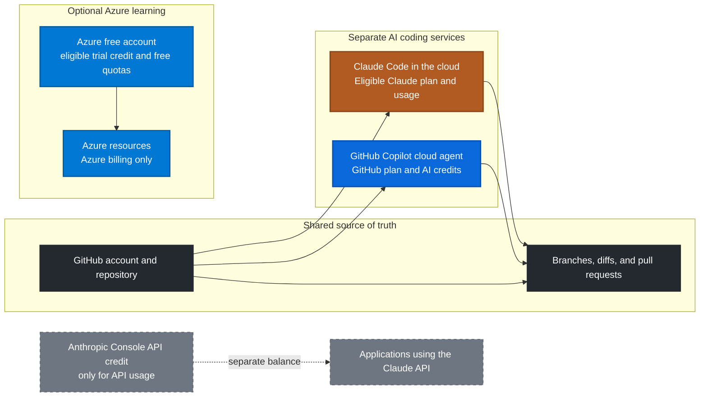

# Try GitHub Copilot, Azure, and Claude Code in the Cloud

This guide shows how to create a GitHub repository, try GitHub Copilot, sign up for an Azure free account, and run Claude Code against a GitHub repository from the browser. It also explains which service pays for what, so an offer or trial in one account is not mistaken for credit in another.

> **Important:** GitHub, GitHub Copilot, Azure, and Claude are separate services with separate accounts, terms, and billing. Azure credit does not pay GitHub or Anthropic. A GitHub Copilot plan does not pay Anthropic. A Claude subscription or Claude usage credit is not the same balance as an Anthropic Console API credit.

## How the services fit together

GitHub is the shared home for your code. Copilot cloud agent and Claude Code in the cloud can each work from a GitHub repository, but they use separate plans and create changes for you to review. Azure is an optional, separate place to learn about or host Azure resources; it is not required to use either coding agent.

The dashed API-credit line is deliberately separate: an Anthropic Console API balance is for API calls. It is not automatically a Claude subscription or cloud-session allowance.

## 1. Create a GitHub account and repository

GitHub is a website and service; you do not need to install an application to use repositories or browser-based cloud agents.

1. Create or sign in to an account at [github.com](https://github.com/).
2. Verify your email address and enable two-factor authentication or a passkey in your account security settings.
3. Create a repository at [github.com/new](https://github.com/new). Choose **Private** for code you do not want publicly readable. Add a README if you want a starter file.
4. Keep credentials, API keys, billing details, and personal data out of the repository. Never commit a `.env` file or paste a secret into an agent prompt.

For work entirely in the browser, stop here: Git, GitHub Desktop, and the GitHub CLI are optional. If you also want to edit files locally, install [GitHub Desktop](https://desktop.github.com/) or [Git](https://git-scm.com/downloads).

## 2. Try GitHub Copilot

Copilot is built into GitHub.com, so the browser workflow does not require a local installation.

1. Open the [GitHub Copilot plans page](https://github.com/features/copilot/plans) while signed in.
2. Start with **Copilot Free** if available to your account. If you want a paid-plan trial, continue only if GitHub explicitly offers a trial at signup; do not assume every account has one.
3. Before accepting a trial, check the displayed renewal date, price after the trial, included AI-credit allowance, and cancellation terms. Set a reminder if you do not want a paid renewal.
4. To try a repository task, open your repository and select its **Agents** tab or open the [Copilot agents page](https://github.com/copilot/agents). If Copilot cloud agent is available to your plan and repository, select the repository, describe one small task, and start the session.
5. Review the generated branch and diff. Run or inspect the relevant checks, then create or merge a pull request only when you are satisfied with the changes.

Copilot cloud agent works in a GitHub-hosted development environment. It is different from local Copilot features in an IDE. The model and usage are governed by GitHub Copilot's plan and AI-credit rules—even when you choose a Claude model inside Copilot. That does **not** use your Anthropic Console API key or Azure trial balance. See [GitHub's Copilot plans](https://docs.github.com/en/copilot/get-started/plans) and [cloud-agent guide](https://docs.github.com/en/copilot/concepts/agents/cloud-agent/about-cloud-agent) for current access and usage details.

## 3. Sign up for an Azure free account

Azure is optional for the GitHub and Claude workflows. Use it if you want to learn Azure, create a small Azure resource, or later deploy an application. It does not provide compute for Claude Code's Anthropic-hosted cloud sessions.

1. Open the official [Azure free account page](https://azure.microsoft.com/free/) and review the offer shown for your country.
2. Sign in with a Microsoft account and complete Microsoft's requested identity, phone, and payment verification. Eligibility and verification requirements can vary.
3. Read the credit amount, expiry date, eligible services, and free-service quotas shown during signup. Microsoft's current documentation describes an Azure credit equivalent to **$200 in your billing currency for 30 days** for eligible new users, plus limited free-service quantities for 12 months. Confirm the offer displayed to you; eligibility and terms can change.
4. After signup, open the [Azure portal](https://portal.azure.com/) and check **Cost Management + Billing** and your subscription's free-service usage before creating resources.
5. If you create resources, choose only what you need and delete the resource group when finished. Avoid leaving virtual machines, databases, or other billable resources running.

**Azure billing safety:** Microsoft's documentation says the subscription and services are disabled when the initial credit expires or runs out unless you upgrade. Upgrading enables continued access but can lead to pay-as-you-go charges beyond free quantities. A budget or alert helps monitor spending; it is not a hard cap that automatically stops resources. Read [Avoid charges with your Azure free account](https://learn.microsoft.com/en-us/azure/cost-management-billing/manage/avoid-charges-free-account), [Create and manage budgets](https://learn.microsoft.com/en-us/azure/cost-management-billing/costs/tutorial-acm-create-budgets), and the [Azure free-account FAQ](https://azure.microsoft.com/en-us/pricing/purchase-options/azure-account/) before upgrading.

## 4. Start Claude Code in the cloud with your GitHub repository

Claude Code in the cloud runs a coding session on cloud infrastructure and connects it to a GitHub repository. It is not the same product or billing account as Copilot.

1. Sign in at [claude.ai](https://claude.ai/) and check the [Claude plans page](https://claude.com/pricing). Claude Code cloud sessions currently require an eligible paid plan or an eligible organization seat; check the live requirements for your account.
2. Open [claude.ai/code](https://claude.ai/code) and follow the **Sign in with GitHub** flow.
3. For public repositories, authorize the requested GitHub access. For a private repository, install the official [Claude GitHub App](https://github.com/apps/claude/installations/new) for the account or organization and grant access only to the repositories you intend Claude to use. An organization owner may need to approve the installation.
4. Complete the cloud-environment setup shown during onboarding. The default environment controls what the session can reach on the network; do not add secrets or broaden access unless the task requires it.
5. Select the repository and give Claude a small, bounded task, for example: “Explain the project structure and suggest one documentation improvement. Do not edit files yet.”
6. For a change, ask Claude to implement one clearly scoped task. Review its branch and diff in GitHub, run checks, and open or merge a pull request yourself.

The session works from the repository version it clones in the cloud. Changes that exist only on your computer are not available until you push them to GitHub. See Anthropic's [Claude Code cloud quickstart](https://code.claude.com/docs/en/web-quickstart) and [cloud-session guide](https://code.claude.com/docs/en/claude-code-on-the-web).

## 5. Understand the Claude $100 offer before using it

Do not count on a universal $100 grant. Anthropic's official pages describe paid-plan usage limits and optional usage credits, but an offer's amount, eligibility, expiration, and supported product must be confirmed in the signed-in account where it appears. A promotion shown to one user may not be available to another.

Before activating or spending any credit:

1. Open [Claude Settings > Usage](https://claude.ai/settings/usage) and identify the exact credit or offer name, balance, expiry, and included products.
2. If it is a **Claude paid-plan usage credit**, use it only as described in the Claude account's usage settings and offer terms. Claude activity across web, desktop, mobile, and Claude Code can draw from the same plan usage pool; paid-plan usage credits are a separate feature from an Anthropic Console API balance.
3. If it is an **Anthropic Console API credit**, open the [Anthropic Console](https://platform.claude.com/) and check the API billing page. Use that balance only with an API integration that accepts an Anthropic API key. It does not automatically pay for a Claude.ai plan or cloud session.
4. Do not paste an API key into a public repository, issue, prompt, or client-side application. Store it in a secret manager or the service's protected secret settings, and set spending limits where available.

The [Claude pricing page](https://claude.com/pricing) and Anthropic's [guide to usage credits for paid plans](https://support.claude.com/en/articles/12429409-manage-usage-credits-for-paid-claude-plans) explain current plan usage and credits. For API setup, use the [Claude Console API quickstart](https://platform.claude.com/docs/en/get-started). If your account shows a $100 offer, follow that offer's own terms rather than assuming it is interchangeable with API credit, Azure credit, or Copilot AI credits.

## 6. A safe first experiment

Use the same repository, but run each agent separately so the result is easy to compare:

1. Ask Copilot to explain a small area of the codebase, or request a bounded documentation change.
2. Ask Claude Code in the cloud to perform the same task on its own branch.
3. Compare the two diffs and test results. Do not let either agent merge its own changes automatically.
4. Use Azure only for a separate Azure exercise, such as creating a small free-tier resource. Check usage and remove it when done.
5. Before ending, verify that no unwanted Copilot renewal is scheduled, no Azure resources are still running, and any Claude usage offer is still within its stated balance and expiry.

### Quick service and billing checklist

| Service | What it provides | Where to check eligibility or usage | What it does not pay for |
|---|---|---|---|
| GitHub | Repository, branches, issues, and pull requests | GitHub account settings | Azure or Anthropic usage |
| GitHub Copilot | GitHub-hosted or IDE coding assistance, depending on plan | Copilot settings and billing | Anthropic Console API calls |
| Azure free account | Azure trial credit and limited free-service quotas for eligible users | Azure portal, Cost Management + Billing | GitHub Copilot or Claude |
| Claude Code in the cloud | Cloud coding sessions connected to GitHub | Claude plan and **Settings > Usage** | Azure resources or GitHub Copilot |
| Anthropic Console API | API access for applications that use an Anthropic API key | Anthropic Console billing and usage | Claude.ai subscription or Azure |

## Official references

- [GitHub Copilot plans](https://docs.github.com/en/copilot/get-started/plans)
- [Use GitHub Copilot cloud agent on GitHub](https://docs.github.com/en/copilot/how-tos/use-copilot-agents/cloud-agent/use-cloud-agent-on-github)
- [Azure free account](https://azure.microsoft.com/en-us/pricing/purchase-options/azure-account/)
- [Avoid charges with your Azure free account](https://learn.microsoft.com/en-us/azure/cost-management-billing/manage/avoid-charges-free-account)
- [Claude Code in the cloud quickstart](https://code.claude.com/docs/en/web-quickstart)
- [Claude Code cloud sessions](https://code.claude.com/docs/en/claude-code-on-the-web)
- [Claude usage credits for paid plans](https://support.claude.com/en/articles/12429409-manage-usage-credits-for-paid-claude-plans)
- [Claude API quickstart](https://platform.claude.com/docs/en/get-started)

*Offer details checked on September 30, 2026. Providers can change plan names, prices, trial eligibility, quotas, and credit terms; the signed-in billing pages and linked official terms take precedence.*
