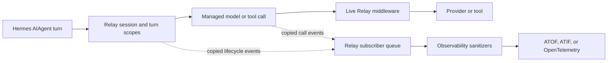

# NeMo Relay

[NeMo Relay](https://docs.nvidia.com/nemo/relay/v0.8.3/about-nemo-relay/overview) connects Hermes sessions, turns, model requests, tool calls, and delegated agents in one trace. Use it to inspect a run, export its data, or apply Relay plugins to model and tool execution.

Hermes supports Relay directly. You do not need to run Hermes behind the [Relay CLI gateway](https://docs.nvidia.com/nemo/relay/v0.8.3/nemo-relay-cli/about) or install a Hermes observability plugin.

:::note NeMo Relay and Hermes Relay are different
NeMo Relay records and processes agent activity. [Hermes Relay](/user-guide/messaging/relay) connects a Hermes gateway to messaging platforms.
:::

## Choose the right path

Hermes has several ways to record activity. Use the one that matches the data you need:

| Goal | Start with |
|---|---|
| Follow sessions, delegated agents, model calls, and tools in one trace; export [ATOF](https://docs.nvidia.com/nemo/relay/v0.8.3/configure-plugins/observability/atof), [ATIF](https://docs.nvidia.com/nemo/relay/v0.8.3/configure-plugins/observability/atif), or [OpenTelemetry](https://docs.nvidia.com/nemo/relay/v0.8.3/configure-plugins/observability/opentelemetry); or apply [live Relay middleware](https://docs.nvidia.com/nemo/relay/v0.8.3/about-nemo-relay/concepts/middleware) | This NeMo Relay integration |
| Send turn, model, token, cost, and tool traces directly to Langfuse | The [built-in Langfuse plugin](/user-guide/features/built-in-plugins#observabilitylangfuse) |
| Save ShareGPT JSONL for training or evaluation | [Trajectory saving](/guides/python-library#saving-trajectories) or [batch processing](/user-guide/features/batch-processing) |
| Keep bounded local usage counters without prompts, responses, or session/request IDs | [Hermes shared metrics](#shared-metrics-are-separate) |

Relay is attached to Hermes's `AIAgent` conversation path:

| Surface | Coverage |
|---|---|
| Covered | AIAgent-backed work from the CLI and TUI, `hermes chat --oneshot`, Desktop and dashboard, ACP editors, messaging gateways, the API server, scheduled and background tasks, batch jobs, and direct Python-library use. |
| Not automatically covered | Local slash or configuration commands, message delivery, scheduler bookkeeping, voice transcription, pre-turn processing, or work performed inside an external MCP server or agent process. |

Direct library calls are covered only when they use `AIAgent.chat()` or `AIAgent.run_conversation()`. Each Hermes process needs its own Relay configuration.

## How it works

Relay separates [managed execution](https://docs.nvidia.com/nemo/relay/v0.8.3/about-nemo-relay/architecture#managed-execution-pipeline) from [queued event publication](https://docs.nvidia.com/nemo/relay/v0.8.3/about-nemo-relay/concepts/events#event-handoff):



[Live middleware](https://docs.nvidia.com/nemo/relay/v0.8.3/about-nemo-relay/concepts/middleware#what-middleware-is) can inspect, block, or change a call before Hermes returns it to the user. [Observability sanitizers](https://docs.nvidia.com/nemo/relay/v0.8.3/reference/event-sanitizers#sanitizer-surfaces) change only the copied event sent to [subscribers and exporters](https://docs.nvidia.com/nemo/relay/v0.8.3/about-nemo-relay/concepts/subscribers#what-subscribers-are); they do not change the provider or tool payload.

Relay exporters and [runtime plugins](https://docs.nvidia.com/nemo/relay/v0.8.3/about-nemo-relay/concepts/plugins#what-plugins-can-register) are inactive by default. To enable them, you must create a Relay [`plugins.toml` configuration file](https://docs.nvidia.com/nemo/relay/v0.8.3/configure-plugins/plugin-configuration-files#file-shape), add the components or plugins you want, and tell Hermes to use that file before it starts. Hermes does not create or select the file for you. The optional [shared metrics](#shared-metrics-are-separate) setting has its own consent and data boundary.

## Prerequisites

Hermes depends on `nemo-relay>=0.8.3,<0.9`. A normal Hermes install or update installs Relay automatically on [supported platforms](https://docs.nvidia.com/nemo/relay/v0.8.3/reference/support-matrix#platforms-and-architectures). You do not need the Relay CLI for the basic setup below; the CLI is useful for optional tasks such as [validating a dynamic plugin manifest](https://docs.nvidia.com/nemo/relay/v0.8.3/configure-plugins/discoverable-plugins#validate-before-loading-code).

The NeMo Relay integration is available only on platforms for which Relay publishes a native Python wheel:

| Operating system | Architecture |
|---|---|
| macOS | Apple silicon |
| Linux, including glibc and musl distributions (not Android) | x86_64 or ARM64 |
| Windows | x86_64 or ARM64 |

Platforms not listed above—including Intel Macs and Android/Termux—are unsupported by the Relay integration. Hermes continues to work on those platforms, but Relay scopes, middleware, plugins, and subscribers are unavailable.

## Quick Start

Start with a local [ATOF file](https://docs.nvidia.com/nemo/relay/v0.8.3/configure-plugins/observability/atof#file-sinks). It is the simplest way to confirm that Hermes and Relay are connected.

Complete the normal Hermes setup first, including a working model provider.

### 1. Create `plugins.toml`

Create the Relay directory under your Hermes home.

On macOS or Linux:

```bash
mkdir -p "$HOME/.hermes/relay"
```

On native Windows PowerShell:

```powershell
New-Item -ItemType Directory -Force "$env:LOCALAPPDATA\hermes\relay" | Out-Null
```

Then create a Relay [`plugins.toml`](https://docs.nvidia.com/nemo/relay/v0.8.3/configure-plugins/plugin-configuration-files#file-shape) in that directory with this content. The examples use the recommended path `$HOME/.hermes/relay/plugins.toml` on macOS and Linux or `%LOCALAPPDATA%\hermes\relay\plugins.toml` on native Windows. If you set `HERMES_HOME`, use its `relay` directory instead.

```toml
version = 1

[policy]
unknown_component = "error"
unknown_field = "error"
unsupported_value = "error"

[[components]]
kind = "observability"
enabled = true

[components.config]
version = 4
enable_full_payloads = false

[components.config.atof]
enabled = true

[[components.config.atof.sinks]]
type = "file"
output_directory = "./hermes-relay"
filename = "events.jsonl"
mode = "append"
```

Relative output paths use the directory from which you start Hermes. Use an absolute path when Hermes runs as a service or may start from different directories.

The [strict validation policy](https://docs.nvidia.com/nemo/relay/v0.8.3/configure-plugins/plugin-configuration-files#validation) turns misspelled component names and fields into activation errors instead of warnings. Hermes still starts if Relay activation fails, so check warnings at startup and when the first agent turn creates the Relay runtime.

[`enable_full_payloads = false`](https://docs.nvidia.com/nemo/relay/v0.8.3/configure-plugins/observability/configuration#full-llm-payloads) reduces repeated model history; it does not make the export metadata-only. Prompts, responses, tool arguments, and tool results can still be present. See [Data and privacy](#data-and-privacy) before sending the file anywhere.

### 2. Select the file

Hermes does not discover this file automatically. For a temporary test, set its path in the shell that starts Hermes:

```bash
export HERMES_NEMO_RELAY_PLUGINS_TOML="$HOME/.hermes/relay/plugins.toml"
```

On native Windows PowerShell:

```powershell
$env:HERMES_NEMO_RELAY_PLUGINS_TOML = "$env:LOCALAPPDATA\hermes\relay\plugins.toml"
```

For regular use, add the variable with an absolute path to `~/.hermes/.env` on macOS or Linux, or `%LOCALAPPDATA%\hermes\.env` on native Windows. For a gateway service, set it in the service environment.

:::caution Use a Hermes-owned configuration path
Relay layers its normal user and system component configuration with the file selected above. Keep the selected file outside Relay's [runtime discovery paths](https://docs.nvidia.com/nemo/relay/v0.8.3/configure-plugins/plugin-configuration-files#runtime-discovery), such as `~/.config/nemo-relay/plugins.toml`; selecting a file Relay also discovers can duplicate exporters and events. The `$HOME/.hermes/relay/plugins.toml` path above avoids that overlap. Review [How configuration is applied](#how-configuration-is-applied) if Relay is already configured on the machine.
:::

### 3. Start Hermes and run one turn

Start Hermes normally. Restart it after changing `plugins.toml`.

```bash
hermes chat --oneshot -q "Use the terminal tool to run pwd, then report the result."
```

This command closes its Relay session before it exits, giving Relay a chance to finish queued exporter work.

### 4. Check the output

```bash
wc -l ./hermes-relay/events.jsonl
tail -n 1 ./hermes-relay/events.jsonl | python3 -m json.tool
```

One successful local run with Relay 0.8.2 produced the following output. The record count varies with the number of model and tool calls.

```text
      20 ./hermes-relay/events.jsonl
{
    "atof_version": "0.1",
    "attributes": [],
    "category": "agent",
    "category_profile": null,
    "data": {},
    "data_schema": null,
    "kind": "scope",
    "metadata": {
        "hermes.execution_surface": "cli",
        "hermes.relay.runtime_instance": "4ed9c79b6b884804bd88f2f06ac9bd8d",
        "hermes.relay.schema_version": "hermes.relay.runtime.v1"
    },
    "name": "hermes.session",
    "parent_uuid": "01a05d86-14be-7070-ad53-75748fb61039",
    "scope_category": "end",
    "timestamp": "2026-09-01T15:11:04.748905+00:00",
    "uuid": "01a05d86-14be-7070-ad53-759c730c8834"
}
```

On native Windows PowerShell:

```powershell
(Get-Content .\hermes-relay\events.jsonl).Count
Get-Content .\hermes-relay\events.jsonl -Tail 1
```

The file should contain newline-delimited records for `hermes.session`, `hermes.turn`, and the model request. If the model follows the instruction, it also contains records named `terminal`. Scopes normally produce a [start and end record with the same UUID](https://docs.nvidia.com/nemo/relay/v0.8.3/about-nemo-relay/concepts/events#start-and-end-pairing); that pair is not a duplicate. Because the sink uses `mode = "append"`, the file also retains earlier runs. If the expected records are missing, see [Troubleshooting](#troubleshooting).

To disable this Relay plugin configuration, remove `HERMES_NEMO_RELAY_PLUGINS_TOML` from the shell, Hermes `.env`, or service environment that sets it, and restart Hermes. This does not disable the separate shared-metrics setting.

## What Hermes reports

Hermes owns the integration points, so Relay can preserve the [scope hierarchy and ownership](https://docs.nvidia.com/nemo/relay/v0.8.3/about-nemo-relay/concepts/scopes#scope-hierarchy-and-ownership) instead of inferring relationships from separate logs.

| Hermes activity | What Relay records |
|---|---|
| Session | A `hermes.session` [agent scope](https://docs.nvidia.com/nemo/relay/v0.8.3/about-nemo-relay/concepts/scopes#scope-types). |
| Turn | A `hermes.turn` child scope with its outcome. |
| Model request | A `hermes.logical_llm_call` scope with one child for each provider attempt, including retries and fallbacks; request and response data, provider and model metadata, available usage, timing, and outcome. OpenAI Chat Completions, OpenAI Responses, and Anthropic Messages use [typed Relay provider codecs](https://docs.nvidia.com/nemo/relay/v0.8.3/integrate-into-frameworks/provider-codecs#built-in-provider-codecs). |
| Streaming model request | Stream lifecycle, compact `llm.chunk` receipt marks, available finish and usage metadata, a reconstructed final response when supported, and the outcome. |
| Tool call | Tool name, arguments, result, timing, outcome, and call ID through a [managed tool boundary](https://docs.nvidia.com/nemo/relay/v0.8.3/instrument-applications/instrument-tool-call). Calls to Hermes skill, memory, scheduler, and MCP tools appear as normal tool scopes. |
| Skill load | A best-effort [`skill.load` mark](https://docs.nvidia.com/nemo/relay/v0.8.3/about-nemo-relay/concepts/events#automatic-skill-load-marks) when Relay recognizes a first-class skill tool such as `skill_view` or a request to read a complete `SKILL.md`. The mark records the detected skill name and load source; the enclosing tool event records whether execution succeeded. |
| Delegated agent | A child `hermes.session` agent scope under the turn that started it when Hermes has that relationship. |

Hermes can also emit optional, privacy-bounded Relay records when [shared metrics](#shared-metrics-are-separate) are enabled: `hermes.task_run`, `hermes.model_call`, `hermes.tool_call`, `hermes.tool_approval`, `hermes.client.active`, `hermes.skill.lifecycle`, and `hermes.skill.load`. Skill lifecycle records cover successful create, install, edit, patch, archive, restore, and stale transitions. Skill-load records describe first use, reuse, and reuse after a patch. These optional `hermes.skill.*` records deliberately omit skill names and content and are separate from Relay's standard `skill.load` mark.

Read a normal trace from `hermes.session` to `hermes.turn`, then to a logical model call, provider attempt, tool call, or delegated child session. Known model protocols use names such as `openai.chat_completions`; `metadata.hermes.provider` records the provider Hermes actually called.

[Relay scope and trajectory IDs](https://docs.nvidia.com/nemo/relay/v0.8.3/reference/atof-event-format#55-id-relationships) are not the IDs shown by `hermes sessions`. Hermes does not currently put its stored session ID in ATOF, ATIF, or OpenTelemetry output. Keep an external mapping if you need to join Relay output back to the Hermes session store.

Hermes also avoids recursively wrapping model or tool calls made from inside an already managed callback. The outer call remains recorded; the nested callback work is not a second managed Relay call.

## Choose what to export

Keep one [`observability` component](https://docs.nvidia.com/nemo/relay/v0.8.3/configure-plugins/observability/configuration) in `plugins.toml`. Enable one or more output sections under its `[components.config]` table.

| Output | Use it for | When data appears |
|---|---|---|
| [ATOF](https://docs.nvidia.com/nemo/relay/v0.8.3/configure-plugins/observability/atof) | Canonical event inspection, local debugging, or a custom event collector | Events are written as Relay processes them. |
| [ATIF](https://docs.nvidia.com/nemo/relay/v0.8.3/configure-plugins/observability/atif) | A completed trajectory for analysis, replay, or evaluation | The top-level agent scope must close first. |
| [OpenTelemetry](https://docs.nvidia.com/nemo/relay/v0.8.3/configure-plugins/observability/opentelemetry) | Sending traces, and optionally compatible marks as logs or metrics, to an OTLP-compatible collector | Export timing follows the configured OpenTelemetry queue and collector. |

### Write ATIF trajectories

Add this section under the existing observability component:

```toml
[components.config.atif]
enabled = true
agent_name = "Hermes Agent"
model_name = "unknown"
output_directory = "./hermes-relay"
filename_template = "trajectory-{session_id}.json"
```

ATIF writes one file when a top-level agent scope closes. The `{session_id}` in the filename is Relay's trajectory UUID. A long-running gateway session may produce turn data before it produces the session trajectory; segmentation produces one trajectory for each closed segment. See [Continuous gateway sessions](#continuous-gateway-sessions) if you need periodic session-level exports.

ATIF projects conversations, tools, and observations into trajectory steps. Point-in-time [Relay marks](https://docs.nvidia.com/nemo/relay/v0.8.3/about-nemo-relay/concepts/events#mark) are not ATIF steps, but the complete events associated with the trajectory remain available under `extra.observed_events`. Use the [ATOF event format](https://docs.nvidia.com/nemo/relay/v0.8.3/reference/atof-event-format) when you need the canonical event stream rather than a trajectory projection.

ATIF can also upload completed trajectories to HTTP or S3-compatible destinations. If every configured remote destination fails for a trajectory, Relay attempts a local recovery copy under `output_directory`. See the [ATIF storage reference](https://docs.nvidia.com/nemo/relay/v0.8.3/configure-plugins/observability/atif#remote-storage) for configuration and delivery details.

### Send OpenTelemetry traces

Add this section under the existing observability component and replace the endpoint with your collector:

```toml
[components.config.opentelemetry]
enabled = true

[[components.config.opentelemetry.endpoints]]
type = "full"
endpoint = "http://localhost:4318/v1/traces"
service_name = "hermes-agent"
```

The [`full` projection](https://docs.nvidia.com/nemo/relay/v0.8.3/configure-plugins/observability/opentelemetry#trace-projections) preserves Relay's parent-child structure and non-metric marks. [Typed metric marks](https://docs.nvidia.com/nemo/relay/v0.8.3/configure-plugins/observability/opentelemetry#emit-log-and-metric-marks) can go to a separately configured metrics pipeline. Relay also supports [`gen_ai`](https://docs.nvidia.com/nemo/relay/v0.8.3/configure-plugins/observability/opentelemetry#genai-projection) for OpenTelemetry GenAI conventions and an [OpenInference projection](https://docs.nvidia.com/nemo/relay/v0.8.3/configure-plugins/observability/openinference#plugin-configuration), plus separate OTLP log and metric pipelines. See the [NeMo Relay OpenTelemetry reference](https://docs.nvidia.com/nemo/relay/v0.8.3/configure-plugins/observability/opentelemetry) before adding production credentials, batching, or multiple endpoints.

### Example: export traces to Arize Phoenix

[Arize Phoenix](https://arize.com/docs/phoenix) can receive Relay's OpenInference-compatible traces directly over OTLP. You do not need a Phoenix tracing SDK in Hermes.

For a local test, start the pinned Phoenix container in a separate terminal:

```bash
docker pull arizephoenix/phoenix:version-20.4.0
docker run --rm --name hermes-phoenix \
  -p 127.0.0.1:6006:6006 \
  arizephoenix/phoenix:version-20.4.0
```

Keep the ATOF sink from the Quick Start while testing, then add this block under the same observability component in `plugins.toml`. If you already copied the generic OpenTelemetry block above, replace it with this one; do not declare `[components.config.opentelemetry]` twice.

```toml
[components.config.opentelemetry]
enabled = true

[[components.config.opentelemetry.endpoints]]
type = "openinference"
endpoint = "http://localhost:6006/v1/traces"
transport = "http_binary"
service_name = "hermes-agent"

[components.config.opentelemetry.endpoints.resource_attributes]
"openinference.project.name" = "hermes-relay"
```

Confirm that Phoenix is ready:

```bash
curl -fsS http://localhost:6006/healthz
```

The response should be `OK`. Start a fresh Hermes process and complete one request. Then open [http://localhost:6006](http://localhost:6006) and select the `hermes-relay` project, or check its latest trace from the command line:

```bash
curl -fsS \
  'http://localhost:6006/v1/projects/hermes-relay/traces?limit=1&include_spans=true'
```

A successful export returns a non-empty `data` array containing linked Hermes session, turn, model, and tool spans. If the trace is not visible immediately, wait a few seconds for the exporter batch. Keep this example local until you have reviewed [Data and privacy](#data-and-privacy); prompts, responses, and tool data can be exported.

### Send ATOF events to a service

ATOF also supports [HTTP and WebSocket sinks](https://docs.nvidia.com/nemo/relay/v0.8.3/configure-plugins/observability/atof#stream-sinks). Keep a file sink during initial setup so you can distinguish a Hermes integration problem from a remote collector problem.

ATOF file sinks do not rotate files by size or age. The explicit `events.jsonl` file in the Quick Start grows across runs while `mode = "append"` is set, so manage retention outside Relay or use a deployment-specific filename policy.

## Add Relay processing

[Relay plugins](https://docs.nvidia.com/nemo/relay/v0.8.3/about-nemo-relay/concepts/plugins#what-plugins-can-register) can change copied observability data or participate in the live execution path. Choose the surface based on the effect you need:

:::caution Enforcement coverage
Relay plugins affect only calls that Hermes routes through an active Relay configuration. Hermes logs a warning and continues without Relay when the selected configuration cannot be loaded. It also skips Relay for a later overlapping turn in the same Hermes session and for model or tool calls nested inside an active Relay callback. Do not use this integration as the only security gate when every call must be checked.
:::

| Goal | Relay surface | Effect on Hermes |
|---|---|---|
| Write or send session data | [Subscriber or exporter](https://docs.nvidia.com/nemo/relay/v0.8.3/about-nemo-relay/concepts/subscribers#what-subscribers-are) | Reads copied events; it does not change the provider or tool payload. |
| Remove sensitive values from exported data | [Observability sanitizer](https://docs.nvidia.com/nemo/relay/v0.8.3/reference/event-sanitizers#sanitizer-surfaces) or PII redaction plugin | Changes the copied event before subscribers receive it; the real model and tool calls stay unchanged. |
| Block or change a model request, tool call, tool result, or model stream | [Conditional, request-intercept, execution, or stream-execution middleware](https://docs.nvidia.com/nemo/relay/v0.8.3/about-nemo-relay/concepts/middleware#choose-a-middleware-type) | Runs on the live managed call and can change user-visible behavior. |
| Run a self-contained out-of-process extension | Compatible [Rust or command worker plugin](https://docs.nvidia.com/nemo/relay/v0.8.3/build-plugins/workers/about#choose-the-implementation) | Runs in a separate worker process, but still applies as one process-wide Hermes policy. |
| Run a native Rust extension | [Dynamic native plugin](https://docs.nvidia.com/nemo/relay/v0.8.3/build-plugins/native/about) | Loads into the Hermes process and shares its failure boundary. |

### Built-in Relay components

The Relay Python binding used by Hermes includes these first-party components:

| Component | Use in Hermes |
|---|---|
| [`observability`](https://docs.nvidia.com/nemo/relay/v0.8.3/configure-plugins/observability/about#exporter-selection) | Export ATOF, ATIF, or OpenTelemetry data. |
| [`pii_redaction`](https://docs.nvidia.com/nemo/relay/v0.8.3/configure-plugins/pii-redaction/about#observability-boundary) | Redact copied observability data without changing the real model or tool call. |
| [`adaptive`](https://docs.nvidia.com/nemo/relay/v0.8.3/configure-plugins/adaptive/about#use-adaptive-when) | Configure adaptive hints, prompt-cache planning, response caching, and related runtime behavior. Support depends on the provider and codec, so test the exact Hermes route before deployment. |
| [`pricing`](https://docs.nvidia.com/nemo/relay/v0.8.3/configure-plugins/model-pricing#configuration) | Add cost estimates when Relay can read model and token usage and a configured catalog entry matches. |
| [`nemo_guardrails`](https://docs.nvidia.com/nemo/relay/v0.8.3/configure-plugins/nemo-guardrails/about) | Maintain an existing Relay 0.8 deployment only. This built-in integration is deprecated, has no 0.8 replacement, and is scheduled for removal in Relay 0.9. |

[Adaptive response caching](https://docs.nvidia.com/nemo/relay/v0.8.3/configure-plugins/adaptive/response-cache#when-to-use-it) changes execution: a hit can skip the provider or tool callback, and cached model responses and tool results are stored unredacted. The PII component protects observability copies, not cache contents. Cache only tools that are read-only and stable for the configured lifetime.

### Example: redact common values from exports

Add a second component to the same `plugins.toml`:

```toml
[[components]]
kind = "pii_redaction"
enabled = true

[components.config]
version = 1

[[components.config.profiles]]
mode = "builtin"
priority = 80

[components.config.profiles.builtin]
action = "redact"
detector = "email"

[[components.config.profiles]]
mode = "builtin"
priority = 90

[components.config.profiles.builtin]
action = "redact"
detector = "api_key"
```

This replaces detected email addresses and API keys in copied observability payloads before the configured exporters receive them. It does not change what Hermes sends to a model or tool. Review the PII plugin's [observability-only boundary](https://docs.nvidia.com/nemo/relay/v0.8.3/configure-plugins/pii-redaction/about#observability-boundary) before relying on it for a privacy policy.

### Test live payload changes

Hermes preserves the original provider SDK request, response, and stream-chunk objects when Relay leaves their JSON representation unchanged. A Relay rewrite crosses a [JSON and codec preservation boundary](https://docs.nvidia.com/nemo/relay/v0.8.3/about-nemo-relay/concepts/codecs#preservation-is-not-semantic-support): known OpenAI and Anthropic requests keep untouched provider-only fields, but a modified response or stream chunk can be reconstructed instead of retaining its exact SDK class. Modified tool results are returned in Hermes's text or JSON-text tool-result form.

Test payload-changing middleware with the exact provider, streaming mode, tool shape, and consuming code you plan to use. Relay tool-request rewrites run before Hermes's `pre_tool_call` hooks and approval checks, so those checks see the rewritten arguments.

### Middleware order

If you use both Hermes plugins and Relay middleware, their order is fixed. Compare this Hermes-specific nesting with Relay's complete [managed execution order](https://docs.nvidia.com/nemo/relay/v0.8.3/about-nemo-relay/concepts/middleware#managed-execution-order):

| Call | Order before the real callback |
|---|---|
| Model | Hermes request middleware and request hooks → Hermes execution middleware → Relay conditional, request, and execution middleware → provider |
| Tool | Relay conditional and request middleware → Hermes request and execution middleware → Hermes hooks, guardrails, and approval → tool; Relay's execution middleware wraps that Hermes path |

Relay 0.8 [asynchronous middleware](https://docs.nvidia.com/nemo/relay/v0.8.3/about-nemo-relay/concepts/middleware#asynchronous-callbacks) runs through these managed execution calls. It does not need a separate Hermes registration API.

## Advanced: load a Relay plugin

With NeMo Relay `0.8.3`, Hermes reads [dynamic plugin records](https://docs.nvidia.com/nemo/relay/v0.8.3/configure-plugins/plugin-configuration-files#gateway-discoverable-plugin-records) directly from the selected file. Add a [manifest-backed plugin](https://docs.nvidia.com/nemo/relay/v0.8.3/build-plugins/package-discoverable-plugins#manifest-responsibilities) only when its author confirms that it can run through this Hermes path:

```toml
[[plugins.dynamic]]
manifest = "./plugins/example/relay-plugin.toml"
```

The manifest path is relative to `plugins.toml`. Add `[plugins.dynamic.config]` only with fields documented by that plugin. Every record is an explicit request to load the plugin when Hermes first creates its Relay runtime, normally on the first conversation.

Hermes is also the host for dynamic plugins. Do not start a separate Relay daemon or run `nemo-relay run`. In a fresh Hermes process, the first `AIAgent` conversation loads compatible native libraries and starts compatible worker subprocesses automatically. Restart Hermes after changing the record or its configuration.

| Boundary | Hermes behavior |
|---|---|
| Artifacts | Loads files already present on the machine. Hermes does not download artifacts, install dependencies, or provision worker environments. |
| Relay CLI state | [`enable`, `disable`, `list`, and `inspect`](https://docs.nvidia.com/nemo/relay/v0.8.3/configure-plugins/discoverable-plugins#add-and-enable-a-plugin) state does not control this explicit record. Remove or comment out the record and restart Hermes to stop loading it. |
| Validation | Does not apply Relay CLI startup or signature policy and does not [validate plugin configuration](https://docs.nvidia.com/nemo/relay/v0.8.3/build-plugins/fundamentals/configuration-and-validation) against the manifest's optional JSON Schema. The native loader still checks a declared library SHA-256. |
| Python workers | [Python workers](https://docs.nvidia.com/nemo/relay/v0.8.3/build-plugins/workers/python) that require the Relay-managed environment created by `nemo-relay plugins add` are unsupported because this loader does not carry that environment reference. |
| Other workers | Compatible self-contained [Rust or command workers](https://docs.nvidia.com/nemo/relay/v0.8.3/build-plugins/workers/about#choose-the-implementation) can run, but the worker process is not a security sandbox. |
| Native plugins | [Native plugins](https://docs.nvidia.com/nemo/relay/v0.8.3/build-plugins/native/about) load inside the Hermes process and share its crash and trust boundary. |
| Compatibility | The manifest must declare Relay `0.8` compatibility. Review the migration guide before loading an older plugin. |

Hermes installs the Relay Python binding, but not the optional CLI. If the `nemo-relay` command is unavailable, install the CLI in the environment where you want to run it:

```bash
pip install "nemo-relay[cli]>=0.8.3,<0.9"
```

You can then validate a manifest without changing Hermes state:

```bash
nemo-relay plugins validate ./plugins/example/relay-plugin.toml
```

Validation is a preflight check; it does not activate the plugin. To inspect runtime activation, set `NEMO_RELAY_LOG=info` before starting a fresh Hermes process and run one agent turn. A successful built-in configuration logs `Plugin configuration activated`. A dynamic configuration also logs `Dynamic plugins activated`, and a worker logs `Worker plugin connected and registered`. Finally, exercise the plugin's documented behavior—an activation log alone does not prove that its callback produced the expected result.

:::warning Dynamic plugins are trusted extensions
Install plugin code and manifests only from sources you trust. Before loading an older plugin, review the Relay 0.8 upgrade requirements for [native plugins](https://docs.nvidia.com/nemo/relay/v0.8.3/reference/migration-guides#upgrade-native-rust-plugins-to-nemo-relay-08) and [worker tool results](https://docs.nvidia.com/nemo/relay/v0.8.3/reference/migration-guides#return-canonical-tool-execution-results).
:::

See [Configure discoverable plugins](https://docs.nvidia.com/nemo/relay/v0.8.3/configure-plugins/discoverable-plugins) for the Relay CLI-managed lifecycle. See [Package discoverable plugins](https://docs.nvidia.com/nemo/relay/v0.8.3/build-plugins/package-discoverable-plugins#manifest-responsibilities) for the manifest format and [Build plugins](https://docs.nvidia.com/nemo/relay/v0.8.3/build-plugins/about#choose-the-execution-model) when you are writing the extension.

## How configuration is applied

`HERMES_NEMO_RELAY_PLUGINS_TOML` is a process setting, not a Hermes profile setting. Relay's [runtime-state ownership](https://docs.nvidia.com/nemo/relay/v0.8.3/about-nemo-relay/architecture#where-runtime-state-lives) explains why one activation governs the process.

### Process-wide configuration

- The first hosted profile selects the Relay plugin policy for the Hermes process.
- Every profile in that process shares the same middleware, dynamic plugins, subscribers, exporter destinations, and plugin credentials.
- Each profile's sessions remain separate in Relay. A closed top-level session normally produces one ATIF trajectory; session segmentation produces one per closed segment. Delegated child sessions can appear inside the parent trajectory. Global ATOF and OpenTelemetry exporters can receive activity from every hosted profile.
- The selected file follows Relay's [configuration layering](https://docs.nvidia.com/nemo/relay/v0.8.3/configure-plugins/plugin-configuration-files#configuration-layering) over supported user and system static component configuration. Repository-local `.nemo-relay/plugins.toml` files are not discovered automatically, although Hermes loads one if you select it explicitly. Lists such as exporter destinations can combine across layers, so inspect ambient Relay configuration if an unexpected destination appears.
- Dynamic `[[plugins.dynamic]]` entries are loaded from the explicitly selected file, not from ambient user configuration.
- Configuration changes take effect after the owning Hermes process restarts.

Selecting any valid `plugins.toml` enables Relay's managed wrapper around eligible model and tool calls, even when the file contains only an observability exporter. With no execution middleware, request bodies, tool calls, and results remain unchanged. Relay still adds its generated [`traceparent`](https://docs.nvidia.com/nemo/relay/v0.8.3/instrument-applications/instrument-llm-call#before-you-start) to known provider SDK requests, and to custom requests that already use `extra_headers`, replacing any existing `traceparent`. Event delivery stays queued off the call path.

Hermes parses the selected file and gives it to Relay as the highest-precedence programmatic layer. This follows Relay's [configuration precedence and merge behavior](https://docs.nvidia.com/nemo/relay/v0.8.3/configure-plugins/plugin-configuration-files#precedence-and-merge-behavior), but differs from ordinary file-to-file discovery: a top-level `[[components]]` entry with `enabled = false` in the selected file disables the matching inherited component. It does not erase the inherited config, which returns if the component is re-enabled. Relay has [no tombstone for an inherited list entry](https://docs.nvidia.com/nemo/relay/v0.8.3/configure-plugins/plugin-configuration-files#explicit-defaults-and-overrides), such as an exporter destination; edit the layer that declares it.

Run profiles in separate Hermes processes when they need different trust levels, credentials, exporter destinations, or runtime policy.

### Activation and execution failures

If the selected file is missing, malformed, or rejected, Hermes logs the activation failure and continues without Relay plugins. Treat that warning as a failed Relay setup even if Hermes itself still answers requests. Relay documents the underlying component lifecycle under [plugin setup failures](https://docs.nvidia.com/nemo/relay/v0.8.3/about-nemo-relay/concepts/plugins#setup-failures).

Hermes also preserves a successful provider or tool result when Relay post-processing fails. That recovery does not override an intentional guardrail or interceptor decision made before the callback runs.

### Delivery and shutdown

[Relay subscriber callbacks](https://docs.nvidia.com/nemo/relay/v0.8.3/about-nemo-relay/concepts/subscribers#waiting-for-delivery) share a serial process-wide dispatcher. A slow callback can delay later subscribers and shutdown flushing, although [queued publication](https://docs.nvidia.com/nemo/relay/v0.8.3/about-nemo-relay/concepts/middleware#queued-event-publication) does not normally wait on the provider or tool callback. The shared publication queue has no generic capacity limit or backpressure, so a persistently slow sanitizer or subscriber can also grow memory use. Keep callbacks bounded and monitor exporter lag. Hermes flushes configured Relay plugins during final normal process teardown; a crash or forced termination can lose queued records. A successful Relay flush drains publication callbacks, but a remote exporter can have its own delivery and acknowledgement guarantees. Review Relay's [performance boundaries](https://docs.nvidia.com/nemo/relay/v0.8.3/reference/performance) when adding custom callbacks.

## Data and privacy

[Relay observability exporters](https://docs.nvidia.com/nemo/relay/v0.8.3/configure-plugins/observability/about#exporter-selection), including ATOF, ATIF, and OpenTelemetry, can receive model prompts and responses, tool arguments and results, scope metadata, model names, timing, and error details. Treat exported Relay data as sensitive application data.

[`enable_full_payloads = false`](https://docs.nvidia.com/nemo/relay/v0.8.3/configure-plugins/observability/configuration#full-llm-payloads) changes only the observability copy; it never shortens the request sent to the provider. The first model request in an agent scope, and the first request after a compaction mark, can contain the full available history. Later model-start records keep the system context, latest user turn, and following assistant or tool messages when the codec can project them safely; otherwise Relay keeps the full request. Tool arguments, tool results, and model responses are unaffected by this setting.

- No remote Relay exporter is enabled by default.
- Keep secrets out of a system-readable `plugins.toml`. Use the environment-variable fields documented by each exporter.
- Provider keys held only by the SDK client are normally outside the request Hermes gives Relay. Explicit provider `extra_headers`, request-body fields, tool data, and custom fields can still be exported. Relay 0.8's standard header removal does not cover Hermes `extra_headers`; prefer SDK or environment authentication and sanitize any sensitive custom fields.
- Add an [event sanitizer](https://docs.nvidia.com/nemo/relay/v0.8.3/reference/event-sanitizers#sanitizer-surfaces) before a remote exporter when copied events can contain sensitive data.
- A sanitizer protects observability copies only. Use [execution middleware](https://docs.nvidia.com/nemo/relay/v0.8.3/about-nemo-relay/concepts/middleware#execution-intercepts) when the live provider or tool payload itself must be blocked or changed.
- Review every dynamic plugin as code with access to the Relay surfaces declared by its [manifest](https://docs.nvidia.com/nemo/relay/v0.8.3/build-plugins/package-discoverable-plugins#manifest-responsibilities).

### Shared metrics are separate

Hermes also has an optional, bounded shared-metrics mode:

```yaml
telemetry:
  shared_metrics:
    enabled: true
    send: false
```

| Boundary | Behavior |
|---|---|
| Includes | Bounded aggregate counters for client activity, task outcomes, model routes, tool outcomes and approvals, and skill loads and lifecycle changes; normalized model and provider route names; Hermes version, OS family, architecture, install method; and a random persistent `install_id` scoped to one `HERMES_HOME`. Model and provider names are syntax-limited, not selected from a closed allowlist. |
| Does not include | Prompts, responses, endpoints, error messages, session IDs, task IDs, or request IDs. |
| Remote delivery | Off by default. Setting `send: true` is a separate opt-in that sends eligible packages to the configured HTTPS endpoint; it does not enable collection by itself. The default endpoint is the Nous telemetry service. |
| Storage and reset | Stores local SQLite state and JSON packages under `$HERMES_HOME/telemetry/shared_metrics`. Disabling collection does not delete them. Stop Hermes and remove that directory to clear the state and reset the install identity. |
| Runtime interaction | Uses the same Relay runtime. Its bounded lifecycle events can appear in configured Relay exporters, and its task/session packaging flush can wait on a slow process-wide subscriber. |

Enabling shared metrics does not enable ATOF, ATIF, or OpenTelemetry. Selecting `plugins.toml` does not enable shared-metrics collection or sending.

## Continuous gateway sessions

Relay exports a session-level span or ATIF trajectory when its [scope closes](https://docs.nvidia.com/nemo/relay/v0.8.3/about-nemo-relay/concepts/scopes#scope-lifetimes). A gateway session can remain open for days, so turn spans may appear normally while the parent session export remains open.

Use optional session segmentation to rotate the parent scope at a turn boundary:

```yaml
gateway:
  telemetry:
    session_segments:
      on_compaction: false  # set true to rotate after compaction
      max_turns: 0          # 0 = unlimited; N = turns per segment
```

| Setting | Default | Behavior |
|---|---:|---|
| `on_compaction` | `false` | Rotate after compaction completes, at the next turn boundary. |
| `max_turns` | `0` | Rotate after every N completed turns. `0` disables the cap. |

The defaults preserve one Relay session scope for the full Hermes session. Rotated spans include the segment number and rotation reason. Segmentation changes only Relay's exported parent scope; it does not create or reset a Hermes conversation.

## Migrate from an earlier integration

### Former Hermes plugin

The former `observability/nemo_relay` Hermes plugin has been removed. Hermes core now owns the Relay session, turn, model, and tool integration. Relay's [0.8 Hermes migration guide](https://docs.nvidia.com/nemo/relay/v0.8.3/reference/migration-guides#move-hermes-agent-to-its-native-relay-integration) records the corresponding Relay-side changes.

1. Remove `observability/nemo_relay` or `nemo_relay` from `plugins.enabled` in the Hermes `config.yaml` file (`~/.hermes/config.yaml` on macOS or Linux, or `%LOCALAPPDATA%\hermes\config.yaml` on native Windows).
2. Move ATOF and ATIF settings into a standard Relay `plugins.toml`.
3. Set `HERMES_NEMO_RELAY_PLUGINS_TOML` to that file.
4. Restart Hermes and run the local ATOF check from [Quick Start](#quick-start).
5. Run `hermes doctor` to find stale Relay plugin entries or old exporter variables.

The old `HERMES_NEMO_RELAY_ATOF_*` and `HERMES_NEMO_RELAY_ATIF_*` variables no longer activate exporters.

### Relay 0.7 Hermes CLI

[Relay 0.8's Hermes migration](https://docs.nvidia.com/nemo/relay/v0.8.3/reference/migration-guides#move-hermes-agent-to-its-native-relay-integration) removed the `nemo-relay hermes` shortcut, `nemo-relay run --agent hermes`, Hermes-specific CLI install, uninstall, doctor, configuration, and MCP-selection commands, hook forwarding, and `/hooks/hermes`. Start Hermes directly and select its Relay configuration with `HERMES_NEMO_RELAY_PLUGINS_TOML`.

Remove `[agents.hermes]` from every Relay configuration file before upgrading. Relay 0.8 no longer accepts that section, and leaving it in place can prevent other Relay commands that resolve configuration from starting.

## Troubleshooting

| Symptom | What to check |
|---|---|
| No output file appears | Confirm the environment variable is set in the process that starts Hermes, the selected file exists, and `output_directory` is writable. Run `hermes logs --level WARNING` and check for Relay activation warnings. |
| The file appears in an unexpected directory | Relative exporter paths use Hermes's current working directory. Use an absolute `output_directory` for services. |
| The same activity has two records with one `start` and one `end` | This is the normal [scope start/end lifecycle](https://docs.nvidia.com/nemo/relay/v0.8.3/about-nemo-relay/concepts/events#start-and-end-pairing). Match them by UUID and use `parent_uuid` to follow nesting. |
| The same activity has duplicate starts or duplicate ends | Clear or separate the append-mode file to rule out older runs. Then make sure the selected file is outside Relay's [normal discovery paths](https://docs.nvidia.com/nemo/relay/v0.8.3/configure-plugins/plugin-configuration-files#default-discovery-locations); selecting a discovered file again can load list-valued settings twice. |
| The ATOF file keeps growing | File sinks do not rotate. Manage retention outside Relay or use a deployment-specific filename policy. |
| Hermes works but no Relay middleware runs | Hermes keeps running when the selected Relay configuration is invalid. Fix the activation warning and restart the process. |
| The configuration is valid, but logs say Relay was already active | Another library initialized process-global Relay first. Hermes leaves that configuration unchanged and disables Hermes-managed middleware. Start Hermes in a separate process or ensure Hermes owns Relay activation. |
| Configuration edits have no effect | Restart every Hermes process that owns the selected configuration. |
| Turn traces appear but no session trajectory appears | The parent Agent scope is still open. Explicitly end the session, stop the owning process normally, or configure segmentation for a long-running gateway. |
| Some model or tool calls are missing | Check for overlapping turns in one session, calls made from inside an active Relay callback, or work outside an active `AIAgent` turn. Hermes logs when it skips an overlapping turn. |
| Provider-normalized fields are missing | Confirm the Hermes API mode is OpenAI Chat Completions, OpenAI Responses, or Anthropic Messages. Other routes still run through eligible middleware but have only a JSON-compatible projection. |
| Provider headers or custom secrets appear in an export | Hermes `extra_headers` are not covered by Relay's standard top-level header removal. Move authentication into the provider SDK or environment and add an observability sanitizer. |
| Relay scope or subscriber warnings appear | Hermes can continue after a bounded lifecycle failure, but the affected trace or trajectory may be incomplete. Check [subscriber delivery](https://docs.nvidia.com/nemo/relay/v0.8.3/about-nemo-relay/concepts/subscribers#waiting-for-delivery) and enable Relay operational logging. |
| Two profiles need different policies | Run them in separate Hermes processes. Relay plugin policy is process-wide. |
| A dynamic plugin is absent | Confirm its record is in the selected file, its manifest path resolves relative to that file, and the plugin supports the Hermes loader. Relay CLI enablement does not control this path. |
| Old exporter variables have no effect | Move their settings into the selected `plugins.toml` and run `hermes doctor` to find remaining stale values. |

For Relay diagnostics, set `NEMO_RELAY_LOG=debug` before starting Hermes. Relay operational logs go to stderr by default and are separate from OpenTelemetry log export. See the [Relay logging environment variables](https://docs.nvidia.com/nemo/relay/v0.8.3/reference/operational-logging#environment-variables).

## Related documentation

- [NeMo Relay overview](https://docs.nvidia.com/nemo/relay/v0.8.3/about-nemo-relay/overview)
- [NeMo Relay GitHub repository](https://github.com/NVIDIA/NeMo-Relay)
- [NeMo Relay plugin configuration files](https://docs.nvidia.com/nemo/relay/v0.8.3/configure-plugins/plugin-configuration-files)
- [NeMo Relay observability](https://docs.nvidia.com/nemo/relay/v0.8.3/configure-plugins/observability/about)
- [NeMo Relay plugin development](https://docs.nvidia.com/nemo/relay/v0.8.3/build-plugins/about#choose-the-execution-model)
- [Hermes environment variables](/reference/environment-variables#nemo-relay)
- [Hermes sessions](/user-guide/sessions)
- [Hermes delegation](/user-guide/features/delegation)
