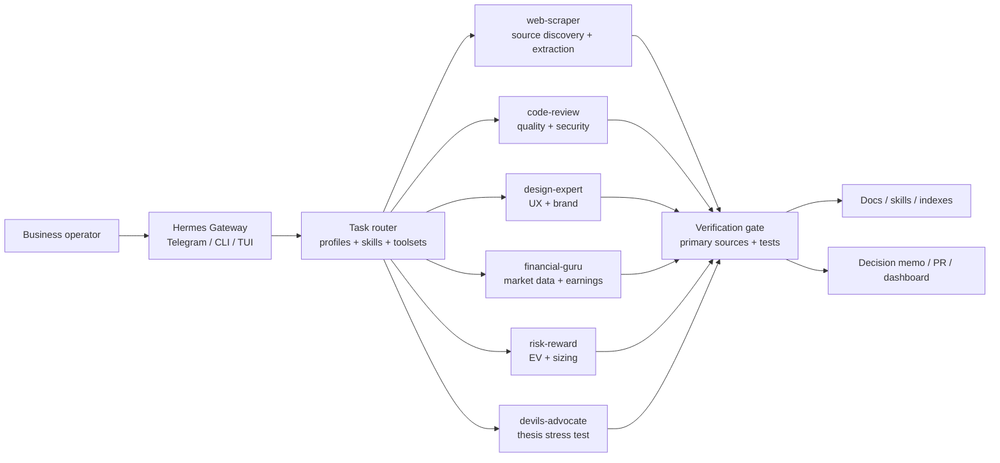
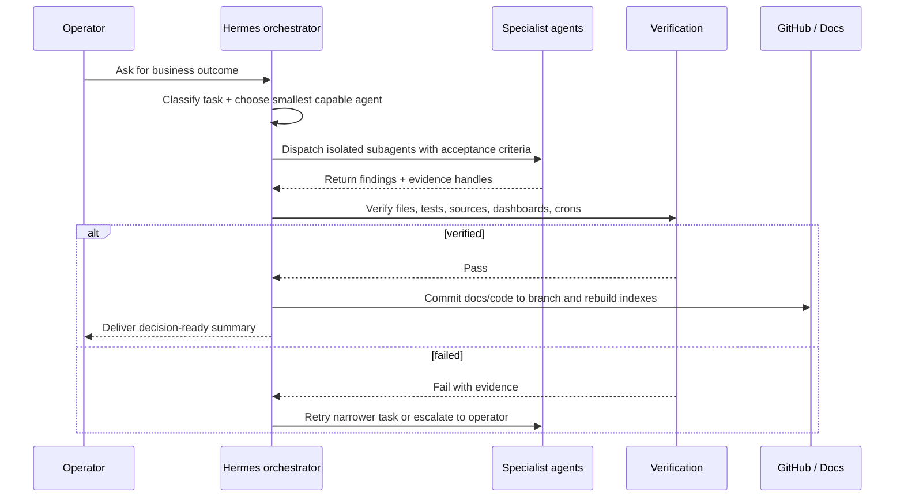

# Business agent evaluation

Use this pattern when Hermes is deployed as a multi-agent business operating system: route each class of work to the smallest capable agent, verify outputs before handoff, and keep durable knowledge in skills/docs rather than hot memory.

## Reference architecture



## Agent-by-application matrix

| Business application | Primary agent | Input artifacts | Acceptance criteria | KPIs |
|---|---|---|---|---|
| Market map or source gathering | `web-scraper` | URLs, search terms, company names, filings | Primary sources captured; fallbacks labeled; extraction reproducible | source coverage, citation quality, freshness |
| Financial screen or earnings analysis | `financial-guru` | local DuckDB, filings, price data, earnings calendars | Data freshness verified; calculations tested; assumptions labeled | hit-rate, data latency, false positives |
| Position sizing / trade structuring | `risk-reward` | thesis, downside bounds, volatility/liquidity, constraints | downside bounded; upside/downside ratio explicit; capacity addressed | expected value, max loss, Kelly fraction, drawdown |
| Investment thesis red-team | `devils-advocate` | memo, model, key assumptions, catalysts | strongest counter-case written; kill criteria identified | assumption fragility, base-rate fit, missing evidence count |
| Codebase or automation change | `code-review` | branch diff, tests, logs, threat model | tests pass; security regressions absent; dead code removed | test coverage, defect density, review findings |
| Dashboard / product experience | `design-expert` | screenshots, flows, target users, brand constraints | visual hierarchy clear; mobile path tested; accessibility issues listed | task completion, readability, Core Web Vitals |
| Cross-functional production launch | default Hermes orchestrator | project docs, repo, crons, deploy targets | specialists run in parallel; outputs verified; docs/indexes rebuilt | cycle time, escaped defects, manual interventions |

## Production evaluation loop



## Production readiness checklist

- [ ] Route work by domain instead of asking one agent to do everything.
- [ ] Give subagents full context and explicit acceptance criteria.
- [ ] Verify subagent outputs with real file/source/test handles before reporting success.
- [ ] Use hooks for silent maintenance and `hermes hooks doctor` for health checks.
- [ ] Rebuild project registry and indexes after structural changes.
- [ ] Commit code/docs to a named branch; push to an accessible remote or report the permission blocker.
- [ ] Move recurring procedures into skills; move durable long-form knowledge into docs.

## Example routing prompt

```text
Context: Evaluate whether this earnings-screening pipeline is production ready.
Agents:
- financial-guru: validate data freshness and factor math.
- code-review: audit pipeline code and tests.
- devils-advocate: identify false-positive and stale-data failure modes.
- design-expert: review dashboard UX.
- risk-reward: evaluate whether outputs support asymmetric trade selection.
Done when: every agent returns evidence, Hermes verifies it, docs/indexes are rebuilt, and the branch is pushed.
```
