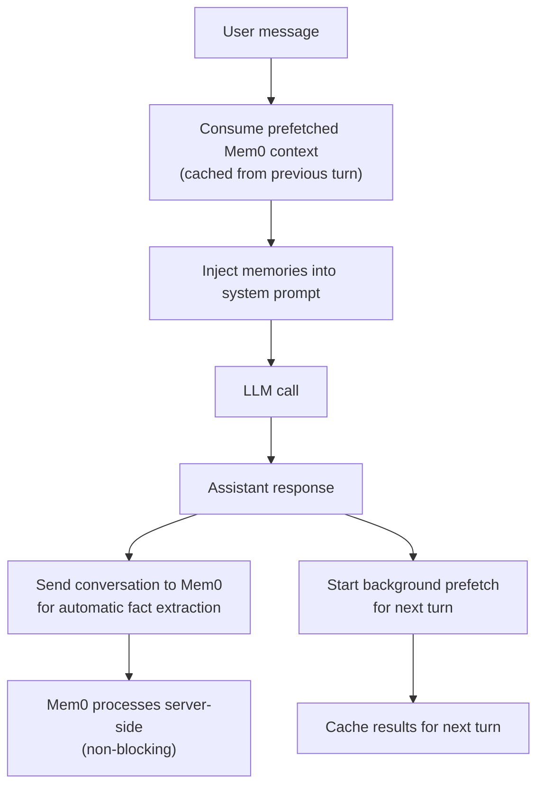

# Mem0 Memory

[Mem0](https://mem0.ai) is a managed memory platform that gives Hermes persistent, cross-session memory. Mem0 automatically extracts facts from conversations and makes them available via semantic search — so the agent remembers user preferences, project context, and corrections across sessions without manual curation.

## Works Alongside Built-in Memory

Hermes has two memory systems that can work together or be configured separately. In `hybrid` mode (the default), both run side by side — Mem0 handles cross-session fact extraction while local files handle agent-level notes.

| Feature | Built-in Memory | Mem0 Memory |
|---------|----------------|-------------|
| Storage | Local files (`~/.hermes/memories/`) | Cloud-hosted Mem0 Platform API |
| Scope | Agent-level notes and user profile | User-scoped facts extracted from conversations |
| Persistence | Across sessions on same machine | Across sessions, machines, and platforms |
| Query | Injected into system prompt automatically | Prefetched + on-demand via tools |
| Content | Manually curated by the agent | Automatically extracted by Mem0's LLM pipeline |
| Write surface | `memory` tool (add/replace/remove) | `mem0_conclude` tool + automatic extraction |

Set `memoryMode` to `mem0` to use Mem0 exclusively. See [Memory Modes](#memory-modes) for details.

## Setup

### Interactive Setup

```bash
hermes mem0 setup
```

The setup wizard walks through API key, identity (user ID, agent ID), memory mode, recall mode, retrieval quality (reranking, keyword search), custom extraction instructions, and session strategy.

### Manual Setup

#### 1. Install the Client Library

```bash
pip install 'mem0ai>=0.1.0'
```

Or with uv:

```bash
uv pip install 'mem0ai>=0.1.0'
```

#### 2. Get an API Key

Go to [app.mem0.ai](https://app.mem0.ai) > Settings > API Keys.

#### 3. Configure

Mem0 reads from `~/.hermes/mem0.json` (or `$HERMES_HOME/mem0.json` for per-instance config):

```json
{
  "apiKey": "m0-your-api-key",
  "hosts": {
    "hermes": {
      "enabled": true,
      "userId": "your-name",
      "agentId": "hermes",
      "memoryMode": "hybrid",
      "recallMode": "hybrid",
      "rerank": true,
      "keywordSearch": true,
      "sessionStrategy": "per-directory"
    }
  }
}
```

`apiKey` lives at the root level. All other settings are scoped under `hosts.hermes`. The `hermes mem0 setup` wizard writes this structure automatically.

Or set the API key as an environment variable:

```bash
export MEM0_API_KEY=m0-your-api-key
```

:::info
When an API key is present (either in config or as `MEM0_API_KEY`), Mem0 auto-enables unless explicitly set to `"enabled": false`.
:::

## Configuration

### Config Resolution Order

Mem0 resolves configuration in this order:

1. `$HERMES_HOME/mem0.json` — instance-local (for per-project overrides)
2. `~/.hermes/mem0.json` — global config
3. `MEM0_API_KEY` environment variable — fallback

### Config Fields

**Root-level (shared)**

| Field | Default | Description |
|-------|---------|-------------|
| `apiKey` | — | Mem0 API key (required) |

**Host-level (`hosts.hermes`)**

| Field | Default | Description |
|-------|---------|-------------|
| `enabled` | *(auto)* | Auto-enables when API key is present |
| `userId` | — | Your identity for memory scoping (required for personalization) |
| `agentId` | `"hermes"` | Agent identifier |
| `memoryMode` | `"hybrid"` | Memory mode: `hybrid` or `mem0` |
| `recallMode` | `"hybrid"` | Retrieval strategy: `hybrid`, `context`, or `tools` |
| `rerank` | `true` | Enable reranking for better search accuracy (+150ms) |
| `keywordSearch` | `true` | Enable keyword search alongside semantic search |
| `customInstructions` | — | Natural language guidelines for what Mem0 should extract |
| `sessionStrategy` | `"per-directory"` | How sessions are scoped |
| `apiKey` | *(root)* | Host-level override for API key (optional) |

All host-level fields fall back to the equivalent root-level key if not set under `hosts.hermes`.

### Memory Modes

| Mode | Effect |
|------|--------|
| `hybrid` | Write to both Mem0 and local files (default) |
| `mem0` | Mem0 only — skip local file writes |

To disable Mem0 entirely, set `"enabled": false` or remove the API key.

### Recall Modes

Controls how Mem0 context reaches the agent:

| Mode | Behavior |
|------|----------|
| `hybrid` | Auto-injected context + Mem0 tools available (default) |
| `context` | Auto-injected context only — Mem0 tools hidden |
| `tools` | Mem0 tools only — no auto-injected context |

### Session Strategies

| Strategy | Session key | Use case |
|----------|-------------|----------|
| `per-directory` | CWD directory name | Each project gets its own session (default) |
| `per-session` | Unique per run | Fresh session every time |
| `global` | Fixed `"global"` | Single cross-project session |

### Custom Instructions

You can guide what Mem0 extracts from conversations using natural language:

```json
{
  "hosts": {
    "hermes": {
      "customInstructions": "Extract only technical preferences and project-specific details. Ignore casual conversation."
    }
  }
}
```

### Retrieval Quality

Two settings control search quality vs. latency:

| Setting | Default | Effect |
|---------|---------|--------|
| `rerank` | `true` | Second-pass reranking for better accuracy. Adds ~150-200ms per search. |
| `keywordSearch` | `true` | Hybrid keyword + semantic search for better recall. Adds ~10ms. |

Both are enabled by default. Disable reranking if latency is critical and you can tolerate slightly less accurate results.

## How It Works

### Memory Lifecycle



Turn 1 is a cold start (no cache). All subsequent turns consume cached results with zero HTTP latency on the response path.

### Entity Scoping and the v2 Filter API

Mem0 uses the **v2 API** for search and retrieval. All entity IDs (`user_id`, `run_id`, etc.) must be passed inside a `filters` dict wrapped in logical operators (`AND`, `OR`).

#### How Hermes stores memories

Hermes stores memories using the v1 add endpoint with `user_id` and an optional `run_id` (derived from the session strategy):

```python
client.add(messages, user_id="kartik", run_id="hermes-agent")
```

The `run_id` is the current working directory name when using `per-directory` session strategy.

#### Why search filters need special handling

Mem0 scopes records per-entity. This means a memory stored with **both** `user_id` and `run_id` will **not** match a filter that only specifies `user_id`. Mem0 treats any entity field missing from the filter as "must be null". So a simple `{"user_id": "kartik"}` filter only returns memories that have no `run_id` set.

To retrieve all memories for a user regardless of which session created them, Hermes combines two filter conditions with `OR`:

```python
# Hermes search filter — covers all records for a user
filters = {
    "OR": [
        {"user_id": "kartik"},                                # records with no run_id
        {"AND": [{"user_id": "kartik"}, {"run_id": "*"}]},   # records with any run_id
    ]
}

client.search("query", filters=filters)
client.get_all(filters=filters)
```

| Filter clause | What it matches |
|---------------|-----------------|
| `{"user_id": "kartik"}` | Memories where `user_id` is `kartik` and `run_id` is null |
| `{"AND": [{"user_id": "kartik"}, {"run_id": "*"}]}` | Memories where `user_id` is `kartik` and `run_id` is any non-null value |

The `"*"` wildcard matches any non-null value. Without it, session-scoped memories would be invisible to search.

:::caution
If you call `client.search()` or `client.get_all()` with only `{"user_id": "..."}` in the filter, you will **not** get back memories that were stored with a `run_id`. Always include the `run_id: "*"` wildcard branch to avoid missing results.
:::

### Automatic Fact Extraction

When you converse with Hermes, Mem0's server-side LLM pipeline automatically:

1. Identifies factual statements, preferences, and corrections
2. Deduplicates against existing memories
3. Stores extracted facts with categories and metadata

This happens asynchronously — no blocking on the response path. You can also store facts explicitly using the `mem0_conclude` tool.

:::info
`mem0_conclude` uses `infer=False` (stores facts verbatim without LLM extraction). This skips Mem0's built-in deduplication — the automatic extraction pipeline handles deduplication correctly.
:::

### Prefetch Pipeline

Mem0 context is fetched in a background thread to avoid blocking:

1. After each assistant response, a background thread searches Mem0 for relevant context
2. Results are cached in memory
3. On the next user message, cached results are consumed and injected into the system prompt
4. If no cache exists (turn 1), the system prompt uses only static context

## Tools

When Mem0 is active, four tools become available. They are invisible when Mem0 is disabled or unconfigured.

### `mem0_profile`

Retrieves all stored memories for the user. Fast, no reranking. Use at conversation start or when you need the full picture.

No parameters.

### `mem0_search`

Semantic search over the user's memories. Returns relevant facts ranked by similarity.

Parameters:
- `query` (string, required) — what to search for (e.g. "programming languages", "dietary preferences")
- `rerank` (boolean, optional) — enable reranking for higher accuracy, default `false`
- `top_k` (integer, optional) — number of results to return, default `10`, max `50`

### `mem0_context`

Deep context retrieval with reranking always enabled. Higher latency than `mem0_search` but richer results. Use for complex questions that need comprehensive context.

Parameters:
- `query` (string, required) — a natural language question about the user or their context

### `mem0_conclude`

Stores a fact about the user in persistent memory. Use when the user explicitly states a preference, corrects you, or shares something that should be remembered across sessions.

Parameters:
- `conclusion` (string, required) — a factual statement to persist (e.g. "User prefers dark mode", "Project uses Python 3.11")

:::tip
The agent automatically extracts facts from normal conversation. Use `mem0_conclude` only for explicit, high-signal facts that you want stored verbatim — like user corrections or stated preferences.
:::

## CLI Commands

```
hermes mem0 setup          # Interactive setup wizard
hermes mem0 status         # Show config and connection status
hermes mem0 search <query> # Search memories from the terminal
hermes mem0 memories       # List all stored memories
hermes mem0 clear          # Delete all memories (with confirmation)
```

### Doctor Integration

`hermes doctor` includes a Mem0 section that validates config, API key, and connection status:

```
hermes doctor
```

Look for the Mem0 section in the output to verify your setup is working.

## Troubleshooting

### Search returns no results but memories exist on the dashboard

This usually means the search filter doesn't account for `run_id`. Memories stored with a `run_id` (which happens automatically with `per-directory` or `per-session` strategies) won't match a filter that only specifies `user_id`. Make sure your filter includes the `run_id: "*"` wildcard branch — see [Entity Scoping](#entity-scoping-and-the-v2-filter-api) above.

### Connection test fails with "Filters are required and cannot be empty"

This means the code is using the old v1-style `user_id=` keyword argument instead of the v2 `filters=` dict. All search and get_all calls must use the v2 filter format with `OR`/`AND` logical operators.

### `hermes mem0 status` shows Connection OK but search returns empty

Verify that:
1. You have memories stored (check the [Mem0 dashboard](https://app.mem0.ai))
2. The `userId` in your config matches the `user_id` the memories were stored under
3. The search query is semantically related to your stored memories

## Use Cases

- **Preference tracking** — remembers coding style, tool preferences, communication style across sessions
- **Project context** — retains project details, architecture decisions, tech stack across conversations
- **Corrections** — when a user corrects the agent, the correction is stored and recalled in future sessions
- **Onboarding** — new conversations start with context from previous ones, reducing repetitive setup
- **Multi-platform memory** — same user memories accessible from CLI, Telegram, Discord, etc.

:::tip
Mem0 is fully opt-in — zero behavior change when disabled or unconfigured. All Mem0 API calls are non-fatal; if the service is unreachable, the agent continues normally without persistent memory.
:::
